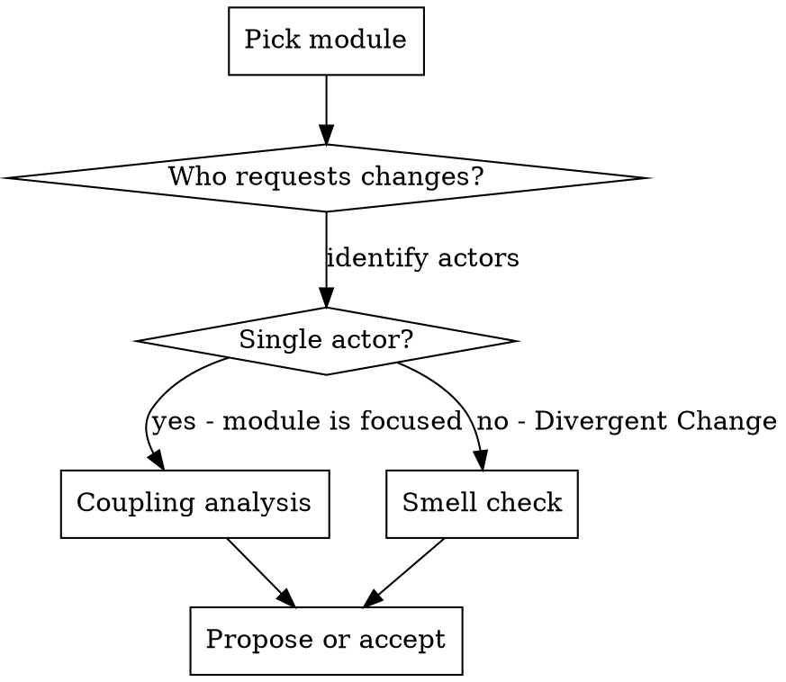

# SOLID TypeScript Module Audit

## Overview

Audit TS modules using SOLID principles (Uncle Bob), code smells (Fowler), and coupling analysis (Kent Beck). Every diagnostic question is change-relative: "coupled with respect to WHICH change?"

**Core formula (Kent Beck):** `cost(software) ~= coupling`

**Cardinal rule:** Don't over-decouple. Reducing coupling for one class of changes increases it for others. Find the sweet spot for changes that ACTUALLY happen.

## When to Use

- Before proposing structural changes to any `.ts` module
- When adding a new command kind, trigger kind, or vendor type
- When a bug fix requires touching 3+ files (Shotgun Surgery signal)
- When reviewing module boundaries after feature additions
- When `git log` shows the same files changing together repeatedly

## The Audit Protocol



### Step 1: Actor Analysis (SRP)

SRP is NOT "does one thing." It IS "one actor requests changes."

For each module, ask: **"WHO would request changes to this module?"**

| Actor | Meaning | Example |
|-------|---------|---------|
| "Anyone adding a new command kind" | Extension actor | types.ts, execute.ts |
| "Anyone changing vendor resolution" | Vendor actor | component.ts |
| "Anyone changing coercion semantics" | Data transformation actor | resolver.ts |
| "Anyone changing validation display" | UI actor | error-display.ts |

**If a module has 2+ actors, it has Divergent Change.** Split along actor boundaries.

**Exception:** A module that serves one actor through multiple operations is fine. `resolver.ts` doing resolve + coerce for the same "data resolution" actor is cohesive, not divergent.

### Step 2: Change-Relative Coupling Analysis

**Don't measure coupling abstractly. Measure it against real changes.**

Diagnostic questions (answer with file counts):

| Change scenario | Files touched | Verdict |
|-----------------|---------------|---------|
| Add new command kind | ? | >2 = Shotgun Surgery |
| Add new trigger kind | ? | >2 = Shotgun Surgery |
| Add new vendor | ? | >1 = coupling leak |
| Add new coercion type | ? | >2 = Shotgun Surgery |
| Add new validation rule | ? | >2 = Shotgun Surgery |
| Fix a bug in conditions | ? | >1 = cascade risk |

**How to measure:** `git log --name-only` on related commits. Files that change together ARE coupled.

**Kent Beck's test:** "If two elements are coupled with respect to a change that never happens, it doesn't matter." Only audit coupling for changes that ACTUALLY happen or are LIKELY to happen.

### Step 3: Smell Detection

Run these diagnostic questions against each module:

| Question | If yes | Smell |
|----------|--------|-------|
| Does this module change for 2+ unrelated reasons? | Split Phase / Extract Module | Divergent Change |
| Does adding one feature require editing 3+ files? | Move Function / consolidate | Shotgun Surgery |
| Does this function import more than it uses locally? | Move to the module it envies | Feature Envy |
| Do two modules import each other's internals? | Hide Delegate / third module | Insider Trading |
| Does this switch/if-chain appear in 2+ files? | Dispatch map | Repeated Switches |
| Do 3+ params always travel together? | Introduce Parameter Object | Data Clumps |
| Does this module have mutable state written by 2+ functions? | Encapsulate Variable | Global Data |

### Step 4: Dependency Direction (DIP)

Dependencies must point toward stability.

```
Most stable (pure, no deps)     ←  Everything depends inward
├── walk.ts                         (zero deps)
├── types.ts                        (zero deps)
├── trace.ts                        (zero deps)
├── resolver.ts                     (depends on walk, component, trace)
├── component.ts                    (depends on walk, trace)
├── rule-engine.ts                  (depends on types only)
├── condition.ts (validation)       (depends on types only)
│
├── element.ts                      (depends on resolver, component)
├── conditions.ts (guards)          (depends on resolver)
├── commands.ts                     (depends on element, conditions, validation, inject)
├── execute.ts                      (depends on commands, conditions, pipeline)
├── pipeline/http/gather            (colocated in execution/ — same actor)
│
├── boot.ts                         (depends on trigger, enrichment, validation, walk-reactions)
├── root.ts                         (depends on boot — entry point)
Least stable (side effects, DOM)
```

**Violation signal:** A pure module importing from a side-effect module. A stable module importing from a volatile module.

### Step 5: Extension Check (OCP + LSP)

For each discriminated union (`Command`, `Trigger`, `Mutation`, `Guard`, `Reaction`):

1. **Where is the switch?** One switch in one place = acceptable (TanStack pattern). Same switch in 2+ files = violation.
2. **Is the resolved root substitutable?** After `resolveRoot()`, does ANY downstream code check vendor? If yes = LSP violation.
3. **Can you add a new kind by writing NEW code only?** If modifying existing code = OCP violation.

**Acceptable OCP cost:** Adding a new command kind requires updating `types.ts` (union) + `commands.ts` (switch) + tests. That's the minimum — two files plus tests. If it requires more, investigate.

### Step 6: Export Surface Check (ISP)

For each module, count: exports used by other modules vs total exports.

```
Module: resolver.ts
  Exports: resolveSource, resolveEventPath, resolveSourceAs, coerce (4)
  Used by element.ts: resolveSource, coerce (2/4)
  Used by conditions.ts: resolveSource, resolveSourceAs, coerce (3/4)
```

**If <50% of exports are used by any single consumer,** the module may be too broad. Consider splitting.

**Exception:** Utility modules (walk.ts) can have broad exports — they serve many consumers by design.

## Refactoring Decision Framework

Before proposing any refactoring, answer Kent Beck's four questions:

1. **Cost** — Will this make future changes cheaper?
2. **Revenue** — Does this unblock a feature someone is waiting for?
3. **Coupling** — Will this reduce files touched per change?
4. **Cohesion** — Will this concentrate changes into fewer modules?

If the answer to all four is "no" or "marginally" — **don't refactor**. The coupling of over-decoupling isn't worth it.

**"Make no sudden moves. Move one element at a time."** — Kent Beck

## Pattern Decisions (Pre-Validated)

### Switch vs Map for Dispatch
- **Switch wins at 4-8 stable kinds** — free TS narrowing, exhaustiveness via `assertNever`
- **Map wins at 10+ extensible kinds** — plugin architectures, runtime handler registration
- V8 treats small string switches as sequential comparisons — optimal at 4 cases
- TypeScript compiler itself uses giant switches for SyntaxKind — authoritative

### `assertNever` Exhaustiveness — ALWAYS ADD
```typescript
function assertNever(value: never, context: string): never {
  throw new Error(`Unhandled ${context}: ${(value as any).kind ?? value}`);
}
// In every switch on discriminated unions:
default: assertNever(cmd, "command kind");
```
Zero cost. Compile-time enforcement. Strict improvement over silent miss.

### Async vs Sync Dual Path
- Current dual path: zero overhead, ~40 lines duplicated — **acceptable for 4 stable reaction kinds**
- Unified async: eliminates duplication, 1 microtick/await overhead — negligible at UI scale
- Revisit if reaction kinds grow to 8+

### Chaining vs Function Dispatch
- **C# DSL chaining** — correct for configuration (Fowler endorses for value objects)
- **TS runtime function dispatch** — correct for execution (CQS, tree-shakeable, side effects)

### Nested Ifs
- **Guard clauses** (early returns) flatten nested conditionals
- **Decompose Conditional** — extract complex boolean into named functions
- Recursive evaluation is correct for tree data structures (guards are trees)

### Parameters
- 1-2 ideal, 3 acceptable, 4+ borderline (Uncle Bob Clean Code Ch. 3)
- **Zero boolean flags** in our codebase — this is a strength
- Introduce Parameter Object only when same group travels across multiple call sites

### Types
- ~40 types for our plan executor = lean (TanStack Query has 60+, tsc has hundreds)
- Types should map 1:1 to JSON plan primitives — correct for schema-validated contract
- Optional fields handle variants — don't create per-variant subtypes (type explosion)

## Architecture Constraints (Non-Negotiable)

1. **Runtime is dumb executor** — NEVER invents behavior, plan carries ALL info
2. **ID-aware** — always use element IDs, never wide selectors
3. **No fallbacks** — fail fast, throw on missing data, no silent defaults
4. **No wide selectors** — forces thinking deeply about correct behavior
5. **No caching** — premature for now, will add when needed
6. **No inline JS in views** — auto-boot.ts handles discovery

## Audit Discipline — NEVER Rubber-Stamp

**"PASS" is earned, not given.** Every module must be challenged:

1. **Trace the actual runtime behavior** — don't just read the code structure. Ask: "what happens when a Syncfusion ComboBox changes? Does this event reach the listener? Does the DOM walk find the right element?" If you can't answer from the code, it's not audited.
2. **Challenge every DOM interaction** — is this using an ID (good) or scanning (bad)? Is this vendor-agnostic or does it accidentally depend on DOM structure?
3. **Test the extension story** — don't just say "open for extension." Actually walk through adding a new component/vendor/rule and count the files that change.
4. **Question silent skips** — every `if (!x) return` is a potential swallowed bug. Is it intentional or lazy? Does the caller know this silently no-ops?
5. **Verify against real component behavior** — SF components fire events on ej2 instances, not DOM elements. Native inputs fire "input"/"change" on the DOM element. Does the module handle both paths or only one?

**If you find yourself writing "PASS" without finding at least one question worth investigating, you're not auditing — you're skimming.**

## Red Flags — STOP and Investigate

- Module imports from 5+ other modules (possible god module)
- Circular imports between any two modules
- `vendor` string checked outside component.ts
- Module-level `let` mutated by 3+ functions
- Same `switch(x.kind)` in 2+ files
- Function with 6+ parameters or any boolean flag parameter
- Wide selectors (`querySelector("input")`, `querySelectorAll("div")`)
- Fallback defaults for missing data
- Caching or memoization (premature — not yet needed)
- Test file exists but tests don't cover the change scenario

## What This Skill Does NOT Cover

- Class hierarchies and inheritance (we use modules + functions)
- Generic OOP patterns (Strategy, Observer, etc. — use when naturally emerging, don't force)
- Performance optimization (separate concern)
- Trace module quality (explicitly low priority)

## Sources

- Robert C. Martin — Clean Architecture (2017), Clean Code Ch. 3 (params), Functional Design (2023), blog.cleancoder.com
- Martin Fowler — Refactoring 2nd Ed (2018), code smells catalog, FluentInterface bliki, FlagArgument bliki
- Kent Beck — Tidy First? (2023), Chapters 29-33 on coupling/decoupling
- TanStack — Query, Router, Table source code patterns (real-world validation)
- V8 blog — async/await optimization, switch internals
- Bob Nystrom — "What Color is Your Function?" (function coloring problem)
- GraphQL-JS — PromiseOrValue pattern for sync/async unification
