# Descriptor & plan pipeline — target state (evidence-driven)

**Deep planning package (issues A–F):** [`descriptor-target-state-planning/README.md`](descriptor-target-state-planning/README.md) — **master** system class + E2E flow diagrams; **[INVEST-rubric.md](descriptor-target-state-planning/INVEST-rubric.md)** (5-point scale, pass ≥4); **one file per issue** (`issue-A-*.md` … `issue-F-*.md`) with **activity + flow** diagrams and **mandatory test catalogs**. This file stays the **policy + full feature inventory**; the folder is the **implementation-ready** breakdown.

**Audience:** Engineers delivering the target state as **INVEST-sized tasks**. **Compliance is mandatory:** every change that touches a **plan feature** (see [inventory](#complete-feature-inventory--literal-schema-backed)) **must** satisfy **tests/evals first**, **flow + activity** diagrams for the task, **read/re-read**, and **help** where required—while keeping the **north star** invariants (nothing breaks; JSON contract preserved unless explicitly migrated).

**Sources:** [descriptor-solid-analysis-plan.md](descriptor-solid-analysis-plan.md), **[complete feature inventory](#complete-feature-inventory--literal-schema-backed)** (every `kind` on the wire from [`reactive-plan.schema.json`](Alis.Reactive/Schemas/reactive-plan.schema.json)), and **these** implementation anchors:

| Area | Anchor files (read before judging) |
|------|--------------------------------------|
| **Contract** | [`reactive-plan.schema.json`](Alis.Reactive/Schemas/reactive-plan.schema.json) — exhaustive `$defs` |
| Plan aggregate + render | [`ReactivePlan.cs`](Alis.Reactive/ReactivePlan.cs) (`AddEntry`, `AddToComponentsMap`, `Render`, `ResolveAll`) |
| Trigger → `Entry` rows | [`TriggerBuilder.cs`](Alis.Reactive/Builders/TriggerBuilder.cs) (`AddEntryWithContexts` + `BuildReactions`) |
| Pipeline modes + segments | [`PipelineBuilder.cs`](Alis.Reactive/Builders/PipelineBuilder.cs) (`AddCommand`, `FlushSegment`, `BuildReaction`, `BuildReactions`, `BuildSingleReaction`, `_segments`) |
| Conditions | [`PipelineBuilder.Conditions.cs`](Alis.Reactive/Builders/PipelineBuilder.Conditions.cs), [`GuardBuilder.cs`](Alis.Reactive/Builders/Conditions/GuardBuilder.cs) (`Then` → nested `BuildReaction`) |
| Validation walk | [`ValidationResolver.cs`](Alis.Reactive/Resolvers/ValidationResolver.cs) |
| HTTP wire DTO | [`RequestDescriptor.cs`](Alis.Reactive/Descriptors/Requests/RequestDescriptor.cs) |
| Row type | [`Entry.cs`](Alis.Reactive/Descriptors/Entry.cs) |
| Command guard | [`Command.cs`](Alis.Reactive/Descriptors/Commands/Command.cs) (`GuardWith`) |

**Rules baked in:** one authoritative JSON contract, **no** backward-compat shims, **no** silent fallbacks, **no** dead APIs—old paths **removed** when the new model lands.

---

## North star — full target state (nothing breaks; system improves)

Every **task** below must **preserve** unless a task **explicitly** migrates contract (e.g. F4, D):

| Invariant | Meaning |
|-----------|---------|
| **Same JSON contract** | `Render()` output shape matches [`reactive-plan.schema.json`](Alis.Reactive/Schemas/reactive-plan.schema.json) and TS runtime expectations—**unless** a task ships a **versioned** contract change with schema + TS + Playwright. |
| **Green pre-merge** | `dotnet test` (all relevant projects) + `npm test` where TS touches + Playwright when browser behavior could move. **No** “fix tests later.” |
| **Improvement** | Each task removes a **measured** problem (silent loss, unclear boundary, mutable resolve) **or** documents **why** negotiable scope was cut. |

**Improvement ≠ rewrite:** A task **may** be **docs + tests only** (F2) and still satisfy “system improves” (clarity)—but **any later code change** to those features **must** follow the **same** mandatory coverage rules below.

---

## Complete feature inventory — literal (schema-backed)

The use cases **UC1–UC6** below are **cross-cutting scenarios** (how pieces combine). They are **not** a substitute for an **exhaustive** list of **plan contract features**.

**Source of truth for “every feature”:** [`reactive-plan.schema.json`](../../Alis.Reactive/Schemas/reactive-plan.schema.json) `$defs` + C# **descriptors** under [`Alis.Reactive/Descriptors/`](../../Alis.Reactive/Descriptors/) + **builder modules** that emit them (e.g. **Conditions** under [`Alis.Reactive/Builders/Conditions/`](../../Alis.Reactive/Builders/Conditions/) and [`PipelineBuilder.Conditions.cs`](../../Alis.Reactive/Builders/PipelineBuilder.Conditions.cs)). If a `kind`, **DSL surface**, or **branch** exists on the wire or public API, it **must** be listed below (or in a child row) and treated as part of the contract: **tests/evals first** before merge, **north-star** invariants preserved, and **no** silent “skip tests.”

### Mandatory compliance (we must—not we can)

| Rule | Requirement |
|------|----------------|
| **Inventory** | **Must** use this section (or the schema) to **identify** which feature rows a PR touches—**no** hand-wavy “misc pipeline” PRs. |
| **Naming** | PR **must** list affected **trigger/reaction/command/guard/gather/HTTP** `kind`s, **RequestDescriptor** fields, **conditions DSL** entry points (`When`/`Then`/`ElseIf`/`Else`/`Confirm`, `BranchBuilder`), or **segment** behavior (`FlushSegment` / `BuildReactions`) — copy identifiers from tables below. |
| **Tests first** | **Must** add or update **evaluation criteria** before implementation merges (unit + schema minimum; TS/Playwright when applicable). **Merge blocked** without them. |
| **Reads** | **Must** re-read anchor **descriptor + schema** for touched `kind`s before merge. |
| **Help** | **Must** request review from **validation / HTTP / Fusion / Native** owners when the touched row crosses that boundary. |

**Coverage rule:** Any PR that changes serialization shape, builder surface, or runtime behavior for a **row** below **must** **name that row** in the PR description and **must** satisfy its **minimum test bar**—at least **C# unit + schema** for plan JSON; **TS** if `Scripts/` executes it; **Playwright** if sandbox/browser behavior is user-visible. **No exceptions** without an explicit **risk accepted** note from maintainers (documented in the PR).

### Plan root

| Feature | Wire | Notes |
|---------|------|--------|
| `planId` | `string` | `typeof(TModel).FullName` from [`ReactivePlan`](Alis.Reactive/ReactivePlan.cs) |
| `components` | `object` of `ComponentEntry` | From `ComponentsMap` + [`SerializeComponentsMap`](Alis.Reactive/ReactivePlan.cs) |
| `entries` | `Entry[]` | Each item: `trigger` + `reaction` |

### Triggers (`Trigger` oneOf — 5 kinds)

| kind | Required wire | C# descriptor | Typical builder entry |
|------|----------------|---------------|------------------------|
| `dom-ready` | `kind` | [`DomReadyTrigger`](Alis.Reactive/Descriptors/Triggers/DomReadyTrigger.cs) | [`TriggerBuilder.DomReady`](Alis.Reactive/Builders/TriggerBuilder.cs) |
| `custom-event` | `kind`, `event` | [`CustomEventTrigger`](Alis.Reactive/Descriptors/Triggers/CustomEventTrigger.cs) | `CustomEvent`, `CustomEvent<TPayload>` |
| `component-event` | `kind`, `componentId`, `jsEvent`, `vendor` (+ optional `bindingPath`, `readExpr`) | [`ComponentEventTrigger`](Alis.Reactive/Descriptors/Triggers/ComponentEventTrigger.cs) | `.Reactive()` extensions (Native/Fusion) |
| `server-push` | `kind`, `url` (+ optional `eventType`) | [`ServerPushTrigger`](Alis.Reactive/Descriptors/Triggers/ServerPushTrigger.cs) | `ServerPush` overloads |
| `signalr` | `kind`, `hubUrl`, `methodName` | [`SignalRTrigger`](Alis.Reactive/Descriptors/Triggers/SignalRTrigger.cs) | `SignalR` overloads |

### Reactions (`Reaction` oneOf — 4 kinds)

| kind | Role | Descriptor |
|------|------|--------------|
| `sequential` | `commands[]` | [`SequentialReaction`](Alis.Reactive/Descriptors/Reactions/SequentialReaction.cs) |
| `conditional` | optional `commands[]` + `branches[]` (`Branch`: `guard?`, `reaction`) | [`ConditionalReaction`](Alis.Reactive/Descriptors/Reactions/ConditionalReaction.cs) |
| `http` | `preFetch?`, `request` | [`HttpReaction`](Alis.Reactive/Descriptors/Reactions/HttpReaction.cs) |
| `parallel-http` | `preFetch?`, `requests[]` (min 2), `onAllSettled?` | [`ParallelHttpReaction`](../../Alis.Reactive/Descriptors/Reactions/ParallelHttpReaction.cs) |

### Conditions module (DSL)

**Wire:** not its own top-level `kind` — it emits **`conditional`** [`Reaction`](../../Alis.Reactive/Descriptors/Reactions/Reaction.cs) and nested **`Guard`** trees. This section is the **When / Then / ElseIf / Else** pipeline and **Confirm** guards. It is **first-class** in the same sense as HTTP or triggers: it has **its own builder types**, drives **`FlushSegment`** / **`_segments`** (multi-`When` blocks → multiple `Entry` rows — **Issue F**), and composes **`Guard`** trees that serialize under `ConditionalReaction`.

| Layer | Responsibility | Primary files |
|-------|----------------|-----------------|
| **Entry** | `When<TPayload,TProp>(payload, path)`, `When<TProp>(TypedSource)`, `Confirm(message)` | [`PipelineBuilder.Conditions.cs`](../../Alis.Reactive/Builders/PipelineBuilder.Conditions.cs) |
| **Source + operators** | `ConditionSourceBuilder` — comparison operators, `And`/`Or`/`Not`, `Then` | [`ConditionSourceBuilder.cs`](../../Alis.Reactive/Builders/Conditions/ConditionSourceBuilder.cs), [`ConditionStart.cs`](../../Alis.Reactive/Builders/Conditions/ConditionStart.cs) |
| **Guard chain** | `GuardBuilder` — `Then` → nested `PipelineBuilder` for branch body → `BuildReaction()` | [`GuardBuilder.cs`](../../Alis.Reactive/Builders/Conditions/GuardBuilder.cs) |
| **Branch list** | `ElseIf` / `Else` — `Branch` list backing `ConditionalReaction` | [`BranchBuilder.cs`](../../Alis.Reactive/Builders/Conditions/BranchBuilder.cs) |
| **Segment flush** | Second `When` after a completed conditional block calls [`FlushSegment`](../../Alis.Reactive/Builders/PipelineBuilder.cs) | [`PipelineBuilder.cs`](../../Alis.Reactive/Builders/PipelineBuilder.cs) (`FlushSegment`, `_segments`, `BuildReactions`) |
| **Typed sources** | `TypedSource` / `TypedComponentSource` for component-based `When` | [`TypedSource.cs`](../../Alis.Reactive/Builders/Conditions/TypedSource.cs), [`TypedComponentSource.cs`](../../Alis.Reactive/Builders/Conditions/TypedComponentSource.cs) |

**Wire output:** `conditional` reaction (`commands?` + `branches[]`), each [`Branch`](../../Alis.Reactive/Descriptors/Reactions/Branch.cs) with `guard?` + nested `reaction` (often `sequential` from `Then`). **Guards** table above applies **inside** branches.

**Runtime:** TS executes `kind: "conditional"` and guard evaluation — see `Scripts` tests (e.g. `when-executing-multiple-entries-same-trigger.test.ts`, `when-resolving-paths-end-to-end.test.ts`).

**DSL reference:** [.claude/skills/conditions-dsl/SKILL.md](../../../.claude/skills/conditions-dsl/SKILL.md) (grammar for authors).

**Refactor touch:** **B** (facade owns segment/flush), **F** (multi-segment / `BuildReaction` footgun), **A** (guarded commands immutable), **E** (emit from branch inner pipelines).

### Commands (`Command` oneOf — 5 kinds)

| kind | Purpose |
|------|---------|
| `dispatch` | `event`, optional `payload`, optional `when` |
| `mutate-element` | `target`, `mutation` (`set-prop` \| `call`), `value`/`source`, optional `vendor`, `when` |
| `mutate-event` | `mutation`, `value`/`source`, `when` |
| `validation-errors` | `formId`, `when` |
| `into` | `target`, `when` |

### Guards (`Guard` oneOf — 5 kinds)

| kind | Schema |
|------|--------|
| `value` | `source`, `coerceAs`, `op` (`GuardOp` enum — all operators in schema), optional `operand`, `rightSource`, `elementCoerceAs` |
| `all` | `guards[]` (min 2) |
| `any` | `guards[]` (min 2) |
| `not` | `inner` |
| `confirm` | `message` |

### Mutations (`Mutation` oneOf)

| kind | Role |
|------|------|
| `set-prop` | `prop`, optional `coerce` |
| `call` | `method`, optional `chain`, `args[]` (`literal` \| `source` per arg) |

### Bind sources (`BindSource` oneOf)

| kind | Fields |
|------|--------|
| `event` | `path` |
| `component` | `componentId`, `vendor`, `readExpr` |

### Gather (`GatherItem` oneOf)

| kind | Role |
|------|------|
| `component` | `componentId`, `vendor`, `name`, `readExpr` |
| `static` | `param`, `value` |
| `event` | `param`, `path` |
| `all` | (no extra fields) |

### HTTP request (`RequestDescriptor`)

| Field | Role |
|-------|------|
| `verb` | `GET` \| `POST` \| `PUT` \| `DELETE` |
| `url` | string |
| `gather` | `GatherItem[]` |
| `contentType` | `form-data` only when set (multipart) |
| `whileLoading` | `Command[]` |
| `onSuccess` / `onError` | `StatusHandler[]` |
| `chained` | nested `RequestDescriptor` |
| `validation` | `ValidationDescriptor` (wire fields after resolve) |

**Builder verbs (HTTP mode):** [`Get`/`Post`/`Put`/`Delete`](Alis.Reactive/Builders/PipelineBuilder.Http.cs), [`Parallel`](Alis.Reactive/Builders/PipelineBuilder.Http.cs) → `ParallelBuilder`.

### StatusHandler (`oneOf` commands vs reaction)

| Branch | Fields |
|--------|--------|
| `commands` | `statusCode?`, `commands[]` |
| `reaction` | `statusCode?`, nested `Reaction` |

**Issue D** target: **sealed union** in C# + schema + TS **lockstep** (same PR).

### Validation wire (extracted / enriched)

Schema `$defs`: `ValidationDescriptor`, `ValidationField`, `ValidationRule`, `ValidationCondition`, `ValidationRuleType` — see [`reactive-plan.schema.json`](Alis.Reactive/Schemas/reactive-plan.schema.json) tail. **Resolver:** [`ValidationResolver`](Alis.Reactive/Resolvers/ValidationResolver.cs). **Issue C** touches **all** HTTP paths that carry `validation`.

### Coercion (`CoercionType`)

`string`, `number`, `boolean`, `date`, `raw`, `array` — used by guards and source args.

---

### Feature × refactor matrix (which Issues A–F touch what)

| Category | A (immutable) | B (facade) | C (resolve) | D (StatusHandler) | E (emit) | F (Entry/rows) |
|----------|---------------|------------|-------------|-------------------|----------|----------------|
| Triggers | If commands mutate | Builder wiring | If validation on trigger path | — | Component commands | **Fan-out** → `Entry` |
| **Conditions module** (`When`/`Then`/…, `BranchBuilder`, `Confirm`, `ConditionSourceBuilder`, `GuardBuilder`) | Guarded **commands** in branches | **`FlushSegment`**, `_segments`, mode **Conditional** | — | — | Inner pipeline **emit** | **Multi-`When`** → **N** `Entry` rows; **`BuildReaction`** in `Then` |
| **All** `Command` kinds | **Yes** | **Yes** | **If** HTTP-adjacent | **If** `OnSuccess`/`OnError` | **Yes** | **If** guarded |
| Guards (`Guard` oneOf) | Part of command | Composed by conditions DSL | — | — | — | — |
| HTTP / gather / chained | Commands inside | **Yes** | **Yes** | **Handlers** | — | **HttpReaction** rows |
| Parallel HTTP | — | **Yes** | **Yes** | **Handlers** | — | — |
| ValidationDescriptor | — | — | **Yes** | — | — | — |
| Components map | — | — | Enrich fields | — | — | — |

**Every feature row** in the tables above **must** comply with the **INVEST** questions in the next section whenever work touches that row—**no** casual edits; **no** merge without naming the **feature kind** and **minimum** test bar.

---

## INVEST + delivery discipline (**every** task — no exceptions)

**Task definition:** A **task** is any **mergeable** slice (PR or explicit sub-PR): **F1**, **F2**, **F3**, **Pre-C**, **C**, **E**, **A**, **B**, **D**, **F4** program, or a **single** vertical slice (e.g. only **Conditions** `FlushSegment` + tests). **Umbrella “Issue A”** is not one task—it is a **theme**; each PR inside it is still a **separate INVEST task** with its own scorecard.

**INVEST** (Agile user stories—adapted to **engineering tasks** — **all six letters for every task**):

| Letter | Here it means |
|--------|----------------|
| **I** — Independent | Delivers **verifiable** value **without** requiring every other task to ship first; dependencies are **explicit** in the task dependency diagram. |
| **N** — Negotiable | Implementation detail (throw vs rename vs analyzer for F3) is **open**; **acceptance criteria** are **not** negotiable once agreed. |
| **V** — Valuable | Ties to **user-visible or maintainer-visible** outcome: fewer silent bugs, clearer API, safer wire. |
| **E** — Estimable | Has **read list**, **test evals**, and **done** definition—enough to time-box. |
| **S** — Small | Fits one PR or one **thin** vertical slice; **B** may split into **B1/B2** if needed. |
| **T** — Testable | **Evaluation criteria written first**—**merge blocked** until they pass. |

### Questions we **must** answer at **every** task (before coding)

1. **Contract:** Does this change **bytes on the wire**? If yes, is schema + TS + snapshots **in** this PR?
2. **Regression:** Which **existing** tests are my **safety net**? Did I **run** them after edits?
3. **Target state:** Which **Issue / tier** (A–F, F1–F4) does this advance? Am I **accidentally** doing another issue **halfway**?
4. **Nothing breaks:** What **caller** paths did I grep? (`new Entry(`, `BuildReaction(`, `AddCommand(`, HTTP views)
5. **Improvement:** What **failure mode** disappears? If none—**why** are we shipping?
6. **Help:** Who should **review** (domain: validation, Fusion, Native)? Did I **re-read** anchor files **after** the first implementation pass?

### Tests / evals first (mandatory)

For each task: **must** **write evaluation criteria before implementation**—then implement to **green**. **No** merges with “tests in follow-up PR.”

- **Unit:** Assert **behavior** (counts, throws, snapshot hash or Verify file).
- **Schema:** `AllPlansConformToSchema` or equivalent for touched plan shapes.
- **Integration:** Sandbox view or Playwright **only** if DOM/trace depends on change.

### Read and re-read

1. **Before** implementation: anchor files in the table at top of this doc + task-specific files.
2. **After** first diff: re-read **changed** types for **accidental** public API drift.
3. **Bring help:** Pair on **ValidationResolver** + HTTP plans (**C**); pair on **extension** churn (**E**); architect review on **F4** (contract).

---

## Task dependency (flow) — order matters

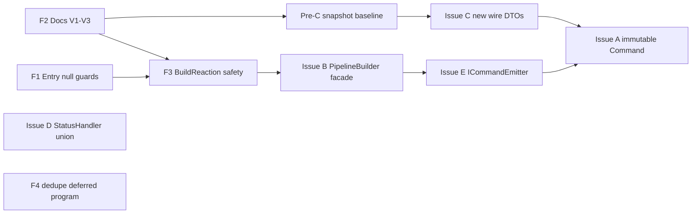

**Legend:** **F2** before **F3** so “what is one row” is documented before API behavior changes. **Pre-C** baseline **before** **C**. **F3 → B** when segment logic moves—**negotiable**. **E → A** negotiable if **A** avoids emit paths.

---

## Task catalog — each entry is a full **INVEST** task

Below, **each** `### Task …` block is **one INVEST work item**: it **must** include the **INVEST table** (I N V E S T), **test evals first**, **flow** + **activity** diagrams where shown, and **reads/help**. Do **not** merge work that skips the scorecard—copy the table to the PR or link a filled **INVEST** section.

**Catalog columns:** **INVEST** | **Test evals (first)** | **Reads** | **Help** | **Flow** (work proceeds) | **Activity** (target behavior).

---

### Task F1 — `Entry` ctor null guards

| INVEST | |
|--------|--|
| **I** | Yes — no dependency on F3. |
| **N** | Throw `ArgumentNullException` vs other — team choice; **must** fail in CI for null. |
| **V** | Fail fast at **row construction**, not at serialize. |
| **E** | Small: one type + grep call sites. |
| **S** | Typically &lt; 1 day with tests. |
| **T** | Unit tests for null trigger/reaction. |

**Test evals (write first)**

1. `new Entry(null, reaction)` throws **ANE** with param name.
2. `new Entry(trigger, null)` throws **ANE**.
3. Grep `new Entry(` — **zero** null literals in product code (tests may use `null` **only** to assert throw).

**Reads:** [`Entry.cs`](Alis.Reactive/Descriptors/Entry.cs); all `new Entry(` sites.

**Help:** Second pair on grep results.

**Flow (task execution)**

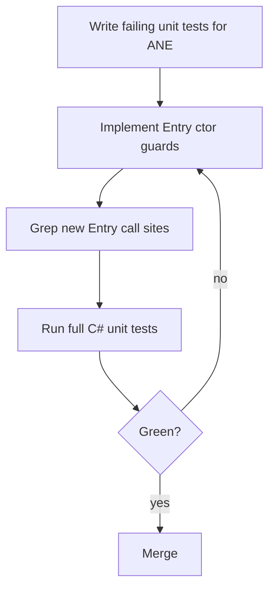

**Activity (target)**

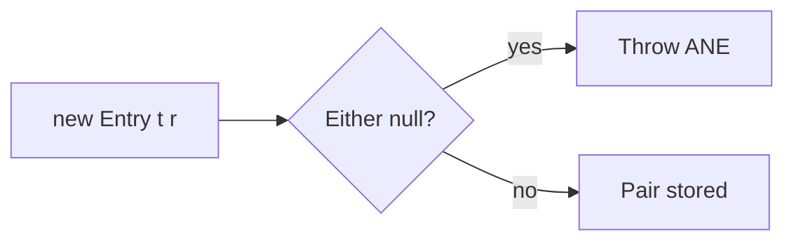

---

### Task F2 — Document V1 / V2 / V3 row semantics

| INVEST | |
|--------|--|
| **I** | Yes — documentation only. |
| **N** | Wording negotiable; **must** explain **N entries** per trigger and **duplicate trigger JSON**. |
| **V** | Maintainers stop misreading `entries[]`. |
| **E** | Very small. |
| **S** | Hours. |
| **T** | Peer review checklist. |

**Test evals (first)**

1. **Review eval:** Another engineer answers **without** reading code: “Can one `Html.On` block produce **two** `entries` rows?” — **must** be **yes** after doc.
2. Link from [`Entry`](Alis.Reactive/Descriptors/Entry.cs) XML to this doc.

**Reads:** [`TriggerBuilder`](Alis.Reactive/Builders/TriggerBuilder.cs), [`PipelineBuilder.BuildReactions`](Alis.Reactive/Builders/PipelineBuilder.cs), Issue F in [analysis plan](descriptor-solid-analysis-plan.md).

**Help:** Tech writer or second dev for clarity pass.

**Flow**

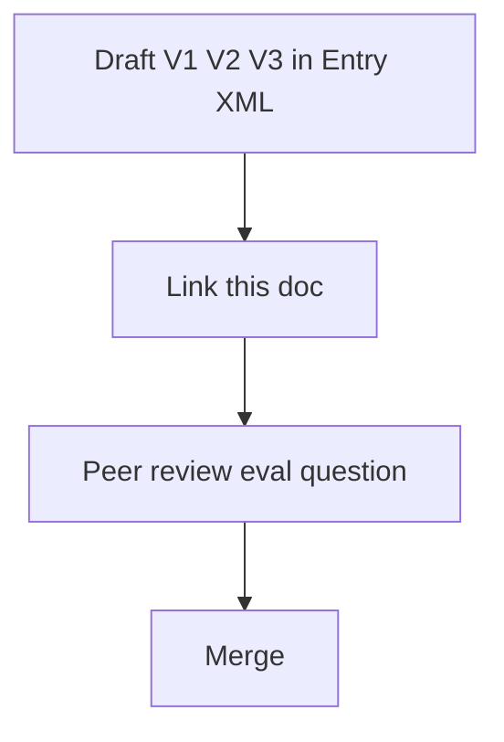

---

### Task F3 — `BuildReaction()` multi-segment safety

| INVEST | |
|--------|--|
| **I** | Depends on **F2** (mental model) and **F1** (valid rows). |
| **N** | Throw vs `Obsolete`+throw vs rename — **negotiable**; **not** negotiable: **no silent** drop. |
| **V** | Eliminates **silent** loss of reactions ([`PipelineBuilder.cs`](Alis.Reactive/Builders/PipelineBuilder.cs) lines 137–142). |
| **E** | Medium — behavior change + test updates. |
| **S** | One PR if scope = `BuildReaction` only. |
| **T** | Tests for multi-segment count + new throw/behavior. |

**Test evals (first)**

1. Pipeline with **two** flushed segments; `BuildReactions().Count == 2`.
2. Same pipeline: `BuildReaction()` **throws** (or compile-time **Obsolete** path—if chosen).
3. **Regression:** `TriggerBuilder` path still emits **two** `Entry` rows when expected.

**Reads:** [`PipelineBuilder.cs`](Alis.Reactive/Builders/PipelineBuilder.cs), [`GuardBuilder.Then`](Alis.Reactive/Builders/Conditions/GuardBuilder.cs).

**Help:** **Pair** — nested branch pipelines easy to break.

**Flow**

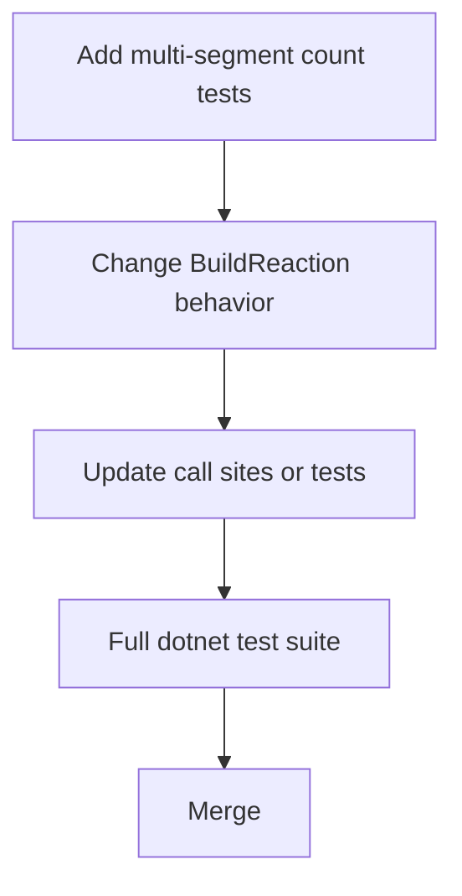

**Activity (target)**

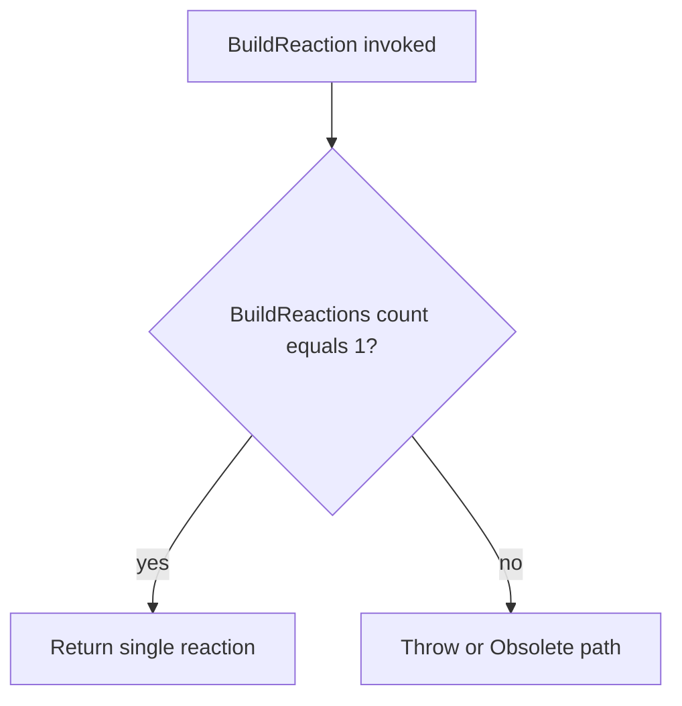

---

### Task Pre-C — Golden `Render()` baseline for HTTP + validation

| INVEST | |
|--------|--|
| **I** | Yes — **before** **C** lands. |
| **N** | Which views to snapshot — negotiable. |
| **V** | Proves **C** did not change wire **accidentally**. |
| **E** | Depends on sandbox coverage. |
| **S** | One focused PR. |
| **T** | Verify snapshots or stable JSON. |

**Test evals (first)**

1. Identify **2–3** representative plans: HTTP + `Validate()`, chained request, components map enrichment.
2. Add **Verify** of `plan.Render()` **before** **C** refactor.
3. **CI gate:** snapshot **must** match after **C** **unless** intentional migration PR.

**Reads:** [`ReactivePlan.Render`](Alis.Reactive/ReactivePlan.cs), [`ValidationResolver`](Alis.Reactive/Resolvers/ValidationResolver.cs).

**Help:** Owner of FluentValidation extraction paths.

**Flow**

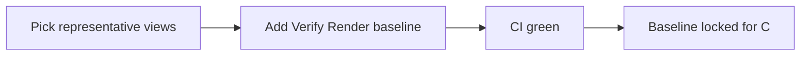

---

### Task C — Resolve to **new** wire DTOs (no in-place `EnrichValidation`)

| INVEST | |
|--------|--|
| **I** | Depends on **Pre-C** baseline. |
| **N** | Implementation negotiable if JSON identical. |
| **V** | **Encapsulation:** resolve **produces** wire state, does not **patch** graph in place. |
| **E** | Large — estimate only after **Pre-C**. |
| **S** | Split C1/C2 if needed. |
| **T** | **Pre-C** snapshots **byte-identical** OR migration pack. |

**Test evals (first)**

1. All **Pre-C** snapshots **pass** after implementation.
2. Unit tests: resolver does not require **two** passes to stabilize JSON.
3. Schema tests unchanged for same wire.

**Reads:** [`ValidationResolver.cs`](Alis.Reactive/Resolvers/ValidationResolver.cs), [`RequestDescriptor.cs`](Alis.Reactive/Descriptors/Requests/RequestDescriptor.cs).

**Help:** **Mandatory** second reviewer (HTTP + validation).

**Flow**

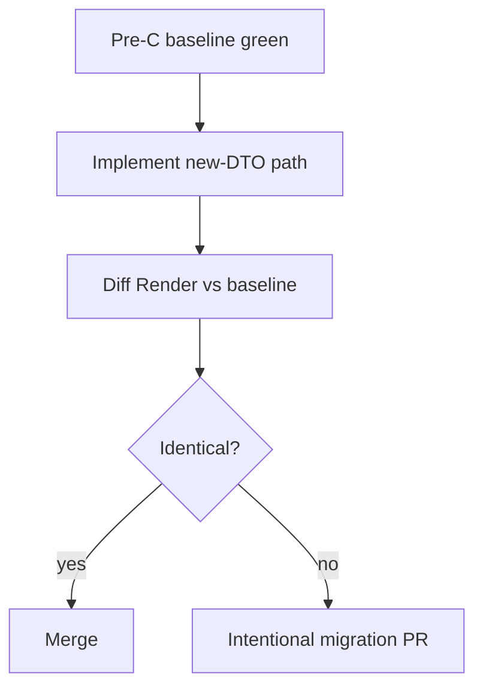

---

### Task E — Narrow command emission (`ICommandEmitter` / internal)

| INVEST | |
|--------|--|
| **I** | Can parallel **F3** if decoupled. |
| **N** | Interface shape negotiable. |
| **V** | **ISP** — narrow port for extensions. |
| **E** | Mechanical — grep `AddCommand` count drives estimate. |
| **S** | Multi-file across Native/Fusion. |
| **T** | Compile + all extension tests. |

**Test evals (first)**

1. List **all** `AddCommand(` call sites — checklist in PR.
2. **Build** all projects **before** removing public `AddCommand`.
3. **One** new test that **only** uses emitter API.

**Reads:** All `AddCommand` references.

**Help:** Fusion + Native owners.

**Flow**

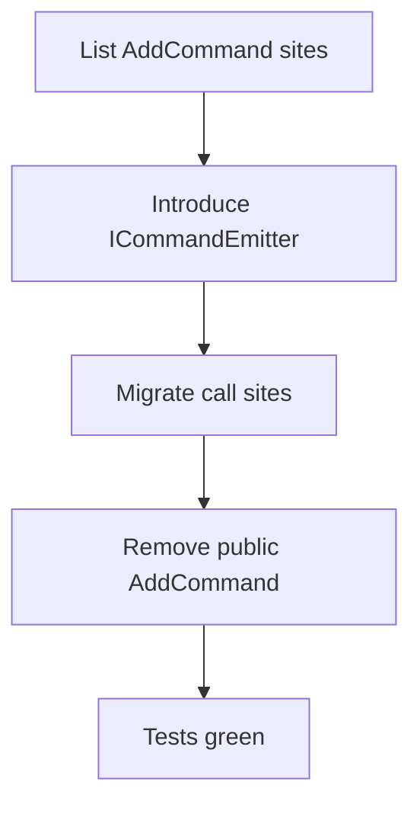

---

### Task A — Immutable `Command` / `WithWhen`

| INVEST | |
|--------|--|
| **I** | Often **after** **E** if emit creates commands. |
| **N** | `WithWhen` vs ctor-only. |
| **V** | No post-hoc `GuardWith`. |
| **E** | High — many leaves. |
| **S** | Phase by command subtype if needed. |
| **T** | Verify + double-guard tests. |

**Test evals (first)**

1. “Double `When`” throw behavior preserved.
2. **Full** Verify suite on representative views.

**Reads:** [`Command.cs`](Alis.Reactive/Descriptors/Commands/Command.cs); command subclasses.

**Help:** Phased PRs.

---

### Task B — `PipelineBuilder` façade + collaborators

| INVEST | |
|--------|--|
| **I** | Often **after** **F3**. |
| **N** | Class names negotiable. |
| **V** | **SRP** — fewer merge conflicts. |
| **E** | Large. |
| **S** | Split B1/B2. |
| **T** | No JSON drift vs **Pre-C** philosophy. |

**Test evals (first)**

1. All pipeline builder unit tests green **without** snapshot drift.
2. Optional: coverage on collaborators **≥** monolith.

**Reads:** `PipelineBuilder*.cs` partials.

**Help:** Refactor **pair**.

---

### Task D — `StatusHandler` sealed union + schema

| INVEST | |
|--------|--|
| **I** | Orthogonal to **C** if wire coordinated. |
| **N** | Union shape negotiable; **must** match schema `oneOf`. |
| **V** | Compiler rejects impossible combos. |
| **E** | Medium — TS + C# + schema. |
| **S** | One vertical slice PR. |
| **T** | Schema + TS tests. |

**Test evals (first)**

1. Schema `oneOf` validates all samples.
2. TS types **exhaustive** match.

**Reads:** Issue D in analysis plan; [`reactive-plan.schema.json`](Alis.Reactive/Schemas/reactive-plan.schema.json).

**Help:** Runtime owner for TS types.

---

### Task F4 — Trigger dedupe on wire (deferred contract program)

| INVEST | |
|--------|--|
| **I** | **Not** mixed into A–E/F1–F3—**must** be a **separate**, explicitly scheduled program. |
| **N** | Shape negotiable **only** inside that program. |
| **V** | Payload size—**must** be **proven** before starting (metrics), not assumed. |

**When undertaken:** **must** satisfy same gates as **Mandatory compliance**—migration tests + browser merge behavior + schema + TS.

**Help:** Architect + product—**must** sign off scope before dev work.

---

## How this document is structured (not surface-level)

1. **[Complete feature inventory](#complete-feature-inventory--literal-schema-backed)** — **Every** trigger/reaction/command/guard/gather/HTTP/validation **`kind`** on the wire (not a casual list). **Mandatory compliance** + **Coverage rule** **must** be satisfied for any row that changes.
2. **Tasks** — INVEST backlog: **tests/evals first**, **flow** + **activity** diagrams, **help**, **north star** invariants.
3. **Use cases UC1–UC6** — **Cross-cutting** flows only; they **do not** replace the inventory—use **both**.
4. **SOLID + Encapsulation** — Per scenario / matrix row: which boundary is **actually** at stake.
5. **Portfolio verdict** — **When** to defer categories.

**Cross-cutting lenses** (same definitions as [descriptor-solid-analysis-plan.md](descriptor-solid-analysis-plan.md) Part 1):

- **SOLID** — SRP/OCP/ISP/DIP/LSP where they apply **to this codebase** (thin polymorphic bases → LSP mostly about JSON shape).
- **Encapsulation** — *Who may change what after construction*; **strong** = invalid state rejected or unrepresentable; **weak** = `GuardWith`, `EnrichValidation` after build, public `AddCommand`, **order-dependent** `ResolveAll` + mutable `RequestDescriptor`.

---

## SOLID and encapsulation — condensed map (Issues A–F)

| Issue | What code actually does today | Encapsulation / SOLID target |
|-------|------------------------------|------------------------------|
| **A** | [`Command.GuardWith`](Alis.Reactive/Descriptors/Commands/Command.cs) mutates `When` after ctor | Immutable command snapshots; **no** post-hoc mutator |
| **B** | One [`PipelineBuilder`](Alis.Reactive/Builders/PipelineBuilder.cs) holds **modes**, **HTTP**, **parallel**, **conditional**, **`_segments`**, **`Commands`** | **Facade** + collaborators; **SRP** on the builder file |
| **C** | [`ValidationResolver.ResolveRequest`](Alis.Reactive/Resolvers/ValidationResolver.cs) calls `req.EnrichValidation(extracted)` — **mutates** descriptor in place | **New** wire `RequestDescriptor` (or row) from resolver; **no** hidden mutation before serialize |
| **D** | `StatusHandler` modeling (see analysis plan) | Sealed union + schema `oneOf` **lockstep** |
| **E** | Public [`AddCommand`](Alis.Reactive/Builders/PipelineBuilder.cs) | **Narrow** `ICommandEmitter` / internal-only — **ISP** |
| **F** | [`Entry`](Alis.Reactive/Descriptors/Entry.cs) ctor **no null checks**; [`TriggerBuilder`](Alis.Reactive/Builders/TriggerBuilder.cs) `foreach` over `BuildReactions()`; `BuildReaction()` footgun | **F1–F4** per analysis plan |

[`Entry`](Alis.Reactive/Descriptors/Entry.cs) is **not** an SRP violation—two properties, one row. **F** is **invariants + clarity**, not a new SOLID pillar.

---

## Use cases UC1–UC6 (cross-cutting only)

**UC1–UC6** are **scenario** walkthroughs (how subsystems combine). They **do not** enumerate **every** `kind` on the wire or **every** builder module. For **literal** feature coverage, use **[Complete feature inventory](#complete-feature-inventory--literal-schema-backed)** — triggers (5), reactions (4), **Conditions module** (DSL), commands (5), guards (5), gather (4), HTTP fields, parallel HTTP, `StatusHandler` branches, validation `$defs`, coercion enum.

---

## Use case — UC1: Simple trigger block (one reaction root)

**Related tasks:** **E**, **B**, **A** (optional ordering: **E → A**).

**Grounding:** [`TriggerBuilder.DomReady`](Alis.Reactive/Builders/TriggerBuilder.cs) → `PipelineBuilder` → [`AddEntryWithContexts`](Alis.Reactive/Builders/TriggerBuilder.cs) loops `pb.BuildReactions()`. When `_segments` is null/empty, [`BuildReactions`](Alis.Reactive/Builders/PipelineBuilder.cs) returns a **single-element** list from `BuildSingleReaction()` (lines 152–155). [`BuildSingleReaction`](Alis.Reactive/Builders/PipelineBuilder.cs) for default mode returns `new SequentialReaction(Commands)` (line 185) — **shares** the `Commands` list reference (mutability of list contents remains an issue for **A**).

**Risk today:** Nested `PipelineBuilder` in [`GuardBuilder.Then`](Alis.Reactive/Builders/Conditions/GuardBuilder.cs) calls `pb.BuildReaction()` for **branch bodies**—fine for **single**-segment branch pipelines; **wrong** if a branch pipeline ever flushes multiple segments (same `BuildReaction` hazard as UC2).

**Target activity (post-refactor)**

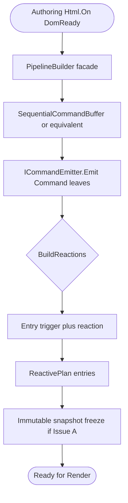

**SOLID / Encapsulation:** **SRP** moves toward collaborators (**B**); **E** narrows emit. **Encapsulation:** command list **not** arbitrarily appendable from **every** caller.

**Tests first:** Existing `WhenComposingAPlan` / trigger tests **plus** any **Native/Fusion** extension tests that call `BuildReaction()` on **non**-branch pipelines. **Before** removing `AddCommand`: add **public-surface** tests that **only** use `Emit` (or approved port).

**Worth it?** **High** for **E** if you have **many** extension assemblies—reduces accidental misuse. **A** on commands is **worth it** if you already debug “guard applied twice” or order bugs; **cost** is every `Command` construction path.

---

## Use case — UC2: Multi-segment pipeline (conditional / multiple `When` blocks)

**Related tasks:** **F1**, **F2**, **F3**, **B** (see **Task catalog** section above).

**Grounding:** Second [`When`](Alis.Reactive/Builders/PipelineBuilder.Conditions.cs) calls [`FlushSegment`](Alis.Reactive/Builders/PipelineBuilder.cs) when `ConditionalBranches` already has entries. **`_segments`** accumulates `SequentialReaction` / `ConditionalReaction` chunks. [`AddEntryWithContexts`](Alis.Reactive/Builders/TriggerBuilder.cs) adds **one `Entry` per** reaction in `BuildReactions()`. **Same** `Trigger` instance is reused for each row.

**Critical code fact:** [`BuildReaction`](Alis.Reactive/Builders/PipelineBuilder.cs) returns `reactions[0]` **unconditionally** when `Count != 1` (lines 139–142)—**silent** drop of later segments.

**Target activity (post-refactor)**

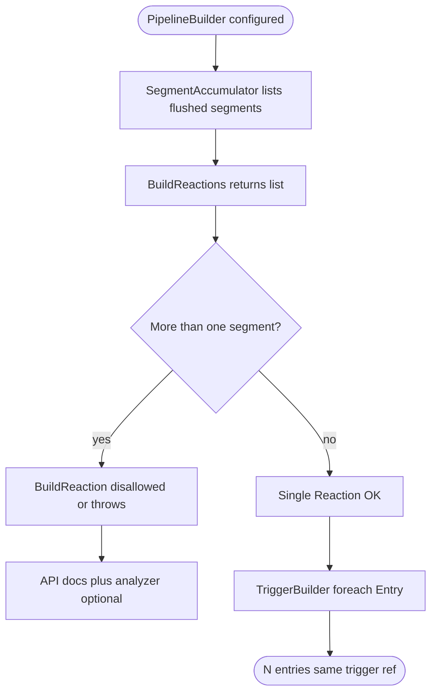

**SOLID / Encapsulation:** **B** (facade + segment ownership); **F2/F3** (document V1/V2/V3; **eliminate silent** `BuildReaction`). **Encapsulation:** “one row” semantics **explicit** at API.

**Tests first:** **Before** changing `BuildReaction` behavior: unit tests that **build** multi-segment pipelines and assert **count** of `BuildReactions()`; **then** assert `BuildReaction()` **throws** or **rename** (F3). **Regression:** `TriggerBuilder` integration tests **expect** N entries for N segments.

**Worth it?** **Very high** for **F3**—small code change, **high** leverage (prevents silent data loss). **F2** is **cheap** (docs). **B** (facade split) is **medium/large** cost—**worth it** only if team is **actively** editing `PipelineBuilder` and shipping segment bugs.

---

## Use case — UC3: `Render` → `ResolveAll` (validation + components)

**Related tasks:** **Pre-C**, **C**, **D** (if `StatusHandler` on wire).

**Grounding:** [`ReactivePlan.ResolveAll`](Alis.Reactive/ReactivePlan.cs) (lines 98–118): (1) if `Extractor != null` → `ValidationResolver.Resolve`; (2) else if `HasValidatorTypes` → **throw**; (3) else if `_componentsMap.Count > 0` → `EnrichFromComponents`; (4) always `StampPlanId`. **No** second serialize pass.

[`ResolveRequest`](Alis.Reactive/Resolvers/ValidationResolver.cs) (lines 81–104): if `ValidatorType != null` **and** `Validation != null` → `extractor.ExtractRules` then **`req.EnrichValidation(extracted)`** — **mutates** `RequestDescriptor`. Then `EnrichFieldsFromComponents` mutates **field** rows on `ValidationDescriptor`.

**Target activity (post-refactor — Issue C)**

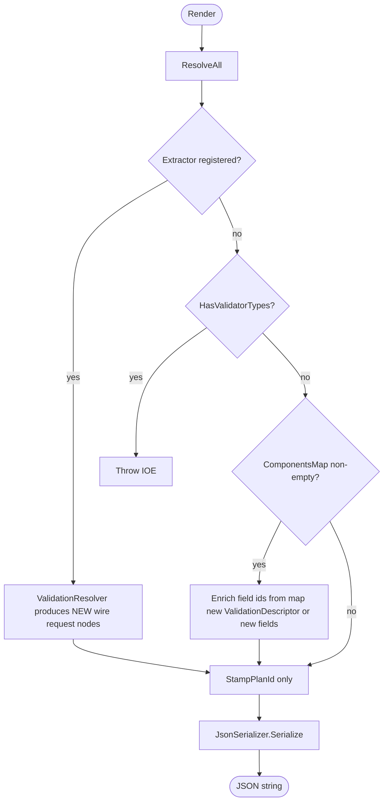

**SOLID / Encapsulation:** **DIP** — plan DTO vs **validation** subsystem; **Encapsulation** — **no** `EnrichValidation` on **shared** mutable object after “build.” **Target:** `ValidatorType` **not** on serialized graph.

**Tests first:** **Before** refactor: snapshot tests that **pin** `Render()` output for HTTP + `Validate()`; **ValidationResolver** unit tests if any. **After:** same JSON bytes **or** intentional migration with schema + TS + Playwright **if** wire shape changes.

**Worth it?** **High** if you **debug** “wrong rules on wire” or **accidental** double enrichment—**C** is **correctness + reasoning**. **Cost** is **touching** every HTTP path + **possibly** TS if wire shape changes (plan says **C# only by default** when JSON unchanged).

---

## Use case — UC4: Component registration + field enrichment

**Related tasks:** **C** (enrichment semantics); registration invariant **unchanged**.

**Grounding:** [`AddToComponentsMap`](Alis.Reactive/ReactivePlan.cs) — **fail-fast** on conflicting `bindingPath` (lines 40–57). [`EnrichFieldsFromComponents`](Alis.Reactive/Resolvers/ValidationResolver.cs) sets `field.FieldId`, `Vendor`, `ReadExpr` from map when `Validation` exists.

**Target activity:** **Unchanged** **fail-fast** registration. Enrichment either **runs** on **immutable** copies of field rows or **returns** new `ValidationDescriptor`—**same JSON** as today if **C** is implemented as **replace-at-resolve** with **equal** output.

**SOLID / Encapsulation:** **Strong** boundary already on registration; **weak** part is **mutation** of validation **fields** during resolve—folds into **C**.

**Tests first:** **Native/Fusion** unit tests for `ComponentsMap` + validation views; **Playwright** for field scoping if applicable.

**Worth it?** **Tied to UC3**—not a separate **business** case; **keep** registration behavior **verbatim**.

---

## Use case — UC5: Vendor / extension command emission

**Related tasks:** **E**.

**Grounding:** [`PipelineBuilder.AddCommand`](Alis.Reactive/Builders/PipelineBuilder.cs) is **public** (`Commands.Add`). **Native/Fusion** extensions construct command leaves and **push** them.

**Target activity:** Extension code **only** sees **`ICommandEmitter.Emit(Command)`** (or **internal** `Friend` assembly pattern—**one** story per analysis plan). **No** direct `List<Command>` access.

**SOLID / Encapsulation:** **ISP** — narrow port; **Encapsulation** — **cannot** inject arbitrary commands **after** pipeline rules without going through the emitter.

**Tests first:** **All** extension tests **compile** against new emit surface **before** deleting `AddCommand` public.

**Worth it?** **Medium**—**breaks** every extension **call site**; **worth it** when **API** misuse is **real** (e.g. tests bypassing `Dispatch`/`Element`). **Low** priority if extensions are **trusted** and **small**.

---

## Use case — UC6: Guards on commands (`When`)

**Related tasks:** **A**.

**Grounding:** [`Command.GuardWith`](Alis.Reactive/Descriptors/Commands/Command.cs) is **internal**; sets `When` **once** or throws. **Risk:** any **future** public path that **reuses** `Command` instances could **double-apply**—today **internal** limits blast radius.

**Target activity:** **`WithWhen`** or **ctor**-only guard; **immutable** `Command` leaf.

**Tests first:** Unit tests for **double guard** throw **today**; **after** **A**, tests assert **no** mutation after `Create`.

**Worth it?** **High** if you **expose** more public APIs on `Command`; **medium** if **internal** stays the only **mutation** path—**A** is **still** coherent with **immutable plan graph** narrative.

---

## Portfolio verdict — is the **whole** redesign worth it?

| Bucket | Verdict | Rationale |
|--------|---------|-----------|
| **F1, F2, F3** | **Do** | **F3** fixes **silent** loss of reactions; **F1/F2** are **low** cost. **Evidence:** [`BuildReaction`](Alis.Reactive/Builders/PipelineBuilder.cs) lines 137–142. |
| **C** (resolve → new DTOs) | **Do if** you **maintain** HTTP+validation **heavily** | **Highest** conceptual payoff; **highest** integration cost. **Gate:** same JSON + existing tests **green** first. |
| **E** (narrow emit) | **Do when** extension count grows | **Mechanical** churn across **Native/Fusion**. |
| **A** (immutable commands/reactions) | **Phased** | Touches **every** command construction; **pair** with **Verify** + schema. |
| **B** (split `PipelineBuilder`) | **Do when** file is **change** bottleneck | **Cosmetic** SRP without **tests** does **not** pay—**measure** churn on `PipelineBuilder.cs` first. |
| **F4** (trigger dedupe on wire) | **Must not** start ad hoc—**only** as a **scheduled** contract program; **must** prove payload need first | **Explicit** contract migration + **Mandatory compliance** when executed |

**Bottom line:** **Worth it** as a **portfolio** if **F3 + C** (or **F3 + phased A**) match **your** pain. **Not** worth it if the goal is **only** “more SOLID” **without** a **failing** test or **production** bug class.

---

## Reference — what disappears (unchanged intent)

| Remove | Replace with |
|--------|----------------|
| `Command.GuardWith` | `WithWhen` / ctor with `Guard` |
| `RequestDescriptor.EnrichValidation` (mutating) | Resolver-built **new** descriptor or immutable row types |
| `public PipelineBuilder.AddCommand` | `ICommandEmitter.Emit` (or **one** internal story) |
| Silent multi-segment **`BuildReaction()`** | **F3** — throw, split/rename API, or analyzer |
| `StatusHandler` dual nullables | Sealed union + schema `oneOf` (**D**) |

---

## Reference — JSON spine (unchanged contract intent)

[`Render`](Alis.Reactive/ReactivePlan.cs) → anonymous `{ planId, components, entries }` + [`WriteOnlyPolymorphicConverter`](Alis.Reactive/Serialization/WriteOnlyPolymorphicConverter.cs) on abstract bases. **`reactive-plan.schema.json`** + **Verify** remain **gates**.

---

## Reference — conceptual class structure (target)

Static view of **types** after B/E; complements **activity** diagrams above.

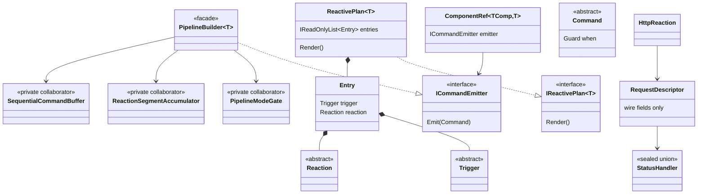

---

## Reference — `Entry` tiers F1–F4 (detail)

| Tier | Target | Contract churn |
|------|--------|----------------|
| **F1** | `ArgumentNullException` in [`Entry`](Alis.Reactive/Descriptors/Entry.cs) ctor | None if no null callers |
| **F2** | Document V1/V2/V3 in XML + link here | None |
| **F3** | Fix `BuildReaction` / multi-segment | **Yes** for misuse paths |
| **F4** | Trigger dedupe on wire—**deferred** program only; **must** use full gates if done | **Yes** — separate project |

---

## Summary

| Dimension | Target |
|-----------|--------|
| **Features (literal)** | **[Complete feature inventory](#complete-feature-inventory--literal-schema-backed)** — **must** maintain; every schema `kind` / wire branch listed; **UC1–UC6** are **not** exhaustive |
| **Method** | **Each** mergeable slice is an **INVEST task** (all six letters, ≥4) — **not** only “Issue A–F” labels → **evals first** → **flow/activity** per task → use cases as **cross-cutting** examples → portfolio verdict |
| **Views / DSL** | Unchanged **fluent** surface; **internals** swap under **same** JSON contract where required |
| **SOLID + Encapsulation** | **Per UC** + **feature × refactor matrix** + Issues A–F map |
| **Quality bar** | **No** parallel “compat” serializers; **no** silent fallbacks; **refactors** **prove** value with **tests**; **PR must name** feature row(s) when touching contract—**mandatory** |

Issue-level **What / Why / How / Because** stays in [descriptor-solid-analysis-plan.md](descriptor-solid-analysis-plan.md); **this** file is the **inventory + use-case + worth-it** view of the **same** destination.
