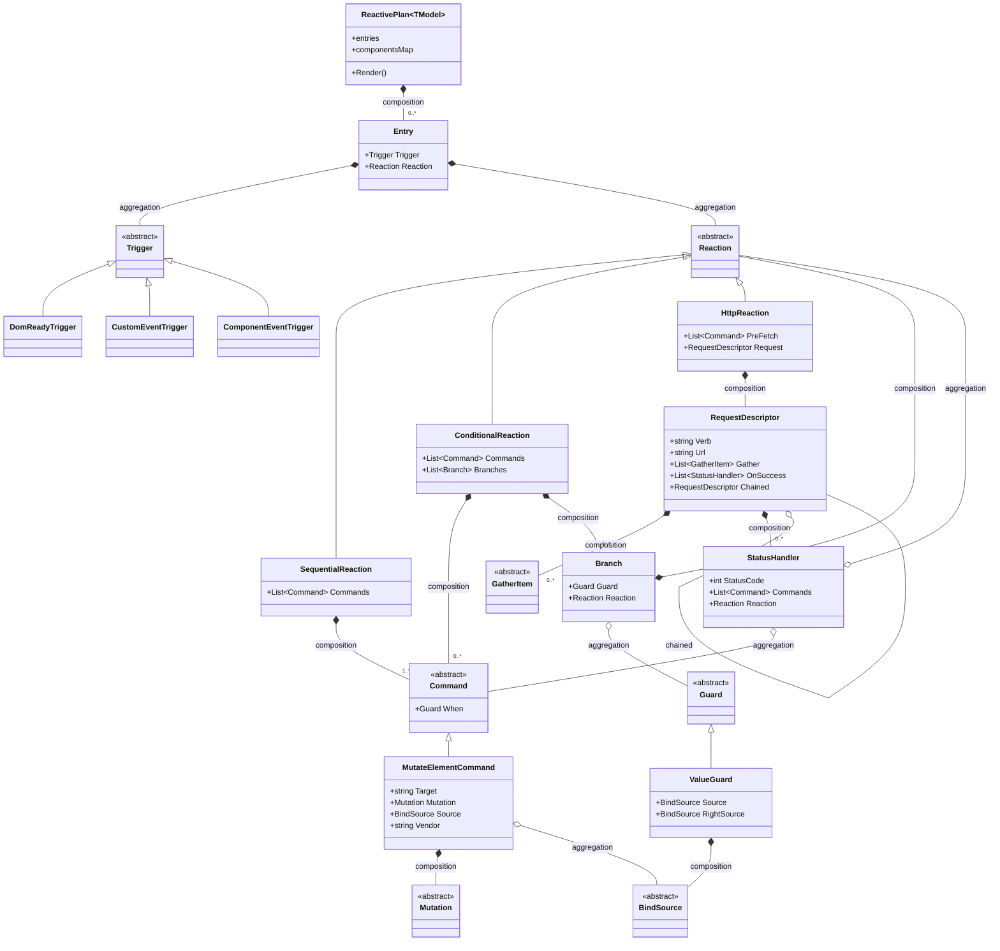
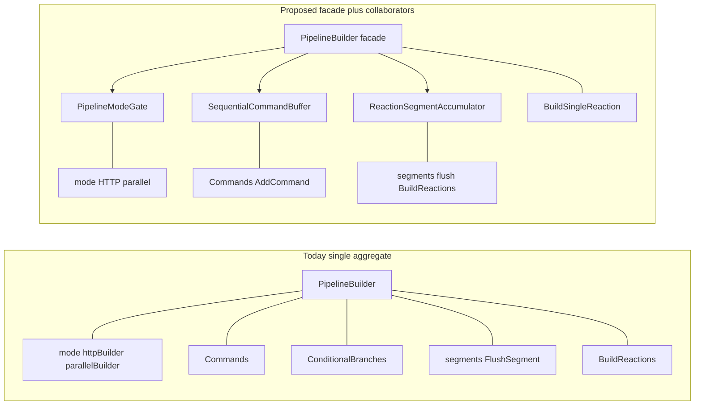
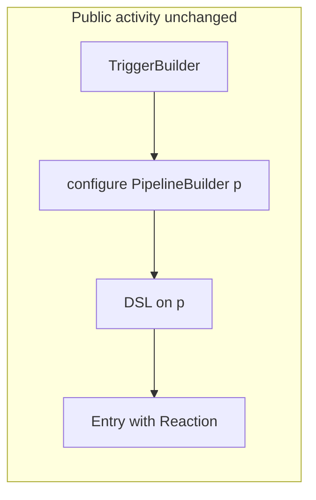
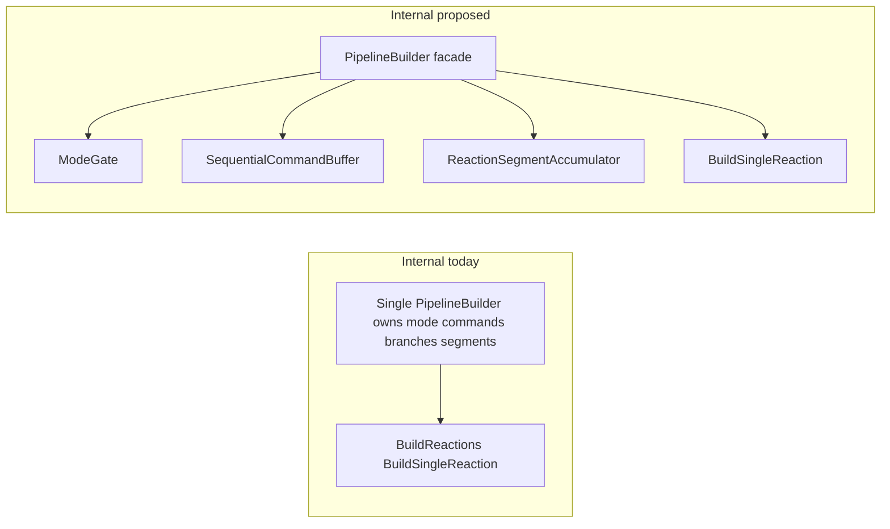
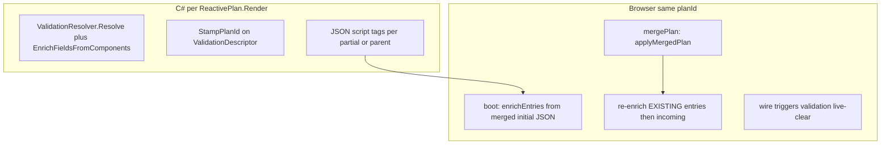
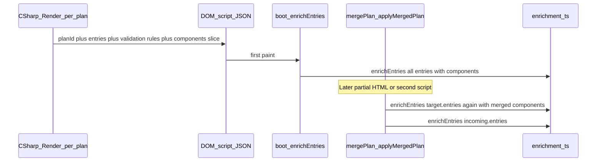
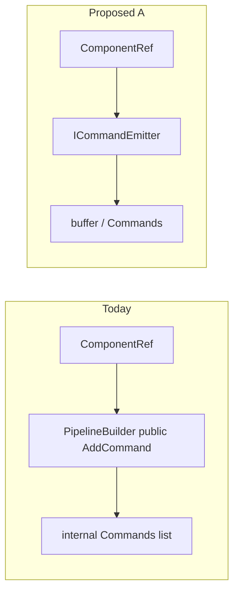

# Descriptor design — SOLID, encapsulation, class diagram, and decisions

**Execution-ready planning:** [descriptor-target-state-planning/README.md](descriptor-target-state-planning/README.md) (master target diagrams, issue A–F files, [INVEST rubric](descriptor-target-state-planning/INVEST-rubric.md), [issue review protocol](descriptor-target-state-planning/issue-review-protocol.md), [implementation guardrails](descriptor-target-state-planning/IMPLEMENTATION-GUARDRAILS.md) — anti-drift checklist per PR). Part 3 Issues: deep links `#issue-a` … `#issue-f`. [descriptor-design-target-state.md](descriptor-design-target-state.md) holds policy + **complete feature inventory**.

**Issue label mapping (analysis vs target-state doc):** This file’s **IssueA** discusses both **`Command`** and **`RequestDescriptor`** mutability. [descriptor-design-target-state.md](descriptor-design-target-state.md) splits work: **Issue A** = immutable **command** graph / `GuardWith`; **Issue C** = HTTP **`RequestDescriptor`** + **`ValidationResolver`** return-new / no in-place enrichment. Same intent—different **issue letter** boundaries for implementation tasks.

---


## Document format (read code → diagram → IssueA…)

Order of content:

1. **Read the code (basis for analysis)** — types under `[Alis.Reactive/Descriptors/](Alis.Reactive/Descriptors/)`; builders wire them; Native/Fusion **instantiate** core descriptors (no second hierarchy).
2. **SOLID + encapsulation** — Part 1 below (per-principle notes grounded in those types).
3. **Current class diagram** — Part 2 (association vs aggregation; how `ReactivePlan`, `Entry`, `Trigger`, `Reaction`, `Command`, requests, guards, mutations connect).
4. **Issues** — **IssueA** through **IssueF**; for **each** issue, exactly four subsections in this order:
  - **What** — what is wrong (the issue statement).
  - **Why** — deep reasoning (root cause, which SOLID/encapsulation rule is strained).
  - **How** — the proposed design (what we build or change; no dual JSON shapes).
  - **Because** — why that design is better **and** why it does not drop any existing plan/runtime capability (same contract, explicit migration—**not** backward-compat shims or silent fallbacks).

**Strict rule:** no backward-compatibility layers, no silent fallbacks; one authoritative model; invalid states fail fast.

**Where descriptors live:** almost all concrete descriptor types are in `[Alis.Reactive/Descriptors/](Alis.Reactive/Descriptors/)`. **Alis.Reactive.Native** and **Alis.Reactive.Fusion** typically **construct** those types (`ComponentEventTrigger`, `MutateElementCommand`, `CallMutation`, etc.) from extension methods; they do not fork a second descriptor taxonomy.

---

## Part 1 — SOLID principles and encapsulation

### Single Responsibility Principle (SRP)

- **Aligned:** Leaf descriptors (`DispatchCommand`, `DomReadyTrigger`, `SetPropMutation`, `EventSource`) each map to one JSON `kind` and one runtime behavior path.
- **Strained:** `[PipelineBuilder<TModel>](Alis.Reactive/Builders/PipelineBuilder.cs)` coordinates sequential pipelines, HTTP, parallel HTTP, and conditional segments (modes, segment flushing, internal `_segments`). That is **multiple reasons to change** in one class.

### Open/Closed Principle (OCP)

- **Aligned:** New trigger/reaction/command shapes are added as **new sealed types**; `[WriteOnlyPolymorphicConverter<T>](Alis.Reactive/Serialization/WriteOnlyPolymorphicConverter.cs)` serializes by **runtime type**, so new subclasses participate without editing a central switch.
- **Strained:** Only if someone bypasses the builder and mutates descriptors inconsistently (see encapsulation).

### Liskov Substitution Principle (LSP)

- **Mostly N/A at depth:** `[Trigger](Alis.Reactive/Descriptors/Triggers/Trigger.cs)`, `[Reaction](Alis.Reactive/Descriptors/Reactions/Reaction.cs)`, `[Command](Alis.Reactive/Descriptors/Commands/Command.cs)`, `[Guard](Alis.Reactive/Descriptors/Guards/Guard.cs)`, `[BindSource](Alis.Reactive/Descriptors/Sources/BindSource.cs)`, `[Mutation](Alis.Reactive/Descriptors/Mutations/Mutation.cs)` are thin abstract bases used for polymorphic JSON. Substitutability matters for **serialization shape**, not rich behavior.

### Interface Segregation Principle (ISP)

- **Aligned:** `[IReactivePlan<TModel>](Alis.Reactive/IReactivePlan.cs)` is a small surface (entries, components map, render).
- **Strained:** Public `[AddCommand(Command)](Alis.Reactive/Builders/PipelineBuilder.cs)` exposes the full command list mutation to **any** caller, not a minimal “emit one command” port.

### Dependency Inversion Principle (DIP)

- **Strained:** `[RequestDescriptor](Alis.Reactive/Descriptors/Requests/RequestDescriptor.cs)` references the **Validation** subsystem and holds non-JSON `ValidatorType` with enrichment methods. High-level “plan DTO” is coupled to validation resolution details.

### Encapsulation (prompt lens — not the same as SRP)

**Definition used here:** *Encapsulation* means **who may change what, when**, and whether **invariants** live **inside** a type/module boundary or depend on **call order** across callers. It overlaps SOLID (especially **ISP** and **immutability**) but is worth naming explicitly because the prompt asks for it.

| Signal | Meaning |
|--------|---------|
| **Strong encapsulation** | Invalid combinations are **unrepresentable** or **rejected** at the boundary; internal state is not mutated after the object is “done.” |
| **Weak encapsulation** | Public surface allows **post-construction mutation**; or **two** ways to do the same thing; or invariants only hold if callers respect **undocumented order**. |

**Strong (evidence in code)**

- `[ReactivePlan.AddToComponentsMap](Alis.Reactive/ReactivePlan.cs)` — conflicting component registration **throws**; no silent merge (matches no-fallback rule).
- Polymorphic **write-only** serialization — `[WriteOnlyPolymorphicConverter<T>](Alis.Reactive/Serialization/WriteOnlyPolymorphicConverter.cs)` keeps “how to serialize `kind`” in one place; callers don’t hand-roll JSON per leaf type.

**Weak (evidence in code)**

- `[Command.GuardWith](Alis.Reactive/Descriptors/Commands/Command.cs)` — mutates `When` **after** construction; the “real” command identity is split between ctor and a later mutator.
- `[RequestDescriptor](Alis.Reactive/Descriptors/Requests/RequestDescriptor.cs)` — enrichment / validation wiring can run **after** the HTTP node was built; **serialize-time** state depends on **resolver order**, not only on what the view author expressed in the lambda.
- Public `[AddCommand(Command)](Alis.Reactive/Builders/PipelineBuilder.cs)` — exposes **direct list mutation** of the pipeline’s command collection; a **wide** surface for “emit a command” (ISP strain = encapsulation leak: everyone can push arbitrary `Command` instances).
- `[Entry](Alis.Reactive/Descriptors/Entry.cs)` — ctor accepts `Trigger`/`Reaction` **without null checks**; **invalid reference** states are possible in C# until serialize (Issue F1 — **boundary** doesn’t enforce “valid row” yet).

**Encapsulation → Issues (quick map)**

| Issue | Encapsulation angle |
|-------|---------------------|
| **A** | Replace post-build **patch** APIs with **immutable** snapshots / `With*` — invariants hold **inside** the object after build. |
| **B** | Split **PipelineBuilder** so mode/HTTP/segment rules live in **collaborators** with clear boundaries — less “one object knows everything.” |
| **C** | Resolution returns **new** wire DTOs (or new `RequestDescriptor`) — **no hidden mutation** of graph nodes during `ResolveAll`. |
| **E** | **Narrow** command emission (`ICommandEmitter` / internal-only) — **don’t** expose raw `List<Command>` mutation to all callers. |
| **F** | **`Entry` ctor** + docs for **fan-out** (`BuildReactions` vs `BuildReaction`) — clarify **what one row means** and enforce non-null at the boundary where possible. |

---

## Part 2 — Class diagram (association and aggregation)

**How to read the diagram**

- **Composition (`*--` in mermaid):** the parent owns the child in the plan object graph for that render (typical lifetime: child lives as part of the aggregate).
- **Aggregation (`o--`):** the parent references a part that may be shared or optional (weaker ownership).
- **Inheritance (`<|--`):** JSON discriminator `kind` + sealed leaf types.

**Native / Fusion:** not separate classes on this diagram; they **associate** to core descriptors by **creating** instances (e.g. `ComponentEventTrigger`, `CallMutation` with `vendor`).




**Narrow associations not every leaf:** `ParallelHttpReaction`, `DispatchCommand`, `IntoCommand`, `ServerPushTrigger`, `SignalRTrigger`, `AllGuard`, `AnyGuard`, `InvertGuard`, `ConfirmGuard`, and gather subtypes (`ComponentGather`, `EventGather`, …) follow the same patterns: **Reaction** / **Command** / **Trigger** / **GatherItem** trees under `[Alis.Reactive/Descriptors/](Alis.Reactive/Descriptors/)`.

---

## Part 3 — Issues (IssueA … IssueF): What / Why / How / Because

Global constraint: **no backward-compatibility shims** (no dual serializers, no “try old then new” paths) and **no silent fallbacks**. A redesign is **one** authoritative shape; migrations are explicit (code + schema + tests together).

---

<a id="issue-a"></a>

### IssueA — Mutable descriptors after construction (`Command`, `RequestDescriptor`)

**What**

`[Command.GuardWith](Alis.Reactive/Descriptors/Commands/Command.cs)` mutates `When` after the command exists. `[RequestDescriptor](Alis.Reactive/Descriptors/Requests/RequestDescriptor.cs)` is enriched after construction (`EnrichValidation`, `AttachValidator`). Until `ResolveAll` runs, the graph can represent **pre-resolution** state that must not be what ships to the browser—but **who** may invoke those mutators is **not** public app code (see **Your response** below).

**Why (original concern)**

If descriptor mutation were a **public** surface for app code, that would be weak encapsulation. Here, critical mutators are `**internal`** (e.g. `GuardWith`), and `[ReactivePlan.Render](Alis.Reactive/ReactivePlan.cs)` invokes `[ResolveAll](Alis.Reactive/ReactivePlan.cs)` before serialization—so the **intended** lifecycle is ordered and **consumers** cannot patch guards after the fact. The remaining gap is **internal** only: the compiler does not prove a graph is “post-`ResolveAll`.”

**Your response — mutability is protected via encapsulation**

`GuardWith` is `internal` to `Alis.Reactive`, so views and extension assemblies **cannot** arbitrarily mutate `Command` after construction. Validation enrichment on `[RequestDescriptor](Alis.Reactive/Descriptors/Requests/RequestDescriptor.cs)` is not a public “poke the plan” API; it is driven from resolver/plan code. So mutability is **bounded by assembly boundaries and the `Render` → `ResolveAll` contract**, not exposed as a free-for-all.

**Answer — why IssueA can still be listed (or downgraded)**

Encapsulation answers **who may mutate**; it does not make **illegal intermediate states unrepresentable** *inside* the framework. A mistaken internal path could still serialize without resolution or double-enrich—review and tests must catch that. **Immutability** would be **defense in depth**: the final artifact is always “built as new,” so “plan = snapshot” is structurally obvious.

**Synthesis**

- Your encapsulation point is a **strong** rebuttal to framing IssueA as a **consumer-facing** defect—it is **largely not** one.
- IssueA remains a **design trade**: accept disciplined internals + tests, **or** adopt immutable descriptors for **stronger static story** at the cost of refactor.

**How — preferred shape (return-new, not constructor-only)**

Avoid **only** “giant constructor” graphs: they are hard to extend and read. Prefer **immutable descriptors** where **each step returns a new value** (wither / fluent copy pattern), not `void` mutators.

**Sketch (illustrative, not full code)**

- **Commands:** `guard = cmd.WithWhen(guardExpr)` → **new** `DispatchCommand` / `MutateElementCommand` with `When` set; old `cmd` unchanged. No `GuardWith` that mutates `this`.
- **Requests:** `req.WithValidation(resolvedDescriptor)` → **new** `RequestDescriptor`; resolver chains `previous.WithValidation(...)` instead of `EnrichValidation` on one instance.
- **Lists:** appending a command is `commands.Add` **replaced by** `commands = commands.Append(cmd)` or builder holding `ImmutableArray<Command>` / `IReadOnlyList` built by return-new steps; `PipelineBuilder` **returns `this`** only where it is still a **mutable coordinator**—or the builder itself becomes a **fold** that returns a new partial plan each step (stronger but heavier refactor).

**Not in scope here:** pasting hundreds of lines of API—only the **rule**: *no in-place patch of shared descriptor state; each logical edit yields a new node (or new list) you can name.*

**Side-by-side (rooted in current code — IssueA)**

Same scenario: `[ElementBuilder.Show()](Alis.Reactive/Builders/ElementBuilder.cs)` pushes a `MutateElementCommand`, then `[ElementBuilder.When(...)](Alis.Reactive/Builders/ElementBuilder.cs)` attaches a guard to the **last** command. Today that flows through `[Command.GuardWith](Alis.Reactive/Descriptors/Commands/Command.cs)`.


|                | **Today (mutable `GuardWith`)**                                                          | **Return-new (`WithWhen`)**                                                                                                                    |
| -------------- | ---------------------------------------------------------------------------------------- | ---------------------------------------------------------------------------------------------------------------------------------------------- |
| **Descriptor** | `Command` exposes `internal void GuardWith(Guard g)` → assigns `When = g` on **this**    | Sealed command exposes `MutateElementCommand WithWhen(Guard g)` → **new** instance with `When` set; **no** `private set` on a shared instance  |
| **Builder**    | `Commands[last].GuardWith(gb.Guard)` — **mutates** the object already stored in the list | `Commands[last] = ((MutateElementCommand)Commands[last]).WithWhen(gb.Guard)` — **replaces** the slot with a new value (same index, new object) |


**Today (shape of the real callsite)**

```csharp
// ElementBuilder — last command is mutated in place
_pipeline.Commands.Add(new MutateElementCommand(/* Show() */ ...));
// ...
_pipeline.Commands[_pipeline.Commands.Count - 1].GuardWith(gb.Guard);
```

```csharp
// Command.cs — void mutator
internal void GuardWith(Guard guard) { /* ... */ When = guard; }
```

**Return-new (same behavior, different mechanics)**

```csharp
_pipeline.Commands.Add(new MutateElementCommand(/* Show() */ ...));
// ...
var i = _pipeline.Commands.Count - 1;
_pipeline.Commands[i] = ((MutateElementCommand)_pipeline.Commands[i]).WithWhen(gb.Guard);
```

```csharp
// MutateElementCommand — illustrative; today `When` lives on base Command with private set.
// A real change adds a ctor/factory that sets When once, e.g.:
public MutateElementCommand WithWhen(Guard guard)
  => new MutateElementCommand(Target, Mutation, Value, Source, Vendor, when: guard);
```

Serialized JSON for `when` is unchanged; only **whether** the in-memory object is updated in place vs **replaced** changes.

**What this buys you**

- **Local reasoning:** a `Command` value you hold is **the** value; no “did something else mutate it later?”
- **Safer refactors inside `Alis.Reactive`:** no hidden aliasing if two branches ever shared a reference by mistake.
- **Testing:** assert on **values** without cloning or reset; optional cheap snapshot of intermediate “return-new” steps.
- **Ergonomics vs constructors:** `With`* methods compose like today’s fluent DSL without 12-parameter constructors.
- **Same JSON contract:** serialization still sees one final tree; **no** backward-compat layer—old mutating APIs are **removed**, not duplicated.

**Because**

Behavior matches today when final rendered JSON matches existing snapshots; you gain **structural** clarity (return-new) without mandating a single monolithic constructor per type.

**Your inclination (recorded — IssueA)**

You **lean toward adopting** this direction: treat **encapsulation** (`internal` mutators, `Render` → `ResolveAll`) as **still valid** for today’s threat model, and **also** move to **return-new** descriptors (`WithWhen` / replace list slot, etc.) so the model is **structurally** “snapshot-safe” without relying on constructor-only trees. Implementation can follow when you choose to execute the plan; IssueA is **decided in principle** from your side.

---

<a id="issue-b"></a>

### IssueB — `PipelineBuilder` mixes all pipeline modes in one type

**What**

`[PipelineBuilder<TModel>](Alis.Reactive/Builders/PipelineBuilder.cs)` (with partials `[PipelineBuilder.Http.cs](Alis.Reactive/Builders/PipelineBuilder.Http.cs)`, `[PipelineBuilder.Conditions.cs](Alis.Reactive/Builders/PipelineBuilder.Conditions.cs)`) still **centralizes all state** in one type: `PipelineMode`, `Commands`, `ConditionalBranches`, `_httpBuilder`, `_parallelBuilder`, `_segments`, `FlushSegment`, `BuildReactions` / `BuildSingleReaction`. Partials split **files**, not **ownership**.

**Why**

That strains **SRP**: HTTP (`Get`/`Post`/`Parallel`), conditionals (`When`/`Confirm`), and segment flushing (`FlushSegment` for multiple `When` blocks) are **different** axes of change. Native/Fusion only need a stable **command list** API, not the whole mode machine.

**How — proposed design (author)**

Keep `**PipelineBuilder` as the public façade** (and `[TriggerBuilder](Alis.Reactive/Builders/TriggerBuilder.cs)` unchanged) so views still use one `p => { ... }` story. **Move state and rules into collaborators** with narrow jobs—**no** second public DSL type unless you later choose it.


| Collaborator (proposed)          | Owns                      | Today’s fields / behavior moved here                                                                                                                                                                                                                                                                                                                                                 |
| -------------------------------- | ------------------------- | ------------------------------------------------------------------------------------------------------------------------------------------------------------------------------------------------------------------------------------------------------------------------------------------------------------------------------------------------------------------------------------ |
| `**PipelineModeGate`**           | Valid mode transitions    | `[SetMode](Alis.Reactive/Builders/PipelineBuilder.Http.cs)`, `_mode`, `_httpBuilder`, `_parallelBuilder`; throws if you try to mix incompatible modes (same rule as now).                                                                                                                                                                                                            |
| `**ReactionSegmentAccumulator`** | Multi-`When` segment list | `_segments`, `[FlushSegment](Alis.Reactive/Builders/PipelineBuilder.cs)`, `[BuildReactions](Alis.Reactive/Builders/PipelineBuilder.cs)` / tail flush; **only** this type reasons about “segment N vs single reaction.”                                                                                                                                                               |
| `**SequentialCommandBuffer`**    | Ordered non-HTTP commands | `Commands` list + semantics of “commands before/inside conditional”; `[AddCommand](Alis.Reactive/Builders/PipelineBuilder.cs)` targets this (ties to IssueE: narrow port).                                                                                                                                                                                                           |
| `**PipelineBuilder` (facade)**   | Wiring                    | Delegates: sequential APIs → buffer; `Get`/`Post`/`Parallel` → gate + existing `[HttpRequestBuilder](Alis.Reactive/Builders/Requests/)` / `ParallelBuilder`; `When`/`Confirm` → accumulator + `[ConditionSourceBuilder](Alis.Reactive/Builders/Conditions/)` path; `[BuildSingleReaction](Alis.Reactive/Builders/PipelineBuilder.cs)` switch reads from gate + buffer + accumulator. |


**Side-by-side (structure, not full code)**


| **Today**                                                                   | **Proposed**                                                                                                                                             |
| --------------------------------------------------------------------------- | -------------------------------------------------------------------------------------------------------------------------------------------------------- |
| One `partial class PipelineBuilder` holds every field and switch.           | Same **public** `PipelineBuilder` methods; **private** `PipelineModeGate`, `ReactionSegmentAccumulator`, `SequentialCommandBuffer` (names illustrative). |
| `BuildSingleReaction` is a private switch on `_mode` inside the mega-class. | Same switch, but inputs come from **injected collaborators**—each testable without spinning HTTP.                                                        |


**Diagrams — side by side (structure vs flow)**

*IssueB does not change the **public** DSL or the **output** `Reaction`; it changes **how `PipelineBuilder` holds state internally**.*

**1) Class-style structure — Today vs Proposed (one diagram, left vs right)**




**2) Activity — public swimlane vs internal (side by side)**

Public steps (`[TriggerBuilder](Alis.Reactive/Builders/TriggerBuilder.cs)` → configure `p` → `[Entry](Alis.Reactive/Descriptors/Entry.cs)`) stay **identical** after IssueB. Only the **internal** swimlane changes: one blob vs façade + collaborators.







**How to read it**

- **Class-style (first diagram):** Read **left** = today’s single `PipelineBuilder` aggregate (all concerns as linked parts). Read **right** = same façade name on the **outside**, with **arrows** to collaborators (composition: façade **uses** gate, buffer, accumulator). **Not** new public types for views.
- **Activity (next diagrams):** First row = **public** chain only (unchanged after IssueB). Second row = **internal** only: **left** one node holds everything; **right** façade fans out to four responsibilities. **IssueB** does not add or remove steps in the public chain—it **replaces** how the internal box is organized.

**What this buys you**

- **SRP:** HTTP work does not live in the same class body as segment flushing—**composition** instead of one 200+ line mental model.
- **Targeted tests:** e.g. “second `When` flushes previous branches” without constructing `HttpRequestBuilder`.
- **Stable extension surface:** Native/Fusion depend on `**SequentialCommandBuffer` + `AddCommand`** (or `ICommandSink`), not on `_mode` / `_segments`.
- **Same JSON:** `[BuildSingleReaction](Alis.Reactive/Builders/PipelineBuilder.cs)` still yields `SequentialReaction` / `HttpReaction` / `ParallelHttpReaction` / `ConditionalReaction`; Verify snapshots stay the contract.

**Because**

The **plan** (`Reaction` graph) does not change; only **where** state lives and who flushes segments changes. **No** backward-compat shim: one builder façade, one output shape.

---

**Public API — does IssueB break it?**

**What (the question)**

Will the IssueB refactor (facade + `PipelineModeGate` + `ReactionSegmentAccumulator` + `SequentialCommandBuffer`) **change** what app code, views, and extension projects are allowed to call?

**Why (why this must be explicit)**

A “private implementation move” that **silently** changes method visibility or names would break **Native/Fusion** and any third party that calls `PipelineBuilder` APIs. You asked for a **full** answer, not a hand-wave.

**How (direct answer)**


| Question                                          | Answer                                                                                                                                                                                                                                                                                                                                                                                                                                                                                                                                             |
| ------------------------------------------------- | -------------------------------------------------------------------------------------------------------------------------------------------------------------------------------------------------------------------------------------------------------------------------------------------------------------------------------------------------------------------------------------------------------------------------------------------------------------------------------------------------------------------------------------------------- |
| **Does IssueB *by itself* break the public API?** | **No**, **if** every **public** member of `[PipelineBuilder<TModel>](Alis.Reactive/Builders/PipelineBuilder.cs)` and related public entry types (`[TriggerBuilder](Alis.Reactive/Builders/TriggerBuilder.cs)`, `[ElementBuilder](Alis.Reactive/Builders/ElementBuilder.cs)`, `[HttpRequestBuilder](Alis.Reactive/Builders/Requests/)`, etc.) keeps the **same signatures** and **same names**. IssueB only moves **private** state into collaborators; it does not require renaming `Get`, `Post`, `When`, `Dispatch`, `Element`, or `AddCommand`. |
| **What *would* break the public API?**            | **Not IssueB’s structure**—but **IssueE** if you change `public void AddCommand(Command)` to `internal` or replace it with a type that **Native/Fusion cannot access** without `[InternalsVisibleTo](https://learn.microsoft.com/en-us/dotnet/api/system.runtime.compilerservices.internalsvisibletoattribute)`. Those assemblies **today** call `AddCommand` from **outside** `Alis.Reactive`; narrowing access **without** friend visibility **is** a breaking change at compile time.                                                           |
| **Does IssueB require IssueE?**                   | **No.** You can do IssueB **without** touching `AddCommand` visibility.                                                                                                                                                                                                                                                                                                                                                                                                                                                                            |


**Because (tie to your rule)**

There is **no** “compat mode”: either the **public** surface stays the same (IssueB-only), or you **deliberately** change it (IssueE) and **fix all call sites** in one migration—no fallback.

---

**Features — does IssueB drop or change behavior?**

**What**

Will HTTP, parallel HTTP, conditionals, multi-segment `When`, sequential commands, or rendered plan JSON **change**?

**Why**

“Refactor for SRP” must not change the **contract** with the JS runtime or existing tests.

**How (direct answer)**


| Area                         | Break behavior?                                                                                                                                                                                                                           |
| ---------------------------- | ----------------------------------------------------------------------------------------------------------------------------------------------------------------------------------------------------------------------------------------- |
| **JSON plan**                | **No** — `BuildSingleReaction` / `BuildReactions` must still produce the same `[Reaction](Alis.Reactive/Descriptors/Reactions/Reaction.cs)` shapes (`SequentialReaction`, `HttpReaction`, `ParallelHttpReaction`, `ConditionalReaction`). |
| **DSL in views**             | **No** — same `p.Get(...).Response(...)`, `p.When(...).Then(...)`, `p.Dispatch(...)`, etc., as long as public API is unchanged (above).                                                                                                   |
| **Native/Fusion**            | **No** for IssueB-only — they keep calling the same `PipelineBuilder` / `AddCommand` **unless** you bundle IssueE.                                                                                                                        |
| **What can still go wrong?** | **Implementation bugs** during extraction (wrong flush order, wrong mode)—caught by **existing** tests; not a “feature removed by design.”                                                                                                |


**Because**

Feature parity is **proven** by the **same** Verify snapshots, JSON schema, TS unit tests, and Playwright—not by maintaining two code paths.

---

**Your inclination (IssueB) — recorded**

You are **inclined to adopt** the façade + collaborators split **on condition** that **strong tests are written first**, **and** that **existing tests** are **explicitly** part of the gate: new public-surface unit tests **plus** the current suite (e.g. `[tests/Alis.Reactive.UnitTests/](tests/Alis.Reactive.UnitTests/)` Verify + schema and any pipeline/builder coverage) must **stay green** or only change with **reviewed** snapshot/intent updates. **Unit** tests must **not** rely on `internal` or private implementation (no `InternalsVisibleTo` shims for private collaborators, no reflection on fields).

---

**Test-first gate (IssueB) — What / Why / How / Because**

**What**

Before moving fields out of `[PipelineBuilder](Alis.Reactive/Builders/PipelineBuilder.cs)`, lock behavior with **(1)** **existing** tests and **(2)** any **new** public-surface unit tests needed to cover gaps.

**Why**

Refactors that extract private collaborators are safe when **observable behavior** is already fixed. Tests that bind to **internals** would break when internals move—defeating the purpose—and would tempt shortcuts (`InternalsVisibleTo` to test assemblies) that couple tests to layout. **Ignoring** the current suite risks regressions that new tests alone might not duplicate.

**How**

- **Existing tests first:** Run and treat as **must-pass**: `[tests/Alis.Reactive.UnitTests/](tests/Alis.Reactive.UnitTests/)` (Verify JSON, schema checks, and any classes that already exercise triggers, commands, HTTP, conditionals). Extend or adjust **only** when a behavior change is **intentional** and snapshot updates are reviewed. Include related suites if they cover builder outcomes (e.g. Native/Fusion unit tests that build plans through the same public DSL).
- **New tests (gaps):** **Arrange / Act** through the **same** APIs views use: `[TriggerBuilder](Alis.Reactive/Builders/TriggerBuilder.cs)` + `[PipelineBuilder](Alis.Reactive/Builders/PipelineBuilder.cs)` DSL (`[Get](Alis.Reactive/Builders/PipelineBuilder.Http.cs)`/`[Post](Alis.Reactive/Builders/PipelineBuilder.Http.cs)`, `[When](Alis.Reactive/Builders/PipelineBuilder.Conditions.cs)`, `[Dispatch](Alis.Reactive/Builders/PipelineBuilder.cs)`, `[Element](Alis.Reactive/Builders/PipelineBuilder.cs)`, etc.), or minimal direct construction of `PipelineBuilder` where that is already public.
- **Assert** on **public** outcomes: `[BuildReactions()](Alis.Reactive/Builders/PipelineBuilder.cs)` / `[BuildReaction()](Alis.Reactive/Builders/PipelineBuilder.cs)`, `[Entry](Alis.Reactive/Descriptors/Entry.cs)` + `[Reaction](Alis.Reactive/Descriptors/Reactions/Reaction.cs)` graph, and/or `[ReactivePlan.Render](Alis.Reactive/ReactivePlan.cs)` + Verify-style JSON for **critical** scenarios (HTTP + conditional + multi-segment `When` + parallel) **where existing tests do not already pin them**.
- **Do not** assert on private fields, `internal` collaborators, or statics that are not part of the contract.
- **Order:** inventory existing coverage → add new tests for **holes** → refactor collaborators → **all** tests (old + new) green.

**Because**

The gate is **existing suite + new gap-filling tests**, all **public**-behavior–based. That matches your condition: **strong tests first**, **honor what already exists**, **no internals**.

---

<a id="issue-c"></a>

### IssueC — HTTP `RequestDescriptor` entangled with validation metadata

**What**

`[RequestDescriptor](Alis.Reactive/Descriptors/Requests/RequestDescriptor.cs)` mixes **wire** HTTP fields with **non-serialized** build-time state (`ValidatorType` [`JsonIgnore`], `[AttachValidator](Alis.Reactive/Descriptors/Requests/RequestDescriptor.cs)` / `[EnrichValidation](Alis.Reactive/Descriptors/Requests/RequestDescriptor.cs)`). `[ReactivePlan.ResolveAll](Alis.Reactive/ReactivePlan.cs)` runs `[ValidationResolver](Alis.Reactive/Resolvers/ValidationResolver.cs)` so **C#** mutates descriptors before JSON.

**End-to-end evidence (read `merge-plan.ts` + enrichment — not assumptions)**

The browser **does not** treat validation enrichment as “done once at C# render.” There is a **second station** after serialization:

1. **[merge-plan.ts](Alis.Reactive.SandboxApp/Scripts/lifecycle/merge-plan.ts)** — `PlanRegistry.add`
  - Merges by `planId`: `Object.assign(target.components, incoming.components)`; `target.entries.push(...incoming.entries)`.
  - **Before** appending new entries, if `target.entries.length > 0`, it calls `hooks.enrichEntries(target.entries, target.components)` — **existing** entries (including HTTP `request.validation` from the root) are **re-walked** when `components` grows (e.g. AJAX partial adds `Address.`*).
  - Then `hooks.enrichEntries(incoming.entries, target.components)` for the new fragment. Lines 40–49.
2. **[enrichment.ts](Alis.Reactive.SandboxApp/Scripts/lifecycle/enrichment.ts)** — `enrichEntries`
  - Sets or clears `fieldId` / `vendor` / `readExpr` from `plan.components[fieldName]`.
3. **[boot.ts](Alis.Reactive.SandboxApp/Scripts/lifecycle/boot.ts)** — `boot` runs `enrichEntries` then wiring; `mergePlan` runs `applyMergedPlan` then live-validation wiring.
4. **Tests that encode the contract:** `[when-enriching-after-merge.test.ts](Alis.Reactive.SandboxApp/Scripts/__tests__/when-enriching-after-merge.test.ts)` — *“Root plan has validation rules … Partial arrives with components … After merge, validation fields get enriched with fieldId/vendor/readExpr.”*

**Visual — two enrichment stations (C# and JS)**







**Why (IssueC still real, scope corrected)**

- **C#** mixing `ValidatorType` with `RequestDescriptor` is still a **maintainability** / **DIP** smell for **server-side** construction.  
- **But:** fixing **C# only** does **not** remove the need for **JS** `enrichEntries` — the **wire** `validation.fields[]` objects are **designed** to gain `fieldId` **after** merge when components were **not** on the server at first boot. **That is not a bug; it is the merge contract.**

**Do we still hold the line?**

**Yes, with a sharper boundary:**


| Claim                                                                                                                                                           | Still valid?                                                                                                                                                                                                                       |
| --------------------------------------------------------------------------------------------------------------------------------------------------------------- | ---------------------------------------------------------------------------------------------------------------------------------------------------------------------------------------------------------------------------------- |
| Separate **compile-time** `ValidatorType` from the **serialized** HTTP DTO in **C#** (immutable output per `Render`, no `EnrichValidation` on shared instances) | **Yes** — improves the **builder/resolver** story.                                                                                                                                                                                 |
| “One enrichment” total                                                                                                                                          | **No** — incorrect. **Two stations:** C# pre-fills what `ComponentsMap` knows at render; **TS** completes or updates when `components` changes at **merge** time.                                                                  |
| IssueC refactor can drop TS enrichment                                                                                                                          | **No** — would break `[when-enriching-after-merge.test.ts](Alis.Reactive.SandboxApp/Scripts/__tests__/when-enriching-after-merge.test.ts)` and partial/AJAX flows unless you replace with another mechanism (out of IssueC scope). |


**Proposal in plain language (what IssueC actually is)**

IssueC is **not** “remove browser enrichment” or “one enrichment only.” It is **only** a **C#** cleanup: stop holding `**ValidatorType`** and `**EnrichValidation`** mutation on a long-lived `RequestDescriptor` in a way that blurs **build** vs **wire**. The **target** is: each `[ReactivePlan.Render](Alis.Reactive/ReactivePlan.cs)` produces **the same JSON** for the same `ComponentsMap` + validator + entries as today — **immutable** DTO graph at the end of resolution — while **JavaScript** `[enrichEntries](Alis.Reactive.SandboxApp/Scripts/lifecycle/enrichment.ts)` **continues** to run at **boot** and **merge** unchanged unless you open a **separate** work item. If that distinction is not what you want, **do not** execute IssueC as written.

---

**Are TypeScript / runtime changes required for IssueC?**

**Default: no.** Minimal IssueC is **C# only**: `[ValidationResolver](Alis.Reactive/Resolvers/ValidationResolver.cs)`, `[RequestDescriptor](Alis.Reactive/Descriptors/Requests/RequestDescriptor.cs)` construction, `[ReactivePlan.ResolveAll](Alis.Reactive/ReactivePlan.cs)`. If `[Render()](Alis.Reactive/ReactivePlan.cs)` output is **the same JSON contract** the browser already parses (same `planId`, `entries`, `request.validation` shape, `components` map semantics), then **[merge-plan.ts](Alis.Reactive.SandboxApp/Scripts/lifecycle/merge-plan.ts)**, **[enrichment.ts](Alis.Reactive.SandboxApp/Scripts/lifecycle/enrichment.ts)**, and **[boot.ts](Alis.Reactive.SandboxApp/Scripts/lifecycle/boot.ts)** do **not** need changes.

**TS (or schema) changes become necessary only when:**


| Situation                           | Why TS / schema would move                                                                                                                                                                                                                                                                                                                |
| ----------------------------------- | ----------------------------------------------------------------------------------------------------------------------------------------------------------------------------------------------------------------------------------------------------------------------------------------------------------------------------------------- |
| **Wire JSON changes**               | Different keys, nesting, or omission of `validation.fields` properties → update `[types/plan.ts](Alis.Reactive.SandboxApp/Scripts/types/plan.ts)`, `[reactive-plan.schema.json](Alis.Reactive/Schemas/reactive-plan.schema.json)`, `[walk-reactions](Alis.Reactive.SandboxApp/Scripts/lifecycle/walk-reactions.ts)` / enrichment callers. |
| **Accidental behavior change**      | C# emits fewer rules or different `fieldName` keys → Vitest merge tests fail; fix **C#** first; only touch TS if the **contract** intentionally changes.                                                                                                                                                                                  |
| **Optional follow-up (not IssueC)** | Deliberate **return-new** validation rows in TS — **separate** work item; not required to close C# IssueC.                                                                                                                                                                                                                                |


**Summary:** IssueC does **not** *need* TS changes; you run TS tests as **regression guards**. TS files change **only** if the **serialized plan** changes or you scope extra work.

**Will the plan JSON shape change?**

**No — not as part of a correct IssueC.** The **contract** with the browser is the serialized plan (`[reactive-plan.schema.json](Alis.Reactive/Schemas/reactive-plan.schema.json)`, TS types, merge logic). IssueC is an **internal C#** story: **how** you build `RequestDescriptor` and attach `ValidatorType` **before** `JsonSerializer` runs — not **what** keys appear in the output for the same logical request.

If the **shape** (keys, nesting, discriminated `kind` values) **changes**, that is either:

1. **A regression** — fix C# until Verify snapshots and schema tests match **before** merging; or
2. **An explicit contract bump** — a **different** project decision (versioned plan, migration), **not** the default IssueC.

So: **plan shape stays stable**; TS changes are **not** expected from IssueC alone.

---

**Test-first gate (IssueC) — tests before code, honor existing suite, know what breaks**

**What**

Before changing **any** C# resolver or `RequestDescriptor` construction: add or extend **characterization** tests that pin **public** outcomes (rendered plan JSON and/or `ValidationResolver` outputs observable via existing test patterns). Run the **full** existing matrix below; only then refactor.

**Why**

IssueC touches **ValidationResolver**, **HTTP pipeline unit tests**, **Verify snapshots**, **JSON schema**, and **TS merge tests** that assume `**validation.fields`** shape and merge re-enrichment. Test-first limits **surprise** diff explosions.

**How — order of operations**

1. **Inventory** existing coverage: C# `[tests/Alis.Reactive.UnitTests/](tests/Alis.Reactive.UnitTests/)` (e.g. `[Http/WhenBuildingHttpPipelines.cs](tests/Alis.Reactive.UnitTests/Http/WhenBuildingHttpPipelines.cs)`, validation-related), `[Alis.Reactive.FluentValidator.UnitTests](tests/Alis.Reactive.FluentValidator.UnitTests)` if validators feed HTTP `Validate()`.
2. **TS:** `[when-enriching-after-merge.test.ts](Alis.Reactive.SandboxApp/Scripts/__tests__/when-enriching-after-merge.test.ts)`, `[when-merging-plans.test.ts](Alis.Reactive.SandboxApp/Scripts/__tests__/when-merging-plans.test.ts)`, `[when-injecting-partial-html.test.ts](Alis.Reactive.SandboxApp/Scripts/__tests__/when-injecting-partial-html.test.ts)`, `[when-live-clearing-validation-errors.test.ts](Alis.Reactive.SandboxApp/Scripts/__tests__/when-live-clearing-validation-errors.test.ts)` — **must stay green**; add **new** cases only where C# behavior is under-specified.
3. **Playwright:** `[WhenPartialsLoadWithValidation.cs](tests/Alis.Reactive.PlaywrightTests/Validation/Contract/WhenPartialsLoadWithValidation.cs)`, `[WhenAjaxPartialsLoadWithValidation.cs](tests/Alis.Reactive.PlaywrightTests/Validation/Contract/WhenAjaxPartialsLoadWithValidation.cs)`, HTTP `[WhenResponseContentTypeVaries.cs](tests/Alis.Reactive.PlaywrightTests/HttpPipeline/WhenResponseContentTypeVaries.cs)` — run before/after.
4. **Then** implement C# changes; **no** TS merge changes in the **same** PR unless scoped and re-tested.

**What could break (explicit)**


| Area                           | Risk if IssueC is mishandled                                                                                                                                                                                                                                                                                                                      |
| ------------------------------ | ------------------------------------------------------------------------------------------------------------------------------------------------------------------------------------------------------------------------------------------------------------------------------------------------------------------------------------------------- |
| **Verify `.verified.txt`**     | Any change to key order, omitted nulls, or `validation` block shape → snapshot diffs (may be **acceptable** if reviewed as intentional).                                                                                                                                                                                                          |
| **JSON schema**                | `[reactive-plan.schema.json](Alis.Reactive/Schemas/reactive-plan.schema.json)` must still validate; breaking schema breaks `AllPlansConformToSchema`-style tests.                                                                                                                                                                                 |
| **TS merge**                   | If C# emits **different** `validation.fields` semantics (missing `fieldName`, rules), `[enrichValidationFields](Alis.Reactive.SandboxApp/Scripts/lifecycle/enrichment.ts)` still runs but **behavior** changes — caught by `[when-enriching-after-merge.test.ts](Alis.Reactive.SandboxApp/Scripts/__tests__/when-enriching-after-merge.test.ts)`. |
| **StampPlanId / summary**      | Wrong `[ValidationDescriptor.PlanId](Alis.Reactive/Resolvers/ValidationResolver.cs)` after refactor → Playwright validation summary / scoping breaks.                                                                                                                                                                                             |
| **FluentValidator extraction** | If resolution order changes, **extracted rules** could differ — FluentValidator unit tests + sandbox validators.                                                                                                                                                                                                                                  |


**Because**

You required **tests first**, **existing tests** respected, and **explicit breakage** awareness — IssueC is **unsafe** to do without that gate. **No** backward-compat shim: failing tests are fixed by **correct** implementation or **reviewed** snapshot updates, not silent defaults.

**Your inclination (IssueC)** — *record when you decide.*

---

**How — implementation sketch (after tests are green / extended)**

1. **C#:** Emit **immutable** `RequestDescriptor` **per** `[Render](Alis.Reactive/ReactivePlan.cs)` with wire + resolved `Validation` for components known at that render; `ValidatorType` only lives in the **resolution pipeline**, not on the serialized graph.
2. **Document** the **two stations** (C# render + JS `[enrichEntries](Alis.Reactive.SandboxApp/Scripts/lifecycle/enrichment.ts)`) so future work does not “optimize away” merge enrichment by mistake.
3. **Optional later:** TS return-new for validation rows — **separate** issue + tests.

**Evidence — partials (server + browser)**


| Mechanism                                                                                                                                                         | Role                                                                                                                                    |
| ----------------------------------------------------------------------------------------------------------------------------------------------------------------- | --------------------------------------------------------------------------------------------------------------------------------------- |
| `[Html.ResolvePlan](Alis.Reactive.Native/Extensions/PlanExtensions.cs)` / `[IsPartial](Alis.Reactive/ReactivePlan.cs)`                                            | Separate C# plan instances, same `planId`; `[RenderPlan](Alis.Reactive.Native/Extensions/PlanExtensions.cs)` omits summary on partials. |
| `[composeInitialPlans](Alis.Reactive.SandboxApp/Scripts/lifecycle/merge-plan.ts)` / `[applyMergedPlan](Alis.Reactive.SandboxApp/Scripts/lifecycle/merge-plan.ts)` | Merge JSON fragments in JS by `planId`.                                                                                                 |
| `[inject.ts](Alis.Reactive.SandboxApp/Scripts/execution/inject.ts)`                                                                                               | Injected HTML pulls plan from `<script>` and calls `mergePlan`.                                                                         |


**Closing note for IssueC**

C# cleanup must **preserve** the merge + re-enrich invariant (`[merge-plan.ts](Alis.Reactive.SandboxApp/Scripts/lifecycle/merge-plan.ts)`). Browser-side mutation of validation field objects remains **by design** until a future TS change.

---

<a id="issue-d"></a>

### IssueD — `StatusHandler`: nullable fields vs discriminated union

**What**

`[StatusHandler](Alis.Reactive/Descriptors/Requests/StatusHandler.cs)` has nullable `Commands` and `Reaction`. `[StatusHandler](Alis.Reactive.SandboxApp/Scripts/types/http.ts)` mirrors that as one interface. The schema encodes XOR; the C#/TS types do not.

**Evidence (no inference)**


| Source | Fact |
|--------|------|
| [reactive-plan.schema.json — `StatusHandler`](Alis.Reactive/Schemas/reactive-plan.schema.json) | `"oneOf": [ { "required": ["commands"] }, { "required": ["reaction"] } ]`, `"additionalProperties": false` |
| [`StatusHandler.cs`](Alis.Reactive/Descriptors/Requests/StatusHandler.cs) | Each constructor sets commands **or** reaction, not both |
| [`ResponseBuilder.BuildHandler`](Alis.Reactive/Builders/Requests/ResponseBuilder.cs) | `SequentialReaction` → `StatusHandler` with commands; else → `StatusHandler` with `reaction` |
| [`http.ts` — `executeHandler`](Alis.Reactive.SandboxApp/Scripts/execution/http.ts) | `if (h.reaction)` → `executeReaction`; `else if (h.commands)` → `executeCommands`; no `throw` if both or neither |
| [`when-http-handlers-contain-nested-reactions.test.ts`](Alis.Reactive.SandboxApp/Scripts/__tests__/when-http-handlers-contain-nested-reactions.test.ts) | Covers nested HTTP in success/error handlers and ordering vs `chained` |


**Bug?**

**No known bug** on the supported path: C# builders + schema-valid JSON. Issue D is **optional modeling** (union types / stricter TS) if you want the types to match the schema XOR without changing behavior.

**How (optional)**

Sealed variants or `kind` + payload aligned with schema; lockstep schema, C#, TS, tests. Only if you want that clarity.

**Because**

Same JSON contract; refactor is for maintainability, not fixing a reported failure mode.

---

<a id="issue-e"></a>

### IssueE — Public `AddCommand` widens who can mutate the pipeline

**What**

`[PipelineBuilder<TModel>.AddCommand](Alis.Reactive/Builders/PipelineBuilder.cs)` is **`public`** and appends to the same **`internal List<Command> Commands`** that backs `Dispatch`, `Element`, `Component`, `Into`, `ValidationErrors`, and conditional segment flushing. The XML doc says it is for vendor projects (Fusion, Native) to emit descriptors—but **visibility is not restricted** to those assemblies: any reference to `Alis.Reactive` can call `AddCommand` with any `Command` subtype.

**Why**

That strains **ISP** (and encapsulation of pipeline invariants):

- Vertical slices only need **“append one well-formed command for this component”**, not access to the **entire** `PipelineBuilder` surface (`Get`/`Post`/`When`/mode state).
- A **public** list mutator makes it easy to bypass the fluent DSL and push commands at the wrong **segment** or **mode** (e.g. after HTTP mode switch), relying on discipline and tests rather than a **narrow port**.

**Evidence — who calls `AddCommand` today (repo)**


| Caller | Role |
|--------|------|
| [`ComponentRef.Emit`](Alis.Reactive/ComponentRef.cs) | Every `ComponentRef<TComponent, TModel>.Emit(...)` → `Pipeline.AddCommand(new MutateElementCommand(...))` — core extension path for Native/Fusion components. |
| [`FusionAutoCompleteOnFiltering`](Alis.Reactive.Fusion/Components/FusionAutoComplete/Events/FusionAutoCompleteOnFiltering.cs) | Event pipeline adds `MutateEventCommand` via `pipeline.AddCommand`. |
| [`FusionMultiSelectOnFiltering`](Alis.Reactive.Fusion/Components/FusionMultiSelect/Events/FusionMultiSelectOnFiltering.cs) | Same pattern for filtering reactions. |

No other `AddCommand` call sites in the solution grep; **all** are **Alis.Reactive** or **Alis.Reactive.Fusion** (not arbitrary app code in this repo—but the API remains **public** to any consumer assembly).

**How — proposed design (two shapes; pick one migration)**

| Approach | Shape | Who can emit |
|----------|--------|----------------|
| **A — Narrow interface** | `PipelineBuilder` implements `ICommandEmitter` (or `ICommandSink`) with **`void Emit(Command command)`** (or `AddSequentialCommand`). **Only** that interface is referenced from `ComponentRef` and Fusion event helpers—not the full `PipelineBuilder` type where you want to hide surface. | Extension code takes `ICommandEmitter`; views still use `PipelineBuilder` for `p => { ... }`. |
| **B — `internal AddCommand` + friend assemblies** | `internal void AddCommand(Command command)` on `PipelineBuilder`; add `[InternalsVisibleTo]` for `Alis.Reactive.Native`, `Alis.Reactive.Fusion`, and any other assembly that must emit today. | Same call sites compile via **friend** access; **external** third parties lose direct `AddCommand` unless you expose **A** publicly. |

**Side-by-side (intent, not full code)**


| **Today** | **Proposed** |
|-----------|----------------|
| `public void AddCommand(Command)` on `PipelineBuilder`; any caller with a reference can append. | **Either** public **`ICommandEmitter`** only **or** `internal AddCommand` + **InternalsVisibleTo** for known vertical-slice assemblies—**one** supported emission contract (matches global rule: no dual paths). |
| `ComponentRef` holds `PipelineBuilder<TModel>` and calls `AddCommand`. | `ComponentRef` holds **`ICommandEmitter`** (or keeps `PipelineBuilder` if **B** and same assembly visibility). |



**What this buys you**

- **Narrow dependency:** component code depends on **emit command**, not the whole builder.
- **Easier review:** new vertical slices show up as `Emit` call sites, not arbitrary `PipelineBuilder` usage.
- **Same JSON:** emitted `Command` instances are unchanged; only the **entry point** changes.

**Because**

The **same** sealed `Command` subtypes are built; **Verify snapshots and runtime behavior stay identical** when emission is refactored without changing *what* gets appended—only *who* may call the port. **No** backward-compat shim: remove `public AddCommand` in the same migration that introduces **A** or **B**, and fix all call sites once.

---

**Public API — does IssueE break consumers?**

**What (the question)**

Will narrowing `AddCommand` **break** Native/Fusion, sandbox, or third-party extensions?

**How (direct answer)**


| Change | Breaks compile? |
|--------|-----------------|
| **A — Introduce `ICommandEmitter`, keep `AddCommand` as explicit interface or move emit-only surface** | **No**, if `PipelineBuilder` still implements the interface and existing code is updated to type against `ICommandEmitter` where appropriate—**or** `AddCommand` remains the implementation detail of that interface. |
| **B — `internal AddCommand` only, with `InternalsVisibleTo` for Fusion/Native** | **No** for friend assemblies; **yes** for any **external** project that called `AddCommand` without InternalsVisibleTo—those must migrate to a **public** `ICommandEmitter` passed from your code or you grant **InternalsVisibleTo** deliberately. |
| **Rename or remove `public AddCommand` without replacement** | **Yes** — breaking change until call sites updated. |

**Because (tie to your rule)**

There is **no** silent compat layer: either the **public** story is a **narrow interface** (**A**), or emission is **internal + explicit friend list** (**B**). Migrations are **one** cut: update `ComponentRef`, Fusion filtering events, and any other grep hits—then **full** `dotnet build` + unit tests.

---

**Relationship to IssueB**

- **IssueB** (split `PipelineBuilder` internals) can ship **without** IssueE—**private** collaborators can still expose `AddCommand` on the façade until you narrow it.
- **IssueE** can ship **without** IssueB—narrowing the emit port is independent of `PipelineModeGate` / segment accumulator.
- If you do **both**, implement **IssueB** first **or** keep `AddCommand`/`ICommandEmitter` wiring on the façade so vertical slices still have a single place to append commands.

---

**Test-first gate (IssueE)**

**What**

Before changing visibility or introducing `ICommandEmitter`: confirm **all** projects that reference `Alis.Reactive` still build and tests pass.

**How**

1. **Grep** — `AddCommand` (already: `ComponentRef`, Fusion AutoComplete/MultiSelect filtering); re-run after edits.
2. **Build** — `dotnet build` for solution; especially `Alis.Reactive`, `Alis.Reactive.Native`, `Alis.Reactive.Fusion`, `Alis.Reactive.SandboxApp`.
3. **Tests** — `Alis.Reactive.UnitTests`, `Alis.Reactive.Native.UnitTests`, `Alis.Reactive.Fusion.UnitTests`; any test that constructs `ComponentRef` or HTTP/component pipelines.
4. **No** new dependency on **private** fields of `PipelineBuilder` in tests—assert on **rendered plan** / **JSON** where possible.

**Because**

IssueE is a **compile-time + API** change; the gate is **green build + existing suites**, not new behavior.

---

**Your inclination (IssueE)** — *record when you decide.*

---

<a id="issue-f"></a>

### IssueF — `Entry`: properties, measured variations, refactor tiers

**SOLID note:** [`Entry`](Alis.Reactive/Descriptors/Entry.cs) has **one** job (pair trigger + reaction for a serialized row)—**not** an SRP violation. This issue tracks **invariants, API clarity, and wire behavior**; primary SOLID strain elsewhere stays **Issues A–E** ([`PipelineBuilder`](Alis.Reactive/Builders/PipelineBuilder.cs), [`RequestDescriptor`](Alis.Reactive/Descriptors/Requests/RequestDescriptor.cs), [`AddCommand`](Alis.Reactive/Builders/PipelineBuilder.cs)).

**What (narrow)**

[`Entry`](Alis.Reactive/Descriptors/Entry.cs) exposes **only** `Trigger` and `Reaction`. This issue separates **(a)** what is always required on the type/schema, **(b)** how `Reaction` **varies** by pipeline mode, **(c)** how many **`Entry` rows** one user-facing block can emit, and **(d)** refactor tiers tied to that evidence—not a generic “atomic row” label.

---

**Properties — required at all times?**

| Property | C# | JSON [`$defs/Entry`](Alis.Reactive/Schemas/reactive-plan.schema.json) |
|----------|-----|------------------------------------------------------------------------|
| `Trigger` | `public Trigger Trigger { get; }` — set in ctor, **no null check** | **`required`** — must appear on wire |
| `Reaction` | `public Reaction Reaction { get; }` — set in ctor, **no null check** | **`required`** — must appear on wire |

No other members. For a **valid** plan row, **both are required** whenever the row is serialized. Invalid **reference** nulls are possible in C# until serialize.

---

**Evidence — `Reaction` is not one shape**

[`BuildSingleReaction`](Alis.Reactive/Builders/PipelineBuilder.cs) dispatches on `_mode` to [`SequentialReaction`](Alis.Reactive/Descriptors/Reactions/SequentialReaction.cs), [`ConditionalReaction`](Alis.Reactive/Descriptors/Reactions/ConditionalReaction.cs), [`HttpReaction`](Alis.Reactive/Descriptors/Reactions/HttpReaction.cs), or parallel HTTP (lines 173–186). Schema [`Reaction`](Alis.Reactive/Schemas/reactive-plan.schema.json) is a **`oneOf`** over those concrete defs. [`SequentialReaction`](Alis.Reactive/Schemas/reactive-plan.schema.json) allows **`commands`** as an array **without** `minItems` ⇒ **empty `commands` is schema-valid**.

---

**Evidence — variations in row production (the important part)**

**V1 — One `Entry` per trigger block (typical)**  
[`BuildReactions()`](Alis.Reactive/Builders/PipelineBuilder.cs) returns a **single-element** list when `_segments` is null/empty (lines 152–155). [`AddEntryWithContexts`](Alis.Reactive/Builders/TriggerBuilder.cs) adds **one** row (lines 100–104).

**V2 — One `Trigger` instance, multiple `Entry` rows**  
When `_segments` has multiple flushed reactions, [`BuildReactions()`](Alis.Reactive/Builders/PipelineBuilder.cs) returns **multiple** `Reaction` objects. The **same** `trigger` reference is reused:

```100:104:Alis.Reactive/Builders/TriggerBuilder.cs
        private void AddEntryWithContexts(Trigger trigger, PipelineBuilder<TModel> pb)
        {
            foreach (var reaction in pb.BuildReactions())
                _plan.AddEntry(new Entry(trigger, reaction));
        }
```

The same **`foreach (var reaction in pb.BuildReactions())`** appears in Native/Fusion `*ReactiveExtensions` (e.g. [`NativeTextBoxReactiveExtensions.cs`](Alis.Reactive.Native/Components/NativeTextBox/NativeTextBoxReactiveExtensions.cs) lines 36–38).

**Implication:** `entries.length` **can exceed** the number of `Html.On` / `.Reactive` **blocks**; one logical block can append **N** rows with **identical serialized `trigger`** subtrees (separate JSON objects per row). That is **current wire behavior**.

**V3 — `BuildReaction()` vs `BuildReactions()`**  
[`BuildReaction()`](Alis.Reactive/Builders/PipelineBuilder.cs) returns `reactions[0]` for **both** `Count == 1` **and** `Count != 1` (lines 139–142). Multi-segment pipelines that mistakenly call **`BuildReaction()`** only surface the **first** segment—**silent** loss of later reactions (API hazard distinct from null `Entry`).

**V4 — Construction sites**  
`new Entry(` appears from [`TriggerBuilder`](Alis.Reactive/Builders/TriggerBuilder.cs) and **many** vertical-slice files; tests use `pb.BuildReaction()` / `pb.BuildReactions()` directly. **No** single factory.

---

**Why (tied to evidence)**

1. **Nulls:** C# ctor vs schema `required` — **F1** below.
2. **V2:** Maintainers may assume **1 block = 1 `Entry`**; without docs, `entries[]` looks “duplicated.” **F2** below.
3. **V3:** Misuse of `BuildReaction()` is a **PipelineBuilder** API issue—**F3**, often grouped with Issue B.
4. **V2 wire duplication:** Fixing payload size means **JSON contract** work—**F4**, not ctor-only.

---

**How — refactor tiers**

| Tier | Action | Contract churn |
|------|--------|----------------|
| **F1** | `ArgumentNullException` in [`Entry`](Alis.Reactive/Descriptors/Entry.cs) ctor for null `trigger`/`reaction`. | None if no null call sites. |
| **F2** | Document V1/V2/V3 in `Entry` XML + [descriptor-design-target-state.md §4.1](descriptor-design-target-state.md). | None. |
| **F3** | Fix or obsolete [`BuildReaction()`](Alis.Reactive/Builders/PipelineBuilder.cs) when `BuildReactions().Count != 1` (throw, split API, analyzer). | **Behavior** for misuse—tests required. |
| **F4** | Dedupe `trigger` in JSON (ids / shared refs) | **Explicit** migration—not F1. |

**What this buys you**

- **F1** — Fail fast on impossible references.
- **F2** — Correct mental model for `entries[]` size and duplicate triggers.
- **F3** — No silent dropped reactions.
- **F4** — Smaller wire—only if product accepts it.

**Because**

Issue F is anchored in **measured** construction paths and **PipelineBuilder** behavior. **No** dead code for F1–F2; F3/F4 are **scoped** deliberately.

---

**Relationship to other issues**

| Issue | Link |
|-------|------|
| **A** | Immutable graphs inside each `Reaction`. |
| **B** | **F3** may land with `PipelineBuilder` / `BuildReactions` work. |
| **C–E** | Orthogonal. |

---

**Test-first gate (IssueF)**

1. **F1:** Null ctor tests; grep `new Entry(`; full build.
2. **F2:** Doc-only review.
3. **F3:** Tests around multi-segment + `BuildReaction()`; add failure or API split tests.

**Your inclination (IssueF)** — *record when you decide.*

---

## Part 4 — What we explicitly reject

- **Backward-compatibility shims** — no dual JSON shapes, no runtime “if old then else.” One plan contract.
- **Silent fallbacks** — no default vendors, no default guards, no “repairing” bad graphs at runtime. Keep **fail fast**, consistent with `[ReactivePlan.AddToComponentsMap](Alis.Reactive/ReactivePlan.cs)` and project rules.

---

## Part 5 — Short summary

The descriptor model is **strong** on **contract clarity** (`Entry` / `Trigger` / `Reaction` / `Command`), **vendor-neutral** payloads, and **extension without editing one giant switch** (write-only polymorphic serialization). After the **current class diagram**, **IssueA–IssueF** each use **What → Why → How → Because** under the no-compat / no-fallback rule.