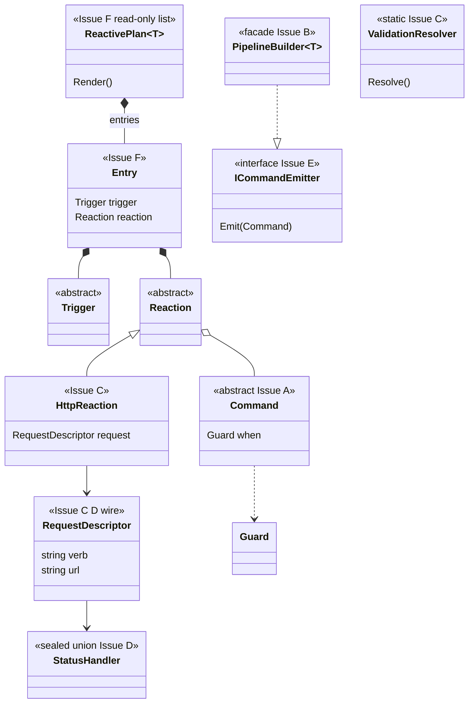
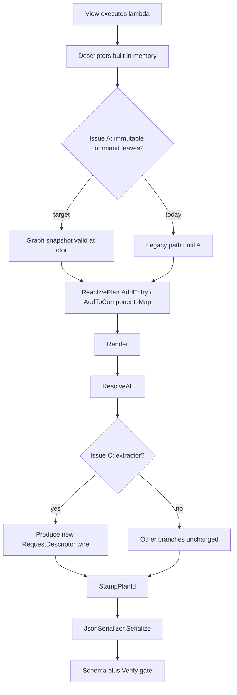
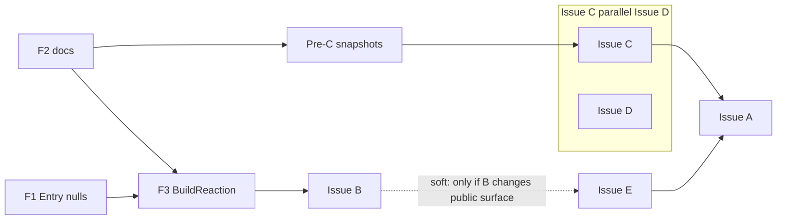

# Descriptor target state — **MASTER** (planning)

**Status:** Design planning only — **no** implementation in this folder.

**Parent docs:** [descriptor-design-target-state.md](../descriptor-design-target-state.md) (policy + full feature inventory), [descriptor-solid-analysis-plan.md](../descriptor-solid-analysis-plan.md) (Issues A–F What/Why/How/Because).

**Child docs (one file per issue):**

| File | Issue |
|------|--------|
| [INVEST-rubric.md](INVEST-rubric.md) | 5-point scale + merge gate |
| [CODE-SMELLS.md](CODE-SMELLS.md) | Constructor **>4** params (**5+**), SOLID, dead code, fallbacks — **per-task** gate; **C# 8** per [`Alis.Reactive.csproj`](../../../Alis.Reactive/Alis.Reactive.csproj) |
| [issue-review-protocol.md](issue-review-protocol.md) | Inputs/outputs; line-by-line **actual vs task** (not surface-level) |
| [IMPLEMENTATION-GUARDRAILS.md](IMPLEMENTATION-GUARDRAILS.md) | **Anti-drift** — final checklist: constraints + per-issue/task + PR sign-off |
| [issue-A-mutable-descriptors.md](issue-A-mutable-descriptors.md) | Mutable descriptors → immutable snapshots |
| [issue-B-pipeline-builder.md](issue-B-pipeline-builder.md) | PipelineBuilder façade + collaborators |
| [issue-c-http-validation.md](issue-c-http-validation.md) | RequestDescriptor + resolve → new wire |
| [issue-d-status-handler.md](issue-d-status-handler.md) | StatusHandler union + schema + TS |
| [issue-e-command-emitter.md](issue-e-command-emitter.md) | Narrow emit port vs `AddCommand` |
| [issue-f-entry-segments.md](issue-f-entry-segments.md) | Entry ctor, V1–V4, `BuildReaction` |
| [ISSUE-BY-ISSUE-VERDICT-2025-03-24.md](ISSUE-BY-ISSUE-VERDICT-2025-03-24.md) | **Code-verified** verdict: priorities, risks, execution order, cross-issue nuances |

**Rule:** Each child file contains **Target state (bigger picture)** + **Discussion & decisions (living log)** + **INVEST scores** + **Code smells (task gate)** ([canonical list](CODE-SMELLS.md) + issue-specific table), plus **§3** Activity diagram (mermaid), **§4** Flow diagram (mermaid), and **§5** Test case catalog (IDs + eval expectations), and **§6** Dependencies. Reviews follow [issue-review-protocol.md](issue-review-protocol.md). This README holds the **whole-system** target **class** and **flow** views only.

**Deep links:** [descriptor-solid-analysis-plan.md](../descriptor-solid-analysis-plan.md) Part 3 Issues use anchors `#issue-a` … `#issue-f` (each issue file links to its anchor).

### Mergeable tasks (labels used in issues)

| Label | Issue doc | Meaning |
|-------|-----------|---------|
| **Pre-C** | [C](issue-c-http-validation.md) | Baseline `Render()` / Verify **before** resolver return-new |
| **A1** / **A2** | [A](issue-A-mutable-descriptors.md) | Command immutability only vs coordinated HTTP |
| **B1** / **B2** | [B](issue-B-pipeline-builder.md) | Segment accumulator extract first vs HTTP move |
| **C1** / **C2** | [C](issue-c-http-validation.md) | Validation extract vs field enrichment split |
| **F1–F4** | [F](issue-f-entry-segments.md) | Entry null guards / docs / `BuildReaction` / dedupe program |

**Every** task: [INVEST-rubric.md](INVEST-rubric.md) (≥4 each letter), [CODE-SMELLS.md](CODE-SMELLS.md) (**C# 8** + Sonar §5 when CI runs), issue **§5** test IDs where applicable. **Implementation:** [IMPLEMENTATION-GUARDRAILS.md](IMPLEMENTATION-GUARDRAILS.md) so constraints **never drift** at merge time.

---

## North star (all issues)

1. **One** JSON contract — [`reactive-plan.schema.json`](../../../Alis.Reactive/Schemas/reactive-plan.schema.json); no silent fallbacks.
2. **Render()** path: build graph → **ResolveAll** (validation/component enrichment as designed) → **serialize once**.
3. **No** post-hoc patch of “done” descriptors — **A** + **C**; **no** silent multi-segment loss — **F3**; **no** impossible `StatusHandler` shapes — **D**.

---

## System context (target — issues overlaid)

```mermaid
flowchart TB
  subgraph authoring [Authoring layer]
    V[cshtml Html.On]
    TB[TriggerBuilder]
    PB[PipelineBuilder facade]
    V --> TB --> PB
  end
  subgraph graph [Plan aggregate target]
    RP[ReactivePlan]
    EN[Entry rows]
    CM[ComponentsMap]
    RP --> EN
    RP --> CM
  end
  subgraph resolve [ResolveAll target]
    VR[ValidationResolver]
    VR -->|"Issue C: new wire nodes"| WIRE[Wire-safe DTOs]
  end
  subgraph ser [Serialization]
    J[JsonSerializer plus WriteOnlyPolymorphicConverter]
    SCH[Schema tests]
    J --> SCH
  end
  subgraph ext [Extension layer]
    EMIT[ICommandEmitter Issue E]
    NAT[Native extensions]
    FUS[Fusion extensions]
    EMIT --> NAT
    EMIT --> FUS
  end
  authoring --> graph
  PB --> EMIT
  graph --> resolve
  resolve --> ser
```

---

## Target class structure (whole system)

**Legend:** Solid boxes = **target** types; **Issue** tags show **primary** owner for structural change.



**Note:** `PipelineBuilder` **internals** (mode gate, segment accumulator, command buffer) are **not** separate classes on the diagram until **B** lands; collaborators are detailed in [issue-B-pipeline-builder.md](issue-B-pipeline-builder.md).

---

## End-to-end flow (target — `Render`)



---

## Issue dependency (planning order — not strict calendar)



**Issue D** can run in parallel with **C** if wire shape for `StatusHandler` is coordinated in the same release train — both live in the **Issue C parallel Issue D** subgraph (not sequential). **Issue E** does **not** wait on **B**; the dashed edge is **only** when **B** changes `PipelineBuilder`’s public surface in the same release. **Sprint order** may still ship **E** before **B** — see [ISSUE-BY-ISSUE-VERDICT-2025-03-24.md](ISSUE-BY-ISSUE-VERDICT-2025-03-24.md).

**F-tier views:** This graph shows **merge prerequisites** (e.g. **F1** and **F2** both feed **F3**). [issue-f-entry-segments.md](issue-f-entry-segments.md) shows **implementation sequence** **F1 → F2 → F3** — use that for **tier order** within a program.

**Recommended execution order (sprint):** [ISSUE-BY-ISSUE-VERDICT-2025-03-24.md](ISSUE-BY-ISSUE-VERDICT-2025-03-24.md) — e.g. **F3** first (public API footgun), **E** does **not** require **B** to ship.

---

## Cross-reference: feature inventory

Every `kind` on the wire **and** first-class **builder modules** (including **Conditions**: `When`/`Then`/…, `BranchBuilder`, `FlushSegment` / **Issue F**) are listed in [descriptor-design-target-state.md § Complete feature inventory](../descriptor-design-target-state.md#complete-feature-inventory--literal-schema-backed). **Mandatory compliance** there applies to **all** issue PRs.

---

## How to use this folder

1. **Before** implementation: read **this README** + [**INVEST-rubric**](INVEST-rubric.md) + the **issue-*.md** you own.
2. **Pick the task** you are shipping (e.g. **Task F1**, not “all of F”). **Each task is INVEST:** score **all six letters** (1–5), **≥ 4** to pass — see rubric. Umbrella issue files are **themes**; **each PR** is still its own INVEST task.
3. **Copy** the scorecard + test IDs to the PR description (or link a filled section).
4. **Implement** test catalog **first** (red), then code (green).
5. **Update** this README **only** if the **whole-system** diagram changes—**not** every small PR.
