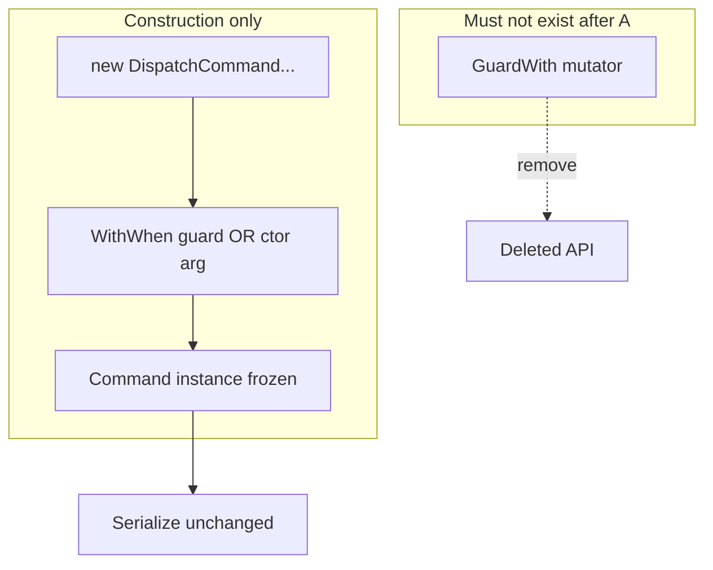
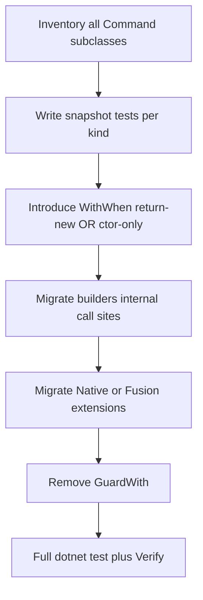

# Issue A — Immutable descriptors after construction

**Analysis plan:** [descriptor-solid-analysis-plan.md § IssueA](../descriptor-solid-analysis-plan.md#issue-a)  
**Master:** [README.md](README.md)

## Target state (bigger picture)

This issue advances **immutable descriptors after construction** (no post-hoc patch of “done” command leaves). Full system target: [README.md](README.md) (North star, diagrams, `Render` flow). Policy + feature inventory: [descriptor-design-target-state.md](../descriptor-design-target-state.md). Analysis **What/Why/How/Because:** [descriptor-solid-analysis-plan.md § IssueA](../descriptor-solid-analysis-plan.md#issue-a).

**Non-goals for this issue:** **`RequestDescriptor` / HTTP graph** mutation (**Issue C**) unless **joint PR**; raising **`LangVersion`** above **8** ([`Alis.Reactive.csproj`](../../../Alis.Reactive/Alis.Reactive.csproj)) unless a **separate** language issue.

**Review:** [issue-review-protocol.md](issue-review-protocol.md) — inputs/outputs; line-by-line **actual vs task**, not surface-level.

---

## Discussion & decisions (living log)

| Date | Decision / question | Outcome | Link |
|------|---------------------|---------|------|
| | | | |

*Add rows as you discuss. Prevents confusion between plan text and what the team agreed.*

---

## 1. Problem statement (code-anchored)

| Location | Today | Failure mode |
|----------|--------|--------------|
| [`Command.GuardWith`](../../../Alis.Reactive/Descriptors/Commands/Command.cs) | Mutates `When` after ctor | Identity split ctor vs mutator; double-guard throw is **reaction** not **type system** |
| [`RequestDescriptor.EnrichValidation`](../../../Alis.Reactive/Descriptors/Requests/RequestDescriptor.cs) | Assigns `Validation` after build | **Issue C** owns HTTP/validation graph; **this issue** focuses **Command** leaves unless coordinated |

**Target:** Command (and broader graph) **immutable** after construction — `WithWhen(Guard)` return-new **or** ctor-only `When`; **no** `GuardWith` internal mutator on hot path.

---

## 2. INVEST scoring (use [INVEST-rubric.md](INVEST-rubric.md); pass ≥4 each)

| Letter | Pass when (deep) |
|--------|------------------|
| **I** | Can ship **Command** immutability **without** **C** if `RequestDescriptor` unchanged in same PR; **or** phased: A1 commands only, A2 HTTP in **C**. |
| **N** | `WithWhen` vs frozen ctor documented; **double-guard** behavior **unchanged** (still throws). |
| **V** | Removes “patch after build” class for **commands**; measurable: grep `GuardWith` → zero in product. |
| **E** | Count: `DispatchCommand`, `MutateElementCommand`, … + all `new XCommand` in tests. |
| **S** | Phase A1: abstract `Command` + leaves only if &gt;400 LOC → split PR. |
| **T** | Every command **kind** has **at least one** Verify snapshot or unit test **unchanged** JSON. |

**PR template:** Paste scores 1–5 per letter + **Evidence** bullet per score.

### Code smells (task gate — every task)

**Canonical:** [CODE-SMELLS.md](CODE-SMELLS.md) — arity, SOLID, dead code, fallbacks; **C# 8** ([`Alis.Reactive.csproj`](../../../Alis.Reactive/Alis.Reactive.csproj)); **Sonar** [§5](CODE-SMELLS.md#sonar-community-csharp).

| Category | Issue A — specific |
|----------|---------------------|
| **Constructor arity** | New `Command` / `WithWhen` factories: avoid **5+** positional params; prefer **`sealed` immutable** guard/options types (C# 8 — no `record`/`init` unless LangVersion raised). |
| **SOLID** | **S:** mutator + serializer concern on same type after refactor; **O:** new command kind needs editing unrelated files; **I:** exposing wide mutable surface for “just add guard”. |
| **Dead code** | `GuardWith` left behind; duplicate `When` assignment paths; tests calling removed API without `#if` migration. |
| **Fallbacks** | Default `When` when null; swallowing double-guard throw “for tests”. |

---

## 3. Activity diagram — target `Command` lifecycle

---

## 4. Flow diagram — delivery

---

## 5. Test case catalog (evals first — mandatory)

| ID | Layer | Case | Acceptance |
|----|-------|------|--------------|
| A-T1 | Unit | Double `When` on same command | Throws **IOE**, message unchanged |
| A-T2 | Unit | Each `Command` kind serializes same JSON **before/after** | Verify diff **empty** or migration PR |
| A-T3 | Schema | `AllPlansConformToSchema` on representative plans | Pass |
| A-T4 | Grep | `GuardWith` | **Zero** callers outside tests |
| A-T5 | Native/Fusion | One extension per project using guarded command | Compile + unit green |

**Negative:** Construct command, attempt second guard via **removed** API — **must not compile** (delete API) or **must** throw if transitional wrapper.

---

## 6. Dependencies

- **Blocks:** Nothing if phased to commands-only.
- **Blocked by:** None for Command-only phase.
- **Pairs with:** **C** if `RequestDescriptor` mutation removed in same release.
