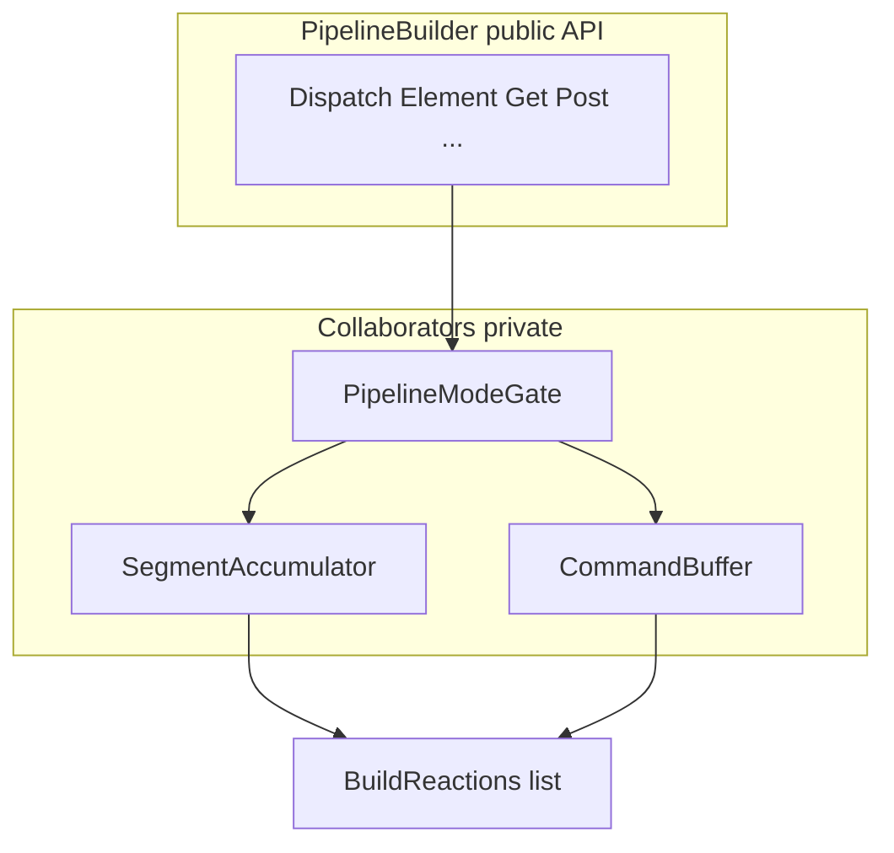
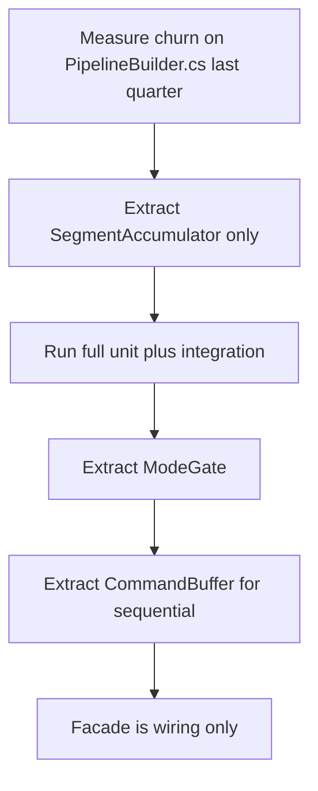

# Issue B — `PipelineBuilder` façade + collaborators

**Analysis plan:** [§ IssueB](../descriptor-solid-analysis-plan.md#issue-b)  
**Master:** [README.md](README.md)

## Target state (bigger picture)

This issue advances **`PipelineBuilder` as façade** with collaborators (segments, HTTP, conditions) so **SRP** is clear. Full system target: [README.md](README.md). Policy + inventory: [descriptor-design-target-state.md](../descriptor-design-target-state.md). Analysis: [descriptor-solid-analysis-plan.md § IssueB](../descriptor-solid-analysis-plan.md#issue-b). **Conditions** (inventory): [descriptor-design-target-state.md § Complete feature inventory](../descriptor-design-target-state.md#complete-feature-inventory--literal-schema-backed).

**Non-goals for this issue:** **`Entry` / `BuildReaction` row semantics** (**Issue F** / **F3**) unless coordinated; **`LangVersion`** &gt; **8** without separate issue; **byte-changing** JSON without migration issue.

**Review:** [issue-review-protocol.md](issue-review-protocol.md).

---

## Discussion & decisions (living log)

| Date | Decision / question | Outcome | Link |
|------|---------------------|---------|------|
| | | | |

*Add rows as you discuss. Prevents confusion between plan text and what the team agreed.*

---

## 1. Problem statement

[`PipelineBuilder`](../../../Alis.Reactive/Builders/PipelineBuilder.cs) holds **sequential**, **HTTP**, **parallel**, **conditional** modes, **`_segments`**, **`FlushSegment`**, **`Commands`**, **`BuildReactions`/`BuildReaction`** — **multiple reasons to change** (SRP strain).

The **Conditions module** ([`PipelineBuilder.Conditions.cs`](../../../Alis.Reactive/Builders/PipelineBuilder.Conditions.cs), [`Builders/Conditions/`](../../../Alis.Reactive/Builders/Conditions/)) lives on the same type: **`When`** / **`Confirm`** switch to **`PipelineMode.Conditional`**, interact with **`ConditionalBranches`**, and **`FlushSegment`** when a **second** `When` follows a completed branch block — see [Conditions module (DSL)](../descriptor-design-target-state.md#conditions-module-dsl).

**Target:** `PipelineBuilder` = **thin façade** delegating to:

- **PipelineModeGate** (or equivalent) — illegal mode transition still throws.
- **ReactionSegmentAccumulator** — owns `_segments` flush semantics.
- **SequentialCommandBuffer** — owns `Commands` list for sequential mode.

**Must preserve:** Public fluent surface **unchanged** for views; **JSON** byte-identical unless separate issue.

---

## 2. INVEST scoring (pass ≥4)

| Letter | Pass when |
|--------|-----------|
| **I** | **B1** accumulator extract **without** HTTP move; green tests; then **B2** HTTP. |
| **N** | Collaborator names/locations negotiable; **behavior** of `BuildReactions` **not** negotiable without **F3** coordination. |
| **V** | Reduced merge conflicts on `PipelineBuilder.cs`; grep line count down **or** file split metrics. |
| **E** | LOC + partial count + test list. |
| **S** | No PR &gt; ~500 LOC without **B1/B2** label. |
| **T** | **Every** `PipelineMode` path has **existing** test **still** passing + **one** new test if new collaborator boundary. |

### Code smells (task gate — every task)

**Canonical:** [CODE-SMELLS.md](CODE-SMELLS.md) — arity, SOLID, dead code, fallbacks; **C# 8** ([`Alis.Reactive.csproj`](../../../Alis.Reactive/Alis.Reactive.csproj)); **Sonar** [§5](CODE-SMELLS.md#sonar-community-csharp).

| Category | Issue B — specific |
|----------|---------------------|
| **Constructor arity** | New collaborators (`PipelineModeGate`, `SegmentAccumulator`, …): **≤4** params or immutable **options types** (C# 8 — `sealed` class / `readonly struct`, not `record`); façade ctor stays thin. |
| **SOLID** | **S:** façade still contains segment math after extract; **I:** collaborators exposed publicly; **D:** collaborators new’d in random call sites. |
| **Dead code** | Old `FlushSegment` copy-paste after move; partial methods never called; duplicate `BuildSingleReaction` paths. |
| **Fallbacks** | “If mode unknown, treat as Sequential”; silent JSON diff “fixed” by post-process string replace. |

---

## 3. Activity diagram — target collaboration

---

## 4. Flow diagram — extraction sequence

---

## 5. Test case catalog

| ID | Layer | Case | Acceptance |
|----|-------|------|--------------|
| B-T1 | Unit | Mode switch illegal | Same `InvalidOperationException` text pattern |
| B-T2 | Unit | Multi-segment `BuildReactions` count | Same as pre-B |
| B-T3 | Unit | HTTP single request `BuildSingleReaction` | Same `HttpReaction` shape |
| B-T4 | Unit | Parallel branches | Same `ParallelHttpReaction` |
| B-T5 | Schema | Sandbox HTTP + conditional pages | `AllPlansConformToSchema` |
| B-T6 | Integration | **F3** coordinated: `BuildReaction` + multi-segment | Throws/rename per F3 spec |

**Performance:** Optional benchmark **not** required unless regression suspected.

---

## 6. Dependencies

- **After** **F3** recommended so segment semantics stable before extraction.
- **Before** **E** if `ICommandEmitter` implemented **on** façade.
