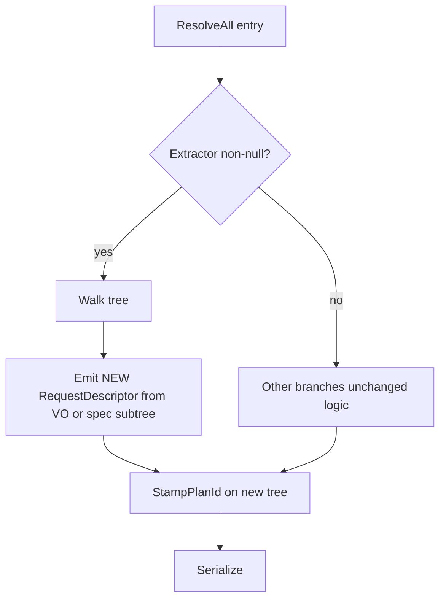
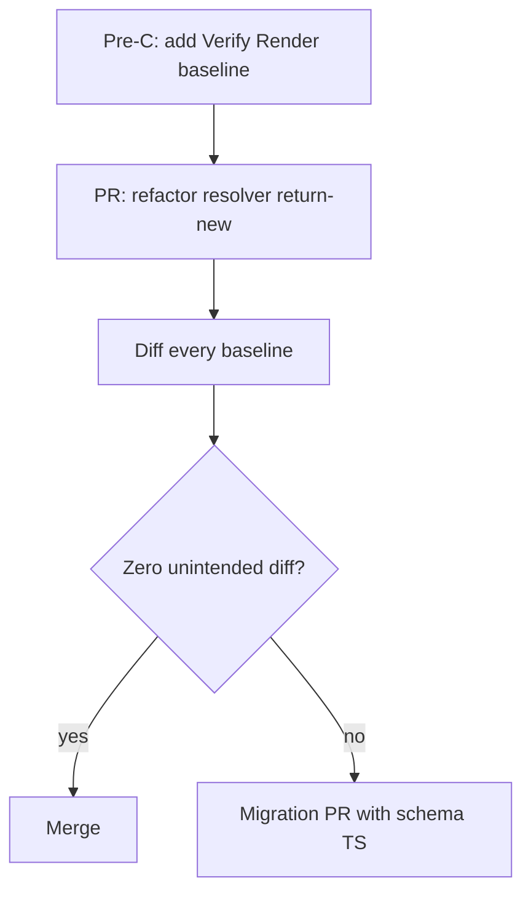

# Issue C — HTTP `RequestDescriptor` + validation resolve (new wire, no hidden mutation)

**Analysis plan:** [§ IssueC](../descriptor-solid-analysis-plan.md#issue-c)  
**Master:** [README.md](README.md)

## Target state (bigger picture)

This issue advances **resolve → new wire** for HTTP `RequestDescriptor` and validation (no hidden in-place mutation during `ResolveAll`). Full system target: [README.md](README.md). Policy + inventory: [descriptor-design-target-state.md](../descriptor-design-target-state.md). Analysis: [descriptor-solid-analysis-plan.md § IssueC](../descriptor-solid-analysis-plan.md#issue-c).

**Non-goals for this issue:** Changing the **public fluent DSL** for HTTP in views (`PipelineBuilder` / extension entry points) — **unless** a **separate** migration issue explicitly breaks or renames it. Command-leaf immutability **Issue A** if not same PR.

**Review:** [issue-review-protocol.md](issue-review-protocol.md).

---

## Discussion & decisions (living log)

| Date | Decision / question | Outcome | Link |
|------|---------------------|---------|------|
| | | | |

*Add rows as you discuss. Prevents confusion between plan text and what the team agreed.*

---

## 1. Problem statement

[`ValidationResolver.ResolveRequest`](../../../Alis.Reactive/Resolvers/ValidationResolver.cs) calls `req.EnrichValidation(extracted)` — **mutates** `RequestDescriptor` **in place** during resolution (`EnrichFieldsFromComponents`, `StampPlanId` likewise touch live graph).

**Already true today:** `ValidatorType` is `[JsonIgnore]` — it does **not** serialize. The **primary** Issue C problem is **encapsulation / reasoning**: build-time + resolve-time **patch** the same object instances instead of **replacing** subgraphs with **new** immutable rows whose `Render()` output is obvious from **constructor + resolver output** alone.

**Target:** `ResolveAll` path **produces** wire-ready subgraphs — **new** `RequestDescriptor` (and nested) instances **or** provably immutable snapshots — **no** hidden order-dependent mutation before `JsonSerializer.Serialize`; **same JSON bytes** as **Pre-C** baseline unless an intentional migration PR.

**Value object (constructor arity — [CODE-SMELLS §1](CODE-SMELLS.md#1-constructor-arity)):** Today’s [`RequestDescriptor`](../../../Alis.Reactive/Descriptors/Requests/RequestDescriptor.cs) constructor takes **nine** positional parameters (**2** required + **7** optional — smell: **well above** the **>4** threshold). Refactor so **all** of that payload lives in an immutable **value object** (e.g. `RequestDescriptorSpec`, `HttpRequestParts` — name TBD) that is the **single** argument to `RequestDescriptor`’s constructor, **or** use `RequestDescriptor.From(spec)` with a **≤4**-parameter surface on the public type. Implement the VO with **C# 8** (`sealed` immutable class or `readonly struct`) — [`Alis.Reactive.csproj`](../../../Alis.Reactive/Alis.Reactive.csproj) pins `<LangVersion>8</LangVersion>`; **do not** use `record` / `init` unless a separate issue raises language version. The VO is an **internal / framework** concern; **views keep the same fluent calls** — builders assemble the VO **behind** the existing API. **Only** if a future issue requires a **new** public shape (extra fluent step, renamed method) may the DSL change; that is **not** part of Issue C by default.

**Public shape rule:** **JSON plan** and **authoring ergonomics** for app code stay **byte- and source-compatible** with Pre-C **unless** an explicit **migration** issue documents the break.

---

## 2. INVEST scoring (pass ≥4)

| Letter | Pass when |
|--------|-----------|
| **I** | **Requires** [**Pre-C**](../descriptor-design-target-state.md) baseline snapshots **locked** first. |
| **N** | Functional immutability acceptable if JSON **identical**; **must** prove with diff. |
| **V** | Debuggability: “what serializes” = “what resolver output” — no hidden order deps. |
| **E** | Count `ResolveRequest`, `EnrichFromComponents`, `StampPlanId` paths; chain depth. |
| **S** | **C1** validation extract only; **C2** field enrichment — if &gt;600 LOC. |
| **T** | **Pre-C** snapshots **byte-identical** **or** one **migration** PR with schema+TS. |

### Code smells (task gate — every task)

**Canonical:** [CODE-SMELLS.md](CODE-SMELLS.md) — arity, SOLID, dead code, fallbacks; **C# 8** ([`Alis.Reactive.csproj`](../../../Alis.Reactive/Alis.Reactive.csproj)); **Sonar** [§5](CODE-SMELLS.md#sonar-community-csharp).

| Category | Issue C — specific |
|----------|---------------------|
| **Constructor arity** | **`RequestDescriptor` must not** keep **nine** positional ctor parameters — use **one** immutable VO (see **Target**), implemented in **C# 8** (`sealed` class / `readonly struct`). Resolver emits **new** VO → **new** descriptor. |
| **SOLID** | **S:** resolver + serialization in one method; **O:** every new HTTP field edits one giant method; **D:** tests that bypass resolver and poke descriptors. |
| **Dead code** | `EnrichValidation` kept after return-new; unused `AttachValidator` paths; `StampPlanId` no-ops. |
| **Fallbacks** | Default empty `Validation` when extractor failed; merge plans with “best effort” when `merge-plan` invariant breaks. |

---

## 3. Activity diagram — target resolve

---

## 4. Flow diagram — PR sequence

---

## 5. Test case catalog

| ID | Layer | Case | Acceptance |
|----|-------|------|--------------|
| C-T1 | Snapshot | HTTP+Validate() view | `Render()` hash **or** Verify **unchanged** |
| C-T2 | Unit | Serialized plan JSON | **No** `validatorType` key (regression); **confirm** `ValidatorType` never appears — already `[JsonIgnore]` today |
| C-T3 | Unit | Chained request | Each node resolved **once** |
| C-T4 | Unit | Parallel HTTP + validation | Each branch |
| C-T5 | Unit | `EnrichFromComponents` only path | Field ids present; **same** JSON as baseline |
| C-T6 | Schema | All affected plans | Schema valid |
| C-T7 | Playwright | Validation summary div | If DOM scoped by `PlanId` — unchanged behavior |
| C-T8 | Unit | VO → `RequestDescriptor` → serialize | Same JSON as **direct** construction baseline for representative cases (proves VO is a **repackaging**, not a behavior change) |

**Negative:** Call `Render()` twice — **must** not require different **order** of side effects (idempotent graph).

---

## 6. Dependencies

- **Hard:** **Pre-C** baseline.
- **Soft:** **A** if command leaves inside `WhileLoading` must be immutable same release.
