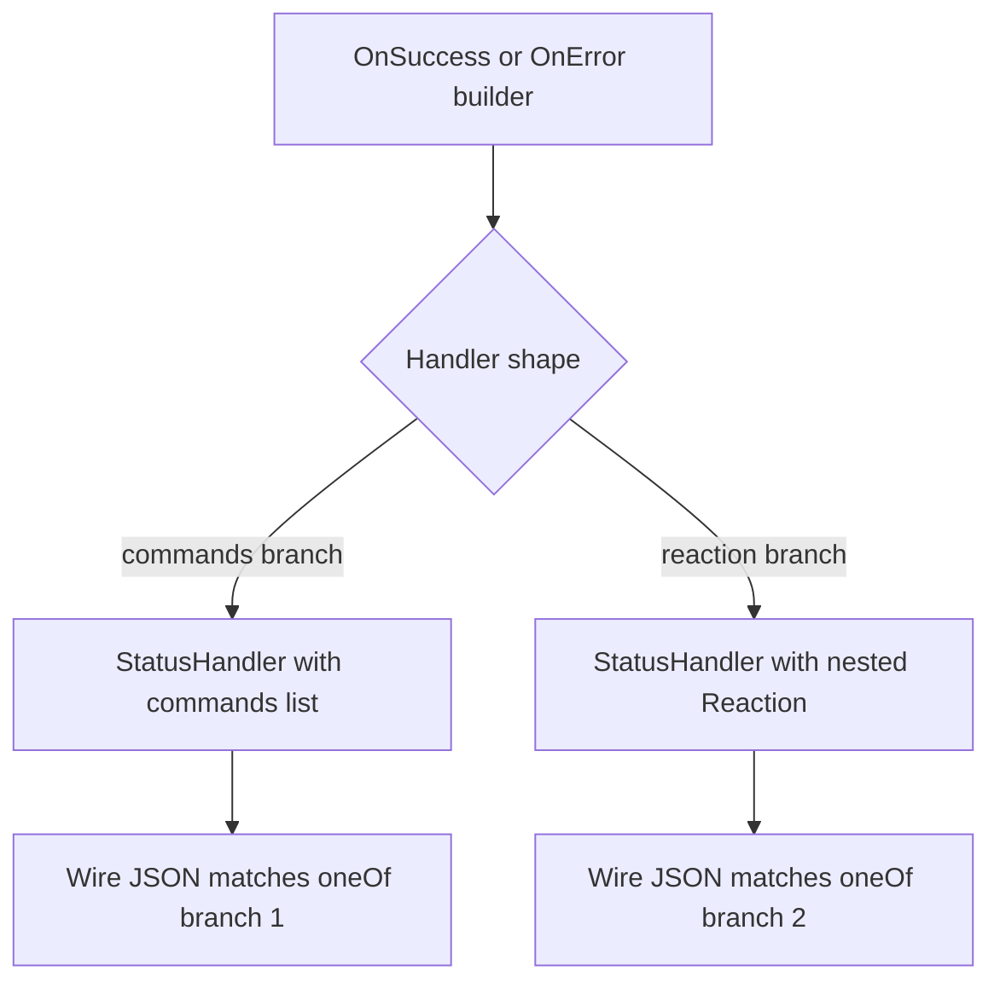
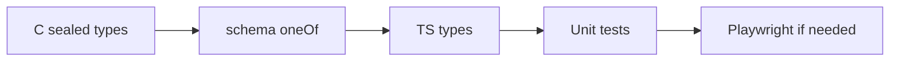

# Issue D — `StatusHandler`: sealed union + schema + TS lockstep

**Analysis plan:** [§ IssueD](../descriptor-solid-analysis-plan.md#issue-d)  
**Master:** [README.md](README.md)

## Target state (bigger picture)

This issue advances **`StatusHandler` as a sealed discriminated union** (schema XOR, C# type system, TS, `executeHandler`) — **one** contract, **no** impossible shapes. Full system target: [README.md](README.md). Policy + inventory: [descriptor-design-target-state.md](../descriptor-design-target-state.md). Analysis: [descriptor-solid-analysis-plan.md § IssueD](../descriptor-solid-analysis-plan.md#issue-d).

**Non-goals for this issue:** Changing **`RequestDescriptor`** HTTP graph shape (**Issue C**) in the same PR unless coordinated; evidence for TS/runtime stays in **SandboxApp** `Scripts/` per analysis plan; **`LangVersion`** &gt; **8** without separate issue.

**Review:** [issue-review-protocol.md](issue-review-protocol.md).

---

## Discussion & decisions (living log)

| Date | Decision / question | Outcome | Link |
|------|---------------------|---------|------|
| | | | |

*Add rows as you discuss. Prevents confusion between plan text and what the team agreed.*

---

## 1. Problem statement

Schema [`StatusHandler`](../../../Alis.Reactive/Schemas/reactive-plan.schema.json) uses `oneOf` **commands** vs **reaction** (mutually exclusive required branches). **TS** [`http.ts`](../../../Alis.Reactive.SandboxApp/Scripts/types/http.ts) models `commands?` and `reaction?` as **optional** — no compile-time XOR. **C#** may use **constructors** that only populate one branch while **properties** remain nullable on the type — the gap is **discriminated union in the type system** + **runtime** hardening (`executeHandler` precedence), not “anything goes” construction.

**Target:** Sealed hierarchy (e.g. `StatusHandlerCommands`, `StatusHandlerReaction`) **or** a single type with a **required discriminant** (`kind`) + **mutually exclusive** payloads — **same PR**: C# + schema + TS + tests — **lockstep** with [analysis plan Issue D](../descriptor-solid-analysis-plan.md#issue-d). **No** nullable “pick a branch at runtime” without **throw** on invalid combinations ([CODE-SMELLS §4](CODE-SMELLS.md#fallbacks-fail-fast)); “optional” only means **product** may defer the issue, **not** that dual-nullables + silent precedence are acceptable as the **end state**.

**Serialization (code fact):** [`StatusHandler`](../../../Alis.Reactive/Descriptors/Requests/StatusHandler.cs) is **one** sealed class today — **not** registered with `JsonDerivedType` / `WriteOnlyPolymorphicConverter` on **that** type. A discriminated union on the wire **reuses the repo’s polymorphic pattern** but still needs **explicit** schema + STJ attributes/options — **not** “zero new code” unless the chosen design is **only** a **required `kind`** property on the **existing** type. See [ISSUE-BY-ISSUE-VERDICT-2025-03-24.md](ISSUE-BY-ISSUE-VERDICT-2025-03-24.md) (§ Issue D anti-patterns).

**Pre-change baseline:** Same discipline as **Pre-C** — snapshot `Render()` outputs that include `onSuccess` / `onError`; post-change diff should show **only** the intended discriminant / shape delta.

---

## 2. INVEST scoring (pass ≥4)

| Letter | Pass when |
|--------|-----------|
| **I** | Can ship **after** **C** if HTTP paths stable; **or** parallel if **no** `RequestDescriptor` shape change. |
| **N** | Union names negotiable; **wire** `oneOf` **not** negotiable without version bump. |
| **V** | Impossible states **unrepresentable** in C#. |
| **E** | Count `StatusHandler` constructions + `OnSuccess`/`OnError` handlers in sandbox. |
| **S** | Single vertical slice PR preferred. |
| **T** | Schema tests + **TS** discriminated union narrowing test + **one** Playwright path if status routing DOM-visible. |

### Code smells (task gate — every task)

**Canonical:** [CODE-SMELLS.md](CODE-SMELLS.md) — arity, SOLID, dead code, fallbacks; **C# 8** ([`Alis.Reactive.csproj`](../../../Alis.Reactive/Alis.Reactive.csproj)); **Sonar** [§5](CODE-SMELLS.md#sonar-community-csharp).

| Category | Issue D — specific |
|----------|---------------------|
| **Constructor arity** | Sealed union types or factories with **≤4** params per ctor; **or** immutable nested types bundling `Commands` / `Reaction` (C# 8 — no `record` unless LangVersion raised). |
| **SOLID** | **L:** branch subtype that allows both `null` and populated; **I:** single `StatusHandler` interface with both optional props; **O:** new branch requires editing TS + C# + schema in **unrelated** places without checklist. |
| **Dead code** | Nullable `Commands`/`Reaction` both left on wire after union; duplicate `executeHandler` branches. |
| **Fallbacks** | “If both set, prefer `commands`” without **throw**; runtime coalesce that masks invalid plan JSON. |

---

## 3. Activity diagram — target construction

---

## 4. Flow diagram — lockstep delivery

---

## 5. Test case catalog

| ID | Layer | Case | Acceptance |
|----|-------|------|--------------|
| D-T1 | Schema | Sample JSON both branches | `oneOf` validates |
| D-T2 | C# | Illegal dual population | **Compile error**, sealed types, or factory **throws** — match chosen design |
| D-T3 | TS | **Post-change** — discriminant exists | Exhaustive switch / narrowing (**N/A** until TS gains `kind` or tagged union) |
| D-T4 | Unit | `Render()` snapshot for HTTP error page | Verify |
| D-T5 | Playwright | Error status dispatches reaction | Trace/DOM per existing pattern |

---

## 6. Dependencies

- Coordinate with **C** if `StatusHandler` nested inside **new** `RequestDescriptor` graph.
