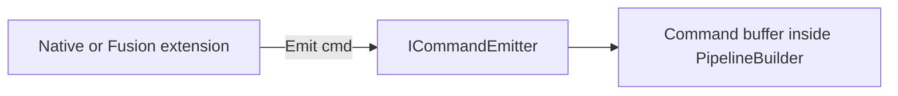
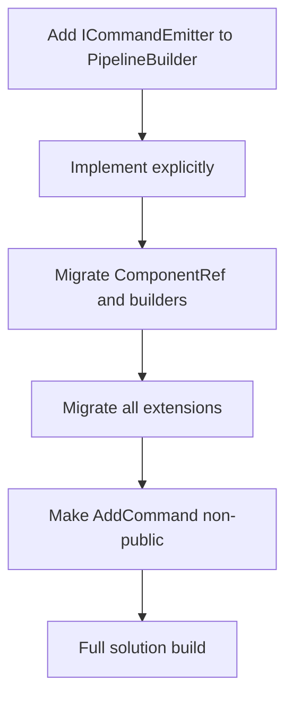

# Issue E — Narrow command emission (`ICommandEmitter` / internal-only)

**Analysis plan:** [§ IssueE](../descriptor-solid-analysis-plan.md#issue-e)  
**Master:** [README.md](README.md)

## Target state (bigger picture)

This issue advances **narrow command emission** (`ICommandEmitter` / internal-only `AddCommand`) so **ISP** and encapsulation hold. Full system target: [README.md](README.md). Policy + inventory: [descriptor-design-target-state.md](../descriptor-design-target-state.md). Analysis: [descriptor-solid-analysis-plan.md § IssueE](../descriptor-solid-analysis-plan.md#issue-e).

**Non-goals for this issue:** Renaming **public** fluent methods on `PipelineBuilder` **except** as required to hide `AddCommand`; **`LangVersion`** &gt; **8** without a separate issue; new **HTTP/conditions** surface on `ICommandEmitter` (keep **emit command** narrow).

**Review:** [issue-review-protocol.md](issue-review-protocol.md).

---

## Discussion & decisions (living log)

| Date | Decision / question | Outcome | Link |
|------|---------------------|---------|------|
| | | | |

*Add rows as you discuss. Prevents confusion between plan text and what the team agreed.*

---

## 1. Problem statement

[`PipelineBuilder.AddCommand`](../../../Alis.Reactive/Builders/PipelineBuilder.cs) is **public** — any caller appends to `Commands` (**ISP** strain, encapsulation leak).

**Target:** Extensions use **`ICommandEmitter`** (or `internal` + `InternalsVisibleTo` **only** if single policy — prefer **narrow public** interface on façade).

---

## 2. INVEST scoring (pass ≥4)

| Letter | Pass when |
|--------|-----------|
| **I** | **Independent of B** — ship when ready; only **four** Fusion filtering extensions + `ComponentRef` call `AddCommand` today (grep-backed). **B** (façade extract) is **not** a prerequisite. |
| **N** | Interface name negotiable; **one** emission story **not** negotiable. |
| **V** | Grep `AddCommand` from extensions → **zero**; only façade/emitter. |
| **E** | `rg AddCommand` count across repo. |
| **S** | Project-by-project: **Alis.Reactive** first, then Native, then Fusion. |
| **T** | **Each** extension assembly **builds** + **one** test per assembly using **only** emitter. |

### Code smells (task gate — every task)

**Canonical:** [CODE-SMELLS.md](CODE-SMELLS.md) — arity, SOLID, dead code, fallbacks; **C# 8** ([`Alis.Reactive.csproj`](../../../Alis.Reactive/Alis.Reactive.csproj)); **Sonar** [§5](CODE-SMELLS.md#sonar-community-csharp).

| Category | Issue E — specific |
|----------|---------------------|
| **Constructor arity** | `ICommandEmitter` methods + façade impl: **≤4** params; use command **factory** or typed descriptor (C# 8 types only). |
| **SOLID** | **I:** emitter exposes `AddCommand` **and** HTTP entry points; **D:** extensions still `new` concrete `PipelineBuilder` internals. |
| **Dead code** | `public AddCommand` shim after migration; `[Obsolete]` without error. |
| **Fallbacks** | Internal `AddCommand` that no-ops when `Commands` null; catch-all that swallows invalid command type. |

---

## 3. Activity diagram — target emit

---

## 4. Flow diagram — migration

---

## 5. Test case catalog

| ID | Layer | Case | Acceptance |
|----|-------|------|--------------|
| E-T1 | Compile | All projects | **0** errors |
| E-T2 | Unit | Emit dispatch + mutate | Same JSON as pre-E |
| E-T3 | Grep | `public void AddCommand` | **Removed** or **obsolete** with error |
| E-T4 | Native | One component vertical slice | Plan snapshot |
| E-T5 | Fusion | One component vertical slice | Plan snapshot |

---

## 6. Dependencies

- **Soft:** Coordinate with **B** only if **B** is actively changing `PipelineBuilder`’s public surface in the same release — otherwise **E** can ship first.
- **Before** **A** if `AddCommand` is the only path mutating the command list post-ctor (ordering preference, not a hard gate).
