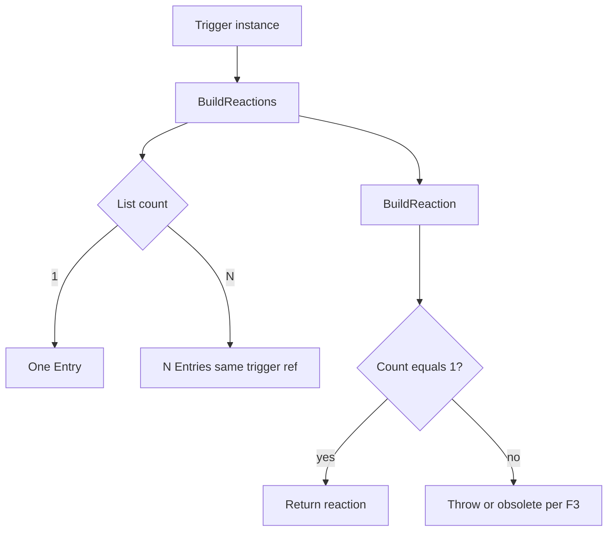
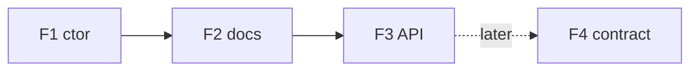

# Issue F — `Entry`, row semantics, `BuildReaction` / `BuildReactions`

**Analysis plan:** [§ IssueF](../descriptor-solid-analysis-plan.md#issue-f)  
**Master:** [README.md](README.md)

## Target state (bigger picture)

This issue advances **`Entry` row semantics**, **V1–V4** validation, **`BuildReaction` / `BuildReactions`**, and tiers **F1–F4** — no silent multi-segment loss. Full system target: [README.md](README.md). Policy + inventory: [descriptor-design-target-state.md](../descriptor-design-target-state.md). Analysis: [descriptor-solid-analysis-plan.md § IssueF](../descriptor-solid-analysis-plan.md#issue-f).

**Non-goals for this issue:** **F4** dedupe program before **README** + product sign-off; **`LangVersion`** &gt; **8** without separate issue; **F3** implementation detail owned by **Issue B** if `BuildReaction` moves to collaborator (**coordinate**).

**Review:** [issue-review-protocol.md](issue-review-protocol.md).

---

## Discussion & decisions (living log)

| Date | Decision / question | Outcome | Link |
|------|---------------------|---------|------|
| | | | |

*Add rows as you discuss. Prevents confusion between plan text and what the team agreed.*

---

## 1. Problem statement (tiers F1–F4)

| Tier | Code fact | Target |
|------|-----------|--------|
| **F1** | [`Entry`](../../../Alis.Reactive/Descriptors/Entry.cs) ctor no null checks | `ArgumentNullException` |
| **F2** | One trigger → N rows via [`TriggerBuilder`](../../../Alis.Reactive/Builders/TriggerBuilder.cs) `foreach` | **Document** V1/V2/V3 |
| **F3** | [`BuildReaction`](../../../Alis.Reactive/Builders/PipelineBuilder.cs) calls `BuildReactions()` then returns `reactions[0]` — **both** branches of the ternary are identical today, so **always** first segment only when `Count > 1` | **Throw**, **obsolete**, or **rename** — **no silent** drop |
| **F4** | Duplicate `trigger` JSON across rows | **Deferred** contract program — [README](README.md) |

**Entry** is **not** an SRP violation — **invariants + clarity**.

**Review highlight (production vs API):** [`TriggerBuilder`](../../../Alis.Reactive/Builders/TriggerBuilder.cs) calls **`BuildReactions()`** only, so the **main** `Html.On` path does **not** drop segments. **`BuildReaction()`** remains **public** and is used by **nested builders** (`GuardBuilder`, `BranchBuilder`, `ResponseBuilder`, `HttpRequestBuilder`, `ParallelBuilder`), **`NativeActionLinkSerializer`**, and tests — **P0** priority is **contract safety** (throw / obsolete / rename), not only a proven production bug. See [ISSUE-BY-ISSUE-VERDICT-2025-03-24.md](ISSUE-BY-ISSUE-VERDICT-2025-03-24.md).

---

## 2. INVEST scoring per tier (pass ≥4 **for each tier in scope**)

| Letter | F1 | F2 | F3 | F4 |
|--------|----|----|----|-----|
| **I** | Alone | Alone | Needs F2 mental model | Separate program |
| **N** | — | Wording | Throw vs rename | Wire format |
| **V** | Fail fast | Onboarding | **Silent loss** fix | Payload |
| **E** | grep `new Entry` | — | Branch tests | Contract team |
| **S** | One PR | One PR | One PR + test churn | Multi-sprint |
| **T** | Unit | Peer review Q | Multi-segment tests | Migration suite |

### Code smells (task gate — every task / tier)

**Canonical:** [CODE-SMELLS.md](CODE-SMELLS.md) — arity, SOLID, dead code, fallbacks; **C# 8** ([`Alis.Reactive.csproj`](../../../Alis.Reactive/Alis.Reactive.csproj)); **Sonar** [§5](CODE-SMELLS.md#sonar-community-csharp).

| Tier | Specific smells |
|------|-----------------|
| **F1** | **Constructor arity:** `Entry(Trigger, Reaction)` stays **2** params — **do not** add long arg lists; if richer types needed, use **`sealed`** wrappers (C# 8 — no `record`). **Fallbacks:** accepting null trigger/reaction “for tests”. |
| **F2** | **Dead code:** docs referencing removed V1/V2/V3 behavior. **S:** mixing row-count docs into `TriggerBuilder` code. |
| **F3** | **Dead code:** redundant ternary / duplicate branch in `BuildReaction` left after fix. **Fallbacks:** silently returning `reactions[0]` when `Count>1`. **SOLID:** **S** — `BuildReaction` doing both fan-out and single-segment shortcut without clear API. |
| **F4** | **Fallbacks:** dedupe JSON by “first wins” without migration; **O:** new row shape without contract program. |

---

## 3. Activity diagram — row production (target clarity)

---

## 4. Flow diagram — tier order

---

## 5. Test case catalog

| ID | Tier | Layer | Case | Acceptance |
|----|------|-------|------|--------------|
| F-T1 | F1 | Unit | `new Entry(null, x)` | ANE |
| F-T2 | F1 | Grep | Product `new Entry(null` | **0** |
| F-T3 | F2 | Review | Peer answers V2 without code | **Correct** |
| F-T4 | F3 | Unit | 2 segments, `BuildReactions().Count==2` | **Pass** |
| F-T5 | F3 | Unit | Same pipeline `BuildReaction()` | **Throws** or compile fail |
| F-T6 | F3 | Integration | `TriggerBuilder` 2 entries | **2** rows |
| F-T7 | F4 | — | **Deferred** | N/A until program |

---

## 6. Dependencies

- **F3** coordinates with **B** if `BuildReaction` moves collaborator.
- **F4** **must not** start without **README** dependency graph + product sign-off.
