# DSL Architecture Atlas

A single navigable map of the Alis.Reactive DSL and rich plan domain. It walks
the frozen public DSL surface area-by-area, names the C# domain types each DSL
call mints, and shows how those types flow across the four layers and the three
boundaries:

```text
Frozen DSL (cshtml) -> Rich C# Plan Domain -> Generated TS Plan Contract -> Runtime Executor
```

Every area below carries its real DSL examples, a feature/domain-type subgraph,
and a table of every feature and every variant. Cross-area edges from the source
maps are drawn in the top-level graph and called out in each area's prose. This
atlas is a navigation surface; the authoritative requirement is still the DSL
source. When in doubt, read the source and update this map.

## Navigation

- [Top-level flow](#top-level-flow)
- [Plan & Triggers](#plan--triggers)
- [Reactions](#reactions)
- [Conditions](#conditions)
- [HTTP Pipeline](#http-pipeline)
- [Arrays](#arrays)
- [Values](#values)
- [Validation](#validation)
- [Components](#components)
- [Slots & Plugins](#slots--plugins)
- [Domain Contract & Serialization](#domain-contract--serialization)
- [End-to-end example](#end-to-end-example)
- [Cohesion notes](#cohesion-notes)

## Top-level flow

The DSL is authored in `.cshtml`. Builders mint a rich C# plan domain. The plan
domain serializes write-only to camelCase JSON via `WriteOnlyPolymorphicConverter`
and hand-written sibling converters. `PlanTypeGenerator` projects the same C#
domain into `runtime/types/plan.ts`. The TypeScript runtime executes the plan and
nothing more.

The areas group around three hubs: **Plan & Triggers** are the entry points,
**Values** is the single shared value path every other area reads through, and
**Domain Contract** is where all the areas converge into one serialized
`PlanDocument`.

```mermaid
flowchart TB
    subgraph L1["Layer 1 — Frozen Public DSL (cshtml)"]
        DSL["Html.ReactivePlan / Html.On / InputField / p.Get / p.When / .Reactive()"]
    end
    subgraph L2["Layer 2 — Rich C# Plan Domain"]
        direction TB
        Triggers["Plan & Triggers"]
        Reactions["Reactions"]
        Conditions["Conditions"]
        Http["HTTP Pipeline"]
        Arrays["Arrays"]
        Values["Values (ValueExpression + Shape)"]
        Validation["Validation"]
        Components["Components"]
        Slots["Slots & Plugins"]
    end
    subgraph L3["Layer 3 — Generated TS Plan Contract + Runtime"]
        Contract["Domain Contract -> PlanDocument JSON"]
        TS["runtime/types/plan.ts (discriminated unions)"]
        Runtime["Runtime executor (resolver.ts, execute.ts, http lane)"]
    end

    DSL --> Triggers
    DSL --> Components
    DSL --> Slots

    %% Plan & Triggers edges
    Triggers -->|"Action&lt;PipelineBuilder&gt; -> BuildReaction()"| Reactions
    Triggers -->|"typed payloads / event args as PayloadContract sources"| Values
    Triggers -->|".Reactive -> ComponentEventOnboarding.Wire"| Components
    Triggers -->|"ResolvePlan partial scope + RegisterPlugin"| Slots
    Triggers -->|"ServerPush/SignalR RequestUrl -> pipelines begin HTTP"| Http
    Triggers -->|"render binds ValidationJobs; root emits summary div"| Validation
    Triggers -->|"trigger reactions branch via When/Then"| Conditions
    Triggers -->|"serialize PlanDocument; generate trigger union"| Contract

    %% Reactions edges
    Reactions -->|"every command carries a ValueExpression"| Values
    Reactions -->|"When/Confirm/ElseIf/Else -> ConditionGraph"| Conditions
    Reactions -->|"p.Get/Post flush sync segment -> RequestReaction"| Http
    Reactions -->|"ComponentRef / ElementBuilder emit Set/Call"| Components
    Reactions -->|"p.Plugin(...).Fire / Into"| Slots
    Reactions -->|"p.ValidationErrors(formId)"| Validation
    Reactions -->|"p.From/FromDom array transforms"| Arrays
    Reactions -->|"per-reaction kind discriminator"| Contract

    %% Conditions edges
    Conditions -->|"operands resolve through ValueExpression + Shape"| Values
    Conditions -->|"Then/ElseIf/Else -> nested ReactionGraph"| Reactions
    Conditions -->|"ResponseBody.Read sources; Confirm gates requests"| Http
    Conditions -->|"In/NotIn/Between/ArrayContains array operands"| Arrays
    Conditions -->|"TypedComponentSource feeds When"| Components
    Conditions -->|"TypedPluginSource / property reads"| Slots
    Conditions -->|"CompareOperator shared with WhenField"| Validation
    Conditions -->|"ConditionGraph subclass kinds"| Contract

    %% HTTP edges
    Http -->|"gather/header/route/response read ValueExpression"| Values
    Http -->|"async ReactionGraph nodes; flush sync lanes"| Reactions
    Http -->|"ResponseBody.Read -> TypedSource; OnError status routing"| Conditions
    Http -->|"Gather.Include reads ComponentSource"| Components
    Http -->|"Validate gates request before send"| Validation
    Http -->|"scalar targets reject array/object shapes"| Arrays
    Http -->|"Gather.Plugin / response Inject into slots"| Slots
    Http -->|"request/response/parallel kind discriminators"| Contract

    %% Arrays edges
    Arrays -->|"every op compiles to ArrayOperationExpression"| Values
    Arrays -->|"AsSource -> SetDataSource; From component members"| Components
    Arrays -->|"ReactiveValue scalars feed reactions"| Reactions
    Arrays -->|"per-element predicates -> ConditionGraph"| Conditions
    Arrays -->|"From json.Read over response body"| Http
    Arrays -->|"From args event-payload arrays"| Triggers
    Arrays -->|"plugin reads + FromDom escape hatches"| Slots
    Arrays -->|"array-op kind + Shape"| Contract

    %% Values edges
    Values -->|"operands of compare/unary/in/between"| Conditions
    Values -->|"gather targets + response reads"| Http
    Values -->|"ReactiveValue / ReactiveArraySource"| Arrays
    Values -->|"ComponentRef.Read -> TypedComponentSource"| Components
    Values -->|"PluginSource reads + method args"| Slots
    Values -->|"SetReaction / CallReaction / dispatch payload operands"| Reactions
    Values -->|"PayloadSource.Event via PayloadContract"| Triggers
    Values -->|"validation operands share the value path"| Validation
    Values -->|"ValueExpression/Source/Shape kind discriminators"| Contract

    %% Components edges
    Components -->|".Reactive registers component-event trigger"| Triggers
    Components -->|"Set/Call reactions; SetText/AddClass"| Reactions
    Components -->|"ComponentRef.Read -> condition guards"| Conditions
    Components -->|"Include gather; SetDataSource from response"| Http
    Components -->|"SetDataSource from AsSource"| Arrays
    Components -->|"setters consume ValueExpression"| Values
    Components -->|"InputField registers binding; error span"| Validation
    Components -->|"model-bound id is slot/SSR join key"| Slots
    Components -->|"ObjectPropertyContract / ObjectMethodContract"| Contract

    %% Validation edges
    Validation -->|"binds to registered input components"| Components
    Validation -->|"FieldCondition -> ConditionGraph"| Conditions
    Validation -->|"peer/literal/range operands share ValueExpression"| Values
    Validation -->|"Validate(formId) gates a request"| Http
    Validation -->|"collection item-fields expand against array ids"| Arrays
    Validation -->|"DI behind IClientValidationRuleSource; slot unload"| Slots
    Validation -->|"ComponentValidation + ValidationRule unions"| Contract

    %% Slots & Plugins edges
    Slots -->|"plugin reads/calls + gather-plugin -> ValueExpression"| Values
    Slots -->|"Into injects success body; Gather.Plugin"| Http
    Slots -->|"plugin commands emit CallReaction; Into"| Reactions
    Slots -->|"app-level objects via ComponentRef"| Components
    Slots -->|"plugin reads are condition sources"| Conditions
    Slots -->|"partial scope drives validation summary"| Validation
    Slots -->|"reactions inside trigger pipelines; ActionLink"| Triggers
    Slots -->|"escape hatch for array/object manipulation"| Arrays
    Slots -->|"PlanScope/PlanId composition keys; PluginContract"| Contract

    Contract --> TS
    Contract --> Runtime
    TS --> Runtime
```

## Plan & Triggers

The plan is the unit of work. `Html.ReactivePlan<TModel>()` mints a root-view
plan; `Html.ResolvePlan<TModel>()` mints a partial-view plan that merges into the
parent by `PlanId`. `Html.RenderPlan(plan)` serializes the plan into a
`<script data-reactive-plan>` element. `Html.On(plan, t => ...)` opens a
`TriggerBuilder`; each trigger overload takes a `PipelineBuilder` callback and
appends exactly one `Behavior` (trigger + reaction) to the `BehaviorGraph` in
authored order. Triggers are the entry points; reactions are the command
sequences they fire. Typed payloads (`CustomEvent<TPayload>`,
`ServerPush<TPayload>`, `SignalR<TPayload>`) and component event args
(`TypedEvent<TArgs>`) become `PayloadContract`-scoped sources read through
`ValueExpression`. Component `.Reactive(...)` extensions wire a
`ComponentEventTrigger` via `ComponentEventOnboarding.Wire`.

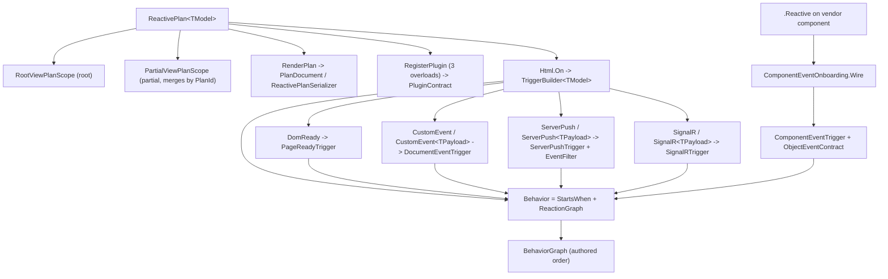

| Feature | Variants | DSL example | Domain types |
|---------|----------|-------------|--------------|
| Create root-view plan | `Html.ReactivePlan<TModel>()` -> `new ReactivePlan<TModel>(ReactivePlanScope.RootView, RequestServices)` | `var plan = Html.ReactivePlan<OrderModel>();` | `ReactivePlan<TModel>`, `ReactivePlanScope`, `RootViewPlanScope`, `PlanId`, `PlanIdentity`, `PlanScope.Root (RootPlanScope)`, `PlanBuildContext` |
| Create partial-view plan (merges into parent by PlanId) | `Html.ResolvePlan<TModel>()` -> `new ReactivePlan<TModel>(ReactivePlanScope.PartialView, RequestServices)`; `IsPartial=true`; `RendersValidationSummary=false` | `var plan = Html.ResolvePlan<OrderModel>();` | `ReactivePlan<TModel>`, `ReactivePlanScope`, `PartialViewPlanScope`, `PlanIdentity.Partial`, `PlanScope.Partial (PartialPlanScope)` |
| Render plan to plan-JSON script element | emits `<script type=application/json data-reactive-plan id=alis-plan-{planId}>{json}</script>`; root scope additionally emits a hidden `data-reactive-validation-summary` div, partial scope emits only the script | `@Html.RenderPlan(plan)` | `ReactivePlan<TModel>`, `PlanDocument`, `ReactivePlanSerializer`, `PlanScope` |
| Serialize plan document directly | `plan.Render()` (ambient services); `plan.Render(IServiceProvider services)`; `plan.RenderFormatted()` (indented, ambient); `plan.RenderFormatted(IServiceProvider services)` | `string json = plan.Render();` | `ReactivePlan<TModel>`, `PlanBuildContext.BuildPlan()`, `PlanDocument`, `ReactivePlanSerializer (Compact/Formatted, camelCase)` |
| Register plugin type metadata on the plan | `plan.RegisterPlugin(string pluginName, Action<PluginTypeBuilder> configure)`; `plan.RegisterPlugin(ReactivePlugin plugin)`; `plan.RegisterPlugin<TPlugin>() where TPlugin : ReactivePlugin, new()` | `plan.RegisterPlugin<UrlPlugin>();` | `ReactivePlan<TModel>`, `Builders.PluginTypeBuilder`, `ReactivePlugin`, `PluginContract`, `PlanBuildContext.RegisterPlugin` |
| Attach triggers to a plan | `Html.On<TModel>(this IHtmlHelper<TModel>, ReactivePlan<TModel> plan, Action<TriggerBuilder<TModel>> trigger)` -> opens a `TriggerBuilder` over `plan.Context`; triggers chain, each adds one independent `Behavior` | `Html.On(plan, t => t.DomReady(p => p.Element("status").SetText("Ready")));` | `TriggerBuilder<TModel>`, `PlanBuildContext`, `Behavior`, `BehaviorGraph` |
| DomReady trigger (page load) | `t.DomReady(Action<PipelineBuilder<TModel>> pipeline)` -> `StartsWhen.PageReady()` | `t.DomReady(p => p.Element("banner").AddClass("shown"));` | `StartsWhen`, `PageReadyTrigger (kind=page-ready)`, `Behavior.On` |
| CustomEvent trigger (named document event) | `t.CustomEvent(string eventName, Action<PipelineBuilder<TModel>> pipeline)` -> `DocumentEventTrigger` with `PayloadContract.Untyped`; `t.CustomEvent<TPayload>(string eventName, Action<TPayload, PipelineBuilder<TModel>> pipeline) where TPayload:new()` -> `DocumentEventTrigger` with `PayloadContract.ForPayload(typeof(TPayload))`; pipeline gets a typed payload instance | `t.CustomEvent<OrderPlaced>("order-placed", (e, p) => p.Element("toast").SetText("Saved"));` | `StartsWhen.DocumentEvent`, `DocumentEventTrigger (kind=document-event)`, `EventName`, `PayloadContract`, `UntypedPayloadContract`, `NamedPayloadContract` |
| ServerPush trigger (Server-Sent Events) | `t.ServerPush(string url, Action<PipelineBuilder<TModel>> pipeline)` -> `ServerPushTrigger` + `ServerPushEventFilter.AnyEvent()`; `t.ServerPush(string url, string eventType, Action<PipelineBuilder<TModel>> pipeline)` -> `NamedEvent` filter, untyped payload; `t.ServerPush<TPayload>(string url, string eventType, Action<TPayload, PipelineBuilder<TModel>> pipeline) where TPayload:new()` -> `NamedEvent` filter with `PayloadContract.ForPayload` | `t.ServerPush<Ticker>("/sse/prices", "tick", (e, p) => p.Element("price").SetText("updated"));` | `StartsWhen.ServerPush`, `ServerPushTrigger (kind=server-push)`, `ServerPushEventFilter`, `AnyServerPushEvent (kind=any)`, `NamedServerPushEvent (kind=named)`, `RequestUrl`, `PayloadContract` |
| SignalR trigger (hub method) | `t.SignalR(string hubUrl, string methodName, Action<PipelineBuilder<TModel>> pipeline)` -> `SignalRTrigger` with `PayloadContract.Untyped`; `t.SignalR<TPayload>(string hubUrl, string methodName, Action<TPayload, PipelineBuilder<TModel>> pipeline) where TPayload:new()` -> `SignalRTrigger` with `PayloadContract.ForPayload` | `t.SignalR<Alert>("/hubs/alerts", "OnAlert", (e, p) => p.Element("alert").SetText("new"));` | `StartsWhen.SignalR`, `SignalRTrigger (kind=signalr)`, `RequestUrl`, `MemberName`, `PayloadContract` |
| Component event trigger (.Reactive on a vendor component) | `builder.Reactive<TModel,TArgs>(plan, Func<TEvents, TypedEvent<TArgs>> eventSelector, Action<TArgs, PipelineBuilder<TModel>> pipeline)` -> `ComponentEventOnboarding.Wire` -> `PlanBuildContext.WireComponentEvent` -> `StartsWhen.ComponentEvent(componentId, eventName)`; one overload per component slice (Fusion ComboBox, AutoComplete, Slider, Sidebar, Tooltip, etc.); `BehaviorGraph` also declares an `ObjectEventContract` on the component object for the wired event | `Html.FusionComboBox(plan, m => m.City).FusionComboBox(b => b.Reactive(plan, e => e.Change, (e, p) => p.Element("out").SetText("changed")));` | `TypedEvent<TArgs>`, `ComponentEventOnboarding`, `PlanBuildContext.WireComponentEvent`, `StartsWhen.ComponentEvent`, `ComponentEventTrigger (kind=component-event)`, `ComponentKey`, `EventName`, `ObjectEventContract`, `ComponentObjectTarget`, `Behavior` |
| Behavior = trigger + reaction (plan graph node) | `Behavior.On(StartsWhen trigger, ReactionGraph reaction)` added to `BehaviorGraph`; each `Html.On` trigger and each `.Reactive` wiring produces exactly one `Behavior`; declaration order preserved in `PlanDocument.Behaviors` | `// implicit: every t.DomReady/CustomEvent/.Reactive(...) call appends one Behavior` | `Behavior`, `BehaviorGraph`, `StartsWhen`, `ReactionGraph`, `PlanDocument (PlanId, Scope, Components, Behaviors)` |

## Reactions

Reactions are the command sequence a trigger fires. They are authored on
`PipelineBuilder<TModel>` and assembled by `BuildReaction()` into a
`ReactionGraph`. Sync commands (set / call / dispatch) buffer into a
`SequenceReaction`; async boundaries (HTTP, parallel) flush the pending sync
segment then emit a `Request`/`Parallel` block; branches split the sync segment
at the authored position. Every reaction carries a `ValueExpression` for the
value it reads. Each reaction subclass owns a `kind` discriminator
(`set`, `call`, `dispatch`, `branch`, `inject`, ...) serialized into the generated
TS plan union.

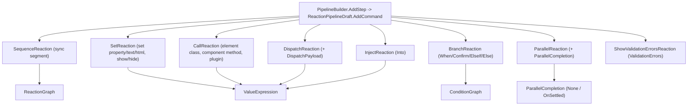

| Feature | Variants | DSL example | Domain types |
|---------|----------|-------------|--------------|
| Set property (element) | `SetText(string)`; `SetText<TSource>(TSource source, Expression<Func<TSource,object>> path)` (event payload); `SetText<TResponse>(ResponseBody<TResponse> source, Expression<Func<TResponse,object>> path)` (HTTP body); `SetText<TProp>(TypedSource<TProp> source)` (component/plugin/URL); `SetHtml(string)`; `SetHtml<TSource>(TSource source, Expression path)`; `SetHtml<TProp>(TypedSource<TProp> source)`; `Show()` (hidden=false); `Hide()` (hidden=true) | `p.Element("banner").SetText("Saved");` | `SetReaction`, `ComponentSource`, `ValueExpression`, `BrowserElementMembers`, `ComponentProperty<T>`, `MemberName`, `ComponentKey` |
| Set property (component) | `ComponentRef.EmitSet<TValue>(ComponentProperty<TValue>, ValueExpression)` emitted by vendor extensions (e.g. `SetValue`); target via `p.Component<T>(m => m.Prop)`, `p.Component<T,TOther>(expr)`, `p.Component<T>("refId")`, or `p.Component<T>()` (app-level); value sources: literal, `TypedSource`, event payload, response body via `ValueExpression` | `p.Component<FusionTextBox>(m => m.Name).SetValue("Ada");` | `SetReaction`, `ComponentSource`, `ComponentObjectTarget`, `ComponentProperty<T>`, `ValueExpression`, `ComponentKey`, `MemberAccess` |
| Call method (element) | `AddClass(string)` -> `addClass`; `RemoveClass(string)` -> `removeClass`; `ToggleClass(string)` -> `toggleClass` | `p.Element("row").AddClass("active");` | `CallReaction`, `ComponentSource`, `ValueExpression`, `BrowserElementMembers`, `ComponentMethod`, `MemberName` |
| Call method (component) | `ComponentRef.EmitCall(ComponentMethod)` (no-arg, e.g. `Focus`, `Show`); `ComponentRef.EmitCall(ComponentMethod, List<ValueExpression> args)` (typed args); same `Component<T>` target overloads as Set (expression / cross-model / explicit-id / app-level) | `p.Component<FusionDialog>().Open();` | `CallReaction`, `ComponentSource`, `ComponentObjectTarget`, `ComponentMethod`, `ValueExpression`, `ComponentKey`, `Shape` |
| Call method (plugin) | `p.Plugin(name, member)` (void member command); `p.Plugin(name)` (root function); `p.Plugin(PluginCommand)` (declared descriptor); `PluginCallBuilder.Arg` overloads: ResponseBody+path, event args+path, `TypedSource`, string, int, bool, long, decimal, double, DateTime, `ArgValue<TValue>`; `PluginCallBuilder.Fire()` (terminal: emits `CallReaction` on `PluginSource`) | `p.Plugin("clipboard", "copy").Arg("hello").Fire();` | `CallReaction`, `PluginSource`, `PluginOperationId`, `PluginArguments`, `PluginInvocationArgument`, `MethodArgumentContract`, `ValueExpression` |
| Dispatch custom event | `p.Dispatch(string eventName)` (no payload, `DispatchPayload.None`); `p.Dispatch<TPayload>(string eventName, TPayload payload)` (literal payload, `LiteralRaw` + `PayloadContract`); `p.DispatchWith<TPayload>(string eventName, Action<DispatchPayloadBuilder<TPayload,TModel>> configure)` (runtime source-backed payload) | `p.Dispatch("order-saved");` | `DispatchReaction`, `DispatchPayload`, `NoDispatchPayload`, `PresentDispatchPayload`, `PayloadContract`, `ValueExpression`, `EventName` |
| Dispatch payload composition | `DispatchPayloadBuilder.Set<TProp>(field, TypedSource<TProp>)` (live source); `Set(field, string)` (literal string); `Set(field, int)` (literal int); `Set(field, bool)` (literal bool); supports nested object paths `x => x.A.B` via `DispatchPayloadPath`; conflicting leaf/parent throws | `p.DispatchWith<Saved>("saved", b => b.Set(x => x.Id, idSource).Set(x => x.Status, "ok"));` | `DispatchPayloadDraft`, `DispatchPayloadPath`, `ValueExpression`, `PayloadContract` |
| Conditional branch | `p.When<TPayload,TProp>(payload, path)`; `p.When<TPayload,TProp>(ResponseBody<TPayload>, path)`; `p.When<TProp>(TypedSource<TProp> source)`; `p.Confirm(message)` (user-confirmation guard, no source); operator -> `GuardBuilder.Then(pipeline)` emits first `BranchCase`; `BranchBuilder.ElseIf(...)` (event/response/typed-source); `BranchBuilder.Else(pipeline)` (default, `BranchGuard.Else`); `And`/`Or`/`Not` compose; `ConditionStart.When` for nested standalone | `p.When(level).Eq("Memory").Then(t => t.Element("fee").SetText("$2400")).Else(t => t.Element("fee").SetText("$0"));` | `BranchReaction`, `BranchCase`, `BranchGuard`, `ConditionGraph`, `ReactionGraph` |
| Reaction sequencing (sync/async lanes) | every command appends in authored order via `PipelineBuilder.AddStep` -> `ReactionPipelineDraft.AddCommand`; sync segment commands buffer into a `SequenceReaction`; async boundaries (HTTP/parallel) flush the pending sync segment then emit Request/Parallel block; branch flush splits sync reactions before/after the `BranchReaction`; single block collapses, multiple wrap in `SequenceReaction` | `p.Element("a").AddClass("x"); p.Dispatch("e"); // two ordered sync reactions` | `SequenceReaction`, `ReactionGraph`, `ReactionPipelineDraft<TModel>`, `PendingBranch`, `PendingAsyncReaction<T>` |
| Parallel reaction (concurrent branches) | `ParallelReaction` holds concurrent steps plus `ParallelCompletion`; `ParallelCompletion.None (NoParallelCompletion)`; `ParallelCompletion.OnSettled(reaction) (SettledParallelCompletion)` | `p.Parallel(b => { ... }).OnAllSettled(t => t.Element("done").Show());` | `ParallelReaction`, `ParallelCompletion`, `NoParallelCompletion`, `SettledParallelCompletion`, `ReactionGraph` |
| Inject HTML into element | `p.Into(elementId)` injects HTTP success response body as HTML into the target element (follows a request) | `p.Get("/fragment").Into("panel");` | `InjectReaction`, `ValueExpression`, `PayloadSource`, `ComponentKey` |
| Show validation errors reaction | `p.ValidationErrors(formId)` emits a reaction that renders accumulated validation errors in the container element | `p.ValidationErrors("summary");` | `ShowValidationErrorsReaction`, `ComponentId` |

## Conditions

Conditions are deterministic graphs over the shared value sources. `p.When(...)`
opens a `ConditionSourceBuilder`; an operator produces a `CompareCondition` (or
unary form); `Then`/`ElseIf`/`Else` build nested pipelines; the whole thing
compiles to a `BranchReaction` whose first matching `BranchCase` wins. `And`/`Or`/
`Not` compose the guard (`AllCondition`/`AnyCondition`/`NotCondition`, flattening
nested same-kind terms). `Confirm` is the one non-value, async user-decision node.
Conditions add no value resolver — every operand resolves through
`ValueExpression` + `Shape`.

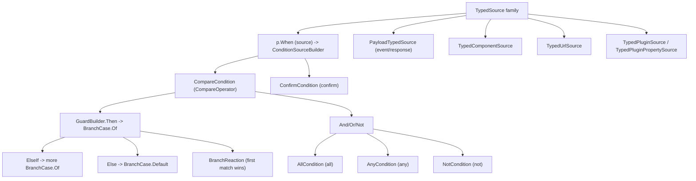

| Feature | Variants | DSL example | Domain types |
|---------|----------|-------------|--------------|
| When (start conditional branch) | `p.When<TPayload,TProp>(TPayload payload, Expression<Func<TPayload,TProp>> path)` (event payload); `p.When<TPayload,TProp>(ResponseBody<TPayload> responseBody, Expression<Func<TPayload,TProp>> path) where TPayload:class` (HTTP body); `p.When<TProp>(TypedSource<TProp> source)` (any typed source) | `p.When(args, e => e.Value).Gte(5).Then(t => t.Set(m => m.Flag, true))` | `ConditionSourceBuilder<TModel,TProp>`, `PayloadTypedSource<TPayload,TProp>`, `ResponseBody<TPayload>`, `TypedSource<TProp>`, `BranchReaction` |
| Comparison operators (literal operand) | `Eq` -> `eq`; `NotEq` -> `neq`; `Gt` -> `gt`; `Gte` -> `gte`; `Lt` -> `lt`; `Lte` -> `lte` | `p.When(args, e => e.Age).Gte(65).Then(t => t.Set(m => m.IsSenior, true))` | `CompareCondition`, `CompareOperator`, `ComparisonOperands (Binary)`, `ValueExpression.LiteralRaw`, `Shape` |
| Source-vs-source comparison operators | `Eq(TypedSource<TProp> right)` -> `eq`; `NotEq` -> `neq`; `Gt` -> `gt`; `Gte` -> `gte`; `Lt` -> `lt`; `Lte` -> `lte` | `p.When(p.FromUrl<int>("min")).Lte(startSource).Then(t => t.Dispatch("valid"))` | `CompareCondition`, `ComparisonOperands (Binary)`, `TypedSource<TProp>.ToValueExpression`, `PresentComparisonRightOperand` |
| Presence / unary operators | `Truthy()` -> `truthy`; `Falsy()` -> `falsy`; `IsNull()` -> `is-null`; `NotNull()` -> `not-null`; `IsEmpty()` -> `is-empty`; `NotEmpty()` -> `not-empty` | `p.When(args, e => e.SelectedId).NotNull().Then(t => t.Component(...))` | `CompareCondition`, `ComparisonOperands.Unary`, `AbsentComparisonRightOperand` |
| Membership / range operators | `In(params TProp[] values)` -> `in` (`ValueExpression.Array`); `NotIn(params TProp[] values)` -> `not-in`; `Between(TProp low, TProp high)` -> `between` (two-element array endpoints) | `p.When(args, e => e.Level).In("Memory", "Skilled").Then(t => t.Set(m => m.HighCare, true))` | `CompareCondition`, `ComparisonOperands (Binary)`, `ValueExpression.Array`, `Shape.ArrayOf` |
| Text operators | `Contains(string substring)` -> `contains`; `StartsWith(string prefix)` -> `starts-with`; `EndsWith(string suffix)` -> `ends-with`; `Matches(string pattern)` -> `matches` (regex); `MinLength(int length)` -> `min-length` (`MinimumTextLength`, `Shape.Number`) | `p.When(args, e => e.Name).StartsWith("Dr.").Then(t => t.Set(m => m.IsDoctor, true))` | `CompareCondition`, `ComparisonOperands (Binary)`, `ValueExpression.LiteralRaw`, `MinimumTextLength`, `Shape.String / Shape.Number` |
| Array membership operator | `ArrayContains(object item)` -> `array-contains` (carries element `ItemShape` via `ComparisonOperands.CollectionItem`) | `p.When(args, e => e.Tags).ArrayContains("urgent").Then(t => t.Dispatch("alert"))` | `CompareCondition`, `ComparisonOperands.CollectionItem`, `TypedSource.ElementShape`, `CompareCondition.ItemShape` |
| Then / first-match branch execution | `GuardBuilder.Then(Action<PipelineBuilder<TModel>> pipeline)` -> first `BranchCase.Of`, returns `BranchBuilder`; standalone `Then` throws `InvalidOperationException` (requires pipeline context) | `p.When(args, e => e.Score).Gt(80).Then(t => t.Set(m => m.Pass, true))` | `BranchBuilder<TModel>`, `BranchCase.Of`, `BranchGuard.When (ConditionalBranchGuard, "when")`, `BranchReaction`, `PipelineConditionContinuation / BranchConditionContinuation` |
| ElseIf chained branches | `ElseIf<TPayload,TProp>(payload, path)` (event); `ElseIf<TPayload,TProp>(responseBody, path)` (response); `ElseIf<TProp>(TypedSource<TProp>)` (typed source); throws `InvalidOperationException` if added after `Else` (`EnsureElseIfCanBeAdded`) | `p.When(args,e=>e.Lvl).Eq(1).Then(t=>...).ElseIf(args,e=>e.Lvl).Eq(2).Then(t=>...)` | `BranchBuilder<TModel>`, `ConditionSourceBuilder<TModel,TProp>`, `BranchCase.Of`, ordered `BranchReaction.Cases` |
| Else default case | `BranchBuilder.Else(Action<PipelineBuilder<TModel>> pipeline)` -> `BranchCase.Default` (`BranchGuard.Else`, "default"); throws if `Else` already called or branches added after | `p.When(args,e=>e.Ok).Truthy().Then(t=>...).Else(t => t.Dispatch("failed"))` | `BranchBuilder<TModel>`, `BranchCase.Default`, `DefaultBranchGuard ("default")` |
| Guard composition (And / Or / Not) | `And<TPayload,TProp>(payload, path)`; `And<TPayload,TProp>(responseBody, path)`; `And<TProp>(TypedSource<TProp>)`; `And(Func<ConditionStart<TModel>,GuardBuilder<TModel>> inner)` (nested, flattened); `Or<TPayload,TProp>(payload, path)`; `Or<TPayload,TProp>(responseBody, path)`; `Or<TProp>(TypedSource<TProp>)`; `Or(Func<...> inner)`; `Not()` | `p.When(args,e=>e.A).Gt(0).And(args,e=>e.B).NotNull().Or(c => c.When(other).Eq(1)).Then(t=>...)` | `GuardBuilder<TModel>`, `AllCondition ("all")`, `AnyCondition ("any")`, `NotCondition ("not")`, `ConditionComposition (FlattenAll/FlattenAny)`, `ConditionStart<TModel>` |
| Confirm guard (async user decision) | `p.Confirm(string message)` (from `PipelineBuilder`, begins branch then returns `GuardBuilder`); `ConditionStart.Confirm(string message)` (standalone for `And`/`Or`) | `p.Confirm("Discharge this resident?").Then(t => t.Post<DischargeModel>("/discharge"))` | `ConfirmCondition ("confirm")`, `GuardBuilder<TModel>`, `ConditionGraph.Confirm` |
| Typed condition value sources | `PayloadTypedSource<TPayload,TProp>` (event/success/error/dispatch payload via `PayloadSource` + `ExpressionPathHelper.ToEventPath`); `ResponseBody<TPayload>.Read(path)` (HTTP body); `TypedComponentSource<TProp>` (`ValueExpression.Read` over `ComponentSource`, or `FromMethod` -> `Invoke`); `TypedUrlSource<TProp>` (`ValueExpression.ReadUrl`, registers `RequestScalarTarget.UrlQueryParameter`); `TypedPluginSource<TProp>` (`Invoke` over `PluginSource`); `TypedPluginPropertySource<TProp>` (`Read` over `PluginSource`) | `p.When(careLevelDdl.ReactiveValue()).Eq("Memory").Then(t => t.Element("warn").Show())` | `TypedSource<TProp>`, `ValueExpression (Read/Invoke/ReadPayload/ReadUrl/LiteralRaw/Array)`, `PayloadSource`, `ComponentSource`, `PluginSource`, `Shape.FromClrType` |

## HTTP Pipeline

HTTP is the framework's primary async lane. `p.Get/Post/Put/Delete` open a
`RequestPlan` and flush the pending sync segment. `Gather` reads payload, header,
and route-param targets through `ValueExpression`; scalar targets (header,
route-param, typed URL query) reject array/object shapes at build via
`RequestScalarTarget.RequireShape`. `Response` opens success/error scopes
(`ResponseBody<T>.Read` mints `TypedSource`s); `OnError(statusCode)` is first-match
status routing. `Chained` runs one follow-up after success; `Parallel` runs
concurrent branches then `OnAllSettled`. `WhileLoading`, `Finally`, and `Validate`
wrap the request lifecycle.

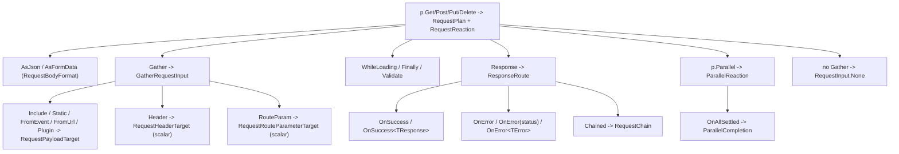

| Feature | Variants | DSL example | Domain types |
|---------|----------|-------------|--------------|
| HTTP request verb (Get/Post/Put/Delete) | `p.Get(string url)`; `p.Post(string url)`; `p.Post(string url, Action<GatherBuilder<TModel>> gather)`; `p.Put(string url, Action<GatherBuilder<TModel>> gather)`; `p.Delete(string url)`; `builder.Get/Post/Put/Delete(string url)` (fluent re-selection on `HttpRequestBuilder`); url may carry `{placeholder}` route-template params validated at build time | `p.Get("/api/residents/{id}")` | `RequestPlan`, `RequestEndpoint`, `HttpMethodName`, `RequestUrl`, `RequestReaction`, `RequestRouteTemplate` |
| Request body format | `.AsJson()` (default); `.AsFormData()`; GET emits query string, POST/PUT/DELETE emit declared body format | `p.Post("/api/intake").Gather(g => g.IncludeAll()).AsFormData()` | `RequestBodyFormat`, `GatherRequestInput` |
| Gather — payload from component value | `.Include<TComponent,TModel>(Expression<Func<TModel,object>> expr)` (model expression -> param name); `.Include<TComponent,TModel>(string refId, string name)` (explicit id+name); `.Include<TModel,TProp>(TypedComponentSource<TProp> source)` (typed member, default name); `.Include<TModel,TProp>(TypedComponentSource<TProp> source, string paramName)` (typed member + explicit param); `.IncludeAll()` (all registered input components) | `p.Post("/api/save").Gather(g => g.Include<FusionTextBox, OrderModel>(m => m.Name))` | `GatherBuilder`, `RequestInputAssignment`, `RequestPayloadTarget`, `ValueExpression`, `ComponentSource`, `RegisteredInputSelection`, `InputComponentPlanBinding`, `InputValueContract`, `BindingPath` |
| Gather — payload from static / event / plugin / URL | `.Static(string param, object value)`; `.FromEvent<TArgs,TProp>(TArgs args, Expression path, string param)`; `.FromUrl(string paramName)`; `.FromUrl(string paramName, string asParam)`; `.FromUrl<T>(string paramName)` (typed); `.FromUrl<T>(string paramName, string asParam)` (typed + name); `.Plugin<T>(TypedPluginSource<T> source, string paramName)` | `p.Get("/api/search").Gather(g => g.FromUrl<int>("page").Static("pageSize", 20))` | `RequestInputAssignment`, `RequestPayloadTarget`, `ValueExpression`, `PayloadSource`, `UrlSource`, `TypedPluginSource`, `RequestScalarTarget`, `UrlParameterName`, `Shape` |
| Gather — header target (scalar) | `.Header(string name, string value)` (literal, null rejected); `.Header<TProp>(string name, TypedSource<TProp> source)` (scalar-only); `.Header<TArgs,TProp>(string name, TArgs args, Expression path)` (event-arg, scalar-only) | `p.Get("/api/me").Gather(g => g.Header("X-Tenant", token))` | `RequestHeaderTarget`, `HeaderName`, `ValueExpression`, `RequestScalarTarget`, `Shape` |
| Gather — route param target (scalar) | `.RouteParam(string name, int value)`; `.RouteParam(string name, string value)` (null rejected); `.RouteParam(string name, long value)`; `.RouteParam<TProp>(string name, TypedSource<TProp> source)` (scalar-only); `.RouteParam<TArgs,TProp>(string name, TArgs args, Expression path)` (scalar-only); every `{placeholder}` must have a matching `RouteParam` and vice versa | `p.Get("/api/residents/{id}").Gather(g => g.RouteParam("id", 42))` | `RequestRouteParameterTarget`, `RouteParameterName`, `ValueExpression`, `RequestScalarTarget`, `RequestRouteTemplate`, `Shape` |
| Response success route | `.OnSuccess(Action<PipelineBuilder<TModel>>)` (untyped); `.OnSuccess<TResponse>(Action<ResponseBody<TResponse>, PipelineBuilder<TModel>>)` (typed body); `ResponseBody<T>.Read<TProp>(expr)` (typed source from success body) | `.Response(r => r.OnSuccess<ApiResponse>((json, s) => s.Element("name").SetText(json, r => r.Data.Name)))` | `ResponseBuilder`, `ResponseRoute`, `ResponseStatusMatch`, `AnyResponseStatusMatch`, `ReactionGraph`, `PayloadSource`, `PayloadContract`, `ResponseBody` |
| Response error route | `.OnError(Action<PipelineBuilder<TModel>>)` (any, untyped); `.OnError(int statusCode, Action<PipelineBuilder<TModel>>)` (exact, untyped); `.OnError<TError>(Action<ResponseBody<TError>, PipelineBuilder<TModel>>)` (any, typed); `.OnError<TError>(int statusCode, Action<ResponseBody<TError>, PipelineBuilder<TModel>>)` (exact, typed); status validated 100-599, network/client failures use the no-status overload | `.Response(r => r.OnError(404, e => e.Element("msg").SetText("Not found")))` | `ResponseRoute`, `ResponseStatusMatch`, `ExactResponseStatusMatch`, `AnyResponseStatusMatch`, `HttpResponseStatusCode`, `PayloadSource`, `PayloadContract`, `ResponseBody` |
| Chained request | `.Chained(Action<HttpRequestBuilder<TModel>>)` (one follow-up after success); only one chained request per response (a second throws); chained request is a full `HttpRequestBuilder` — may gather from the previous success scope and nest its own `Chained` | `.Response(r => r.OnSuccess(...).Chained(c => c.Get("/api/next/{id}").Gather(g => g.Include<...>(...))))` | `RequestChain`, `TerminalRequestChain`, `FollowUpRequestChain`, `RequestPlan`, `ResponseRouting` |
| Parallel requests | `p.Parallel(params Action<HttpRequestBuilder<TModel>>[] branches)` (N concurrent branches); `.OnAllSettled(Action<PipelineBuilder<TModel>>)` (after every branch settles); requires at least one branch | `p.Parallel(b => b.Get("/api/a"), b => b.Get("/api/b")).OnAllSettled(s => s.Dispatch("loaded"))` | `ParallelBuilder`, `ParallelReaction`, `ParallelCompletion`, `NoParallelCompletion`, `SettledParallelCompletion`, `RequestReaction`, `RequestPlan`, `ReactionGraph` |
| WhileLoading reaction | `.WhileLoading(Action<PipelineBuilder<TModel>>)` (runs before the request is sent, e.g. show spinner) | `.WhileLoading(s => s.Component(loader).Show())` | `RequestReactions`, `ReactionGraph`, `RequestPlan` |
| Finally reaction | `.Finally(Action<PipelineBuilder<TModel>>)` (runs after the request settles regardless of outcome; no response-body access) | `.Finally(s => s.Component(loader).Hide())` | `RequestReactions`, `ReactionGraph`, `RequestPlan` |
| Validate before request | `.Validate<TValidationSource>(string formId)` (runs client validation against the registered rule source, displaying errors in the form container, before sending); default when not called is `RequestValidationTarget.None` | `p.Post("/api/save").Validate<OrderValidator>("order-form").Gather(g => g.IncludeAll())` | `RequestValidationTarget`, `NoRequestValidationTarget`, `ContainerRequestValidationTarget`, `ClientValidationBeforeRequest`, `ComponentId` |
| Bodiless request | no `Gather` call leaves `RequestInput.None (NoRequestInput)` — bodiless GET/DELETE | `p.Delete("/api/residents/{id}").Gather(g => g.RouteParam("id", id))` | `RequestInput`, `NoRequestInput`, `GatherRequestInput` |

## Arrays

Arrays are part of the value family: every operator compiles to an
`ArrayOperationExpression` (kind `array-op`). `p.From`/`p.FromDom` begin a
transform over a typed array source; `Where`/`Select`/`OrderBy` shape it;
`Count`/`Any`/`All`/`Sum`/`Find` reduce to a `ReactiveValue<T>` (itself a
`TypedSource<T>`); `AsSource()` exposes a shaped array as a `TypedSource<T[]>` for
component data binding with no HTTP round-trip. Per-element predicates and
selectors are compiled by `ElementExpressionCompiler` into the same sync
`ConditionGraph` and element-scope value reads the conditions area defines.

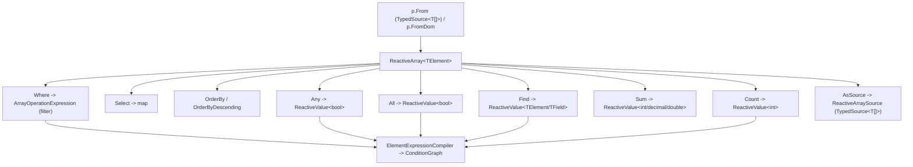

| Feature | Variants | DSL example | Domain types |
|---------|----------|-------------|--------------|
| p.From — begin an array transform from a typed array source | `From<TElement>(TypedSource<TElement[]> source)` (component member, plugin read, response-body Read, URL, literal, or prior `AsSource()`); `From<TArgs,TElement>(TArgs args, Expression<Func<TArgs,TElement[]>> selector)` (captures a `.Reactive()` event-payload array; lambda captured into a plan read, never invoked); element type `TElement` flows through the chain | `var residents = p.From(json.Read(x => x.Residents));` | `ReactiveArray<TElement>`, `TypedSource<TElement[]>`, `PayloadTypedSource<TArgs,TElement[]>`, `ValueExpression`, `Shape` |
| p.FromDom — begin an array transform from a DOM element's array-like member | `FromDom(string elementId, string member)` => `ReactiveArray<string>` (string-element default for `DOMTokenList`/`classList`); `FromDom<TElement>(string elementId, string member)` => `ReactiveArray<TElement>` (declared element type); element resolved by `getElementById`, member via `ValueExpression.ReadDom`; array-like collections normalized at the input boundary | `var classes = p.FromDom("resident-card", "classList");` | `ReactiveArray<string>`, `ReactiveArray<TElement>`, `ReadExpression`, `DomSource`, `Shape` |
| Where — filter elements by a per-element sync predicate | `Where(Expression<Func<TElement,bool>> predicate)` => `ReactiveArray<TElement>` (chainable); predicate compiled to a sync `ConditionGraph` (compare/all/any/not) reading element scope; supports `== != > >= < <=`, `&& || !`, string `Contains`/`StartsWith`/`EndsWith` (literal arg), and boolean members | `residents.Where(x => x.Status == "active")` | `ReactiveArray<TElement>`, `ArrayOperationExpression (op="filter")`, `ConditionGraph`, `ValueExpression.ArrayFilter`, `ElementExpressionCompiler` |
| Select — project each element through a per-element selector | `Select<TResult>(Expression<Func<TElement,TResult>> selector)` => `ReactiveArray<TResult>` (result element shape = `Shape.FromClrType(typeof(TResult))`); compiled to a `ValueExpression` read against element scope; v1 supports member access, the element itself (`x => x`), and whitelisted pure element method calls; object-init/arithmetic throw at render | `residents.Select(x => x.Name)` | `ReactiveArray<TResult>`, `ArrayOperationExpression (op="map")`, `ValueExpression.ArrayMap`, `ElementExpressionCompiler` |
| OrderBy / OrderByDescending — order elements by a per-element key | `OrderBy<TKey>(Expression<Func<TElement,TKey>> key)` => `ReactiveArray<TElement>` (op="orderBy"); `OrderByDescending<TKey>(...)` (op="orderByDescending"); key must project to a sortable scalar (string/number/boolean/date/nullable); a non-scalar key throws at plan render time | `roster.OrderBy(x => x.Name)` | `ReactiveArray<TElement>`, `ArrayOperationExpression (op="orderBy"/"orderByDescending")`, `ValueExpression.ArrayOrderBy`, `Shape`, `ElementExpressionCompiler` |
| Count — count all elements or count matching elements | `Count()` => `ReactiveValue<int>` (op="count", no predicate); `Count(Expression<Func<TElement,bool>> predicate)` => `ReactiveValue<int>` (sugar for `Where(predicate).Count()`) | `residents.Count(x => x.Status == "active")` | `ReactiveValue<int>`, `ArrayOperationExpression (op="count"/"filter")`, `ValueExpression.ArrayCount`, `ConditionGraph` |
| Any — true when array non-empty or when any element matches | `Any()` => `ReactiveValue<bool>` (op="any", predicate null = non-empty); `Any(Expression<Func<TElement,bool>> predicate)` => `ReactiveValue<bool>` (op="any" with compiled predicate) | `residents.Any(x => x.Status == "critical")` | `ReactiveValue<bool>`, `ArrayOperationExpression (op="any")`, `ValueExpression.ArrayAny`, `ConditionGraph` |
| All — true when every element matches the predicate | `All(Expression<Func<TElement,bool>> predicate)` => `ReactiveValue<bool>` (op="all", predicate required) | `residents.All(x => x.Age >= 18)` | `ReactiveValue<bool>`, `ArrayOperationExpression (op="all")`, `ValueExpression.ArrayAll`, `ConditionGraph` |
| Sum — sum a numeric per-element selector (typed by selector return) | `Sum(Expression<Func<TElement,int>> selector)` => `ReactiveValue<int>`; `Sum(... decimal ...)` => `ReactiveValue<decimal>`; `Sum(... double ...)` => `ReactiveValue<double>`; all are op="sum" carrying a projection `ValueExpression`; output `Shape` is always `Shape.Number` | `residents.Where(x => x.Status == "active").Sum(x => x.Age)` | `ReactiveValue<int>`, `ReactiveValue<decimal>`, `ReactiveValue<double>`, `ArrayOperationExpression (op="sum")`, `ValueExpression.ArraySum` |
| Find — first matching element, optionally projected to a field | `Find(Expression<Func<TElement,bool>> predicate)` => `ReactiveValue<TElement>` (projection null, result shape = element shape; null when none match); `Find<TField>(Expression<Func<TElement,bool>> predicate, Expression<Func<TElement,TField>> selector)` => `ReactiveValue<TField>` (result shape = `Shape.FromClrType(typeof(TField))`) | `residents.OrderByDescending(x => x.Age).Find(x => true, x => x.Name)` | `ReactiveValue<TElement>`, `ReactiveValue<TField>`, `ArrayOperationExpression (op="find")`, `ValueExpression.ArrayFind`, `ConditionGraph` |
| AsSource — expose the transformed array as a typed array source | `AsSource()` => `TypedSource<TElement[]>` (backed by `ReactiveArraySource<TElement>` wrapping the array-op `ValueExpression`); lets a shaped array bind directly to a component via `SetDataSource(TypedSource<T[]>)` with no HTTP round-trip | `roster.OrderBy(x => x.Name).AsSource()` | `TypedSource<TElement[]>`, `ReactiveArraySource<TElement>`, `ArrayOperationExpression`, `ValueExpression` |
| ReactiveValue&lt;T&gt; — scalar result of a reduction, usable anywhere TypedSource&lt;T&gt; is | `ReactiveValue<TValue> : TypedSource<TValue>` produced by Count/Sum/Any/All/Find; plugs into `SetText`, `When`, and dispatch payloads with no new overloads (base-source consumers); gather intake is typed to component/plugin sources, not the base source | `s.Element("res-total").SetText(residents.Count());` | `ReactiveValue<TValue>`, `TypedSource<TValue>`, `ValueExpression` |
| Element-scope expression compilation (per-element predicates & selectors) | predicate -> sync `ConditionGraph` (compare/all/any/not), comparison shape derived from the typed member operand; element member read -> `ReadPayload(PayloadSource.Element(), path, shape)`; identity (`x => x`) -> `ReadWholeElement(shape)`; whitelisted pure element method call (getDay/getMonth/getFullYear/getDate/getHours/getMinutes/getSeconds/getTime/toUpperCase/toLowerCase/trim/getAttribute/hasAttribute) -> `InvokeElement`; non-whitelisted/side-effecting methods throw at render; parameter-free subexpression -> `LiteralFromValue` | `residents.Where(x => x.StartDate.GetMonth() == 3 && x.Name.StartsWith("A"))` | `ElementExpressionCompiler`, `ConditionGraph`, `ComparisonOperands`, `CompareOperator`, `PayloadSource (Element)`, `ValueExpression.ReadWholeElement`, `ValueExpression.InvokeElement`, `ValueExpression.ReadPayload` |

## Values

`ValueExpression` is the single value path. One concept reads every value the
plan needs — literal, live read (component/plugin/URL/DOM/payload), object, array,
and array-op — and is polymorphic over a `kind` discriminator. Every other area
reads through it: sets, calls, condition operands, gather targets, dispatch
payloads, validation operands, plugin args, route params, and headers. `Shape` is
the type contract carried by every value. `TypedSource<TProp>` is the compile-time
carrier that preserves operator type safety everywhere a source is accepted.

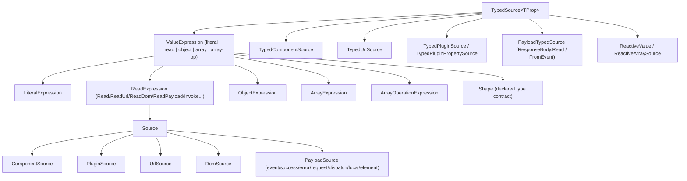

| Feature | Variants | DSL example | Domain types |
|---------|----------|-------------|--------------|
| ValueExpression (the single value path) | abstract base with internal `OutputShape`; polymorphic over kind `literal | read | object | array | array-op`; consumed by `SetReaction`, `CallReaction`, `ConditionGraph` operands, gather request input, dispatch payload, validation condition, plugin args, route params, headers; internal static factories only — never constructed in app code | `// every source below resolves to a ValueExpression node serialized into the plan` | `Alis.Reactive.PlanModel.ValueExpression` |
| LiteralExpression (constant value) | `Literal(bool)` -> Boolean; `Literal(string)` -> String; `Literal(int/long/decimal/double)` -> Number; `Literal(DateTime)` -> Date (ISO 'O'); `Null()` -> `LiteralExpression(null, Shape.None)`; `LiteralRaw(object?, Shape)` (caller-declared shape, condition operands); `LiteralFromValue(object?)` (shape inferred via `Shape.FromValue`, null becomes `Null()`); kind = `literal`, carries Value + Shape | `p.Element("greeting").SetText("Hello");` | `Alis.Reactive.PlanModel.LiteralExpression`, `Alis.Reactive.PlanModel.Shape` |
| ReadExpression (live value read from a Source) | `Read(Source, member)`; `Read(Source, member, Path)`; `Read(Source, member, Shape)`; `Read(Source, member, Path, Shape)`; `ReadUrl(paramName)`; `ReadUrl(paramName, Shape)`; `ReadDom(elementId, member, Shape)`; `ReadPayload(PayloadSource, path)` / `(.., Shape)`; `ReadWholePayload(PayloadSource)` / `(.., Shape)`; `ReadWholeElement()` / `(Shape)`; `Invoke(RuntimeObjectSource, method, returns, args)`; `InvokeElement(receiverPath, method, returns, args)`; kind = `read`, carries From/Member/Path/Shape/Access | `p.When(p.FromUrl<int>("page")).Gt(1).Then(s => s.Element("prev").Show());` | `Alis.Reactive.PlanModel.ReadExpression`, `ValueRead`, `ValueReadTarget`, `ValueReadAccess`, `PropertyValueReadAccess`, `MethodValueReadAccess` |
| Source hierarchy (what a read points at) | abstract `Source` (write-only polymorphic, kind discriminator); `RuntimeObjectSource` (base for browser objects with declared members); `ComponentSource ("component")` via `ComponentKey`; `PluginSource ("plugin")` carries `PluginName` + `TypeKey.Plugin`; `UrlSource ("url")` singleton; `DomSource ("dom")` by id; `PayloadSource ("payload")` scope + contract | `p.Component<FusionTextBox>(m => m.Name).Read<string>(...) // ComponentSource` | `Source`, `RuntimeObjectSource`, `ComponentSource`, `PluginSource`, `UrlSource`, `DomSource`, `PayloadSource` |
| PayloadSource scopes (event / response / request / dispatch / local / element) | `Event()` / `Event(PayloadContract)` / `Event(string)`; `Success()` / `Success(contract)` / `Success(string)`; `Error()` / `Error(contract)` / `Error(string)`; `Request()` / `Request(contract)` / `Request(string)`; `Dispatch()` / `Dispatch(contract)` / `Dispatch(string)`; `Local()` (view-model, untyped); `Element()` (current array element); each carries `PayloadScope` + `PayloadContract` | `.OnSuccess<ApiResponse>((json, s) => s.When(json, r => r.Status).Eq("approved").Then(...));` | `Alis.Reactive.PlanModel.PayloadSource`, `Alis.Reactive.PlanModel.PayloadContract` |
| TypedSource&lt;TProp&gt; (compile-time type carrier over a value source) | abstract; `ToValueExpression()` + `Shape` (`Shape.FromClrType(TProp)`) + `ElementShape` (collection item shape); the universal accepted type for When, And/Or, source-vs-source compare, gather, headers, route params, dispatch payload, plugin args, SetText, array From; `TProp` preserves operator type safety in `ConditionSourceBuilder` | `TypedSource<int> page = p.FromUrl<int>("page");` | `Alis.Reactive.Builders.Conditions.TypedSource<TProp>` |
| TypedComponentSource&lt;TProp&gt; (component member as value source) | `ctor(componentId, valueMember)` (property read, `Shape.FromClrType(TProp)`); `FromMethod(ComponentSource, method, args)` (method-return via `Invoke`); exposes `DefaultPayloadName` for gather naming; minted by `ComponentRef.Read<TValue>(ComponentProperty)` / `Read<TValue>(ComponentMethod)` / `Read<TValue>(ComponentMethod, args)` | `g.Include<FusionDropDownList, OrderModel>(m => m.CareLevel)` | `Alis.Reactive.Builders.Conditions.TypedComponentSource<TProp>`, `ComponentSource`, `ComponentRef` |
| TypedUrlSource&lt;TProp&gt; (URL query parameter as value source) | `p.FromUrl(name)` -> `TypedUrlSource<string>`; `p.FromUrl<T>(name)` -> `TypedUrlSource<T>`; ctor validates via `UrlParameterName.Of` and registers `RequestScalarTarget.UrlQueryParameter<TProp>`; `ToValueExpression` -> `ReadUrl(name, Shape.FromClrType(TProp))` | `p.When(p.FromUrl<string>("tab")).Eq("billing").Then(...);` | `Alis.Reactive.Builders.Conditions.TypedUrlSource<TProp>`, `UrlSource` |
| PayloadTypedSource&lt;TPayload,TProp&gt; (event/response/error/dispatch payload property as source) | `FromEvent(expression)` (`Event(PayloadContract.ForPayload(TPayload))` + expression); `ctor(PayloadSource, expression)` (any payload scope); minted by `When(payload, path)` (event) and `ResponseBody<T>.Read(path)` (success/error); `ToValueExpression` compiles lambda via `ExpressionPathHelper.ToEventPath` -> `ReadPayload` | `t.CustomEvent<CareEvent>("care", (e, p) => p.When(e, x => x.Level).Eq(3).Then(...));` | `PayloadTypedSource<TPayload,TProp>`, `PayloadSource`, `ResponseBody<T>` |
| ResponseBody&lt;T&gt; (typed HTTP response body source factory) | `Read<TProp>(Expression<Func<T,TProp>>)` -> `TypedSource<TProp>` via `PayloadTypedSource` over success/error scope; passed as first lambda param of `OnSuccess<TResponse>`/`OnError<TError>` (compile-time inference, no runtime instance); also used directly with SetText/SetHtml binding | `.OnSuccess<ApiResponse>((json, s) => s.Element("name").SetText(json, r => r.Data.Name));` | `Alis.Reactive.ResponseBody<T>`, `PayloadTypedSource<TPayload,TProp>` |
| TypedPluginSource&lt;TProp&gt; / TypedPluginPropertySource&lt;TProp&gt; (plugin member as value source) | `TypedPluginSource<TProp>` (method return; `Invoke(PluginSource, method, Shape, args)`); `TypedPluginPropertySource<TProp>` (property read; `Read(PluginSource, member, Shape)`); `p.Plugin<T>(name, member)` -> `PluginReadBuilder<T>` implicit -> `TypedPluginSource<T>`; `p.Plugin<T>(name)` (root function); `p.Plugin<T>(PluginFunction<T>)`; `p.PluginProperty<T>(name, member)` -> `TypedPluginPropertySource<T>`; `p.Plugin<T>(PluginProperty<T>)` | `p.When(p.Plugin<int>("cart","itemCount").Arg(json, x => x.Items)).Gt(0).Then(...);` | `TypedPluginSource<TProp>`, `TypedPluginPropertySource<TProp>`, `PluginReadBuilder`, `PluginSource` |
| ReactiveValue&lt;TValue&gt; (scalar produced by an array operation, as a typed source) | wraps an array-op `ValueExpression` (count/sum/any/all/find) and is itself a `TypedSource<TValue>`; plugs into SetText, When, dispatch payloads (base-source consumers); produced by `ReactiveArray<T>.Count/Count(pred)/Any()/Any(pred)/All(pred)/Sum(selector)/Find(pred)/Find(pred,selector)` | `p.When(p.From(json, r => r.Items).Count(x => x.Active)).Gt(5).Then(...);` | `Alis.Reactive.Builders.Arrays.ReactiveValue<TValue>`, `ArrayOperationExpression` |
| ReactiveArraySource&lt;TElement&gt; (transformed array exposed as a typed source) | internal `TypedSource<TElement[]>` over a composed array-op expression; produced by `ReactiveArray<T>.AsSource()` so a filtered/mapped/sorted array binds to a component data source without an HTTP round-trip | `p.Component<FusionGrid>(m => m.Rows).SetDataSource(p.From(json, r => r.Rows).Where(x => x.Open).AsSource());` | `ReactiveArraySource<TElement>`, `TypedSource<TProp>` |
| ObjectExpression (composite value from named fields) | `Object(IReadOnlyDictionary<string,ValueExpression>)` (shape inferred, `ObjectOf` per field); `Object(fields, Shape)` (explicit); kind = `object`, field names non-empty, values non-null; minted by `DispatchPayloadBuilder.Build()` | `p.DispatchWith<CarePayload>("care", b => { b.Set(x => x.Level, p.FromUrl<int>("lvl")); b.Set(x => x.Note, "hi"); });` | `Alis.Reactive.PlanModel.ObjectExpression`, `Shape` |
| ArrayExpression (composite value from ordered items) | `Array(IReadOnlyList<ValueExpression>)` (shape inferred: homogeneous -> `ArrayOf(item)`, else `ArrayOf(Any)`); `Array(items, Shape)` (explicit); empty -> `ArrayOf(Shape.Any)`, items non-null; builds In/NotIn/Between/Range operand arrays | `p.When(p.Component<FusionDropDownList>(m => m.State).Read<string>(...)).In("WA","OR","CA").Then(...);` | `Alis.Reactive.PlanModel.ArrayExpression`, `Shape` |
| ArrayOperationExpression (deterministic op over an array-shaped value) | `ArrayCount` -> Number; `ArrayFilter(source, ConditionGraph, itemShape)` -> `ArrayOf(itemShape)`; `ArrayMap(source, projection, itemShape, resultItemShape)` -> `ArrayOf(resultItemShape)`; `ArraySum(source, projection?, itemShape)` -> Number; `ArrayAny(source, predicate?, itemShape)` -> Boolean; `ArrayAll(source, predicate, itemShape)` -> Boolean; `ArrayFind(...)`; `ArrayOrderBy(source, key, itemShape, descending)` (orderBy/orderByDescending); kind = `array-op`, Op sub-discriminator; predicate/projection nullable + WhenWritingNull; read element scope | `p.When(p.From(json, r => r.Lines).Sum(x => x.Amount)).Gt(1000).Then(...);` | `Alis.Reactive.PlanModel.ArrayOperationExpression`, `ReactiveArray<TElement>`, `ConditionGraph` |
| Shape (declared type contract carried by every value) | scalars: String, Number, Boolean, Date, Raw, Any, None; `ArrayOf(item)` (rejects None); `ObjectOf(fields)` closed / `OpenObject()` open; `Nullable(inner)`; `FromClrType(Type)` (string/bool/date/numeric/Guid/TimeSpan/enum/collection inference, `Nullable<T>` unwrap); `CollectionItemShapeOrNone(Type)`, `FromValue(object?)`; `IsScalar` gate (header/route/query suitability), `IsNone`, structural Equals/==/!=; `ShapeJsonConverter` write-only | `// Shape.FromClrType(typeof(int)) => Number` | `Alis.Reactive.PlanModel.Shape`, `ShapeStructure`, `ShapeObjectContract` |
| ConditionSourceBuilder operand minting (source -> compare operands) | literal operand (`Eq/NotEq/Gt/Gte/Lt/Lte` typed) -> `LiteralRaw(operand, sourceShape)`; text literal (`Contains/StartsWith/EndsWith/Matches`) -> `LiteralRaw(string, String)`; `MinLength` -> `LiteralRaw(MinimumTextLength, Number)`; unary -> `ComparisonOperands.Unary(leftValue, shape)`; array (`In/NotIn`) -> `Array` of `LiteralRaw`; `Between` -> two-endpoint `Array`; `ArrayContains` -> `CollectionItem(left, item, shape, elementShape)`; source-vs-source -> `Binary(left, right.ToValueExpression(), shape)` | `p.When(checkOut).Gt(checkIn) // two TypedSource<DateTime> compared` | `ConditionSourceBuilder<TModel,TProp>`, `ComparisonOperands`, `ConditionGraph` |

## Validation

FluentValidation stays the server authority; browser validation is explicit
client metadata. `ReactiveValidator<T>` declares server rules and client metadata
in the same constructor and is the single source for both. `ClientRule(field)`
pairs a server `RuleFor` with a client field rule; `WhenField`/`WhenFields` declare
client-side conditional activation that also runs server-side. Server-only
`When`/`Unless`/`WhenAsync` reject `ClientRule`. At render, each
`ClientValidationField` binds to a registered input component (or a model-field
`IdGenerator` id), and `FieldCondition` resolves into the same `ConditionGraph`
the conditions DSL uses. Operands share the `ValueExpression` + `Shape` model.

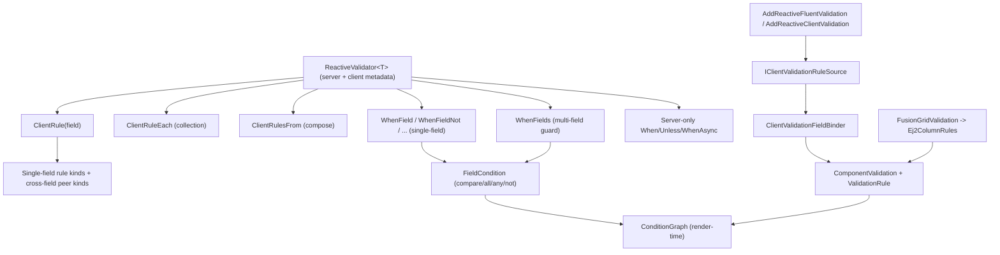

| Feature | Variants | DSL example | Domain types |
|---------|----------|-------------|--------------|
| ReactiveValidator&lt;T&gt; base class | `abstract class ReactiveValidator<T> : AbstractValidator<T>, IClientValidationMetadataSource where T : class`; server rules and client metadata in the same ctor; `GetClientRules()` returns `IReadOnlyList<ClientValidationField>` (single source for server + browser) | `public sealed class ResidentValidator : ReactiveValidator<ResidentModel> { public ResidentValidator() { ClientRule(m => m.Name).Required("Name is required"); } }` | `ReactiveValidator<T>`, `IClientValidationMetadataSource`, `ClientValidationRuleSet`, `ClientValidationField` |
| ClientRule(field) — declare a server+client rule for one field | `ClientRule<TValue>(Expression<Func<T,TValue>> field)` -> `ReactiveClientRuleBuilder<T,TValue>` (pairs `RuleFor` + client field rule); `ClientRule<TChild>(field, ReactiveValidator<TChild> validator)` (nested child: `SetValidator` server, `AddRulesFrom` with prefix client); `ClientRuleEach<TItem>(Expression<Func<T,IEnumerable<TItem>>> field)` -> `ReactiveClientCollectionRuleBuilder<T,TItem>` (`RuleForEach`) | `ClientRule(m => m.Email).Required("Required").Email("Bad email");` | `ReactiveClientRuleBuilder<TModel,TValue>`, `ReactiveClientCollectionRuleBuilder<TModel,TItem>`, `ClientValidationFieldRuleBuilder<TModel,TValue>`, `ClientValidationFieldToken<TModel,TValue>`, `ClientRuleActivation` |
| ClientRulesFrom — compose rules from another validator | `ClientRulesFrom(ReactiveValidator<T> validator)` (`Include` server + `AddRulesFrom` empty prefix); `ClientRulesFrom<TSource>(ReactiveValidator<TSource> validator)` (client-only from a different source, no server Include) | `ClientRulesFrom(new SharedContactRules());` | `ReactiveValidator<T>`, `ClientValidationRuleSet`, `ValidationFieldPath.Empty`, `ClientRuleActivation` |
| Single-field client rule kinds | `Required` (NotEmpty + `required`); `Empty` (`empty`); `Email` (string?, `email`); `Url` (`url`); `CreditCard` (`creditCard`); `AtLeastOne` (`atLeastOne`); `MinLength(int)` (`minLength`); `MaxLength(int)` (`maxLength`); `Regex(string)` (`regex`); `Range(low,high)` (`range`, struct+class); `ExclusiveRange(low,high)` (`exclusiveRange`, struct+class); `Min` (`min`, struct+class); `Max` (`max`, struct+class); `GreaterThanOrEqualTo` (`min`); `LessThanOrEqualTo` (`max`); `GreaterThan` (`gt`); `LessThan` (`lt`); `EqualTo(literal)` (`equalTo`); `NotEqual(literal)` (`notEqual`) | `ClientRule(m => m.Age).Range(0, 120, "0-120").GreaterThan(17, "Must be 18+");` | `ReactiveClientRules`, `ValidationRuleName`, `ValidationRuleOperand (None/Literal/Range)`, `ClientValidationLiteral`, `ValidationRangeBounds`, `Shape` |
| Cross-field (peer) client rule kinds | `EqualTo(Expression peerField)` (`equalTo` peer, server `Equal`); `NotEqualTo(peerField)` (`notEqualTo` peer); `GreaterThan(peerField)` (`gt` peer, struct+class); `GreaterThanOrEqualTo(peerField)` (`min` peer); `LessThan(peerField)` (`lt` peer); `LessThanOrEqualTo(peerField)` (`max` peer); field-rule-builder also accepts a pre-built `ClientValidationFieldToken<TModel,TValue>` peer overload per comparison | `ClientRule(m => m.ConfirmPassword).EqualTo(m => m.Password, "Passwords must match");` | `PeerFieldValidationRuleOperand`, `ClientValidationFieldReference`, `ValidationRuleExecution.WithPeer`, `ValidationPlanBinding.ResolvePeerValue`, `ValueExpression` |
| WhenField — declarative client-side conditional activation (single field) | `WhenField(Expression<Func<T,bool>>, defineRules)` (Truthy); `WhenFieldNot` (Falsy); `WhenField<TProp>(field, value, ...)` (Eq); `WhenFieldNot<TProp>(field, value, ...)` (Neq); `WhenFieldGt/Gte/Lt/Lte<TProp>(field, value, ...)`; `WhenFieldNull/NotNull<TProp>`; `WhenFieldEmpty/NotEmpty(Expression<Func<T,string?>>)`; `WhenFieldIn/NotIn<TProp>(field, TProp[], ...)`; `WhenFieldBetween<TProp>(field, low, high, ...)`; `WhenFieldContains/StartsWith/EndsWith/Matches(field, string, ...)`; `WhenFieldMinLength(field, int, ...)`; `WhenFieldArrayContains<TProp>(Expression<Func<T,IEnumerable<TProp>?>>, value, ...)`; each wraps `base.When(guard.ServerPredicate, defineRules)`; nested AND-composes via `FieldCondition.All` | `WhenField(m => m.IsVeteran, () => ClientRule(m => m.ServiceBranch).Required("Branch required"));` | `FieldStart<T,TProp>`, `FieldGuard<T>`, `FieldCondition (FieldCompare/FieldAll/FieldAny/FieldNot)`, `CompareOperator`, `FieldComparisonValue`, `ConditionalClientRuleActivation`, `ClientRuleActivation` |
| WhenFields — multi-field / composed guard condition | `WhenFields(Func<FieldConditionBuilder<T>,FieldGuard<T>> buildCondition, defineRules)`; `FieldConditionBuilder<T>.Field<TProp>(expr)` -> `FieldStart<T,TProp>` with full operator set (Truthy/Falsy/Eq/Neq/Gt/Gte/Lt/Lte/IsNull/NotNull/IsEmpty/NotEmpty/Contains/StartsWith/EndsWith/Matches/MinLength/In/NotIn/Between/ArrayContains); `FieldGuard<T>.And/Or/Not` mirrored to client `FieldCondition` and server predicate | `WhenFields(f => f.Field(m => m.Country).Eq("US").And(f.Field(m => m.Age).Gte(18)), () => ClientRule(m => m.Ssn).Required("SSN required"));` | `FieldConditionBuilder<T>`, `FieldStart<T,TProp>`, `FieldGuard<T>`, `FieldCondition`, `SelectedClientValidationField<TModel,TValue>`, `CompareOperator` |
| Server-only conditions — FluentValidation When/Unless rejecting ClientRule | `When(Func<T,bool>, action)` and `When(Func<T,ValidationContext<T>,bool>, action)` (server-only); `Unless(...)` (both overloads); `WhenAsync`/`UnlessAsync` (both overloads, async); calling `ClientRule` inside throws `InvalidOperationException` (use `WhenField`); `.Otherwise()` re-enters server-only scope | `WhenAsync(async (m, ct) => await repo.ExistsAsync(m.Email, ct), () => RuleFor(m => m.Email).Must(_ => false).WithMessage("Taken"));` | `IConditionBuilder`, `ServerOnlyConditionBuilder`, `ClientConditionScope (_serverOnlyDepth)`, `ClientRuleActivation` |
| App-level / non-FluentValidation client rules | `ClientValidationRulesBuilder<TModel>.Field<TValue>(Expression)` and `.Field(ClientValidationFieldToken)` -> `ClientValidationFieldRuleBuilder` (same rule surface, no server pairing); full rule set directly (Required/Empty/Email/Url/CreditCard/AtLeastOne/MinLength/MaxLength/Regex/Range/ExclusiveRange/Min/Max/GreaterThanOrEqualTo/LessThanOrEqualTo/GreaterThan/LessThan/EqualTo(literal|peer)/NotEqual/NotEqualTo(peer)); `.When(condition builder, define)` -> `ClientValidationConditionBuilder<TModel>.Field(...)` with full operators + And/Or/Not; combines via `ClientRuleActivation.Combine` | `services.AddReactiveClientValidation(b => b.Add<MyMeta, OrderModel>(r => r.Field(m => m.Qty).GreaterThan(0, "Must be positive")));` | `ClientValidationRulesBuilder<TModel>`, `ClientValidationFieldRuleBuilder<TModel,TValue>`, `ClientValidationConditionBuilder<TModel>`, `ClientValidationFieldConditionStart<TModel,TValue>`, `ClientValidationCondition<TModel>` |
| DI registration of validation metadata | `AddReactiveFluentValidation(b => b.Add<TValidator>() | .AddFromAssembly(asm) | .AddFromAssemblyContaining<T>())` (registers `IValidator` + `ReactiveValidatorClientMetadataProvider`, builds rules once per validator at startup); `AddReactiveClientValidation(b => b.Add<TSource,TModel>(define))` (`ConfiguredClientValidationMetadataProvider` keyed by source type); both `TryAddSingleton<IClientValidationRuleSource, ClientValidationRuleSource>`; `ClientValidationRuleSource` aggregates all providers + exposes `Ambient` for net48 | `services.AddReactiveFluentValidation(b => b.AddFromAssemblyContaining<ResidentValidator>());` | `ReactiveFluentValidationBuilder`, `ReactiveClientValidationBuilder`, `ClientValidationRuleSource`, `IClientValidationMetadataProvider`, `ReactiveValidatorClientMetadataProvider`, `ConfiguredClientValidationMetadataProvider`, `IClientValidationRuleSource` |
| Validate before request — wire form validation into the HTTP pipeline | `HttpRequestBuilder<TModel>.Validate<TValidationSource>(string formId)` records a `ClientValidationBeforeRequest` (source type + form container id); resolved at end of `Render()` into `ComponentValidation` via `ValidationJob` | `p.Post("/residents").Validate<ResidentValidator>("resident-form").Gather(...);` | `HttpRequestBuilder<TModel>`, `ClientValidationBeforeRequest`, `ValidationJob`, `ComponentId` |
| Render-time binding to plan domain | `ClientValidationFieldBinder` resolves each `ClientValidationField` to a registered input `ComponentRegistration`, else to a model-field `IdGenerator` id (`ModelFieldInput`); `ValidationFieldBinding.ToComponentValidation` builds `ComponentValidation.ForServerField(componentId, ReadValue, planRules, serverFieldName)`; `ValidationRule.ToPlanRule` -> `PlanModel.ValidationRule` with execution `WithoutTarget`/`WithConstraint(literal)`/`WithPeer(ValueExpression)`, activation Always or `When(ConditionGraph)`; collection item-field expansion via `RenderedItemFieldMatch`; shape mismatch / unknown peer or condition field throws | `(internal) binder.ResolveAll(field, ruleBinding) => ComponentValidation per registered/model field` | `ClientValidationFieldBinder`, `ValidationFieldBinding`, `ModelFieldInput`, `ValidationPlanBinding`, `FieldConditionPlanBinding`, `FieldComparisonTarget`, `PlanModel.ComponentValidation`, `PlanModel.ValidationRule`, `ValidationRuleExecution`, `ValidationRuleActivation`, `ConditionGraph` |
| Fusion EJ2 grid column validationRules emit | `FusionGridValidation.From<TValidator,TRow>(IClientValidationRuleSource)` -> `FusionGridFieldValidation<TRow>`; `.Field<TField>(Expression<Func<TRow,TField>>)` -> EJ2 `column.validationRules` (`{ rule: [value, message] }`) or null; `Ej2ColumnRules.From` emits only unconditional single-field rules with EJ2 equivalents (required/email/url -> [true,msg], minLength/maxLength -> [int,msg], regex -> [pattern,msg], min/max -> [value,msg], numeric range -> [[lo,hi],msg]); conditional/cross-field/exotic rules skipped (server-authoritative) | `new GridColumn { Field = "openTasks", EditType = "numericedit", ValidationRules = care.Field(r => r.OpenTasks) }` | `FusionGridValidation`, `FusionGridFieldValidation<TRow>`, `Ej2ColumnRules`, `ClientValidationField`, `ValidationRule (IsUnconditional/LiteralOperand/RangeOperand)` |

## Components

Components are browser objects with typed members. `Html.InputField(plan, m => m.Prop)`
wraps a model-bound field (label, content slot, error span) and chains a vendor
factory (`.NativeTextBox()`, `.FusionDropDownList()`). Vendor identity comes from
`IComponent.Vendor` (the only join key into `resolver.ts`); `IInputComponent.ValueMember`
is the gather/validation read member; `IAppLevelComponent.DefaultId` is the fixed
layout id. `p.Component<T>()` returns a typed `ComponentRef` that emits Set/Call
reactions or `Read`s into `TypedComponentSource`; `p.Element(id)` mutates raw DOM
elements. Each component is a self-contained 7-file vertical slice with zero
runtime changes.

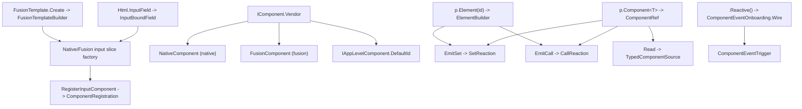

| Feature | Variants | DSL example | Domain types |
|---------|----------|-------------|--------------|
| Html.InputField — model-bound field wrapper | `InputField(plan, m => m.Prop)` (no label/required, `InputFieldConfiguration.Default`); `InputField(plan, m => m.Prop, o => o.Label("X").Required())` (configured); returns `InputBoundField<TModel,TProp>`; chain a component factory to fill the wrapper; wrapper emits div + optional label (required `*`) + content slot + `data-valmsg-for` error span; `Render()` throws if the chained component never called `RegisterInputComponent` | `Html.InputField(plan, m => m.Name, o => o.Required().Label("Name")).NativeTextBox(b => b.Placeholder("Enter name"));` | `InputBoundField<TModel,TProp>`, `InputBoundFieldBase<THelper,TModel,TProp>`, `BoundInputField<TModel,TProp>`, `InputFieldOptions`, `InputFieldConfiguration (Default/Configured)`, `InputFieldBuilder`, `InputFieldRenderScope`, `ModelBoundInputComponentSlot`, `InputComponentRenderTarget` |
| Vendor identity — IComponent / IInputComponent / IAppLevelComponent | `IComponent.Vendor` (NativeComponent => `native`, FusionComponent => `fusion`, only join key into resolver.ts); `IInputComponent.ValueMember` (JS gather + validation read, e.g. `value`, `checked`); `IAppLevelComponent.DefaultId` (fixed layout id); `NativeComponent` / `FusionComponent` abstract bases; a 3rd vendor only touches resolver.ts + resolution/event-{vendor}.ts | `public sealed class NativeTextBox : NativeComponent, IInputComponent { public string ValueMember => "value"; }` | `IComponent`, `IInputComponent`, `IAppLevelComponent`, `NativeComponent`, `FusionComponent`, `ComponentVendor` |
| Native input component slices (7-file vertical slice) | `NativeTextBox` (value, Type/CssClass/Placeholder, Changed); `NativeCheckBox` (checked); `NativeCheckList` (multi-select array); `NativeDropDown` (value, select); `NativeRadioGroup`; `NativeTextArea`; `NativeHiddenField`; each slice: Component.cs (`IInputComponent` + static Registration), Builder (renders `<input>` via `html.TextBoxFor`), HtmlExtensions (`.NativeXxx()` factory), ReactiveExtensions (`.Reactive()`), Extensions (SetValue/Read), Events + Events/*Args | `Html.InputField(plan, m => m.Email).NativeTextBox(b => b.Type("email").Reactive(plan, e => e.Changed, (a,p) => p.Element("status").SetText("changed")));` | `NativeTextBox`, `NativeCheckBox`, `NativeCheckList`, `NativeDropDown`, `NativeRadioGroup`, `NativeTextArea`, `NativeHiddenField`, `NativeTextBoxBuilder<TModel,TProp>`, `InputComponentRegistrationProfile`, `ComponentRegistration`, `RegisteredComponentIdentity`, `RegisteredInputBinding`, `ComponentKind` |
| Native non-input components | `NativeButton` (phantom type, `NativeButtonBuilder`, explicit elementId, no `IInputComponent`, reactive via `.Reactive(e => e.Click)`); `NativeActionLink` (special 4-file slice, no Component.cs/Events; `NativeActionLinkBuilder` renders `<a data-reactive-link=payloadJson>`, own IdGenerator + Serializer that bakes a pipeline into the link payload); `NativeButton(html, elementId, text)` takes explicit developer-chosen id | `Html.NativeButton("save-btn", "Save").Reactive(plan, e => e.Click, (a,p) => p.Component<FusionToast>().Success().Show());` | `NativeButton`, `NativeButtonBuilder<TModel>`, `NativeActionLinkBuilder<TModel>`, `NativeActionLinkIdGenerator`, `NativeActionLinkSerializer` |
| Fusion (Syncfusion EJ2) input component slices | `FusionDropDownList`, `FusionAutoComplete`, `FusionComboBox`, `FusionMultiColumnComboBox`, `FusionMultiSelect`, `FusionTextBox`, `FusionTextArea`, `FusionSmartTextArea`, `FusionInputMask`, `FusionOtpInput`, `FusionRichTextEditor`, `FusionNumericTextBox`, `FusionSlider`, `FusionRating`, `FusionDatePicker`, `FusionTimePicker`, `FusionDateTimePicker`, `FusionDateRangePicker`, `FusionCheckBox`, `FusionSwitch`, `FusionColorPicker`, `FusionDropDownTree`, `FusionFileUpload`, `FusionInPlaceEditor`; all `FusionComponent` + `IInputComponent`; HtmlExtension renders via `setup.Helper.EJS().XxxFor(expr).HtmlAttributes(id+name)` and registers; typed `.Fields<TItem>(t=>t.Text, v=>v.Value[, g=>g.Group])`; Extensions expose SetValue/SetText/SetDataSource (event/response/`TypedSource<T[]>` overloads) + DataBind/FocusIn/FocusOut/ShowPopup/HidePopup + Value() | `Html.InputField(plan, m => m.Country).FusionDropDownList(b => { b.Fields<Item>(t => t.Text, v => v.Value); b.Reactive(plan, e => e.Changed, (a,p) => p.Element("out").SetText("picked")); });` | `FusionDropDownList`, `FusionDatePicker`, `FusionNumericTextBox`, `FusionTextBox`, `FusionMultiSelect`, `FusionComponent`, `ComponentProperty<TValue>`, `ComponentMethod`, `Shape`, `PayloadSource`, `ResponseBody<T>`, `TypedSource<T[]>` |
| Fusion display/container component slices (events + methods, no form value) | `FusionGrid` (DataStateChange/server binding), `FusionAccordion`, `FusionTab`, `FusionDialog`, `FusionSidebar`, `FusionStepper`, `FusionToolbar`, `FusionMenu`, `FusionContextMenu`, `FusionBreadcrumb`, `FusionCarousel`, `FusionChipList`, `FusionListView`, `FusionListBox`, `FusionKanban`, `FusionPivotView`, `FusionTooltip`, `FusionMention`, `FusionAIAssistView`, `FusionBulletChart`, `FusionButton`, `FusionDropDownButton`, `FusionSplitButton`, `FusionProgressButton`, `FusionSmartPasteButton`, `FusionRadioButton`; all extend `FusionComponent` only (no `IInputComponent`); HtmlExtension takes explicit elementId, renders directly with no InputField wrapper / no input registration; events via `.Reactive()`, methods/props via `p.Component<T>("id")` | `Html.FusionGrid(plan, "residents-grid", b => b.DataSource(rows)).Reactive(plan, e => e.RowSelected, (a,p) => p.Element("detail").SetText(a, x => x.Name));` | `FusionGrid`, `FusionAccordion`, `FusionTab`, `FusionDialog`, `FusionSidebar`, `FusionButton`, `FusionGridBuilder<TModel>`, `FusionAccordionBuilder<TModel>`, `TypedEvent<TArgs>` |
| p.Component&lt;T&gt;() — typed component reference (ComponentRef) | `Component<T>(m => m.Prop)` (id from model expression via IdGenerator); `Component<T,TOtherModel>(m => m.Prop)` (cross-partial); `Component<T>("explicit-id")` (non-input/display); `Component<T>() where T:IAppLevelComponent` (layout singleton via DefaultId -> `LayoutObjectTarget`); `EmitSet(property,value)` => Set; `EmitCall(method[,args])` => Call; `Read(property)`/`Read<T>(method,args)` => `TypedComponentSource` | `p.Component<FusionDropDownList>(m => m.Country).SetValue("US").DataBind();` | `ComponentRef<TComponent,TModel>`, `ComponentObjectTarget (ObjectTarget/LayoutObjectTarget)`, `ComponentKey`, `ComponentSource`, `ComponentProperty<TValue>`, `ComponentMethod`, `ReactionGraph.Set`, `ReactionGraph.Call`, `TypedComponentSource<T>`, `MemberAccess`, `ObjectPropertyContract`, `ObjectMethodContract` |
| p.Element(id) — raw DOM element mutations | `AddClass/RemoveClass/ToggleClass(name)` (classList Call); `SetText(literal)` / `SetText(source, m=>m.Path)` / `SetText(ResponseBody<T>, path)` / `SetText(TypedSource<T>)` (textContent Set); `SetHtml(literal)` / `SetHtml(eventPayload, path)` / `SetHtml(TypedSource<T>)` (innerHTML Set); `Show()`/`Hide()` (hidden false/true); members via `BrowserElementMembers` (classAdd->classList.add, text->textContent, html->innerHTML, hidden) | `p.Element("status").AddClass("active").SetText("Saved");` | `ElementBuilder<TModel>`, `BrowserElementMembers`, `ComponentKey`, `ComponentSource`, `ReactionGraph.Set`, `ReactionGraph.Call`, `ComponentProperty<TValue>`, `ComponentMethod` |
| App-level components — layout singletons with fixed DOM id | `NativeDrawer` (id alis-drawer): Open/Close/SetSize(DrawerSize Sm/Md/Lg) + `Html.NativeDrawer()`; `NativeLoader` (id alis-loader): Show/Hide/SetTarget(id)/SetTimeout(ms) + `Html.NativeLoader()`; `FusionConfirm`: SetContent/Show/Hide + `Html.FusionConfirmDialog()`; `FusionToast`: SetTitle/SetContent/SetTimeout/ShowCloseButton/ShowProgressBar + Success/Warning/Danger/Info + Show/Hide + `Html.FusionToast()` (ToastPosition/ToastType); all `IAppLevelComponent` => `p.Component<T>()` with no expression | `p.Component<NativeDrawer>().SetSize(DrawerSize.Lg).Open();` | `NativeDrawer`, `NativeLoader`, `FusionConfirm`, `FusionToast`, `IAppLevelComponent`, `DrawerSize`, `DrawerPosition`, `ToastPosition`, `ToastType`, `ComponentRef<TComponent,TModel>`, `LayoutObjectTarget` |
| .Reactive() — component event wiring | Native: `builder.Reactive(plan, evt => evt.Changed, (args, p) => {...})` on `NativeXxxBuilder`; Fusion: `builder.Reactive(plan, evt => evt.Changed, (args, p) => {...})` on the EJ2 builder (componentId from `HtmlAttributes["id"]`); event selector returns `TypedEvent<TArgs>` from a sealed Events.Instance; always the last call in the chain; goes through `ComponentEventOnboarding.Wire` => `plan.Context.WireComponentEvent(id, vendor, jsEvent, reaction)` | `b.Reactive(plan, e => e.Changed, (args, p) => p.Component<FusionToast>().SetContent("saved").Show());` | `TypedEvent<TArgs>`, `NativeTextBoxEvents`, `FusionDropDownListEvents`, `ComponentEventOnboarding`, `PipelineBuilder<TModel>`, `ReactionGraph` |
| Typed Fusion templates (column/item template builder) | `FusionTemplate.Create<TModel>()` => `FusionTemplateBuilder<TModel>`; Id/Class/Attr; `Text(literal)` / `Text(m=>m.Prop)`; Span/Img/Badge/Icon/Link (literal + bound + css overloads); Div (nested); `Button(text,onClick[,css])`; `ButtonFor(text, m=>m.Id, fn[,css])`; `EventButton(text, eventName, m=>m.Id[,css])` (dispatches custom event with row id); `When(cond, then[, else])` / `ShowIf(cond, content)` (SF `${if}`/`${else}`); `Raw(html)`; `Render()` => HTML string | `FusionTemplate.Create<Item>().Span(m => m.Name, "font-bold").EventButton("Edit", "edit-row", m => m.Id);` | `FusionTemplateBuilder<TModel>`, `FusionTemplate`, `FusionConditionalBuilder<TModel>`, `FusionTemplateExpression`, `TemplateElements`, `TemplateElementId`, `TemplateCss`, `TemplateAltText`, `TemplateElseBranch<TModel>` |
| Input component registration profile (the join into the plan) | `InputComponentRegistrationProfile.For(component, componentTypeName)` (static per component); `.RegisterInputComponent(profile)` in the HtmlExtension => `slot.Register(profile)` => `ComponentRegistration.RegisteredInput(identity, binding, kind, valueShape)`; carries `RegisteredComponentIdentity` (id+vendor), `RegisteredInputBinding` (bindingPath + value MemberName), `ComponentKind`, value `Shape`; `ModelBoundInputComponentSlot.For<TModel,TProp>(expr, html.NameFor(expr))` is the deterministic join key | `setup.RegisterInputComponent(NativeTextBox.Registration); // inside .NativeTextBox()` | `InputComponentRegistrationProfile`, `ModelBoundInputComponentSlot`, `ComponentRegistration`, `RegisteredComponentIdentity`, `RegisteredInputBinding`, `ComponentKind`, `ComponentId`, `BindingPath`, `MemberName`, `Shape` |

## Slots & Plugins

Slots and plugins cover SSR/browser composition and the typed escape hatch.
`Html.ReactivePlan` / `Html.ResolvePlan` create root and same-model partial plans
that compose by `PlanId`; `PlanScope` (root/partial) selects boot-compose vs
slot-load. `p.Into(elementId)` injects an HTTP success body into a slot host.
Plugins are registered on the plan (`RegisterPlugin`, 3 overloads) and described by
a typed `ReactivePlugin` or a stringly `PluginTypeBuilder`; their function/property
reads (`p.Plugin<T>` / `p.PluginProperty<T>`) and command calls (`p.Plugin(...).Fire()`)
flow through the same `ValueExpression` path as everything else. App-level layout
singletons (Drawer, Loader, Toast, Confirm) are referenced via `p.Component<TAppLevel>()`.

```mermaid
flowchart TB
    Root["Html.ReactivePlan (root)"] --> Keys["PlanId / PlanScope composition keys"]
    Partial["Html.ResolvePlan (partial, merges by PlanId)"] --> Keys
    Render["RenderPlan / Render -> ReactivePlanSerializer"] --> Doc["PlanDocument (Version=3)"]
    Into["p.Into(elementId) -> InjectReaction (slot)"] --> Doc
    Reg["RegisterPlugin (3 overloads)"] --> Contract["PluginContract"]
    Reg --> Typed["ReactivePlugin (Function/Command/Property)"]
    Reg --> Stringly["PluginTypeBuilder (Method/Function/Void/Property)"]
    Read["p.Plugin&lt;T&gt; / p.PluginProperty&lt;T&gt;"] --> TPS["TypedPluginSource / TypedPluginPropertySource"]
    CallP["p.Plugin(...).Fire()"] --> CR["CallReaction on PluginSource"]
    Args[".Arg overloads"] --> PIA["PluginInvocationArgument -> ValueExpression"]
    App["p.Component&lt;TAppLevel&gt;()"] --> AppObj["Drawer / Loader / Toast / Confirm (LayoutObjectTarget)"]
    Link["Html.NativeActionLink"] --> Inline["inline-plan link payload"]
```

| Feature | Variants | DSL example | Domain types |
|---------|----------|-------------|--------------|
| Root plan creation (Html.ReactivePlan) | `html.ReactivePlan<TModel>()` (root-view, `RootViewPlanScope`, `RendersValidationSummary=true`); internal `new ReactivePlan<TModel>()` / `new ReactivePlan<TModel>(ReactivePlanScope)` used by factory only (constructors internal) | `var plan = Html.ReactivePlan<OrderModel>();` | `ReactivePlan<TModel>`, `ReactivePlanScope`, `RootViewPlanScope`, `PlanIdentity (Root)`, `PlanId`, `PlanBuildContext` |
| Same-model partial plan creation (Html.ResolvePlan) | `html.ResolvePlan<TModel>()` (partial-view, merges into the owning view's plan by shared PlanId, `PartialViewPlanScope`, `RendersValidationSummary=false`) | `var plan = Html.ResolvePlan<OrderModel>();` | `ReactivePlan<TModel>`, `ReactivePlanScope`, `PartialViewPlanScope`, `PlanIdentity (Partial)`, `PlanScope.Partial / PartialPlanScope` |
| Plan rendering / serialization (Html.RenderPlan + Render) | `html.RenderPlan(plan)` (emits `<script type=application/json data-reactive-plan id=alis-plan-{planId}>`; appends hidden validation-summary div only for root scope); `plan.Render()` (compact camelCase); `plan.Render(IServiceProvider)` (resolves validation source from DI); `plan.RenderFormatted()` / `RenderFormatted(IServiceProvider)` (indented); `plan.PlanId`; `plan.IsPartial` | `@Html.RenderPlan(plan)` | `PlanExtensions`, `ReactivePlanSerializer`, `PlanDocument (Version=3, PlanId, Scope, Types, Components, Behaviors)`, `PlanIdentity`, `PlanScope / RootPlanScope / PartialPlanScope` |
| Plan composition keys (PlanId / PlanScope / SlotId) | `PlanId.ForModel(type)` (full-type-name identity to compose root + same-model partials at boot); `PlanScope.Root ("root")` vs `PlanScope.Partial ("partial")` (selects boot-compose vs slot-load); Object Contract Merge / Component Merge (compatible declarations compose from boot + active slot sources, runtime side) | `// PlanId derived automatically: plan.PlanId == typeof(OrderModel).FullName` | `PlanId`, `PlanIdentity`, `PlanScope`, `RootPlanScope`, `PartialPlanScope`, `PlanDocument` |
| Partial slot injection (p.Into) | `p.Into(elementId)` (injects HTTP success response body as HTML into a host element/slot; declares element, reads whole success payload, emits `InjectReaction` kind="inject", target.slot); slot load/unload + active-plan recomposition are runtime-keyed by SlotId (no separate load/unload DSL verb in C#) | `p.Get("/orders/panel").Into("order-panel");` | `InjectReaction (Slot, Value)`, `ReactionGraph.Inject`, `ComponentKey`, `ValueExpression.ReadWholePayload`, `PayloadSource.Success` |
| Plugin registration on the plan (RegisterPlugin) | `plan.RegisterPlugin(string name, Action<PluginTypeBuilder>)` (stringly compatibility); `plan.RegisterPlugin(ReactivePlugin)` (typed instance); `plan.RegisterPlugin<TPlugin>() where TPlugin: ReactivePlugin, new()` (construct + register + return typed descriptor) | `var url = plan.RegisterPlugin<UrlPlugin>();` | `ReactivePlan<TModel>.RegisterPlugin`, `PluginTypeBuilder`, `ReactivePlugin`, `PluginContract`, `PlanBuildContext.RegisterPlugin`, `BrowserObjectContracts` |
| Typed plugin descriptor (ReactivePlugin base) | `Function<TReturn>(member)` / `Function<TReturn>()` (root) / `Function<TReturn>(member, Action<PluginArgumentTypes>)` / `Function<TReturn>(Action<...>)` (root); `Function<TReturn,TArg1>(member|root)` / `Function<TReturn,TArg1,TArg2>(member|root)` / `Function<TReturn,TArg1,TArg2,TArg3>(member|root)`; `Command(member)` / `Command()` (root) / `Command(member, Action<...>)` / `Command(Action<...>)` (root); `Command<TArg1>(member|root)` / `Command<TArg1,TArg2>(member|root)` / `Command<TArg1,TArg2,TArg3>(member|root)`; `Property<TValue>(member)`; `PluginFunction<TReturn>.Arg<TArg>()` / `.Args(...)` and `PluginCommand.Arg<TArg>()` / `.Args(...)`; `EnsureNoPropertyMethodCollision` | `class UrlPlugin : ReactivePlugin { public UrlPlugin():base("url"){ } public PluginFunction<string> Param = ...; }` | `ReactivePlugin`, `PluginOperation`, `PluginFunction<TReturn>`, `PluginCommand`, `PluginProperty<TValue>`, `PluginMemberDeclarations`, `PluginArgumentTypes`, `Shape`, `MethodSignature`, `MethodArgumentContract` |
| Stringly plugin contract builder (PluginTypeBuilder) | `Method<T>(name)` / `Method<TReturn>(name, Action<PluginArgumentTypes>)` / `Method<TReturn,TArg1>(name)` / `Method<TReturn,TArg1,TArg2>(name)` / `Method<TReturn,TArg1,TArg2,TArg3>(name)`; `Function<T>()` (root) / `Function<TReturn>(Action<...>)` / `Function<TReturn,TArg1>()` / `Function<TReturn,TArg1,TArg2>()` / `Function<TReturn,TArg1,TArg2,TArg3>()`; `Property<T>(name)`; `Void(name)` / `Void(name, Action<...>)` / `Void()` (root) / `Void(Action<...>)` / `Void<TArg1>(name|root)` / `Void<TArg1,TArg2>(name|root)` / `Void<TArg1,TArg2,TArg3>(name|root)`; `Command(name)` / `Command(name, Action<...>)` / `Command()` / `Command(Action<...>)` (alias for Void); `PluginArgumentTypes.Arg<T>()` | `plan.RegisterPlugin("url", p => p.Method<string>("getToken"));` | `PluginTypeBuilder`, `PluginArgumentTypes`, `PluginOperationContract`, `PluginPropertyContract`, `PluginOperationId`, `PluginPropertyId`, `MethodArgumentContract`, `MethodSignature`, `Shape` |
| Plugin function read (p.Plugin&lt;T&gt; value source) | `p.Plugin<T>(pluginName, member)` (member function return); `p.Plugin<T>(pluginName)` (root function return); `p.Plugin<T>(PluginFunction<T>)` (typed descriptor); returns `PluginReadBuilder<T,TModel>`; `.Arg(...)` chains; implicit conversion to `TypedPluginSource<T>` (no Build()) | `p.SetText(label, p.Plugin<string>("url", "getToken"));` | `PluginReadBuilder<TReturn,TModel>`, `TypedPluginSource<TProp>`, `PluginOperationId`, `PluginMethodRequirement.Function`, `ValueExpression.Invoke`, `PluginSource`, `PluginArguments` |
| Plugin property read (p.PluginProperty / p.Plugin property) | `p.PluginProperty<T>(pluginName, member)` (stringly property read); `p.Plugin<T>(PluginProperty<T>)` (typed property descriptor); returns `TypedPluginPropertySource<T>` | `p.When(p.PluginProperty<bool>("feature", "enabled")).Then(...);` | `TypedPluginPropertySource<TProp>`, `PluginPropertyId`, `PluginPropertyRequirement.Read`, `ValueExpression.Read`, `PluginSource` |
| Plugin command call (p.Plugin(...).Fire) | `p.Plugin(pluginName, member)` (void member command); `p.Plugin(pluginName)` (plugin root function as command); `p.Plugin(PluginCommand)` (typed command descriptor); returns `PluginCallBuilder<TModel>`; terminal `.Fire()` emits the call reaction | `p.Plugin("clipboard", "copy").Arg("hello").Fire();` | `PluginCallBuilder<TModel>`, `PluginOperationId`, `PluginMethodRequirement.Command`, `ReactionGraph.Call`, `CallReaction`, `PluginSource`, `PluginArguments` |
| Plugin invocation arguments (.Arg overloads) | `Arg<TResponse,TProp>(ResponseBody<TResponse>, Expression)` (response-body, success/error scope); `Arg<TArgs,TProp>(TArgs, Expression)` (event-args, FromEvent); `Arg<TArg>(TypedSource<TArg>)` (typed source); `Arg(string)` / `Arg(int)` / `Arg(bool)` / `Arg(long)` / `Arg(decimal)` / `Arg(double)` / `Arg(DateTime)` (literals); `ArgValue<TValue>(TValue)` (generic literal); on both `PluginCallBuilder` and `PluginReadBuilder`; arg shapes validated against `MethodArgumentContract` | `p.Plugin<string>("fmt","join").Arg(",").Arg(p.Read(grid)).Fire();` | `PluginInvocationArgument`, `PluginArguments`, `MethodArgumentContract`, `ValueExpression`, `Shape`, `ResponseBody<T>`, `PayloadSource.Event` |
| Plugin read in HTTP gather (Gather.Plugin) | `GatherBuilder.Plugin<T>(TypedPluginSource<T> source, string paramName)` (invoke/read plugin and assign result into the request payload before fetch) | `p.Post("/save").Gather(g => g.Plugin(p.Plugin<string>("auth","token"), "csrf"));` | `GatherBuilder<TModel>`, `TypedPluginSource<T>`, `RequestInputAssignment.Payload`, `BindingPath`, `ValueExpression` |
| App-level / layout object reference (p.Component&lt;TAppLevel&gt;) | `p.Component<TAppLevel>() where TAppLevel: IAppLevelComponent, new()` (fixed-id layout object target, role.kind="layout-object", using DefaultId + Vendor; no per-instance wiring or model binding); contrast `p.Component<TComponent>(expr)` / `<TComponent,TOtherModel>(expr)` / `<TComponent>(refId)` (model-bound or explicit-id) | `p.Component<NativeDrawer>().Open();` | `IAppLevelComponent`, `ComponentObjectTarget.ForLayout`, `LayoutObjectTarget`, `ComponentRef<TComponent,TModel>`, `PlanBuildContext.DeclareLayoutObject` |
| Native Drawer app-level object | `Html.NativeDrawer()` (render fixed-id `<aside>` in _Layout once); `Open()` (add visible class + remove aria-hidden); `Close()` (remove visible class); `SetSize(DrawerSize.Sm|Md|Lg)` (swap size class; `DrawerPosition` enum also defined) | `p.Component<NativeDrawer>().SetSize(DrawerSize.Lg).Open();` | `NativeDrawer (IAppLevelComponent)`, `NativeDrawerExtensions`, `DrawerSize`, `DrawerPosition`, `ComponentMethod`, `ValueExpression.Literal`, `ComponentRef` |
| Native Loader app-level object | `Html.NativeLoader()` (render fixed-id overlay in _Layout once); `Show()` / `Hide()` (toggle visible class + aria-hidden); `SetTarget(targetId)` (data-target covers a specific element); `SetTimeout(ms)` (data-timeout auto-hide) | `p.Component<NativeLoader>().SetTarget("grid").Show();` | `NativeLoader (IAppLevelComponent)`, `NativeLoaderExtensions`, `ComponentMethod`, `ValueExpression.Literal`, `ComponentRef` |
| Fusion Toast app-level object | `Html.FusionToast()` (render EJ2 Toast singleton in _Layout once); setters SetTitle / SetContent / SetTimeout(ms) / ShowCloseButton / ShowProgressBar; type convenience Success / Warning / Danger / Info (set e-toast-* cssClass); actions Show() (dataBind + show) / Hide(); `ToastPosition` and `ToastType` value types | `p.Component<FusionToast>().Success().SetContent("Saved").Show();` | `FusionToast (IAppLevelComponent)`, `FusionToastExtensions`, `ComponentProperty<T>`, `ComponentMethod`, `ToastPosition`, `ToastType`, `ValueExpression.Literal`, `ComponentRef` |
| Fusion Confirm app-level object | `Html.FusionConfirmDialog()` (render fixed-id dialog host in _Layout once); `SetContent(message)` (set content property + dataBind); `Show()` / `Hide()`; note confirm-as-guard (`p.Confirm(...).Then(...)`) lives in the conditions area — this slice is the imperative dialog object | `p.Component<FusionConfirm>().SetContent("Delete?").Show();` | `FusionConfirm (IAppLevelComponent)`, `FusionConfirmExtensions`, `ComponentProperty<string>`, `ComponentMethod`, `ValueExpression.Literal`, `ComponentRef` |
| Native ActionLink (inline-plan link) | `Html.NativeActionLink(linkText, url, Action<PipelineBuilder<TModel>>)` (renders `<a data-reactive-link=...>` whose payload is a self-contained inline plan executed on click); fluent `.CssClass(css)` / `.Attr(name, value)` (reserved id/href/data-reactive-link cannot be overridden; `class` attr routes to CssClass); id assigned by `NativeActionLinkIdGenerator.Next`; single-request constraint enforced by `NativeActionLinkSingleRequestAnalyzer` | `@Html.NativeActionLink("Delete", "/items/1", p => p.Delete("/items/1").Into("list"))` | `NativeActionLinkBuilder<TModel>`, `NativeActionLinkHtmlExtensions`, `NativeActionLinkSerializer`, `NativeActionLinkIdGenerator`, `PipelineBuilder<TModel>` |

## Domain Contract & Serialization

The domain contract is where every area converges. `PlanBuildContext.BuildPlan()`
snapshots a `PlanDocument` (Version 3) of identity, object contracts (Types),
components, and behaviors. `WriteOnlyPolymorphicConverter<T>` delegates each
abstract base to its concrete subtype so each subtype writes its own `kind`
discriminator; hand-written sibling converters cover the rest. `ReactivePlanSerializer`
emits the JSON into the `<script data-reactive-plan>` element.
`PlanTypeScriptContract` -> `PlanTypeGenerator` projects the same C# domain into
`runtime/types/plan.ts` as discriminated unions, kept in lockstep at version `3`.
`Shape`, `Path`, the `PlanString` value-object family, `PayloadContract`, and the
`CompareOperator` vocabulary are the cross-cutting contract types.

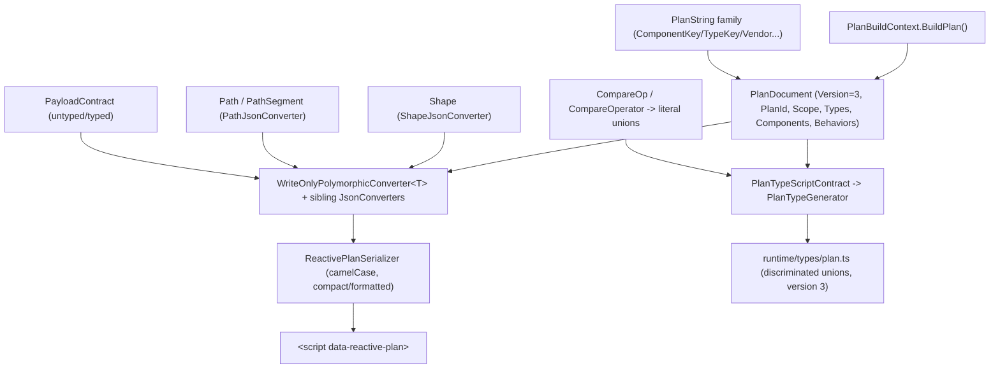

| Feature | Variants | DSL example | Domain types |
|---------|----------|-------------|--------------|
| PlanDocument (serialized plan root) | `Version => 3` (mirrored as TS `version: 3`); `PlanId => identity.PlanIdForJson` (camelCased to planId); `Scope => identity.ScopeForJson` (root | partial); `Types => IReadOnlyDictionary<string, BrowserObjectContract>`; `Components => IReadOnlyDictionary<string, ComponentObject>`; `Behaviors => IReadOnlyList<Behavior>`; built only by `PlanBuildContext.BuildPlan()` | `@Html.RenderPlan(plan)  // serializes the PlanDocument produced by plan.Render()` | `PlanDocument`, `PlanBuildContext`, `PlanIdentity`, `PlanScope` |
| PlanIdentity / PlanId / PlanScope (plan identity & merge scope) | `PlanId.ForModel(Type)` (uses `modelType.FullName`); `PlanId.Of(string)` (explicit); `PlanIdentity.Root(PlanId)` -> `RootPlanScope` ("root"); `PlanIdentity.Partial(PlanId)` -> `PartialPlanScope` ("partial", same planId merges in browser); `PlanScope` polymorphic abstract with Kind discriminator; Root/Partial are the two singletons | `var plan = Html.ReactivePlan<Order>();  // root scope, planId = Order.FullName` | `PlanIdentity`, `PlanId`, `PlanScope`, `RootPlanScope`, `PartialPlanScope` |
| WriteOnlyPolymorphicConverter&lt;T&gt; (kind-discriminated polymorphic serialization) | Write: delegates to `JsonSerializer.Serialize(writer, value, value.GetType(), options)` so each concrete subtype writes its own `kind`; Read: throws `NotSupportedException("Plan types are write-only.")`; registered on bases `Source`, `ReactionGraph`, `ConditionGraph`, `ValueExpression`, `StartsWhen`, `PlanScope`, `PayloadContract`, `ParallelCompletion`, `ServerPushEventFilter`, `ValueReadAccess`, `DispatchPayload(internal)`; hand-written siblings: `ShapeJsonConverter`, `PathJsonConverter`/`PathSegmentJsonConverter`, `BranchCaseJsonConverter`, `BranchGuardJsonConverter`, `CompareConditionJsonConverter`, `DispatchReactionJsonConverter`, `DispatchPayloadJsonConverter` | `[JsonConverter(typeof(WriteOnlyPolymorphicConverter<ReactionGraph>))] public abstract class ReactionGraph` | `WriteOnlyPolymorphicConverter<T>`, `Source`, `ReactionGraph`, `ConditionGraph`, `ValueExpression`, `StartsWhen`, `PlanScope`, `PayloadContract` |
| ReactivePlanSerializer (JSON emit + embed) | `Serialize(PlanDocument)` (compact JSON, `JsonNamingPolicy.CamelCase`); `SerializeFormatted(PlanDocument)` (indented, CamelCase); `RenderPlan<TModel>` embeds JSON in `<script type="application/json" id="alis-plan-{planId}" data-reactive-plan data-trace="trace">`; root view also emits `<div data-reactive-validation-summary hidden>` fallback, partials emit script only | `@Html.RenderPlan(plan)  // emits the <script data-reactive-plan> the runtime discovers` | `ReactivePlanSerializer`, `PlanDocument`, `PlanExtensions` |
| PlanTypeScriptContract -> PlanTypeGenerator -> runtime/types/plan.ts | `PlanTypeScriptContract.Render()` builds a `TypeScriptContract` and renders the full discriminated-union file; declaration builders `Interface(name).Requires/.Optional`, `Union(name, members...)`, `LiteralUnion(name, values)`, `Alias(name, type)`, `ComponentVariant(...)`; `Literal(value)` wraps a string as TS literal; `LiteralUnion` projects C# value-object `.Values` into a string-literal union; emit primitives `TypeScriptContract.GeneratedBy`, `TypeScriptInterface`, `TypeScriptProperty (Required/Optional)`, `TypeScriptTypeAlias`, `TypeScriptType (Single/Union)`, `TypeScriptWriter (Indent/Outdent/Line/BlankLine, CRLF->LF)`; `PlanTypeGenerator Program.Main(args)` writes to `args[0]` (default `Alis.Reactive.Assets/runtime/types/plan.ts`); invoked by npm `generate:plan-types`; output is `// <auto-generated />`, version literal `3` in lockstep with `PlanDocument.Version` | `npm run generate:plan-types -w Alis.Reactive.Assets  // C# plan domain -> runtime/types/plan.ts` | `PlanTypeScriptContract`, `TypeScriptContract`, `TypeScriptInterface`, `TypeScriptTypeAlias`, `TypeScriptType`, `TypeScriptWriter`, `PlanTypeGenerator.Program` |
| Shape (cross-cutting type contract value object) | scalar singletons String/Number/Boolean/Date/Raw/Any/None (kind discriminators); `ArrayOf(item)` -> `ArrayShape { item }` (rejects None); `ObjectOf(fields)` -> `ObjectShape { fields, additional:false }`; `OpenObject()` -> `ObjectShape { fields:{}, additional:true }`; `Nullable(inner)` -> `NullableShape { inner }` (rejects None); `FromClrType(Type)` (Nullable<T>, string, bool, Date types, numerics, Guid/TimeSpan/TimeOnly->string, enum->string, IEnumerable<T>->array, else Any); `FromValue(object?)` (None for null else FromClrType); `CollectionItemShapeOrNone(Type)`, `IsScalar`, structural Equals; `ShapeJsonConverter` (writes kind + nested item/inner/fields/additional) | `Shape.Nullable(Shape.ArrayOf(Shape.String))  // nullable<array<string>> type contract` | `Shape`, `ShapeStructure`, `ShapeObjectContract`, `ShapeJsonConverter` |
| Path / PathSegment (member navigation path) | `Path.None`, `Path.Property(name)`, `path.Then(name)`, `path.AtIndex(index)`; `Path.Parse(dotPath)` (splits on '.', numeric parts -> `IndexSegment` else `PropertySegment`, rejects empty); `PathSegment.Property(name)` -> `PropertyPathSegmentBody` ("property"); `PathSegment.AtIndex(index)` -> `IndexPathSegmentBody` ("index", non-negative `PathIndex`); `PathJsonConverter` writes a bare JSON array; TS `Path=PathSegment[]`, `EmptyPath=[]`, `StructuredPath=[PathSegment,...PathSegment[]]`; `Path.Overlaps`/`IsPrefixOf` for binding-path conflict detection | `Path.Parse("Address.Lines.0.City")  // [property, property, index, property]` | `Path`, `PathSegment`, `PathSegmentBody`, `PathIndex`, `PathJsonConverter`, `PathSegmentJsonConverter` |
| PlanString family (validated string value objects) | base `PlanString` (non-null + non-empty default, Allow for `RequestUrl`, value equality by Type+Value); `PlanId`, `ComponentId`, `ComponentKey`, `TypeKey` (NativeElement/ComponentObject/Plugin factories), `BindingPath` (carries parsed Path), `MemberName`, `ComponentKind`, `EventName`, `PluginName` (no-whitespace); `RequestUrl` (empty allowed), `HeaderName`, `RouteParameterName` ([a-zA-Z0-9_]), `ComponentVendor` (token regex; Native/Fusion singletons + From), `PayloadTypeName`; constrained enum-like with `.Values`: `MemberAccess` (read/write/readwrite + Widen), `HttpMethodName` (GET/POST/PUT/DELETE), `RequestBodyFormat` (json/form-data), `PayloadScope` (event/success/error/request/dispatch/local/element); non-PlanString value objects `MinimumTextLength` (>=0), `HttpResponseStatusCode` (100-599), `PathIndex` (>=0) | `ComponentVendor.From("fusion")  // validated vendor token value object` | `PlanString`, `ComponentKey`, `TypeKey`, `ComponentVendor`, `MemberAccess`, `HttpMethodName`, `RequestBodyFormat`, `PayloadScope` |
| PayloadContract (payload typing contract) | `PayloadContract.Untyped` -> `UntypedPayloadContract` ("untyped"); `PayloadContract.Named(string)` -> `NamedPayloadContract` ("typed", Type=name); `PayloadContract.ForPayload(Type)` -> `Named(type.FullName)`; `SameAs(other)` structural compare; `DisplayName`; polymorphic via `WriteOnlyPolymorphicConverter<PayloadContract>`; TS `PayloadContract = UntypedPayloadContract | TypedPayloadContract`; carried by events/triggers/dispatch/server-push/SignalR | `PayloadContract.ForPayload(typeof(OrderDto))  // typed payload contract on a dispatch/trigger` | `PayloadContract`, `UntypedPayloadContract`, `NamedPayloadContract`, `PayloadTypeName` |
| CompareOp / CompareOperator (operator vocabulary value object) | `CompareOp` string constants surfaced as `CompareOperator` singletons: Eq/Neq, Gt/Gte/Lt/Lte, Truthy/Falsy/IsNull/NotNull/IsEmpty/NotEmpty, In/NotIn, Between, Contains/StartsWith/EndsWith, Matches, MinLength, ArrayContains; categorized arrays the TS generator projects into literal unions: EqualityValues, OrderedValues, UnaryValues, MembershipValues, RangeValues, TextValues, RegexValues, TextLengthValues, CollectionItemValues; `CompareOperator.Values` (all) + `RequiresRightOperand` (false for unary); generated TS `CompareOp` literal union plus per-category unions driving the `CompareCondition` subfamily | `LiteralUnion("CompareOp", CompareOperator.Values)  // emits the TS operator union from the C# value object` | `CompareOp`, `CompareOperator` |

## End-to-end example

A realistic senior-living flow: when a care coordinator changes the resident's
care level, confirm the change, validate the form, POST it, and on success route
the billing total and a re-priced charge list back into the page. This single
authored pipeline crosses triggers, conditions (Confirm + When), HTTP gather,
response routing, set reactions, an array transform, and validation.

```csharp
// ResidentBilling.cshtml
@{
    var plan = Html.ReactivePlan<ResidentBillingModel>();
}

@Html.InputField(plan, m => m.CareLevel, o => o.Required().Label("Care Level"))
      .FusionDropDownList(b =>
      {
          b.Fields<CareLevelItem>(t => t.Text, v => v.Value);

          // 1. TRIGGER — component change event starts the pipeline
          b.Reactive(plan, e => e.Changed, (args, p) =>

              // 2. CONDITION (guard) — only proceed if a high-care level is chosen,
              //    then confirm the (billable) change with the coordinator
              p.When(args, e => e.Value).In("Memory", "Skilled")
               .Then(t =>
                   t.Confirm("Increase billing for this resident?")
                    .Then(c =>

                        // 3. HTTP — validate the form, then POST a gathered payload
                        c.Post("/api/billing/reprice")
                         .Validate<ResidentBillingValidator>("billing-form")
                         .Gather(g => g
                             .Include<FusionDropDownList, ResidentBillingModel>(m => m.CareLevel)
                             .RouteParam("residentId", residentIdSource)
                             .Header("X-Tenant", tenantSource))

                         // 4. RESPONSE ROUTE — success scope reads the typed body
                         .Response(r => r
                             .OnSuccess<RepriceResponse>((json, s) =>
                             {
                                 // 5a. SET — billing total from the response body
                                 s.Element("billing-total").SetText(json, x => x.MonthlyTotal);

                                 // 5b. ARRAY — re-priced charge list, filtered + bound
                                 //     to the grid with no second HTTP round-trip
                                 s.Component<FusionGrid>(m => m.Charges)
                                  .SetDataSource(
                                      p.From(json.Read(x => x.Charges))
                                       .Where(ch => ch.Amount > 0)
                                       .OrderByDescending(ch => ch.Amount)
                                       .AsSource());
                             })
                             .OnError(422, e =>
                                 // 5c. VALIDATION — render server-side errors in the form
                                 e.ValidationErrors("billing-form"))))));
      });

@Html.RenderPlan(plan)
```

```mermaid
sequenceDiagram
    participant DSL as Frozen DSL (cshtml)
    participant Dom as C# Plan Domain
    participant JSON as PlanDocument JSON
    participant RT as TS Runtime

    DSL->>Dom: b.Reactive(e => e.Changed, ...)
    Note over Dom: ComponentEventOnboarding.Wire -> ComponentEventTrigger + Behavior
    DSL->>Dom: p.When(args,e=>e.Value).In("Memory","Skilled")
    Note over Dom: CompareCondition (in) -> BranchReaction (BranchCase.Of)
    DSL->>Dom: .Confirm("Increase billing...").Then(...)
    Note over Dom: ConfirmCondition guard (async user decision)
    DSL->>Dom: c.Post(...).Validate(...).Gather(...)
    Note over Dom: RequestPlan + ContainerRequestValidationTarget + RequestPayloadTarget/RouteParam/Header (ValueExpression)
    DSL->>Dom: .Response(OnSuccess<RepriceResponse> / OnError(422))
    Note over Dom: ResponseRoute (any + exact 422) + ResponseBody.Read TypedSource
    DSL->>Dom: SetText + SetDataSource(From...Where...OrderByDescending.AsSource())
    Note over Dom: SetReaction + ArrayOperationExpression(filter,orderByDescending) + ShowValidationErrorsReaction
    Dom->>JSON: PlanBuildContext.BuildPlan() -> WriteOnlyPolymorphicConverter (kind discriminators)
    Note over JSON: behaviors[].startsWhen=component-event; reaction=branch->confirm->request->response->set/array-op/show-validation-errors
    JSON->>RT: <script data-reactive-plan> discovered + parsed
    Note over RT: PlanTypeGenerator types matched; executor runs sync lane, awaits confirm, fires HTTP async lane
    RT->>RT: on success: write billing-total, bind filtered/sorted charges to grid
    RT->>RT: on 422: render validation errors in billing-form
```

## Cohesion notes

These are places where concepts overlap, share machinery, or could unify. They
are observations from the area maps, not action items — the rule is still
"unify only when the DSL graph proves the overlap."

- **`ValueExpression` is the true center.** Conditions, HTTP gather/response,
  arrays, reactions, validation operands, plugin args, dispatch payloads, and
  component setters all read through the one `ValueExpression` + `Shape` path. No
  area should grow a second value resolver. This is the strongest existing
  cohesion and the load-bearing invariant to protect.

- **`CompareOperator` / `ConditionGraph` is shared three ways.** The conditions
  DSL, validation `WhenField`/`FieldCondition`, and per-element array predicates
  (`Where`/`Any`/`All`/`Count`/`Find` via `ElementExpressionCompiler`) all compile
  into the same comparison vocabulary and `ConditionGraph`. `FieldCondition`
  resolves into `ConditionGraph` at render time; it is effectively a symbolic
  pre-stage of the same graph. Worth watching that the validation field-condition
  tree and the runtime condition graph do not drift into two operator dialects.

- **`ParallelReaction` / `ParallelCompletion` is authored from two areas.** It is
  documented under both Reactions and HTTP. The same parallel node serves "N
  concurrent HTTP branches then OnAllSettled" and the general concurrent-steps
  case — one domain type, two DSL entry framings. Keep it one type.

- **`ResponseBody<T>.Read` and `PayloadTypedSource` blur HTTP and Conditions.**
  A response read is simultaneously an HTTP concept (success/error scope) and a
  condition/value source. The unifying type is `PayloadSource` scopes
  (event/success/error/request/dispatch/local/element) — every "where did this
  value come from" question collapses to a `PayloadScope`. This is good
  cohesion; the risk is documenting the same source three times in three areas.

- **Confirm appears as both a condition node and an app-level object.**
  `p.Confirm(...).Then(...)` is a `ConfirmCondition` guard (Conditions area),
  while `FusionConfirm` is an imperative `IAppLevelComponent` dialog
  (Slots & Plugins / Components). Same user-facing concept, two distinct domain
  paths (async guard vs. object method). The naming proximity is a documentation
  hazard worth a cross-reference, not a merge.

- **App-level objects are just components with a fixed id.** Drawer, Loader,
  Toast, and Confirm reuse `ComponentRef`, `ComponentProperty`/`ComponentMethod`,
  and `EmitSet`/`EmitCall` — they differ from model-bound components only by
  `IAppLevelComponent.DefaultId` and the `LayoutObjectTarget` role. The "app-level
  object" concept is a role on the component machinery, not a separate subsystem.

- **`Into` / partial slots / `NativeActionLink` are three injection shapes.**
  `p.Into` injects an HTTP success body into a slot; partial plans compose by
  `PlanId`; `NativeActionLink` bakes an inline plan into a link payload. All three
  are "deliver a reaction/HTML into the live document," keyed by ids
  (`SlotId`/`PlanId`/element id). They are distinct enough to stay separate, but
  share the composition-by-id mental model.

- **Plugins, `FromDom`, and `DomSource` are the documented escape hatches.** Each
  area that touches "values the deterministic DSL cannot express" funnels into
  the same three: plugin reads/calls, `p.FromDom`, and raw `DomSource`. They
  consistently still flow through `ValueExpression`, which keeps the escape hatch
  from becoming a second runtime. Their stringly boundary (`PluginName`, DOM
  `member`) is the intentional edge of typed authoring.

- **`Shape` and the `PlanString` family are the quiet contract spine.** Every
  area's domain types ultimately carry a `Shape` and validated `PlanString`
  identifiers (`ComponentKey`, `ComponentVendor`, `MemberName`, ...). They never
  appear in DSL examples but are present in nearly every domain-types column —
  the place where "what type is this value" and "what is this object's identity"
  are enforced once for the whole plan.
