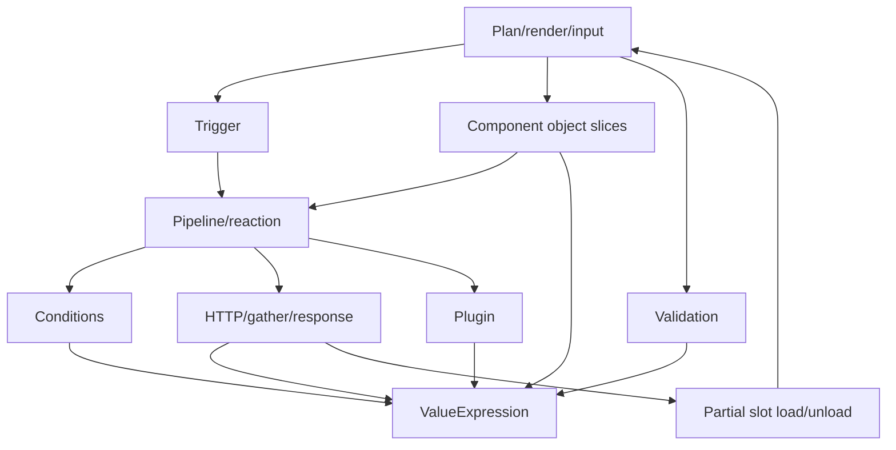

# DSL Graph Coverage Matrix

This file is the source inventory used to prove the structured design is not
based on memory. It classifies the public DSL method families from source into
graph modules and test-vector sets.

Current checkpoint: source inventory. Module diagrams and behavior matrices are
the next checkpoint. Runtime and plan implementation do not drive this file.

Core DSL inventory command:

```bash
rg -n "^\s*public .*\(" \
  Alis.Reactive/Builders \
  Alis.Reactive/Validation \
  Alis.Reactive.FluentValidator \
  Alis.Reactive/Razor/Extensions \
  Alis.Reactive/ReactivePlan.cs \
  Alis.Reactive/ReactivePlugin.cs \
  Alis.Reactive/ResponseBody.cs \
  Alis.Reactive/ComponentRef.cs \
  Alis.Reactive/ComponentMember.cs \
  -g '*.cs'
```

The current source scan returns 302 public method lines across the core DSL,
validation projection, plugin DSL, and plan/rendering DSL. Component vertical
slices are classified separately because they follow a repeated pattern:
render, typed property/method/value source, typed event/callback.

Component inventory command:

```bash
rg -n "^\s*public\s+[^=;]+\(" \
  Alis.Reactive.Native \
  Alis.Reactive.Fusion \
  -g '*.cs'
```

Native/Fusion component and template source returns 347 public method lines
across repeated vertical slices.

## Source-Derived Capability Inventory

| Capability group | Actual public DSL inputs from source | Domain concept that must exist |
| --- | --- | --- |
| Plan lifetime | `Html.ReactivePlan<TModel>()`, `Html.ResolvePlan<TModel>()`, `Html.RenderPlan(plan)`, `plan.Render()`, `plan.RenderFormatted()` | Plan document, plan identity, root scope, partial scope, rendered plan artifact |
| Plugin registration | `plan.RegisterPlugin(name, configure)`, `plan.RegisterPlugin(plugin)`, `plan.RegisterPlugin<TPlugin>()` | Browser plugin contract with typed properties, functions, commands |
| Input field slot | `Html.InputField(plan, expr)`, `Html.InputField(plan, expr, configure)` | Model-bound component slot, controlled component id, validation display slot |
| Trigger starts | `DomReady`, `CustomEvent`, `CustomEvent<TPayload>`, `ServerPush(url)`, `ServerPush(url,eventType)`, `ServerPush<TPayload>`, `SignalR`, `SignalR<TPayload>` | Trigger with optional event payload scope |
| Component trigger starts | Every component `Reactive(...)` extension, wired through `ComponentEventOnboarding.Wire` | Component event/callback trigger with typed event payload scope |
| Reaction sequence | Every pipeline call appends in authored order; `PipelineDraft` separates sync command segments from request/parallel/branch segments | Ordered reaction graph with sync lane and async request/parallel lane |
| Dispatch | `Dispatch(name)`, `Dispatch<TPayload>(name,payload)`, `DispatchWith<TPayload>(name, configure)` | Custom event reaction with no payload, literal payload, or runtime-built payload |
| Dispatch payload | `Set(field, TypedSource<T>)`, `Set(field,string)`, `Set(field,int)`, `Set(field,bool)` | Object value expression with typed leaves |
| DOM element object | `Element(id).AddClass/RemoveClass/ToggleClass`, `SetText`, `SetHtml`, `Show`, `Hide` | Browser object contract for DOM element properties and methods |
| Component object target | `Component<T>(expr)`, `Component<T,TOtherModel>(expr)`, `Component<T>(id)`, `Component<TApp>()` | Browser object target by controlled id, cross-model id, explicit id, layout/app-level id |
| URL source | `FromUrl(name)`, `FromUrl<T>(name)` | URL query value expression |
| Plugin read source | `Plugin<T>(plugin,member)`, `Plugin<T>(plugin)`, `Plugin<T>(PluginFunction<T>)`, `Plugin<T>(PluginProperty<T>)`, `PluginProperty<T>(plugin,member)` | Plugin property read and function value expression |
| Plugin command | `Plugin(plugin,member)`, `Plugin(plugin)`, `Plugin(PluginCommand).Arg(...).Fire()` | Plugin command reaction |
| Plugin arguments | `Arg(response,path)`, `Arg(event,path)`, `Arg(TypedSource<T>)`, scalar literals, `ArgValue<T>` | Ordered invocation argument list from value expressions |
| Validation display | `ValidationErrors(formId)` | Validation errors display reaction |
| Partial injection | `Into(elementId)` | Inject success body into partial slot; partial plan artifact must be loadable/unloadable |
| Conditions start | `When(event,path)`, `When(response,path)`, `When(TypedSource<T>)`, `Confirm(message)` | Condition graph with payload/object/url/plugin sources and confirm guard |
| Condition operators | `Eq/NotEq/Gt/Gte/Lt/Lte`, `Truthy/Falsy`, `IsNull/NotNull`, `IsEmpty/NotEmpty`, `In/NotIn`, `Between`, `Contains/StartsWith/EndsWith/Matches/MinLength`, `ArrayContains`, source-vs-source comparisons | Compare condition with unary, literal, array/range, text, collection-item, or source right operand |
| Condition composition | `And`, `Or`, nested `And(Func<ConditionStart,...>)`, nested `Or(...)`, `Not`, `Then`, `ElseIf`, `Else` | Branch graph preserving authored order and one default case |
| Request start | `Get`, `Post`, `Post(url,gather)`, `Put(url,gather)`, `Delete`, request builder `Get/Post/Put/Delete` | HTTP request plan with method and URL template |
| Request stages | `Gather`, `AsJson`, `AsFormData`, `WhileLoading`, `Finally`, `Validate<TValidationSource>`, `Response` | Request input projection, body format, before graph, complete graph, validation target, response routes |
| Gather targets | `IncludeAll`, `Static`, `FromEvent`, `Header`, `RouteParam`, `FromUrl`, `Plugin`, `Include(component)`, `Include(TypedComponentSource)`, `Include(source,param)` | Request input assignments to body/query payload, headers, and route params |
| Response routes | `OnSuccess`, `OnSuccess<T>`, `OnError`, `OnError(status)`, `OnError<T>`, `OnError<T>(status)`, `Chained` | Response match with success/error payload scope and optional follow-up request |
| Parallel requests | `Parallel(branches).OnAllSettled(pipeline)` | Concurrent request graph with all-settled completion graph |
| Response payload source | `ResponseBody<T>.Read(expr)` plus direct `SetText(response,path)` | Success/error payload value expression |
| Direct validation projection | `Field`, field rule methods, projection `When`, validation condition builders | Client validation projection with fields, rules, peer fields, and activation conditions |
| FluentValidation client projection | `ProjectToClient`, `ReactiveValidator.WhenField*`, `WhenFields`, server-only `When/Unless/WhenAsync/UnlessAsync` | Adapter that extracts only client-declared rules and client-declared conditions; async/server-only conditions stay server-only |
| App-level objects | `FusionToast`, `FusionConfirm`, `NativeDrawer`, `NativeLoader`, app-level `Component<TApp>()` | Layout browser object with fixed id and typed commands/properties |
| Native ActionLink | `NativeActionLinkBuilder`, serializer, HTML extension | Inline plan artifact carried in attributes for behavior that starts from a rendered link |
| Fusion templates | `FusionTemplate`, `FusionTemplateBuilder`, `FusionConditionalBuilder`, `EventButton`, `ShowIf`, template expression helpers | Vendor template authoring; does not change runtime plan graph except event/action hook payloads |

## Component Vertical Slice Inventory

The component slice pattern is deliberate and must stay isolated:

```text
render extension -> controlled component id -> object contract members
reactive extension -> typed event/callback payload -> behavior graph
component extensions -> typed property set/read and method call/read
```

| Slice family | Public method count from source | Domain graph role |
| --- | ---: | --- |
| `FusionSchedule` | 28 | Syncfusion object with many event callbacks, readable properties, method sources |
| `FusionInPlaceEditor` | 20 | Syncfusion object with edit events and command/property surface |
| `FusionAutoComplete` | 20 | Syncfusion object with filtering/change callbacks, data source mutation, value/text reads |
| `FusionDropDownList` | 17 | Syncfusion object with blur/change/focus events and value/data APIs |
| `NativeRadioGroup` | 16 | Native input object, typed values, options builder, changed event |
| `FusionMultiSelect` | 15 | Syncfusion multi-value object, filtering/change callbacks |
| `FusionMultiColumnComboBox` | 15 | Syncfusion combo object, change callback and data APIs |
| `NativeCheckList` | 14 | Native collection input object, changed event |
| `FusionNumericTextBox` | 12 | Syncfusion numeric object, value/min/focus/increment/decrement |
| `FusionToast` | 12 | App-level layout object with fixed id and command/property surface |
| `NativeDropDown` | 11 | Native input object, options builder, changed event |
| `FusionTooltip` | 11 | Syncfusion object with app-like open/close lifecycle callbacks |
| `FusionDialog` | 11 | Syncfusion object with open/close/overlay callbacks and commands |
| `NativeTextBox` | 10 | Native input object, value read/write, changed event |
| `NativeTextArea` | 10 | Native input object, value read/write, changed event |
| `FusionGrid` | 10 | Syncfusion grid object, data state callback, data source operations |
| `NativeHiddenField` | 8 | Native input object, hidden value read/write |
| `NativeCheckBox` | 8 | Native input object, checked value, changed event |
| `NativeButton` | 8 | Native action component with click event |
| `FusionTimePicker` | 7 | Syncfusion time input object |
| `FusionTab` | 7 | Syncfusion tab object and selected event |
| `FusionDateTimePicker` | 7 | Syncfusion date-time input object |
| `FusionDatePicker` | 7 | Syncfusion date input object |
| `FusionColorPicker` | 7 | Syncfusion color input object |
| `FusionRichTextEditor` | 6 | Syncfusion HTML/text value object |
| `FusionInputMask` | 6 | Syncfusion masked input object |
| `FusionDateRangePicker` | 6 | Syncfusion range object with start/end/value reads |
| `FusionAccordion` | 6 | Syncfusion accordion object and expanded event |
| `NativeActionLink` | 5 | Inline action link plan artifact |
| `NativeLoader` | 5 | App-level loader object |
| `FusionSwitch` | 5 | Syncfusion boolean input object |
| `NativeDrawer` | 4 | App-level drawer object |
| `FusionFileUpload` | 4 | Syncfusion upload object and selected event |
| `FusionConfirm` | 4 | App-level confirm dialog object |

Fusion template builders are classified outside the runtime plan graph because
they produce vendor template markup, not plan behavior, except where
`EventButton` creates an action hook.

## Module Classification

| Module | Source files | Public method lines | Graph nodes | Required vectors |
| --- | --- | ---: | --- | --- |
| Plan/render/input | `ReactivePlan.cs`, `Razor/Extensions/*.cs`, `InputField*` | 12+ | PlanDocument, PlanIdentity, PlanScope, RenderPlan, Controlled Component ID | T13, T14, T18 |
| Trigger | `TriggerBuilder.cs`, component `*ReactiveExtensions.cs` | 8 core + component slices | Trigger, EventScope, BehaviorGraph | T1, T2, T16 |
| Pipeline/reaction | `PipelineBuilder.cs`, `ElementBuilder.cs`, `DispatchPayloadBuilder.cs` | 36 | ReactionGraph, ValueExpression, BrowserObjectContract | T1, T2, T3, T15, T17 |
| Conditions | `PipelineBuilder.Conditions.cs`, `Builders/Conditions/*.cs` | 72 | ConditionGraph, BranchReaction, ValueExpression | T3, T4, T5 |
| HTTP/gather/response | `PipelineBuilder.Http.cs`, `Builders/Requests/*.cs`, `ResponseBody.cs` | 46+ | RequestPlan, RequestInputProjection, ResponseRoute, ParallelRequests | T6, T7, T8, T9, T10 |
| Validation projection | `Alis.Reactive/Validation/*.cs`, `Alis.Reactive.FluentValidator/*.cs` | 126 | ValidationProjection, ValidationCondition, FieldRule | T11, T12, T14 |
| Plugin | `ReactivePlugin.cs`, `PluginTypeBuilder.cs`, `PluginReadBuilder.cs`, `PluginCallBuilder.cs` | 52+ | PluginContract, PluginRead, PluginCall | T6, T17 |
| Component object slices | `Alis.Reactive.Native/**`, `Alis.Reactive.Fusion/**` extension/event files | many repeated slice methods | BrowserObjectContract, ComponentObject, ObjectProperty, ObjectMethod, ObjectEvent | T7, T15, T16 |

## Graph Module Dependencies



## Public Method Family Matrix

| Source family | Method families | Graph edge | Design artifact status |
| --- | --- | --- | --- |
| `PlanExtensions` | `ReactivePlan`, `ResolvePlan`, `RenderPlan` | plan DSL -> plan document -> JSON script | needs module design |
| `HtmlExtensions` | `On` | plan -> trigger builder | needs module design |
| `ReactivePlan` | plugin registration, render | plan -> plugin contract / JSON | needs module design |
| `TriggerBuilder` | page, document event, SSE, SignalR | trigger -> pipeline, optional event scope | blueprint vectors present, module design pending |
| component `.Reactive` | vendor events/callbacks | component event -> payload scope -> pipeline | component module design pending |
| `PipelineBuilder` | dispatch, dispatch with payload, element, component, URL source, plugin read/call, validation display, inject | pipeline -> reaction/value/object/partial | module design pending |
| `ElementBuilder` | class methods, text/html, show/hide | DOM object -> set/call reaction | module design pending |
| `DispatchPayloadBuilder` | source/literal field assignment | dispatch payload object <- value source | module design pending |
| `ConditionStart` / `PipelineBuilder.Conditions` | `When`, `Confirm` | pipeline -> condition graph | module design pending |
| `ConditionSourceBuilder` | compare, presence, membership, text, range, source-vs-source | condition source -> compare operands | module design pending |
| `GuardBuilder` / `BranchBuilder` | `And`, `Or`, `Not`, `Then`, `ElseIf`, `Else` | condition graph -> branch reaction | module design pending |
| `PipelineBuilder.Http` | request starters, parallel | pipeline -> request/parallel reaction | HTTP design present |
| `HttpRequestBuilder` | endpoint, gather, body format, validation, stages, response | request DSL -> request plan | HTTP design present |
| `GatherBuilder` / `GatherExtensions` | target/source assignments and all registered inputs | gather target <- value source | HTTP design present |
| `ResponseBuilder` / `ResponseBody` | success/error routes, response payload source, chained request | response -> payload scope/pipeline/follow-up | HTTP design present |
| `ParallelBuilder` | all-settled graph | parallel -> completion graph | HTTP design present |
| direct validation builders | field, rule, condition builders | validation DSL -> validation projection | needs module design |
| FluentValidation adapter/builders | client rule projection and client-known guards | validator source -> validation projection | needs module design |
| plugin builders | type registration, read args, call args | plugin DSL -> plugin contract/value/call | needs module design |
| component extensions | typed property/method/value source/event/render | component slice -> browser object contract | needs module design |

## Completeness Gates

Before a module is called closed:

1. Its source family row above must point to a module design document.
2. The module design document must include class, activity/flow, and
   input/output matrix diagrams/tables.
3. Every public method family in that module must map to at least one graph edge.
4. Every graph edge must map to at least one test vector.
5. Every test vector must have a behavior proof file and current test result.

If any row says `needs module design`, the overall rich-model goal is not done.
