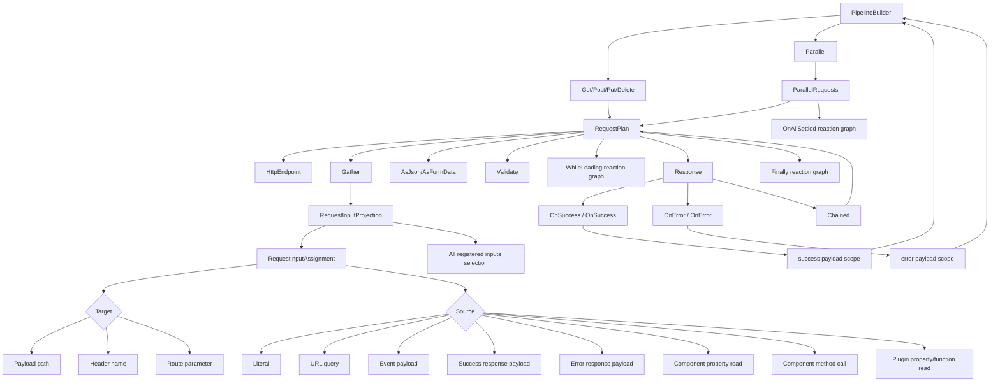
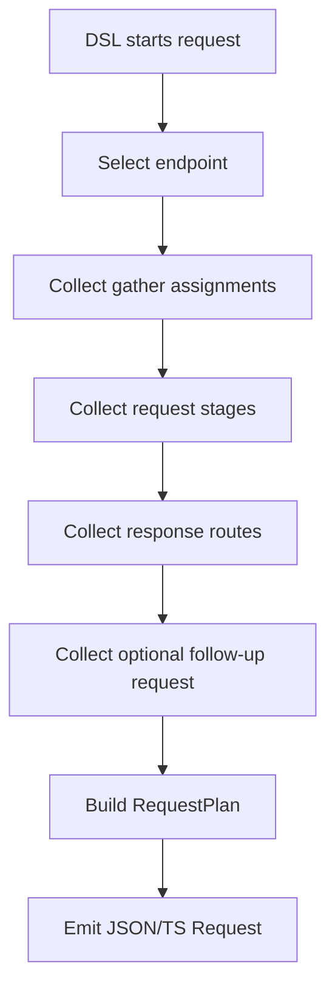
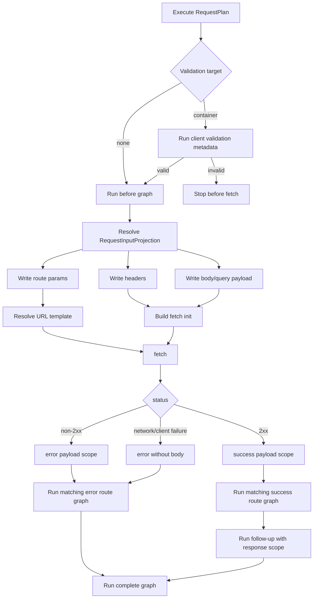

# HTTP, Gather, Response Structured Design

This document is a design test for the HTTP/Gather/Response module. It is
grounded in the public DSL source. Implementation changes in this module must
map to this graph and matrix before code is changed.

## Source Boundary

| Source file | Public DSL surface | Module role |
| --- | --- | --- |
| `Alis.Reactive/Builders/PipelineBuilder.Http.cs` | `Get`, `Post`, `Post(url,gather)`, `Put(url,gather)`, `Delete`, `Parallel` | creates request or parallel reaction nodes |
| `Alis.Reactive/Builders/Requests/HttpRequestBuilder.cs` | `Get`, `Post`, `Put`, `Delete`, `Gather`, `AsJson`, `AsFormData`, `WhileLoading`, `Finally`, `Validate`, `Response` | builds one `RequestPlan` |
| `Alis.Reactive/Builders/Requests/GatherBuilder.cs` | `IncludeAll`, `Static`, `FromEvent`, `Header`, `RouteParam`, `FromUrl`, `Plugin`, vendor `Include` bridge | builds `RequestInputProjection` |
| `Alis.Reactive/Builders/Requests/GatherExtensions.cs` | `Include<TComponent,TModel>(expr)`, `Include<TComponent,TModel>(id,name)`, `Include(TypedComponentSource)`, `Include(TypedComponentSource,param)` | component source gather DSL |
| `Alis.Reactive/Builders/Requests/ResponseBuilder.cs` | `OnSuccess`, `OnSuccess<T>`, `OnError`, `OnError(status)`, `OnError<T>`, `OnError<T>(status)`, `Chained` | builds response routes and follow-up request |
| `Alis.Reactive/Builders/Requests/ParallelBuilder.cs` | `OnAllSettled` | builds post-parallel reaction graph |
| `Alis.Reactive/ResponseBody.cs` | `Read(x => x.Property)` | typed response payload value source |

## Domain Class Design

```mermaid
classDiagram
    class RequestPlan {
        HttpEndpoint endpoint
        RequestInputProjection input
        RequestValidation validation
        ReactionGraph before
        ResponseRoute[] success
        ResponseRoute[] error
        ReactionGraph complete
        FollowUpRequest followUp
    }

    class RequestInputProjection {
        BodyFormat bodyFormat
        SourceSelection sourceSelection
        RequestInputAssignment[] assignments
    }

    class RequestInputAssignment {
        RequestInputTarget target
        ValueExpression source
    }

    class RequestInputTarget {
        PayloadTarget
        HeaderTarget
        RouteParameterTarget
    }

    class ValueExpression {
        Literal
        UrlRead
        PayloadRead
        ObjectPropertyRead
        ObjectMethodCall
        PluginRead
        ObjectValue
        ArrayValue
    }

    class ResponseRoute {
        ResponseStatusMatch match
        ReactionGraph reaction
        PayloadScope bodyScope
    }

    class ParallelRequests {
        RequestPlan[] branches
        ReactionGraph onAllSettled
    }

    RequestPlan --> RequestInputProjection
    RequestPlan --> ResponseRoute
    RequestPlan --> RequestPlan : followUp
    RequestInputProjection --> RequestInputAssignment
    RequestInputAssignment --> RequestInputTarget
    RequestInputAssignment --> ValueExpression
    ResponseRoute --> ReactionGraph
    ParallelRequests --> RequestPlan
```

## DSL Graph

## Request Build Activity

## Request Runtime Activity

## Input/Output Matrix

### Request Starters

| DSL input | Developer intent | Domain output | JSON/TS output | Runtime behavior |
| --- | --- | --- | --- | --- |
| `p.Get(url)` | create GET request reaction | `RequestPlan(endpoint: GET url)` | `Request.method="GET"` | fetch uses GET; gather payload becomes query |
| `p.Post(url)` | create POST request reaction | `RequestPlan(endpoint: POST url)` | `Request.method="POST"` | fetch uses POST; gather payload becomes body |
| `p.Post(url, gather)` | create POST and input projection inline | request plus projection | method plus `input.kind="gather"` | resolve input before fetch |
| `p.Put(url, gather)` | create PUT and input projection inline | request plus projection | method plus `input.kind="gather"` | resolve input before fetch |
| `p.Delete(url)` | create DELETE request reaction | `RequestPlan(endpoint: DELETE url)` | `Request.method="DELETE"` | fetch uses DELETE |
| `p.Parallel(a,b)` | run request branches concurrently | `ParallelRequests` | `reaction.kind="parallel"` | branches start concurrently |

### Gather Targets

| DSL target input | Developer intent | Domain output | JSON/TS output | Runtime behavior |
| --- | --- | --- | --- | --- |
| `Static(param,value)` | put literal into request payload | assignment to `PayloadTarget` | target kind `payload` | write body/query path |
| `FromEvent(args,path,param)` | put event payload value into request payload | assignment to `PayloadTarget` from event scope | payload target + `source.from.scope="event"` | read event detail path |
| `FromUrl(param)` | put URL query value into same request payload name | assignment to `PayloadTarget` from URL | payload target + source kind `url` | read `URLSearchParams` |
| `FromUrl<T>(param, asParam)` | typed URL query value into named payload path | assignment to `PayloadTarget` with shape | payload target + URL source shape | read and convert URL value |
| `Header(name,value)` | write literal HTTP header | assignment to `HeaderTarget` | target kind `header` | write header |
| `Header(name, source)` | write dynamic HTTP header | assignment to `HeaderTarget` from value source | header target + source | resolve scalar then write header |
| `RouteParam(name,value)` | substitute route template value | assignment to `RouteParameterTarget` | target kind `route-param` | URL placeholder substitution |
| `RouteParam(name, source)` | substitute dynamic route value | assignment to `RouteParameterTarget` from value source | route target + source | resolve scalar then substitute |
| `Plugin(source,param)` | put plugin result into payload | assignment to `PayloadTarget` from plugin value | payload target + plugin source | invoke/read plugin then write payload |
| `IncludeAll()` | include all mounted registered inputs | source selection all registered inputs | `sourceSelection.kind="all-registered-inputs"` | iterate current runtime plan mounted inputs |
| `Include(component expr/id)` | include component value member | assignment to `PayloadTarget` from component property | component read source | read component value |
| `Include(TypedComponentSource)` | include component property/method source | assignment to `PayloadTarget` from object member | component read/call source | read property or call method |

### Value Sources Allowed In Gather

| Source category | DSL source | Scope | Target compatibility |
| --- | --- | --- | --- |
| literal | static overloads | none | payload, header, route |
| URL | `p.FromUrl<T>`, `Gather.FromUrl<T>` | URL query | payload, header, route |
| event payload | `args, x => x.Prop` | `event` | payload, header, route |
| success payload | `json.Read(x => x.Prop)` inside `OnSuccess<T>` | `success` | payload, header, route when request is declared in success graph |
| error payload | `json.Read(x => x.Prop)` inside `OnError<T>` | `error` | payload, header, route when request is declared in error graph |
| component property | component `.Value()` and typed property sources | browser object | payload, header, route if scalar for header/route |
| component method | component method-return source such as `GetEvents()` | browser object | payload, header/route only if scalar |
| plugin property/function | `p.Plugin<T>`, `PluginProperty<T>` | plugin object | payload, header, route if scalar for header/route |

### Response Routes

| DSL input | Developer intent | Domain output | JSON/TS output | Runtime behavior |
| --- | --- | --- | --- | --- |
| `OnSuccess(p => ...)` | run reaction graph on any 2xx | success `ResponseRoute` without typed body | `success[] match any` | execute on 2xx |
| `OnSuccess<T>((json,p) => ...)` | typed success body available to graph | success route with success payload contract | success payload scope | read response body paths |
| `OnError(p => ...)` | run reaction graph on any error | error `ResponseRoute` | `error[] match any` | execute on non-2xx/network failure |
| `OnError(status,p => ...)` | run graph for exact HTTP status | error route exact status | `match.kind="status"` | choose exact status before any |
| `OnError<T>((json,p) => ...)` | typed error body available to graph | error route with error payload contract | error payload scope | read error body paths |
| `Chained(c => c.Get(...))` | run follow-up request after response route | `FollowUpRequest` | request chain/follow-up | execute after response route |

## Proof Matrix

| Vector | Required proof | Current proof file | Status |
| --- | --- | --- | --- |
| HGR-01 / T6 mixed targets and sources | projection plus runtime gather | `WhenGatherDslBuildsRequestInput.assignments_keep_the_authored_source_to_target_order`, `runtime/__tests__/gather.test.ts` | present, must stay green |
| HGR-02 / T7 component method gather | projection shows method access and return shape | `WhenGatherDslBuildsRequestInput.component_method_sources_are_projected_as_method_value_reads` | present, must stay green |
| HGR-03 / T8 success response drives follow-up request | projection, runtime, Playwright | projection test added; runtime test added; Playwright sandbox/test being wired | incomplete until Playwright passes |
| HGR-04 / T9 chained request | runtime plus Playwright for `Response.Chained` | `runtime/__tests__/http.test.ts`, HTTP section 3/13 Playwright | present, needs focused rerun |
| HGR-05 / T10 parallel requests | runtime plus Playwright for concurrent branches and all-settled | HTTP section 4 Playwright; runtime parallel behavior | needs focused rerun |

## Closure Gate

This module is closed only when:

1. HGR-01 through HGR-05 are green.
2. `npm run typecheck` passes after generated `plan.ts`.
3. Focused Playwright for route params, URL params, server loads, headers,
   content type, finally, and parallel passes using freshly built assets.
4. Tests that only protect removed helper shape are deleted or rewritten.
5. No request/gather/runtime code remains that invents fallback or preflight
   validation for framework-generated plans.
