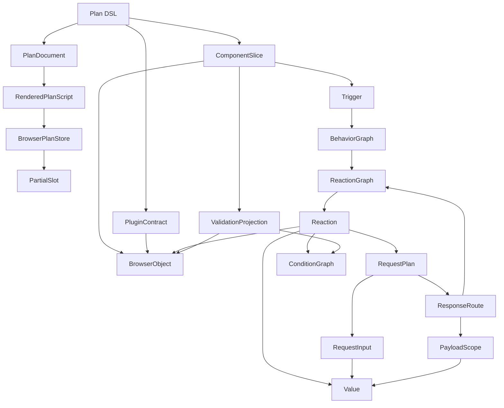
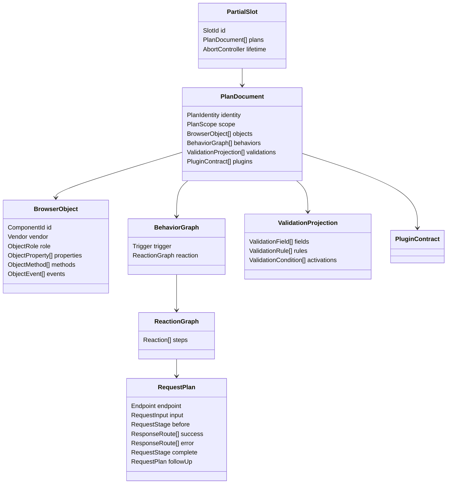
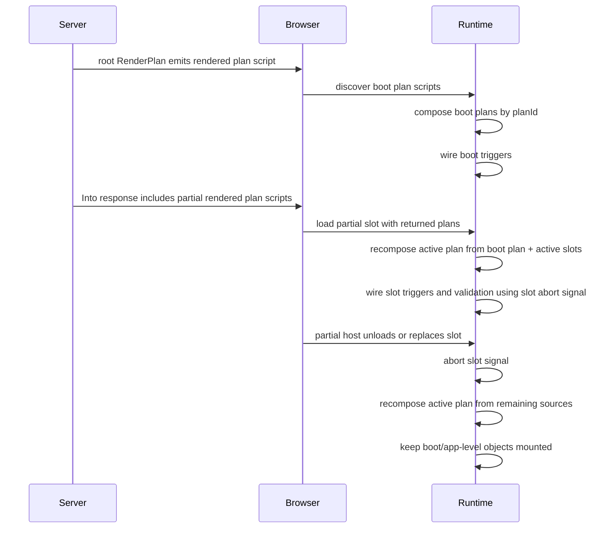
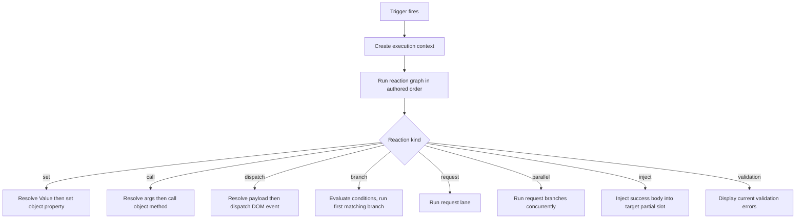
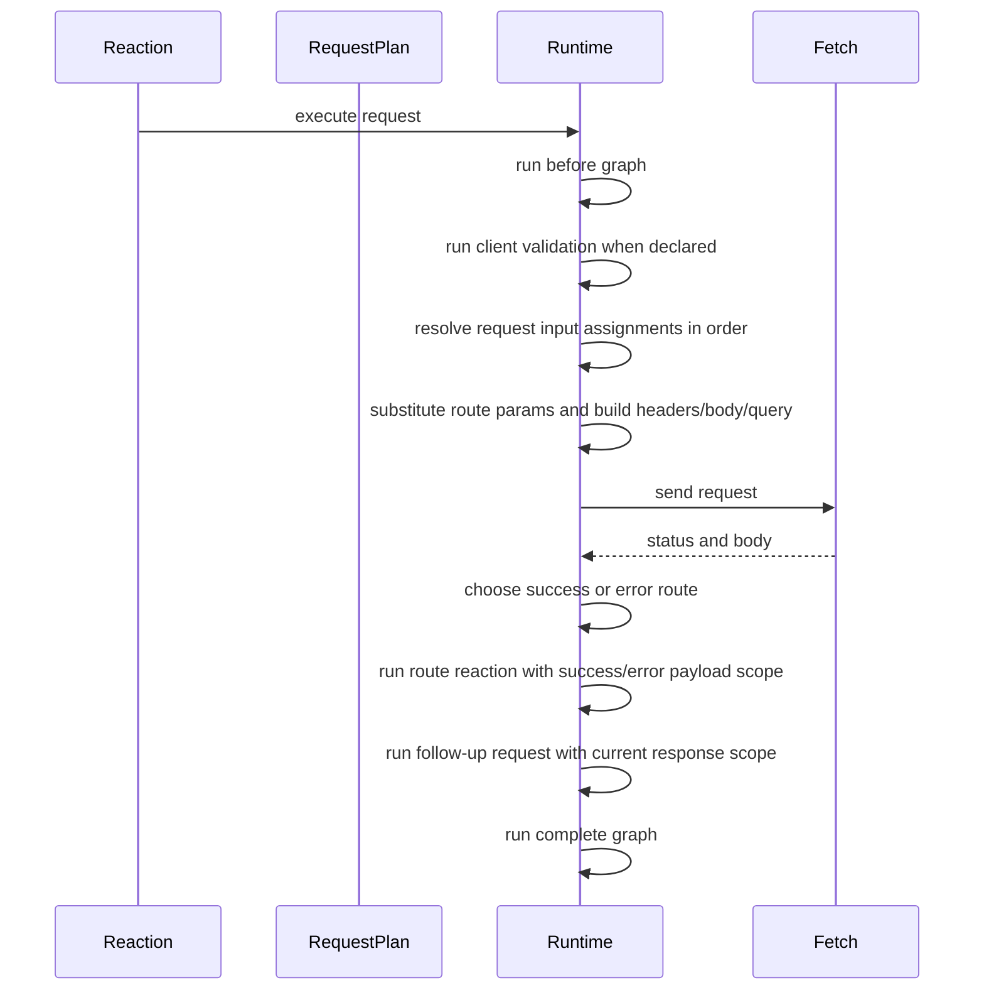
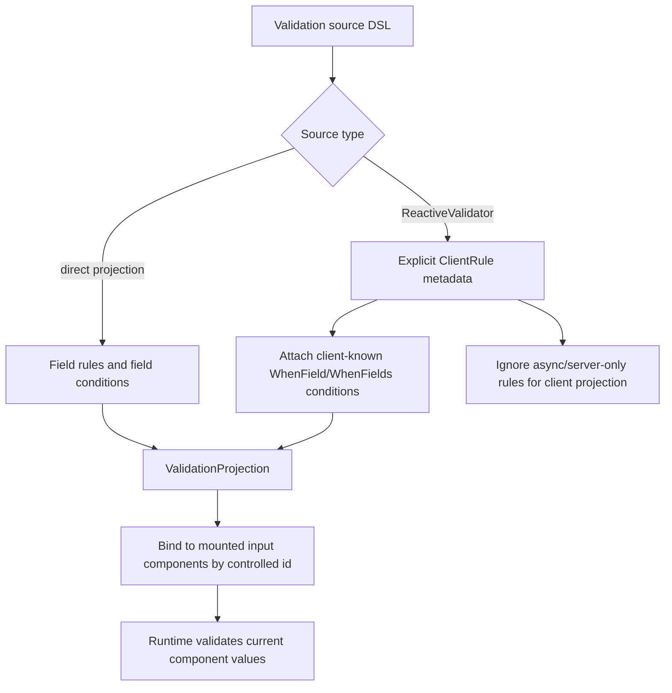
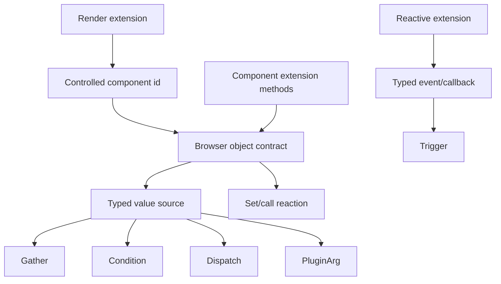
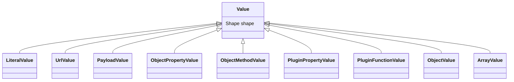

# Reactive Plan Domain Design

This design is sourced from the public DSL inventory in
`docs/design/dsl-graph-coverage-matrix.md`. The current runtime, old JSON
schema, and old unit-test helper shapes are not requirements.

The target flow is:

```text
typed cshtml DSL -> rich C# plan domain -> generated TS plan contract -> runtime executor
```

The runtime receives a generated plan and executes it. It does not validate
whether the server generated a possible shape.

## Domain Vocabulary

| Term | Meaning | Source driver |
| --- | --- | --- |
| `PlanDocument` | The deterministic behavior document emitted by a view or partial | `ReactivePlan`, `ResolvePlan`, `RenderPlan` |
| `RenderedPlanScript` | The JSON script emitted by `RenderPlan` and discovered during boot or injection | root view, partial view |
| `PartialSlot` | Browser lifetime for an `Into(...)` host; replacing or emptying the host unloads the previous slot plans | partial load/unload |
| `BehaviorGraph` | A trigger plus the reaction graph it starts | `Html.On`, trigger builders |
| `Trigger` | Browser start point, optionally with payload scope | page, custom event, SSE, SignalR, component event |
| `ReactionGraph` | Ordered deterministic work to perform | pipeline builders |
| `Reaction` | One executable unit: set, call, dispatch, branch, request, parallel, inject, validation display | pipeline methods |
| `Value` | A runtime value expression | literal, URL read, payload read, object read/call, plugin read/call, object, array |
| `BrowserObject` | A JS object known to the plan by id/vendor and typed members | components, DOM elements, plugins |
| `ObjectMember` | Typed property, method, or event/callback on a browser object | component slices, plugin contracts, element members |
| `RequestPlan` | One HTTP request, its input, stages, response routes, and follow-up | HTTP builders |
| `RequestInput` | Ordered assignments to payload, headers, route params, or all registered inputs | gather builders |
| `ResponseRoute` | Success or error handler with optional typed response body scope | response builders |
| `ValidationProjection` | Deterministic client rules for mounted input components | validation builders and FluentValidation projection |
| `PluginContract` | Explicit browser bridge for behavior not worth modeling as first-class DSL | plugin builders |
| `ComponentSlice` | One isolated Native/Fusion component onboarding surface | component folders |

## Source Coverage

Every row in this table is sourced from public DSL source. The domain model is
not allowed to introduce a concept that cannot be justified by one of these
rows, and implementation work is not allowed to skip one of these rows.

| Source family | Public DSL facts from source | Required design rows |
| --- | --- | --- |
| Plan/render/input | root plan, partial plan, render plan, validation summary only for root, model-bound input field slots | Plan/script/slot matrix |
| Trigger | page ready, document event, typed document event, SSE, typed SSE, SignalR, typed SignalR, component event/callback | Trigger matrix |
| Pipeline/reaction | dispatch, dispatch payload, element mutation, component object target, URL source, plugin read/command, validation display, success-body injection | Reaction/value matrix |
| Conditions | event/response/typed-source starts, confirm, unary/binary/text/range/membership/collection comparisons, nested all/any/not, then/elseif/else | Conditions matrix |
| HTTP/gather/response | request starts, body format, validation before request, before/finally graphs, gather target/source assignments, response routes, follow-up request, parallel all-settled | HTTP matrix |
| Validation | direct projection field rules, field conditions, rule activations, peer fields, FluentValidation explicit client projection, client-known guards, server-only guards | Validation matrix |
| Plugin | string registration, descriptor registration, property/function/command/root function/root command, exact/open argument contracts, read args and command args from literals/event/response/sources | Plugin matrix |
| Component slices | render, controlled ids, typed events/callbacks, typed property write/read, typed method call/read, app-level fixed ids, action-link inline plan | Component matrix |
| Fusion templates | template markup builders and event buttons | Component matrix; template markup itself stays outside runtime plan behavior |

## Module Graph



## Domain Class Shape



## Plan Slot Lifecycle



Fragment id is for load/unload ownership. Component id and vendor remain the
runtime join keys for JS object lookup.

## Reaction Flow



Sync reactions stay sync. Request, parallel, confirm, remote event delivery,
and injection introduce async boundaries.

## Request Flow



## Validation Flow



## Component Slice Flow



## Value Design



Every consumer accepts `Value` where the DSL exposes a typed source:
conditions, element mutations, dispatch payloads, gather assignments, request
headers, route params, plugin args, component method args, validation
conditions, and response handlers.

## Input/Output Matrix

### Plan, Fragment, Input Slot

| DSL input | Domain output | Runtime output |
| --- | --- | --- |
| `ReactivePlan<T>()` | `PlanDocument(scope=root, model id)` | root plan joins boot composition and owns validation summary |
| `ResolvePlan<T>()` | `PlanDocument(scope=partial, model id)` | partial plan joins SSR composition or a browser partial slot |
| `RenderPlan(plan)` | `RenderedPlanScript` JSON script | runtime discovers the plan during boot or injection |
| partial replacement/unload | `PartialSlot` source changes | runtime aborts slot wiring and recomposes from boot plan + active slots |
| `InputField(plan, expr)` | controlled model-bound component slot | component id binds validation and gather reads |
| `InputField(plan, expr, options)` | same plus label/required marker metadata | rendering concern, same plan slot |

### Trigger

| DSL input | Payload scope | Domain output | Runtime output |
| --- | --- | --- | --- |
| `DomReady(pipeline)` | none | page-ready `Trigger` | run behavior after boot |
| `CustomEvent(name,p)` | none | document event trigger | run on named DOM event |
| `CustomEvent<T>(name,(args,p))` | event payload shape | document event trigger with payload contract | read event detail paths |
| `ServerPush(url,p)` | event payload raw/none | SSE trigger | open EventSource and run on message |
| `ServerPush(url,type,p)` | event type filter | SSE trigger with event type | run only matching event type |
| `ServerPush<T>(url,type,(args,p))` | typed event payload | SSE trigger with payload contract | parse event payload and read paths |
| `SignalR(url,method,p)` | none | SignalR trigger | subscribe to hub method |
| `SignalR<T>(url,method,(args,p))` | typed hub payload | SignalR trigger with payload contract | read hub payload paths |
| component `Reactive` overload with `(args, pipeline)` | typed component event/callback payload | object event trigger | wire vendor event/callback to behavior |

### Reaction And Value Consumers

| DSL input | Value inputs | Domain output | Runtime output |
| --- | --- | --- | --- |
| `Element(id).SetText(literal)` | literal | set property reaction | set `textContent` |
| `SetText(args,path)` | event payload read | set property reaction | read event payload then set |
| `SetText(response,path)` | success/error payload read | set property reaction | read response payload then set |
| `SetText(TypedSource<T>)` | URL/component/plugin/response source | set property reaction | resolve value then set |
| `SetHtml` literal, event, and typed-source overloads | literal/event/source | set property reaction | set `innerHTML` |
| `AddClass/RemoveClass/ToggleClass` | literal class name | call method reaction | call DOM classList method |
| `Show/Hide` | literal bool | set hidden property | set `hidden` |
| `Component<T>(expr/id/app)` plus typed component extension methods | literals, typed sources, response payloads, event payloads, and component method args declared by the slice | component property set/read or method call/read reaction | resolve object by component id/vendor |
| `Dispatch(name)` | none | dispatch reaction | dispatch event |
| `Dispatch<T>(name,payload)` | literal object | typed dispatch reaction | dispatch event detail |
| `DispatchWith<T>.Set` literal and typed-source overloads | literal/source fields | object value payload | dispatch built detail |
| `ValidationErrors(formId)` | validation state | validation display reaction | show current errors |
| `Into(elementId)` | whole success payload | inject reaction | set HTML and load returned plans into the target partial slot |

### Conditions

| DSL input | Source input | Domain output | Runtime output |
| --- | --- | --- | --- |
| `When(args,path)` | event payload | compare/confirm condition root | evaluate against event scope |
| `When(json,path)` | success/error payload | compare condition root | evaluate against response scope |
| `When(TypedSource<T>)` | URL/component/plugin/response source | compare condition root | resolve source value |
| `.Eq/NotEq/Gt/Gte/Lt/Lte(literal)` | literal right operand | binary compare | compare values |
| `.Eq/NotEq/Gt/Gte/Lt/Lte(TypedSource<T>)` | source right operand | source-vs-source compare | resolve both values |
| `.Truthy/Falsy/IsNull/NotNull/IsEmpty/NotEmpty()` | none | unary compare | evaluate source |
| `.In/NotIn(values)` | literal array | membership compare | evaluate membership |
| `.Between(low,high)` | literal range | range compare | evaluate inclusive range |
| `.Contains/StartsWith/EndsWith/Matches/MinLength()` | text operand | text compare | evaluate text |
| `.ArrayContains(item)` | collection item | collection compare | evaluate array membership |
| `.And/.Or(source)` | next condition term | all/any condition | evaluate terms |
| `.And/.Or(inner => condition)` | nested expression | all/any condition | nested condition expression, flattened by domain |
| `.Not()` | prior condition | not condition | invert |
| `.Then(pipeline)` | reaction graph | branch case | run if guard matches |
| `.ElseIf(source).Then(pipeline)` | ordered guard | branch case | run first matching case |
| `.Else(pipeline)` | default | branch default case | run when no prior case matched |
| multiple condition blocks mixed with other pipeline calls | authored order | separate branch reactions inside sequence | preserve order with surrounding reactions |

### HTTP, Gather, Response, Parallel

| DSL input | Domain output | Runtime output |
| --- | --- | --- |
| `Get/Post/Put/Delete(url)` | request endpoint | fetch with method and URL template |
| `Post/Put(url,gather)` | endpoint plus request input | resolve gather before fetch |
| `Gather(gather)` | ordered request input assignments | body/query/header/route values are written in order |
| `AsJson/AsFormData` | request body format | JSON body or FormData body |
| `WhileLoading(pipeline)` | before reaction graph | run before fetch |
| `Finally(pipeline)` | complete reaction graph | run after success/error/network result |
| `Validate<T>(formId)` | validation target | run client validation before fetch |
| `IncludeAll()` | all registered input selection | read all mounted registered inputs |
| `Static(param,value)` | payload assignment from literal | write body/query payload path |
| `FromEvent(args,path,param)` | payload assignment from event scope | write event value |
| `Header(name,literal/source/event)` | header assignment | resolve scalar header |
| `RouteParam(name,literal/source/event)` | route assignment | substitute URL template placeholder |
| `FromUrl(name/asParam)` | payload assignment from URL | read URL query and write payload |
| `Plugin(source,param)` | payload assignment from plugin function | call plugin and write payload |
| `Include<TComponent>(expr/id)` | payload assignment from component value | read registered component value |
| `Include(TypedComponentSource)` | payload assignment from component property/method | read property or call method |
| `OnSuccess(p)` | success route | run on 2xx |
| `OnSuccess<T>((json,p))` | success route with payload scope | response body can feed values, gather, plugin args, conditions |
| `OnError(p)` | error route | run on non-2xx/network |
| `OnError(status,p)` | exact error route | run matching status first |
| `OnError<T>((json,p))` | error route with payload scope | error body can feed values, gather, plugin args, conditions |
| `Chained(request)` | follow-up request | run after response route using current response scope |
| `Parallel(branches)` | parallel request reaction | start branches concurrently |
| `OnAllSettled(p)` | completion reaction | run after every branch settles |

### Validation

| DSL input | Domain output | Runtime output |
| --- | --- | --- |
| direct `Field(expr).Required/Empty/Email/Url/CreditCard/AtLeastOne` | no-operand field rule | validate current field value |
| direct `MinLength/MaxLength/Regex` | literal rule operand | validate scalar operand |
| direct `Range/ExclusiveRange/Min/Max/Gt/Lt/EqualTo/NotEqual` | literal comparison rule | validate field against literal |
| direct peer comparisons | peer field operand | read peer component by controlled id |
| direct projection `When(condition, rules)` | rule activation condition | run enclosed rules only when condition true |
| validation condition `Field(expr)` plus typed condition operator | field condition | read mounted field component |
| validation condition `And/Or/Not` | composite condition | evaluate condition graph |
| `ReactiveValidator.ClientRule(...)` | explicit browser rule metadata | emit only declared client rule |
| Fluent `WhenField*` / `WhenFields` | client-known condition | emit activation condition |
| Fluent `When/Unless/WhenAsync/UnlessAsync` | server-only condition | server still runs; client projection skips or marks server-only |
| request `.Validate<TSource>(formId)` | validation job for source/container | validate container before request |

### Plugin

| DSL input | Domain output | Runtime output |
| --- | --- | --- |
| `RegisterPlugin(name,p => p.Property<T>(member))` | plugin property contract | runtime reads object property |
| `Method/Function<TReturn>` | plugin function contract | runtime calls function and uses return value |
| `Void/Command` | plugin command contract | runtime calls function as reaction |
| generic arg overloads and `PluginArgumentTypes.Arg<T>()` | argument shape contract | runtime resolves ordered args |
| descriptor-based `ReactivePlugin` | same contract without string member calls | typed C# plugin descriptor |
| `p.Plugin<T>` function overloads | plugin function value | value source for conditions, gather, dispatch, element, plugin args |
| `p.PluginProperty<T>` and descriptor property overloads | plugin property value | value source |
| `p.Plugin` command overloads followed by `Arg` overloads and `Fire()` | command reaction | invoke plugin side-effect bridge |

### Component Slice

| DSL input | Domain output | Runtime output |
| --- | --- | --- |
| component render extension | component object with controlled id/vendor | browser object available by id/vendor |
| component builder/options | render-time configuration only unless a reactive member is declared | no runtime plan behavior by itself |
| component `Reactive` extension | object event trigger | wire typed vendor event/callback |
| component setter extensions such as `SetValue`, `SetChecked`, `SetText`, `SetDataSource`, `SetTitle`, `SetContent`, `SetTimeout`, `SetSize`, `SetTarget` | property set reaction | set JS object property |
| component command extension | method call reaction | call JS object method |
| component value extension | typed component property source | read JS object property |
| component method-return extension | typed component method source | call JS object method and use return value |
| app-level component extension | layout object target with fixed id | call/read layout object |
| action link extension | inline plan payload in attributes | runtime executes the link click behavior |

### Component Source Facts

These rows come from `*Extensions.cs`, `*HtmlExtensions.cs`,
`*ReactiveExtensions.cs`, component builders, and event payload source files.

| Component family | Render DSL facts | Event/callback facts | Object member facts |
| --- | --- | --- | --- |
| Native text inputs | `NativeTextBox`, `NativeTextArea`, `HiddenFieldFor` render controlled inputs; builders expose `Type`, `Rows`, `CssClass`, `Placeholder` where supported | `Reactive` overload wires `NativeTextBoxChangeArgs`, `NativeTextAreaChangeArgs`, `NativeHiddenFieldChangeArgs` with `Value` | `SetValue`, `FocusIn`, `Value` |
| Native choice inputs | `NativeCheckBox`, `NativeDropDown`, `NativeRadioGroup`, `NativeCheckList`; builders expose items/options/placeholder/enabled/css | changed args expose `Checked`, `Value`, or `string[] Value` | `SetChecked` or `SetValue`, `FocusIn`, `Value` |
| Native button | `NativeButton`; builder exposes `Type`, `CssClass` | click args | `SetText`, `FocusIn` |
| Native app-level | `NativeDrawer`, `NativeLoader` render layout objects with fixed ids | no component trigger source | drawer `SetSize/Open/Close`; loader `SetTarget/SetTimeout/Show/Hide` |
| Native action link | `NativeActionLink(text,href,pipeline)` renders `data-reactive-link`; builder exposes `CssClass`, `Attr` except reserved attributes | click-started inline plan | exactly one request in reaction tree, no validation, no parallel, no chained request, href must match request URL; projected request keeps payload/all-registered-input gather only |
| Fusion simple inputs | color/date/date-time/time/input-mask/rich-text/switch/file upload render controlled Syncfusion inputs | changed/selected args expose typed values and `IsInteracted` where source has it | `SetValue`/`SetChecked`, focus methods, `Toggle`, `Value` |
| Fusion range input | `FusionDateRangePicker` render controlled range | changed args expose `StartDate`, `EndDate`, `DaySpan`, `IsInteracted` | `StartDate`, `EndDate`, `Value` typed sources |
| Fusion list inputs | auto-complete/dropdown/multi-column/multi-select render fields/data builders | changed args expose value; filtering args expose `Text`, `PreventDefault`, `UpdateData<TResponse>` | `SetValue`, `SetText`, `SetDataSource` from literal or response, `DataBind`, popup/focus methods, `Value` |
| Fusion grid | `FusionGrid` render builder | data-state-change args expose `Skip`, `Take`, `Sorted`, `Action` paging/sorting/filtering/searching/grouping details | `SetDataSource` from response/source, `Refresh` |
| Fusion schedule | `FusionSchedule` render builder | action/cell/data-bound/event/navigate/popup events expose typed schedule payloads; popup/event args include cancel/data helpers | `CurrentView`, `SelectedDate`, `GetEvents`, `SetDataSource`, `AddEvent`, `SaveEvent`, `DeleteEvent`, `OpenEditor`, `CloseEditor`, `RefreshEvents`, `Print`, `ScrollTo` |
| Fusion editor/dialog/tooltip/tab/accordion | render builders for each component | editor begin/action/end helpers can prevent default; dialog/tooltip before events expose `Cancel`; tab selected exposes indexes; accordion expanded exposes index/state | editor `SetValue/Enable/Disable/Save/Focus/AddClass/RemoveClass/Value`; dialog `Show/Hide/RefreshPosition`; tooltip `Open/Close/Refresh`; tab `Select/HideTab/SetSelectedItem`; accordion `ExpandItem/EnableItem` |
| Fusion app-level | `FusionToast`, `FusionConfirmDialog` render layout objects with fixed ids | confirm is an app-level object, not a component event source | toast `SetTitle/SetContent/SetTimeout/ShowCloseButton/ShowProgressBar/Success/Warning/Danger/Info/Show/Hide`; confirm `SetContent/Show/Hide` |
| Fusion templates | `FusionTemplate.Create`, template builders, `ShowIf`, `When`, `EventButton`, expression helpers | `EventButton` creates an action hook | template markup is render-time DSL; it does not add a new runtime plan primitive |

## Design Gates Per Module

| Module | Closed when |
| --- | --- |
| Plan/script/slot | root and SSR partial scripts compose by `planId`; browser partial slots load/unload by host id; component ids remain object lookup keys |
| Trigger/reaction | every trigger creates a behavior graph; authored order is preserved across sync commands, branches, requests, parallel, and injection |
| Value | every DSL source has one value representation and every consumer accepts it where source allows |
| Conditions | all source kinds, operators, compositions, else-if/default, and multiple mixed blocks work from the same condition graph |
| HTTP/gather/response | target/source matrix works for payload/header/route, response body can feed follow-up requests, parallel and chain work |
| Validation | direct and Fluent client projections produce same validation domain; server-only/async stays server-side |
| Plugin | plugin contract, reads, commands, args, properties, root functions, descriptors map to object members |
| Component slices | each slice only declares its own render/event/property/method surface; common plan primitives do the rest |
| Runtime/TS | generated TS contract matches C# domain; runtime executes without plan-shape defensive fallback |
