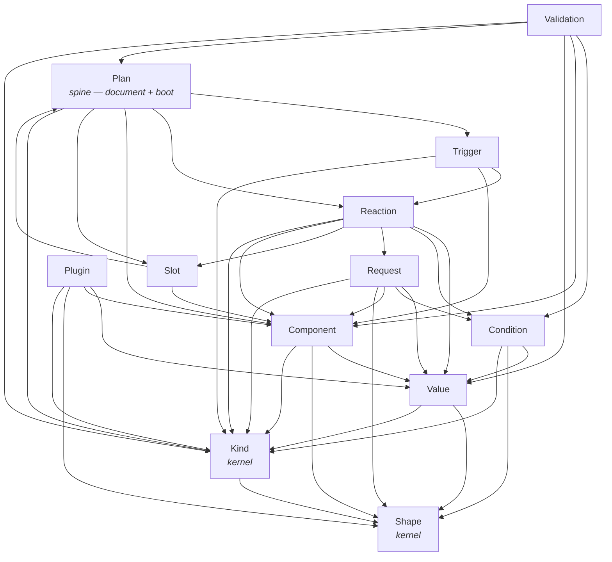
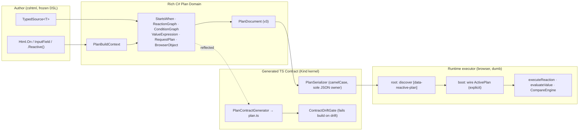

# Alis.Reactive — The New Design (Front Door)

> **What this is.** The single entry point to the fresh design. Read this first.
> It synthesizes the four working documents into one map:
> [`01-connectivity-graph.md`](./01-connectivity-graph.md) (the floor — the system
> as it is today), [`02-micro-modules.md`](./02-micro-modules.md) (the 12-module
> decomposition), [`03-naming.md`](./03-naming.md) (the plain-English names),
> [`04-matrix-*.md`](./04-matrix-triggers-reactions-conditions.md) (the
> determinism matrix), and [`05-determinism-proof.md`](./05-determinism-proof.md)
> (the coverage proof).
>
> **Audience.** A .NET developer who has never seen the codebase, and an LLM that
> must implement or extend it. Everything here is grounded in actual source; the
> prior `dsl-architecture-atlas.md` is *not* a source for this design.

---

## 1. Thesis + Key Factors

### The one job

The framework has exactly one job, expressed as one data flow:

```
Frozen DSL (cshtml)  ->  Rich C# Plan Domain  ->  Generated TS Contract  ->  Runtime executor (browser)
```

- **C# never executes browser behavior.** It serializes *intent* as a plan.
- **TypeScript never invents information the plan does not carry.** It executes the plan.
- The **plan is the only contract.** Everything else is machinery that produces it,
  shapes it, transports it, and runs it.

### What the baseline proved

The source-verified baseline ([`01`](./01-connectivity-graph.md)) found that the
system's **spines are right in meaning** — one value abstraction, one condition
graph, one shape, one `kind` discriminator, one plan document, one deterministic
component id. **The debt is in *form*, not intent:** a hand-authored 1,165-line TS
contract mirror with no drift gate, three competing serialization strategies, five
god-objects, magic string sentinels, runtime singletons, and naming collisions.

So the new design **preserves every spine's meaning** and **rebuilds the form**
around five factors.

### The five key factors

| Factor | What it means | How it shows up |
|---|---|---|
| **Cohesion** | One concept, one folder, end-to-end. A developer who wants conditions opens *one* place and sees `When/Then`, the `ConditionGraph` node, its wire shape, and the compare engine — never five files across four directories. | The 12-module vocabulary cut (§2). |
| **Simplicity** | Plain-English names a developer reads once and gets; no god-objects; one write path and one read path per spine. | The naming test (§2); the spine table (§3). |
| **Determinism** | One public DSL input lowers to exactly one plan-JSON shape and one browser behavior. The choice when the developer says nothing is the right one. | The matrix + proof (§4). |
| **Micro-modules** | 9 vocabulary concept-slices + 3 shared kernels. Acyclic, layered. A feature touches one author seam, one node family, one runtime reader. | The module map + dependency graph (§2). |
| **Good defaults** | The no-ceremony common case is the correct case. `payloadType: untyped`, `args: []`, ascending sort, body only when fields are present, `Else` last and only one. | The "Good default" column of every matrix row (§4). |

### The non-negotiable rules (carried from the root `CLAUDE.md`)

- **DSL -> Rich C# Plan Domain -> Generated TS Contract -> Runtime executor.** No layer skips.
- **The plan carries all info; the runtime is a dumb executor.** No fallbacks, no
  registries-as-control-flow, no defensive validators for framework-generated plans.
- **Invalid states are unrepresentable in C#, not defended in TS.** Magic sentinels
  become real variants; nullable+`[JsonIgnore]` pairs become per-op variants.
- **Boundary checks only at real edges:** DOM lookup, browser API, network, external JSON.
- **JSON-schema-as-contract is retired.** The contract is the C# plan domain plus
  the *generated* TypeScript plan types.
- **Sync stays sync; async only for real boundaries** (HTTP, parallel, confirm,
  remote trigger, partial injection) — and the lane is **carried in the plan**, not
  re-detected at runtime.
- **Value objects with invariants over null. Screaming domain names. Vertical
  slices (duplication over abstraction).**

---

## 2. The Micro-Module Map

**12 modules: 9 vocabulary concept-slices + 3 shared kernels.** Each slice carries
one DSL graph concept across all four layers — the fluent authoring surface, the
plan node family, its single wire shape, and the runtime executor — so a developer
reasons in domain vocabulary, not in layers. Three things every concept depends on
but none owns become thin kernels: **Shape**, **Kind**, **Plan**.

`→` is the C# authoring/plan side; `⇒` is the TS runtime side of the same concept.

| Module | Says what it does (plain English) | Owns (`→` author · `⇒` runtime) | Dissolves (from the baseline) |
|---|---|---|---|
| **Trigger** | When a behavior starts — page-ready, an event, a component callback, a server push. | `→` `Html.On` + `TriggerBuilder`; `StartsWhen` (symmetric); `Behavior`/`BehaviorGraph`. `⇒` `wireTrigger`; one `ExecutionContext`. | `Behavior`/`StartsWhen` internal-class/public-prop asymmetry; raw-vs-rich `ExecContext` double threading. |
| **Reaction** | What runs when a trigger fires — set, call, dispatch, inject, show errors, in order. | `→` thin command sink + `ElementBuilder` + `DispatchPayloadBuilder`; `ReactionPipelineDraft` that **stamps the lane**; `ReactionGraph`. `⇒` `executeReaction` (switch + `assertNever` on the carried lane). | `PipelineBuilder` god-builder (4 partials); `instanceof Promise` lane re-detection; `RequestReaction.Request`'s `new` hack. |
| **Condition** | The if/else-if/else decision over readable values; first match wins. | `→` `When/Confirm` + `GuardBuilder`/`BranchBuilder`/`ConditionContinuation`; `ConditionGraph`; the 21 `CompareOp` tokens as the single op-list. `⇒` ONE `CompareEngine`; `confirmThenEvaluate` wraps it async. | Dual divergent evaluators; `ValueEvaluator` DI threaded through 8 fns; `Standalone.Then` runtime throw. |
| **Value** | Every value the plan can read — a literal, a component member, a URL part, a payload field. | `→` `TypedSource<T>` (absorbs all source families); flat `ValueExpression` (`Literal`/`Read`/`ObjectValue`/`ArrayValue`/`ArrayOp`); `WholePayload`/`WholeElement` as real variants. `⇒` slim `evaluateValue` + separate `ArrayOpEngine`. | `ValueExpression.cs` god-facade + 4-type read indirection; `evaluate.ts` god-class; `responseBody`/`elementValue` sentinels; the gather-source hole. |
| **Request** | The HTTP call: gather the body, fetch, route success/error, chain, run in parallel. | `→` `HttpRequestBuilder` + `GatherBuilder`/`Include` + `ResponseBuilder` + `ParallelBuilder`; `RequestPlan` + `GatherAssignment` + `ResponseRouting`. `⇒` `http` pipeline (`gather` → `httpFetch` → route → finally → chain); ONE `RequestPayloadWriter`. | The 7-scope-onto-3-field fold; the dead `local` scope; FormData/File knowledge scattered across 3 modules. |
| **Component** | A browser object with an id, a vendor, a type, and a member contract. | `→` `IdGenerator` + `Html.InputField` + `ModelBoundInputComponentSlot` (the ONE id regime); `BrowserObject`/`ComponentRole`/`InputBinding`/`BrowserObjects`; `BrowserObjectContract` + `BrowserObjectId`. `⇒` `RuntimeComponents`/`RuntimeObject` (**memoized**); `ComponentDriver` + `wireFusionEvent`/`wireNativeEvent` (sole vendor seam). | `ComponentObject.cs` god-file (677 lines); `RuntimePlan` rebuilt per read; stale `resolver.ts` Rule-5 claim; `TypeKey` opaque string. |
| **Slot** | Compose plans: join by plan id on the server, load/unload partials by slot id in the browser. | `→` `PlanScope` (root vs partial). `⇒` `injectPartial` + `AppliedPlans` (snapshots + slots + abort); `recompose` builds a **new** `PlanDocument`; ONE `MergePolicy` shared with C#. | In-place `resetPlanDocument` mutation; the C# (replace) vs TS (append) merge divergence. |
| **Validation** | Client-side rules recorded for a field and run in the browser; the server stays the authority. | `→` `ReactiveValidator<T>` `ClientRule`/`WhenField`; `ValidationGraph` (own home); `ValidationRuleNode` (renamed); ONE `RuleName` source; ONE `RuleOperand`; real `CollectionItemBinding`. `⇒` orchestrator/ruleEngine/errorDisplay/liveClear reusing **Condition's `CompareEngine`**. | Validation tower buried in `ComponentObject.cs`; two `ValidationRule` types; three rule-name enumerations; substring path arithmetic. |
| **Plugin** | The typed escape hatch — declare a browser object the DSL does not model, then read/call it. | `→` ONE `Plugin` declaration API; ONE args-builder-first `PluginMemberBuilder`; `PluginContract`. `⇒` `PluginCatalog` (host instances; resolve throws at the real boundary). | Two parallel declaration APIs; ~95%-identical read/call builders; the arity-0..3 overload explosion (~30 methods). |
| **Shape** *(kernel)* | The structural type tag carried on every value, so the same bytes convert the same way everywhere. | `→` `Shape` + `ShapeStructure` + `ShapeContractCompatibility`. `⇒` `ShapeConverter` (one `applyShape`/`convertByShape`); the **shape-once** rule. | The 3 redundant re-shapings (evaluate / gather re-derive / `formatForWire`). |
| **Kind** *(kernel)* | The one discriminator that tells C# and TS apart which node this is, and generates the TS contract from it. | `→` ONE `PlanNodeDiscriminator`; `PlanContractGenerator` (reflects `plan.ts`); `PlanSerializer` (sole JSON owner); `ContractDriftGate`. `⇒` `assertNever`. | `WriteOnlyPolymorphicConverter` + 11 hand converters; the 1,165-line hand-authored `PlanTypeScriptContract`. |
| **Plan** *(spine)* | The document the slices write into and the runtime boots from — build, freeze, serialize, discover, boot. | `→` `PlanBuildContext` + `PlanDocument` (version=3) + `Html.ReactivePlan`/`ResolvePlan`/`RenderPlan`. `⇒` `root` discovery + `boot` with `ActivePlan` passed **explicitly**. | Hidden mutable `activeRuntimePlan` singleton; the 4 `reset*ForTests` functions; the boot↔browser-plans cycle. |

### Why these names (the naming test)

> **Read it cold.** Show the name alone to a .NET developer who has never seen this
> codebase. If they can say what it does in one breath and be right, the name passes.

This is why `ReactionPipelineDraft` beats `PipelineBuilder` (a "pipeline" of what?),
why `BrowserObjectId` beats `TypeKey` (a key for which type?), and why `IdGenerator`
survives unchanged. Names already doing their job are **not churned** — `Shape`,
`Kind`, `IdGenerator`, `PlanDocument`, `ConditionGraph`, `ReactionGraph`,
`ValueExpression`, `evaluateValue`, `assertNever` all survive. A name is renamed
**only when it lies, collides, or needs a paragraph.** Three named collisions are
resolved by names that announce *when the type lives and who writes it*:

| Collision (today) | Resolution (new design) |
|---|---|
| Two `ValidationRule` types (authoring + plan-model) | Developer writes a `ClientRule`; the plan carries a `ValidationRuleNode`. No two types share the name. |
| `RequestReaction.Request` declared with `new` to shadow a base member | The base no longer exposes a colliding `Request`; the `new` hack is deleted. |
| Stale `resolver.ts` "sole vendor seam" claim | The seam is named honestly: `ComponentDriver` + `wireFusionEvent`/`wireNativeEvent` are the only vendor-aware code. |

### The module-dependency graph (acyclic, layered)

The two kernels (**Shape**, **Kind**) sit at the bottom; **Plan** sits at the top
as the aggregate root that wires the concept-slices together. There are **no
cycles** — the boot↔browser-plans callback injection and the `sync-condition`
DI-threading are both removed by direct, layered dependence.



> **On the `Slot -> Plan` edge.** Slot composition recomposes a `PlanDocument`, so
> it depends on the document concept Plan owns — but Plan does **not** depend back on
> Slot. The runtime boot path reaches slot injection through the Reaction `inject`
> handler, never by Plan importing Slot. This is the layered replacement for today's
> boot↔browser-plans cycle: composition is a downward dependency on the document
> type, never an upward callback into boot.

---

## 3. The End-to-End Flow (Author → Domain → Contract → Runtime)

The same six spines run through all four layers. If a spine breaks, the system
breaks — so the new design preserves each spine's *meaning* while cleaning its
*form*. Trace any feature along these and you have traced the whole framework.



The six spines, end to end:

| Spine | Author (`→`) | Domain | Contract | Runtime (`⇒`) |
|---|---|---|---|---|
| **Value** — one write path, one read path | `TypedSource<T>` (all source families) | `ValueExpression` (flat 5-variant) | one `read`/`literal`/`object`/`array`/`arrayOp` node shape | `evaluateValue` (slim) + `ArrayOpEngine` |
| **Condition** — same value sources, one engine | `When/Then/ElseIf/Else`, 21 `CompareOp` | `ConditionGraph` (Compare/All/Any/Not/Confirm) | `condition` node | ONE `CompareEngine`; `confirmThenEvaluate` wraps async |
| **Shape** — structural type rides every value | `Shape.FromClrType` (CLR inference) | `Shape` on every value/operand/member | `shape` field on each node | `ShapeConverter`, **shaped once** on egress |
| **Kind** — the literal C#↔TS contract | a compile-enforced base writes `kind` | every polymorphic node carries `kind` | `PlanContractGenerator` reflects `plan.ts`; drift gate | every `switch` + `assertNever` |
| **Plan document** — build, freeze, transport | `PlanBuildContext` Declare/Wire verbs | immutable `PlanDocument` (v3) | `PlanSerializer` → `<script data-reactive-plan>` | `root` discovers → `boot` wires `ActivePlan` |
| **Component id** — one deterministic id | `IdGenerator` from model expression | `ModelBoundInputComponentSlot` / `BrowserObjectId` | `component` id in node | `getElementById` only (no DOM scanning) |

**The async lane is the seventh spine, and it is carried, not re-detected.**
`ReactionPipelineDraft` stamps a `ReactionLane` (`sync` | `async`) onto each node at
authoring time. `executeReaction` routes on that carried fact. Sync reactions stay
sync because the plan *says so* — the only async openers are Request, parallel,
confirm, remote trigger (ServerPush/SignalR delivery), and partial injection.

### One concrete trace (the value spine, fully)

`p.When(m => m.CareLevel).Eq("memory").Then(t => t.Element("billing").SetText(...))`

1. **Author** — `When(TypedSource<string>)` opens a `ConditionSourceBuilder`;
   `.Eq("memory")` picks the `Eq` `CompareOp`; `.Then(...)` routes a branch.
2. **Domain** — lowers to `ConditionGraph.Compare(Read(component "CareLevel"), Eq,
   Literal("memory"))` with `Shape.String` inferred from `string`; the `Then` body
   becomes a `ReactionGraph.Set` node; the whole thing is a `branch` reaction stamped
   `SYNC`.
3. **Contract** — `PlanSerializer` writes `{ "kind":"compare", "op":"eq",
   "left":{"kind":"read",...}, "right":{"kind":"literal","value":"memory",
   "shape":{"kind":"string"}} }`. `PlanContractGenerator` already emitted the
   matching TS union; `ContractDriftGate` proves they agree.
4. **Runtime** — `executeReaction` hits the `branch` case (SYNC), calls
   `evaluateCondition` → `CompareEngine` → `evaluateValue` reads the live component
   value via `RuntimeObject` (memoized, `getElementById` + `ComponentDriver`), shapes
   it once, compares, and on `true` runs the `Set`. No Promise, no fallback.

---

## 4. The Determinism Guarantee + How the Matrix Proves It

### The guarantee

> **One deterministic public DSL input, walked through the fixed micro-modules,
> produces exactly one plan-JSON shape and exactly one browser behavior — and the
> choice made when the developer says nothing is the right one.**

If that holds, **code generation is mechanical**: pick the case, fill the
parameters, emit the C# slice + wire node + runtime handler. Nothing in a row is a
judgement call.

### How the matrix proves it: parameterization

The matrix ([`04-matrix-*`](./04-matrix-triggers-reactions-conditions.md)) does not
list thousands of cases. It lists a **small number of lowering templates**, each
instantiated by a finite set of **axes**. A generated case is the tuple
`(template, axis values…)`; determinism holds because each tuple has exactly one
lowering and one runtime reader. The axes (all finite, all read from source):

| Axis | Finite domain | Used by |
|---|---|---|
| **TriggerKind** | `page-ready` · `document-event` · `component-event` · `server-push` · `signalr` | Trigger rows |
| **PayloadContract** | `untyped` · `typed(T)` | every trigger/dispatch carrying a payload |
| **ReactionKind** | `set` · `call` · `dispatch` · `branch` · `sequence` (+ `request`/`parallel`/`inject`/`show-validation-errors`) | Reaction rows |
| **ValueSource** | `literal` · `read(component\|url\|plugin\|payload\|dom)` · `whole-payload` · `whole-element` · `object` · `array` | every value slot |
| **Shape** | `string · number · boolean · date · nullable<scalar> · array<item> · object{fields} · raw · any · none` | every value, operand, member |
| **CompareOp** | the 21 tokens in 9 operand-shape families | Condition rows |
| **GuardComposition** | `single` · `all` · `any` · `not` | guard graph |
| **BranchPosition / Continuation** | `then`/`else-if`/`else`; `pipeline`/`branch`/`standalone` (**standalone is unrepresentable**) | first-match routing |

Each matrix row reads: **Feature/variant · Input (DSL) · Module interaction path
(`→` author, `⇒` runtime) · Output (exact camelCase plan JSON + browser behavior) ·
Good default.** One row = one self-contained proof.

### How the proof scores it

The proof ([`05`](./05-determinism-proof.md)) does **not** trust the matrix's own
counts. It enumerates the actual public DSL surface from source and maps each
feature to a matrix case **by name** (the repo's "Coverage Completeness Gate"). The
verdict, by named public feature family:

| Band | Families | Covered | Partial (deterministic, stale/misnamed) | True gap |
|---|---|---|---|---|
| Triggers | 10 | 10 | 0 | 0 |
| Reactions | 15 | 15 | 0 | 0 |
| Conditions | 15 | 15 | 0 | 0 |
| Values | 15 | 15 | 0 | 0 |
| HTTP | 28 | 28 | 0 | 0 |
| Arrays | 16 | 16 | 0 | 0 |
| Validation | 4 surfaces | 4 | 0 | 0 |
| Components | 4 | 4 | 0 | 0 |
| Slots | 4 | 4 | 0 | 0 |
| Plugins | 4 | 4 | 0 | 0 |
| App-level | 5 | 5 | 0 | 0 |

- **Clean deterministic coverage: 120/120 = 100%.**
- **Deterministic coverage (clean + partial): 120/120 = 100%.**
- **True gaps (no deterministic authoring row at all): 0/120 = 0%.**

### How the 100% was earned (not asserted)

The 100% is real because the matrix was corrected to close what were *completeness*
defects, never *non-determinism*. Each missing verb always had exactly one obvious
lowering; the matrix simply had not written the row:

1. **`p.Into(elementId)`** → `ReactionGraph.Inject(elementId,
   ReadWholePayload(Success))` — inject the HTTP success body as `innerHTML`. Now a
   dedicated `inject` row in the triggers-reactions-conditions matrix; the value is
   always the success whole-body (the right default). Band C now names the real
   `p.Into` verb and states that `InjectInto` does not exist in source.
2. **`p.ValidationErrors(formId)`** → `ReactionGraph.ShowValidationErrors(container)` —
   render accumulated errors in the named container. Now a dedicated
   `show-validation-errors` row; Band A4 no longer says "no new plan node" — it **is**
   a distinct node.
3. **Component count.** Band B1 now states the real **~60 slices** (51 Fusion + 9
   Native + 4 app-level), folding display/container components explicitly under the
   B2/B3/B4 generalization instead of implying 31 inputs.

With those edits landed and verified against source, the matrix is a true generator
spec. The thesis — *one input → one lowering → one reader, so generation is
mechanical* — **holds for all 120 public feature families** and is the design's
strongest property.

---

## 5. How to Add a Feature in the New Design (Mechanical Walkthrough)

Because every feature is one matrix row, adding one is mechanical. The work touches
**one author seam, one node family, one runtime reader** — never a god-object. The
worked example: a `toggle-class` reaction verb.

### Step 0 — Write the matrix row first

Before any code, fill one row in the right band. This *is* the design:

> **Feature:** `p.Element(id).ToggleClass(name)` · **Input:** the DSL call ·
> **Module path:** `Reaction → ElementBuilder` emits a `call` node on the element
> object; `Reaction ⇒ executeReaction` `call` case toggles the class ·
> **Output:** `{ "kind":"call", "target":{...}, "member":"classList.toggle",
> "args":[{"kind":"literal","value":"<name>","shape":{"kind":"string"}}] }`;
> browser toggles the CSS class · **Good default:** none needed (name required).

If the row cannot be written from source, **stop and read more source** — the
design is not clear enough yet.

### Step 1–4 — Lower through the layers (each step is one module)

| Step | Module | What you do | Why it is mechanical |
|---|---|---|---|
| **1. Author** | the slice (here **Reaction** / `ElementBuilder`) | Add the one fluent method; it emits an existing node variant (or a new sealed node with an `internal` ctor + a base-written `Kind`). | The author seam is one focused builder, not a 4-partial god-builder. |
| **2. Node** | the same slice's node family | Add the variant to `ReactionGraph` if genuinely new; otherwise reuse `call`. Carry `Shape` on any value; let `ReactionPipelineDraft` **stamp the lane** (`SYNC` here). | Invalid states are unrepresentable — you cannot emit a node without its `kind` and `shape`. |
| **3. Contract** | **Kind** kernel | Do nothing by hand. `PlanContractGenerator` **reflects** the node into `plan.ts`; `ContractDriftGate` fails the build if you forgot. | No hand-authored mirror to keep in sync — the contract is generated. |
| **4. Runtime** | the same slice's reader | Add the `switch` case in `executeReaction` (or none, if reusing `call`). `assertNever` proves exhaustiveness; route on the **carried lane**, never `instanceof Promise`. | One reader per lowerer; the compiler forces you to handle the new `kind`. |

### Step 5 — Prove the boundary

- **C# domain test** — the DSL call produces the expected node (one write path).
- **TS runtime test** — `evaluateValue`/`executeReaction` produces the behavior
  (one read path), in jsdom.
- **`npm run typecheck`** — confirms the generated `plan.ts` agrees (drift gate).
- **Playwright** — the user-visible behavior, against freshly built runtime assets.
- **Sandbox view** — demonstrate the verb.

### Why this stays mechanical at scale

- **Cohesion** keeps the feature in one folder, so the diff is small and readable.
- **The kernels do the cross-cutting work for you** — `Shape` rides the value,
  `Kind` generates the contract and proves exhaustiveness, `Plan` transports it.
- **Good defaults** mean most features add *zero* configuration surface.
- **No god-objects** means adding a feature never forces a change that risks every
  other slice — the vertical-slice isolation the framework is built on holds.

A third vendor is the same story restricted to **Component**: add a
`resolution/event-{vendor}.ts` driver and one `ComponentDriver` registration — zero
changes to any other module, because `ComponentDriver` is the sole vendor seam.

---

## Where to go next

| You want… | Read |
|---|---|
| The system as it is today (the floor + the debt) | [`01-connectivity-graph.md`](./01-connectivity-graph.md) |
| The full 12-module decomposition + why each is simpler | [`02-micro-modules.md`](./02-micro-modules.md) |
| Every name, its gloss, and old→new | [`03-naming.md`](./03-naming.md) |
| The proof that each input lowers to one output | [`04-matrix-triggers-reactions-conditions.md`](./04-matrix-triggers-reactions-conditions.md), [`04-matrix-http-arrays-values.md`](./04-matrix-http-arrays-values.md), [`04-matrix-validation-components-slots.md`](./04-matrix-validation-components-slots.md) |
| The earned 100% coverage score, mapped by named feature | [`05-determinism-proof.md`](./05-determinism-proof.md) |
