# Connectivity Graph of the Current System

> Factual baseline for the redesign. This document describes the system **as it is
> built today**, not as it should be. Every concept, edge, and pain point below was
> read from source and spot-verified (file:line). It is the floor the redesign must
> stand on, and the catalogue of debt the redesign must remove.

The framework has one job, expressed as one pipeline:

```
Frozen public DSL (cshtml)  ->  Rich C# Plan Domain  ->  Generated TS Plan Contract  ->  Runtime executor (browser)
```

- **C# never executes browser behavior.** It serializes *intent* as a plan.
- **TS never invents information the plan does not carry.** It executes the plan.
- The plan is the only contract. Everything below is the machinery that produces it,
  shapes it, transports it, and runs it.

This baseline merges four source-grounded surveys: the **DSL builders** (Layer 1
authoring), the **C# plan domain model** (Layer 2 rich domain), the **C#->TS contract
and serialization** (the Layer 2->3 boundary), and the **TS runtime** (Layer 3
execution — core/lifecycle/IO/validation/components).

---

## 1. The Connectivity Graph (Mermaid)

The graph is grouped by the four architecture layers. Concrete value-source families
(`TypedComponentSource`, `TypedUrlSource`, etc.) all funnel into `TypedSource<T>` in
C#, which lowers to the single `ValueExpression` domain type — the spine of the whole
system. On the runtime side, `evaluateValue` is the single mirror that reads every
`ValueExpression` back out.

```mermaid
graph TD
    %% ============ LAYER 1: FROZEN PUBLIC DSL (Razor) ============
    subgraph L1["Layer 1 — Frozen Public DSL (authoring in cshtml)"]
        RenderPlan["PlanExtensions<br/>ReactivePlan / ResolvePlan / RenderPlan"]
        HtmlOn["Html.On(plan, t =&gt; ...)"]
        InputField["Html.InputField(m =&gt; m.Prop)<br/>+ .NativeXxx() / .FusionXxx()"]
        SliceReactive["Component .Reactive() extensions<br/>(per vendor slice)"]
        SliceMutate["Component mutation/read extensions<br/>SetValue, Value, ... (per slice)"]
        Validator["ReactiveValidator&lt;T&gt;<br/>ClientRule / WhenField"]
        AppClientRules["AddReactiveClientValidation<br/>ClientValidationRulesBuilder"]
        PluginDecl["Plugin declaration<br/>RegisterPlugin / ReactivePlugin"]
    end

    %% ============ LAYER 1.5: BUILDERS (authoring engine) ============
    subgraph LB["Layer 1 — Builder engine (the fluent 'p' surface)"]
        TriggerB["TriggerBuilder&lt;TModel&gt;"]
        PipelineB["PipelineBuilder&lt;TModel&gt;<br/>(god-builder, 4 partials)"]
        Draft["ReactionPipelineDraft&lt;TModel&gt;<br/>(hidden sync/async/branch ordering)"]
        Emitter["IReactionEmitter"]
        ElementB["ElementBuilder&lt;TModel&gt;"]
        ComponentRef["ComponentRef&lt;TC,TModel&gt;"]
        EventOnboard["ComponentEventOnboarding.Wire"]
        HttpB["HttpRequestBuilder&lt;TModel&gt;"]
        GatherB["GatherBuilder + GatherExtensions.Include"]
        ResponseB["ResponseBuilder + ResponseBody&lt;T&gt;"]
        ParallelB["ParallelBuilder&lt;TModel&gt;"]
        CondB["When/Confirm + ConditionSourceBuilder<br/>GuardBuilder + BranchBuilder + ConditionStart"]
        CondCont["ConditionContinuation / ConditionComposition"]
        DispatchB["DispatchPayloadBuilder&lt;TPayload,TModel&gt;"]
        ArrayB["ReactiveArray / ReactiveValue<br/>+ ElementExpressionCompiler"]
        PluginB["PluginReadBuilder / PluginCallBuilder<br/>PluginArguments"]
        InputBound["InputBoundField / InputBoundFieldBase<br/>+ ModelBoundInputComponentSlot"]
    end

    %% ============ shared value spine ============
    subgraph SPINE["Shared value spine (C# authoring)"]
        TypedSource["TypedSource&lt;TProp&gt;<br/>(unifies every readable value)"]
        TS_Comp["TypedComponentSource"]
        TS_Url["TypedUrlSource"]
        TS_Plugin["TypedPluginSource / TypedPluginPropertySource"]
        TS_Payload["PayloadTypedSource (FromEvent / response)"]
    end

    %% ============ LAYER 2: RICH C# PLAN DOMAIN ============
    subgraph L2["Layer 2 — Rich C# Plan Domain (PlanModel)"]
        Context["PlanBuildContext<br/>(authoring sink, ~20 Declare/Wire/Register verbs)"]
        PlanDoc["PlanDocument (version=3)<br/>planId, scope, types, components, behaviors"]
        Behavior["Behavior + BehaviorGraph<br/>(trigger -&gt; reaction edge)"]
        StartsWhen["StartsWhen<br/>(PageReady/DocumentEvent/ComponentEvent/ServerPush/SignalR)"]
        Reaction["ReactionGraph<br/>Set/Call/Dispatch/Inject/ShowValidationErrors/<br/>Sequence/Branch/Request/Parallel"]
        Condition["ConditionGraph<br/>Compare/All/Any/Not/Confirm"]
        ValueExpr["ValueExpression<br/>Literal/Read/Object/Array/ArrayOp<br/>(THE single value abstraction)"]
        ReadExpr["ReadExpression / ValueRead / ValueReadTarget<br/>(+ magic 'responseBody' / 'elementValue' members)"]
        SourceT["Source<br/>Component/Plugin/Payload/Url/Dom"]
        ReqPlan["RequestPlan<br/>endpoint + input + routing + chain + validation"]
        ReqInput["RequestInput / GatherRequestInput<br/>(payload/header/route-param assignments)"]
        RespRoute["ResponseRouting / ResponseRoute / RequestChain"]
        CompObj["ComponentObject + ComponentRole + InputBinding<br/>(ComponentObjects = repo + policy)"]
        ObjContract["BrowserObjectContract + TypeKey<br/>(props/methods/events by type)"]
        PluginContract["PluginContract family"]
        Shape["Shape (+ ShapeStructure, ShapeContractCompatibility)"]
        Path["Path / PathSegment"]
        ValDomain["Validation domain<br/>ContainerScope -&gt; ComponentValidation -&gt;<br/>ValidationRule -&gt; Execution -&gt; Activation"]
        ValJob["ValidationJob (deferred, resolved at Render)"]
        PlanStr["PlanString family (value objects)"]
    end

    %% ============ validation authoring (C#, render-time) ============
    subgraph VAUTH["Layer 2 — Client-validation authoring (render-time bind)"]
        SymRule["Validation.ValidationRule (symbolic)<br/>+ ValidationRuleOperand + ClientRuleActivation"]
        FieldCond["FieldCondition / FieldComparisonValue"]
        RuleSet["ClientValidationRuleSet -&gt; ClientValidationField"]
        RuleSource["IClientValidationRuleSource / providers (DI)"]
        RuleBinder["ClientValidationRuleBinder + ClientValidationFieldBinder<br/>(BindQueuedJobs at Render)"]
    end

    %% ============ BOUNDARY: C# -> TS contract ============
    subgraph BND["Boundary — C# plan -> JSON -> generated TS"]
        Serializer["ReactivePlanSerializer<br/>(camelCase, sole JSON owner)"]
        PolyConv["WriteOnlyPolymorphicConverter&lt;T&gt;<br/>(reflect concrete .Kind)"]
        HandConv["11 hand-written JsonConverters<br/>(Shape/Path/Branch/Dispatch/Compare/Validation...)"]
        KindConv["Kind discriminator convention<br/>(~60 hand-written 'Kind =&gt; ...')"]
        TsContract["PlanTypeScriptContract (HAND-AUTHORED)<br/>~200 Declare(...) + TypeScriptContractWriter"]
        Generator["tools/PlanTypeGenerator (console)"]
        PlanTs["plan.ts (generated, git-tracked)<br/>137 interfaces + 65 unions"]
    end

    %% ============ LAYER 3: TS RUNTIME ============
    subgraph L3["Layer 3 — TS Runtime (dumb executor)"]
        Root["root.ts (entry, discover [data-reactive-plan])"]
        Boot["boot.ts (wire one plan into the page)"]
        AppliedPlans["AppliedBrowserPlans (browser-plans.ts)<br/>boot snapshot + slot composition"]
        CompMerge["component-merge.ts / object-contracts.ts"]
        Inject["inject.ts (partial slot injection)"]
        Execute["execute.ts<br/>(reaction executor, sync void / async Promise)"]
        Trigger["trigger.ts (StartsWhen -&gt; listener + error boundary)"]
        Http["http.ts (async HTTP lane)"]
        Gather["gather.ts + request-payload-writer.ts + http-fetch.ts"]
        Evaluate["evaluate.ts (evaluateValue — THE value resolver)"]
        Conditions["conditions.ts (async lane + confirm)"]
        SyncCond["sync-condition.ts (pure compare engine, 21 ops)"]
        ShapeConv["shape-convert.ts (applyShape / convertByShape)"]
        RuntimePlan["RuntimePlan + RuntimeComponents<br/>+ RuntimeObjectContracts + RuntimePlugins"]
        RuntimeObj["RuntimeObject / RuntimePath / RuntimeValue / RuntimeShape"]
        ExecCtx["ExecutionContext over ExecContext"]
        CompRuntime["ComponentRuntime (vendor driver registry)<br/>+ event-fusion / event-native"]
        Resolver["resolver.ts (5-line wireEvent pass-through)"]
        PluginCatalog["BrowserPluginCatalog"]
        ValOrch["validation/orchestrator.ts<br/>+ rule-engine + error-display + live-clear"]
        AppObjects["App-level objects (drawer/loader/confirm/action-link)<br/>fixed DOM IDs"]
    end

    %% ---- Layer 1 -> builders ----
    RenderPlan --> PlanDoc
    HtmlOn --> TriggerB
    TriggerB --> PipelineB
    PipelineB --> Draft
    PipelineB --> Emitter
    PipelineB --> ElementB
    PipelineB --> ComponentRef
    PipelineB --> HttpB
    PipelineB --> ParallelB
    PipelineB --> CondB
    PipelineB --> DispatchB
    PipelineB --> ArrayB
    PipelineB --> PluginB
    SliceReactive --> EventOnboard
    EventOnboard --> PipelineB
    SliceMutate --> ComponentRef
    InputField --> InputBound

    %% ---- builders -> value spine ----
    ElementB --> TypedSource
    CondB --> TypedSource
    DispatchB --> TypedSource
    GatherB --> TypedSource
    ComponentRef --> TS_Comp
    PipelineB --> TS_Url
    PluginB --> TS_Plugin
    ResponseB --> TS_Payload
    TS_Comp --> TypedSource
    TS_Url --> TypedSource
    TS_Plugin --> TypedSource
    TS_Payload --> TypedSource

    %% ---- HTTP sub-builders ----
    HttpB --> GatherB
    HttpB --> ResponseB
    ResponseB --> HttpB
    ParallelB --> HttpB
    CondB --> CondCont

    %% ---- builders -> domain ----
    TypedSource --> ValueExpr
    PipelineB --> Reaction
    Draft --> Reaction
    CondB --> Condition
    ArrayB --> ValueExpr
    HttpB --> ReqPlan
    GatherB --> ReqInput
    ResponseB --> RespRoute
    InputBound --> CompObj
    Context --> PlanDoc

    %% ---- domain internal ----
    PlanDoc --> Behavior
    Behavior --> StartsWhen
    Behavior --> Reaction
    Reaction --> ValueExpr
    Reaction --> Condition
    Reaction --> ReqPlan
    Reaction --> SourceT
    Condition --> ValueExpr
    ValueExpr --> ReadExpr
    ValueExpr --> Shape
    ReadExpr --> SourceT
    ReadExpr --> Path
    ReqPlan --> ReqInput
    ReqPlan --> RespRoute
    ReqInput --> ValueExpr
    CompObj --> ObjContract
    CompObj --> ValDomain
    ObjContract --> Shape
    PluginContract --> ObjContract
    PlanDoc --> CompObj
    PlanDoc --> ObjContract
    PluginDecl --> PluginContract

    %% ---- validation authoring ----
    Validator --> SymRule
    Validator --> FieldCond
    AppClientRules --> RuleSet
    SymRule --> RuleSet
    RuleSet --> RuleSource
    RuleBinder --> RuleSource
    RuleBinder --> ValDomain
    ValJob --> ValDomain
    Reaction -. "p.Get().Validate" .-> ValJob

    %% ---- boundary ----
    PlanDoc --> Serializer
    Serializer --> PolyConv
    Serializer --> HandConv
    PolyConv --> KindConv
    HandConv --> KindConv
    TsContract --> Generator
    Generator --> PlanTs
    KindConv -. "must match by hand" .-> TsContract

    %% ---- runtime boot ----
    PlanTs --> RuntimePlan
    Root --> Boot
    Boot --> AppliedPlans
    Boot --> Trigger
    Boot --> Execute
    AppliedPlans --> CompMerge
    Inject --> AppliedPlans

    %% ---- runtime execution ----
    Trigger --> Execute
    Trigger --> CompRuntime
    Trigger --> Resolver
    Execute --> Evaluate
    Execute --> Conditions
    Execute --> Http
    Execute --> Inject
    Execute --> RuntimePlan
    Http --> Gather
    Gather --> Evaluate
    Conditions --> SyncCond
    Conditions --> Evaluate
    Evaluate --> SyncCond
    Evaluate --> RuntimePlan
    Evaluate --> RuntimeObj
    Evaluate --> ShapeConv
    Evaluate --> ExecCtx
    SyncCond --> ShapeConv
    RuntimePlan --> RuntimeObj
    RuntimePlan --> CompRuntime
    RuntimePlan --> PluginCatalog
    RuntimeObj --> ShapeConv
    Resolver --> CompRuntime
    Execute --> ValOrch
    ValOrch --> RuntimePlan
    AppObjects -. "fixed IDs, self-init" .-> Boot
```



---

## 2. Node Table — Concept · Responsibility · Layer

The unit of the table is a **concept** (often a small cluster of co-located types),
not every class. `L1` = Frozen DSL / builders, `L2` = Rich C# plan domain (incl.
validation authoring), `B` = C#->TS contract boundary, `L3` = TS runtime.

### Layer 1 — Frozen DSL + builder engine

| Concept | Responsibility | Layer |
|---|---|---|
| `PlanExtensions` (ReactivePlan/ResolvePlan/RenderPlan) | Razor open/close of every reactive view; `Render()` then emits `<script data-reactive-plan>` JSON + optional validation-summary div | L1 |
| `Html.On` | Sole entry to behavior authoring; news a `TriggerBuilder` over `plan.Context` | L1 |
| `Html.InputField` + `.NativeXxx()/.FusionXxx()` | Opens a model-bound field from `m => m.Prop`; builds the slot + `InputBoundField`; slice extensions register + render | L1 |
| `ReactivePlan<TModel>` | Aggregate root for one view's reactive behavior; owns `PlanBuildContext` + registered inputs; `PlanId` from model type; `Render()` overloads | L1 |
| `TriggerBuilder<TModel>` | Maps browser trigger intent (DomReady/CustomEvent/ServerPush/SignalR, optional typed payload) to `StartsWhen` + one reaction graph | L1 |
| `PipelineBuilder<TModel>` (the `p`) | Central command sink: Dispatch/Element/Component/FromUrl/Plugin/ValidationErrors/Into + Http/Conditions/Arrays partials; delegates ordering to the draft | L1 |
| `ReactionPipelineDraft<TModel>` | Hidden ordering engine; segments flat command stream into sync sequences vs async blocks, inserts `Branch` at the right offset | L1 |
| `IReactionEmitter` | Narrow 2-member seam (AddStep, BuildContext) letting vendor extensions push steps without seeing the whole builder | L1 |
| `ElementBuilder<TModel>` | DOM-element mutation: AddClass/SetText/SetHtml/Show/Hide; emits `Set`/`Call` on a component source | L1 |
| `ComponentRef<TComponent,TModel>` | Typed handle to a browser component object; `EmitSet/EmitCall/Read` that slice extensions call | L1 |
| `ComponentEventOnboarding.Wire` | Shared path every slice's `.Reactive()` delegates to; runs `(args, p)` callback and `WireComponentEvent` | L1 |
| Component slice extensions (`.Reactive()`, mutation/read, Html) | Per-component static extensions: event authoring, member mutation/read, markup render. Vertical slice surface | L1 |
| `TypedEvent<TArgs>` | Pairs a JS event name with a default typed args instance for compile-time event-arg paths | L1 |
| `InputBoundField` / `InputBoundFieldBase` | Carrier between `InputField()` and a slice Html extension; holds slot ElementId/BindingPath; wraps content in label + validation field | L1 |
| When/Confirm + `ConditionSourceBuilder` + `GuardBuilder` + `BranchBuilder` + `ConditionStart` | Condition authoring grammar: typed comparison ops, And/Or/Not composition, Then/ElseIf/Else first-match routing | L1 |
| `ConditionContinuation` / `ConditionComposition` | Strategy deciding where a finished condition goes (pipeline/branch/standalone); flattens nested All/Any | L1 |
| `HttpRequestBuilder<TModel>` | Builds one `RequestPlan`: Get/Post/Put/Delete, Gather, body format, WhileLoading/Finally, Validate, Response | L1 |
| `GatherBuilder` + `GatherExtensions.Include` | Builds request input assignments (payload/header/route-param) reading through `TypedSource`; vendor-agnostic `Include` | L1 |
| `ResponseBuilder<TModel>` + `ResponseBody<T>` | Builds success/error/chain routing; typed overloads inject a `ResponseBody` scope into the lambda | L1 |
| `ParallelBuilder<TModel>` | Builds concurrent request branches + OnAllSettled completion | L1 |
| `DispatchPayloadBuilder<TPayload,TModel>` | Composes a source-backed dispatch payload (dotted-path object tree) -> `ValueExpression.Object` | L1 |
| `ReactiveArray` / `ReactiveValue` / `ElementExpressionCompiler` | Deferred typed array transforms compiled to array-op `ValueExpression`s at render time; no server execution | L1 |
| `PluginReadBuilder` / `PluginCallBuilder` / `PluginArguments` | Build a plugin invocation with typed args; read -> source, call -> void reaction | L1 |
| `PluginTypeBuilder` / `ReactivePlugin` | Two parallel plugin-declaration APIs (stringly inline vs typed subclass) building a `PluginContract` | L1 |
| `ReactiveValidator<T>` (ClientRule / WhenField) | FluentValidation subclass declaring server + parallel client rules; conditional scopes | L1 |
| `ClientValidationRulesBuilder` (app-level) | Standalone app-level client-rule builder via `AddReactiveClientValidation` | L1 |
| `ClientValidationFieldRuleBuilder` | The 16-rule typed authoring surface shared by both validator paths | L1 |

### Shared value spine (C# authoring)

| Concept | Responsibility | Layer |
|---|---|---|
| `TypedSource<TProp>` | Abstract base unifying every readable value; `ToValueExpression()` + `Shape`. The single consumer contract for conditions/sets/gather/headers/route/dispatch/plugin args/arrays | L1 |
| `TypedComponentSource` / `TypedUrlSource` / `TypedPluginSource` / `TypedPluginPropertySource` / `PayloadTypedSource` / `ReactiveValue` | Concrete `TypedSource` families per source kind; all lower to a `ValueExpression.Read`/`Invoke` | L1 |

### Layer 2 — Rich C# plan domain

| Concept | Responsibility | Layer |
|---|---|---|
| `PlanBuildContext` | Mutable authoring boundary; ~20 narrow Declare/Wire/Register verbs; `BuildPlan()` snapshots into `PlanDocument` | L2 |
| `PlanDocument` (version=3) | Immutable serialized plan root: planId, scope, types, components, behaviors | L2 |
| `PlanIdentity` / `PlanScope` | PlanId (model FullName) + root/partial scope; decides SSR-merge vs slot-loadable | L2 |
| `Behavior` / `BehaviorGraph` | One trigger->reaction edge; append-only list; back-declares an event contract on component-event triggers | L2 |
| `StartsWhen` | Trigger discriminated union: PageReady/DocumentEvent/ComponentEvent/ServerPush/SignalR | L2 |
| `ReactionGraph` | Reaction discriminated union: Set/Call/Dispatch/Inject/ShowValidationErrors/Sequence/Parallel/Branch/Request | L2 |
| `ConditionGraph` | Predicate discriminated union: Compare/All/Any/Not/Confirm; sync subset reused as array-op predicate | L2 |
| `CompareCondition` / `ComparisonOperands` / `CompareOperator` / `CompareOp` | Left expr + operator + optional right operand + shape; 21 op tokens shared verbatim with TS | L2 |
| `ValueExpression` | THE single value abstraction: Literal/Read/Object/Array/ArrayOp; ~40 static factories; carries `OutputShape` | L2 |
| `ReadExpression` / `ValueRead` / `ValueReadTarget` | Reads a live value: Source + Member + Path + Shape + property/method access; payload sources auto-parse member into Path | L2 |
| `Source` | Value-source union: Component/Plugin (RuntimeObjectSource), Payload, Url, Dom | L2 |
| `PayloadSource` / `PayloadScope` / `PayloadContract` | Reads trigger/response/request/dispatch/local/element payloads; untyped/named typing | L2 |
| `Shape` (+ `ShapeStructure`, `ShapeContractCompatibility`) | Structural type tag for every value; merge/accept algebra; CLR reflection inference | L2 |
| `Path` / `PathSegment` | Ordered property/index navigation path; conflict checks | L2 |
| `RequestPlan` | HTTP request aggregate: endpoint + input + while-loading/finally + success/error routing + chain + validation target | L2 |
| `RequestInput` / `GatherRequestInput` | Body strategy: None or Gather (assignments + body format + registered-input selection) | L2 |
| `ResponseRouting` / `ResponseRoute` / `RequestChain` | Status-matched success/error routes; terminal or follow-up chained request | L2 |
| `ComponentObject` / `ComponentRole` / `InputBinding` / `ComponentObjects` | A registered browser object (id/vendor/type/role/binding); `ComponentObjects` is repo + same-vendor invariant + enrichment + member routing | L2 |
| `BrowserObjectContract` / `TypeKey` / `MethodSignature` | Per-type member surface (props/methods/events) keyed by `vendor.kind.id` / `plugin.name` string | L2 |
| `PluginContract` family | Plugin object surface (properties + operations) -> `BrowserObjectContract` | L2 |
| Validation domain (`ContainerScope` -> `ComponentValidation` -> `ValidationRule` -> `Execution` -> `Activation`) | Plan-model validation graph living inside `ComponentObject.cs`; merge-replace-by-component | L2 |
| `ValidationJob` | Deferred validation source (requestUrl + container + CLR Type) resolved at `Render()` | L2 |
| `PlanString` family | Base + concrete string value-objects (PlanId/ComponentId/TypeKey/BindingPath/EventName/PluginName/...) | L2 |
| `Validation.ValidationRule` (symbolic) + `ValidationRuleOperand` + `ClientRuleActivation` | Render-time pre-binding rule; `ToPlanRule(binding)` resolves into the plan-model rule | L2 |
| `FieldCondition` / `FieldComparisonValue` | Symbolic condition tree over `ValidationFieldPath`; `ToPlanCondition` -> `ConditionGraph` | L2 |
| `ClientValidationRuleSet` -> `ClientValidationField` | Build-time accumulator keyed by field path; one-shape-per-path invariant; flattens nested/collection validators | L2 |
| `IClientValidationRuleSource` / providers | DI seam fanning across metadata providers (FluentValidator + app-level), keyed by source type | L2 |
| `ClientValidationRuleBinder` / `ClientValidationFieldBinder` | Render-time orchestrator; binds queued jobs to rendered components or deterministic `IdGenerator` ids | L2 |
| `ComponentRegistration` / `InputComponentRegistrationProfile` / `IInputComponent` | Per-rendered-input record (id/vendor/binding/valueMember/shape); each slice exposes a static profile | L2 |
| `ModelBoundInputComponentSlot` | Deterministic join slot: ComponentId (IdGenerator) + BindingPath + ValueShape; single source of the id across render/gather/validation/runtime | L2 |

### Boundary — C# plan -> JSON -> generated TS

| Concept | Responsibility | Layer |
|---|---|---|
| `ReactivePlanSerializer` | Sole owner of `JsonSerializerOptions` (camelCase); the single C#->JSON boundary | B |
| `WriteOnlyPolymorphicConverter<T>` | Polymorphism: delegates to concrete `.GetType()` so each leaf's `Kind => "x"` becomes the discriminator | B |
| 11 hand-written `JsonConverter<T>` | Manual kind+payload writers for types that hide a private body (Shape/Path/Branch/Dispatch/Compare/ComparisonRightOperand/Validation*) | B |
| Kind-discriminator convention | De-facto contract: ~60 hand-written `public string Kind => "literal"` + camelCase; no `[JsonPropertyName]`, enforced by nothing | B |
| `PlanTypeScriptContract` + `TypeScriptContractWriter` | HAND-AUTHORED mirror of the entire plan domain (~200 `Declare`); the embedded TS-emission engine | B |
| `tools/PlanTypeGenerator` (+ `generate:plan-types` npm script) | Console entry that writes `plan.ts`; runs before every bundle and every typecheck | B |
| `plan.ts` (generated, git-tracked) | 137 interfaces + 65 unions; the boundary the runtime trusts | B |
| `ValueObjectLiteralFeeds` (`.Values` lists) | The ONLY live data-flow from the C# domain into the contract generator (6 call sites: CompareOperator/MemberAccess/PayloadScope/HttpMethodName/RequestBodyFormat/ValidationRuleName) | B |

### Layer 3 — TS runtime

| Concept | Responsibility | Layer |
|---|---|---|
| `root.ts` | ESM entry: drain plugins, init app singletons, discover `[data-reactive-plan]`, parse + compose + boot | L3 |
| `boot.ts` | Wire one active plan into the page; two-phase behavior wiring; set active plan singleton; `alis:booted` | L3 |
| `AppliedBrowserPlans` (browser-plans.ts) | Owns all composition state (activePlans, bootSnapshots, partialSlotLoads + AbortControllers); recomposes on slot load/unload | L3 |
| `component-merge.ts` / `object-contracts.ts` | Merge `ComponentObject` and `BrowserObjectContract` entries across composed plans | L3 |
| `inject.ts` | Browser partial injection: extract embedded plans, append DOM, route to load/unload slot | L3 |
| `execute.ts` | The reaction executor; dispatches `ReactionGraph` across sync (void) and async (Promise) lanes; owns `activeRuntimePlan` | L3 |
| `trigger.ts` | Behavior wiring: `StartsWhen` -> listener; `runReaction` error boundary; threads AbortSignal | L3 |
| `http.ts` | Async HTTP lane: validation gate, while-loading, gather -> fetch -> response routing -> finally -> chain | L3 |
| `gather.ts` / `request-payload-writer.ts` / `http-fetch.ts` | Resolve `RequestInput` -> egress bundle (query/form/json) -> pure `ResolvedFetch` | L3 |
| `evaluate.ts` (`evaluateValue`) | THE single value resolver; dispatches `ValueExpression`; owns the LINQ array-op engine + dom/url reads | L3 |
| `conditions.ts` | Current-lane condition evaluator; async only for `confirm` (window.alis.confirm) | L3 |
| `sync-condition.ts` | Pure sync compare/all/any/not + the full 21-op compare engine; receives value evaluator by DI | L3 |
| `shape-convert.ts` | The single Shape->value conversion engine (`applyShape` lenient, `convertByShape` Result) | L3 |
| `RuntimePlan` (+ `RuntimeComponents` / `RuntimeObjectContracts` / `RuntimePlugins`) | Join layer over a `PlanDocument`, WeakMap-cached; `objectForSource` maps Component/Plugin source to a `RuntimeObject` | L3 |
| `RuntimeObject` / `RuntimePath` / `RuntimeValue` / `RuntimeShape` | Resolved browser object + declared contract; member traversal; value+shape pairing; wire formatting | L3 |
| `ExecutionContext` over `ExecContext` | Immutable scope wrapper; `resolvePayload` maps 7 PayloadScopes onto 3 backing fields | L3 |
| `ComponentRuntime` (+ event-fusion / event-native) | The real vendor seam: Vendor->driver registry (resolveRoot + wireEvent) | L3 |
| `resolver.ts` | 5-line `wireEvent` pass-through to `ComponentRuntime` | L3 |
| `BrowserPluginCatalog` | Map of plugin instances registered by the host; resolve throws at boundary | L3 |
| validation `orchestrator.ts` / `rule-engine.ts` / `error-display.ts` / `live-clear.ts` | Runtime validation executor: evaluate per-component rules, report inline/summary, live-clear wiring, DOM error owner | L3 |
| App-level objects (drawer/loader/confirm/action-link) | Page-singleton objects with fixed DOM IDs; self-init; kept mounted across slot unload | L3 |

---

## 3. Cross-Cutting Data-Flow Edges

These are the *spines* — the edges that, if broken, break the whole system. They are
the relationships the redesign must preserve in meaning while it cleans up the form.

1. **The value spine.** Every readable value in C# — component read, plugin read, URL
   param, event payload, response body, request snapshot, literal, object, array,
   array-op result — funnels into `TypedSource<TProp>` (authoring) and lowers to the
   single `ValueExpression` domain type. On the runtime side, `evaluateValue`
   (evaluate.ts) is the single mirror that reads every `ValueExpression` back out.
   **One write path, one read path.** The one documented exception: the gather intake
   is typed to concrete sources (`TypedComponentSource`/`TypedPluginSource`), so
   `ReactiveValue`/`ReactiveArray.AsSource()` cannot reach it — the "one ValueExpression
   reads all values" rule has a real hole at the gather boundary (`GatherBuilder.cs`,
   `GatherExtensions.cs:58`).

2. **The condition spine.** `ConditionGraph` is consumed by three places with the same
   value sources: branch routing (`BranchReaction`), array-op predicates
   (`ArrayOperationExpression.Predicate`), and validation activation
   (`ValidationRuleActivation`). The runtime mirrors this with two evaluators
   (`conditions.ts` async, `sync-condition.ts` sync) sharing one 21-op compare engine.

3. **The shape spine.** `Shape` rides on *every* value, condition operand, gather
   assignment, object-contract member, and validation comparison. It is the
   cross-cutting type-consistency invariant from authoring (CLR inference) through the
   wire to runtime coercion (`shape-convert.ts`). A single value is shaped up to three
   times on the gather egress path (evaluate, gather re-derive, `formatForWire`).

4. **The kind-discriminator spine.** Every polymorphic plan node carries a string
   `Kind` that becomes the JSON discriminator and the TS union tag. It is produced by
   three competing mechanisms (reflection via `WriteOnlyPolymorphicConverter`, 11
   hand-written converters, plain reflection) and consumed by every runtime `switch`
   guarded with `assertNever`. **This is the literal C#<->TS contract.**

5. **The plan-document spine.** `PlanBuildContext.BuildPlan()` -> `PlanDocument` ->
   `ReactivePlanSerializer` -> JSON in `<script data-reactive-plan>` -> `root.ts`
   discovery -> `RuntimePlan` join. SSR composition merges by `PlanId`; browser slot
   injection composes by `SlotId` from a boot snapshot. The same `PlanDocument` object
   is treated as both immutable snapshot and mutable recompose target at runtime.

6. **The component-id spine.** `IdGenerator` produces a deterministic id from the model
   expression at render time. `ModelBoundInputComponentSlot.ComponentId` is the single
   source threaded through DOM render, plan registration, validation binding, gather,
   slot load/unload, and runtime `getElementById`. **But** non-input ids
   (`p.Element("id")`, `p.Component<T>("refId")`, app-level fixed IDs) are
   developer-typed strings — two id regimes with no compile-time link between the
   `.Reactive()` event id and the rendered component id.

7. **The vendor-isolation spine.** All vendor knowledge is meant to live in one place.
   Today it actually lives in `ComponentRuntime` (the Vendor->driver registry) plus
   `event-fusion.ts` / `event-native.ts` — **not** in `resolver.ts`, which is now a
   5-line pass-through despite the CLAUDE.md Rule-5 claim.

8. **The async-lane spine.** Sync reactions stay sync (void); async boundaries are HTTP,
   parallel, remote triggers, confirm, and partial injection (Promise). The lane color
   is encoded structurally and re-detected everywhere via `instanceof Promise` rather
   than carried in the plan or the return type.

---

## 4. Current Pain Points (consolidated, with file:line)

Ranked roughly by blast radius for the redesign. Every claim below was read from source;
the most surprising ones were spot-verified this pass (noted ✓).

### A. The contract is hand-maintained, not generated (highest risk)

- **TS contract is a hand-authored mirror, not derived from the domain.** ✓
  `PlanTypeScriptContract.cs` (1,165 lines) hard-codes ~200 `Declare(...)` calls with raw
  string property types. CLAUDE.md claims "Generated TS types come from the C# plan
  domain via `PlanTypeGenerator`", but no reflection-based generator exists — only 6
  live couplings (the `.Values` feeds). Any new/renamed C# plan property must be retyped
  by hand or the JSON silently drifts from `plan.ts`
  (`Alis.Reactive.Assets/runtime/types/plan.ts`, 1,186 lines / 137 interfaces + 65 unions ✓).
- **No automated drift gate.** JSON-schema-as-contract was retired (CLAUDE.md) but
  nothing replaced its checks; drift is caught only indirectly by `npm run typecheck`
  against runtime usage and by Playwright. `plan.ts` is git-tracked, so a stale checkout
  that skips `generate:plan-types` ships a `plan.ts` that disagrees with the domain with
  no failing build (`Alis.Reactive.Assets/package.json:9-16`).
- **One C# type, many hand-split TS variants.** A single `ReadExpression`
  (`ValueExpression.cs:295`) is hand-split into 8 TS interfaces
  (`PlanTypeScriptContract.cs:549-642`); one `CompareCondition` (`ConditionGraph.cs:40`)
  into 9 op-variants (`PlanTypeScriptContract.cs:709-801`). The narrowing logic lives
  nowhere in C# and cannot be verified against what the type actually serializes.
- **A domain value object knows about the codegen layer.** `CompareOperator`'s op-group
  arrays (`PlanTerms.cs:489-547`) exist only to feed the TS `LiteralUnion` declarations —
  a Layer-2-knows-Layer-3 coupling.

### B. Three competing serialization strategies for one problem

- Polymorphism is solved 3 ways: (a) `WriteOnlyPolymorphicConverter<T>` reflecting the
  concrete `Kind`; (b) 11 bespoke `JsonConverter<T>` that manually
  `WriteString("kind", ...)` (`Shape.cs:11`, `Path.cs:13/27`,
  `ReactionGraph.cs:182/238/340/406`, `ConditionGraph.cs:65/173`,
  `ComponentObject.cs:472/659` ✓); (c) plain reflection on a `Kind => "x"` property.
  Which one a type uses depends on whether it hides a private body, and is not obvious
  from the type.
- **Discriminator naming is implicit and unenforced.** Correctness depends on ~60 leaves
  hand-writing `public string Kind => "..."` plus `JsonNamingPolicy.CamelCase`. There is
  no `[JsonPropertyName("kind")]` and no base contract; a leaf that forgets `Kind`
  serializes wrong with no compile error.
- **`Path` ignores its only public property then re-emits it.** `[JsonIgnore]` on
  `Segments` (`Path.cs:182`) + a hand converter (`Path.cs:13`) — the recurring "public
  API surface differs from wire shape" smell (also `Shape`, `CompareCondition`).

### C. God-objects and oversized files

- **`PipelineBuilder<TModel>` is a god-builder** split across 4 partials
  (`PipelineBuilder.cs` 15.5 KB + `.Http.cs` + `.Conditions.cs` + `.Arrays.cs` ✓) mixing
  dispatch/element/component/http/conditions/arrays/plugins/validation/into. Every new
  primitive bolts another method onto it; the partials are the only seam.
- **`ComponentObject.cs` (677 lines ✓) is a god-file** holding six unrelated concerns:
  `ComponentObject`/`ComponentRole`/`InputBinding`, `InputValueContract`,
  `ValidationContainerBinding`+`ContainerScope`+`ContainerValidations`,
  `ComponentValidation`, and the entire plan-model `ValidationRule`/`Execution`/`Activation`
  + their converters (`ComponentObject.cs:450-677`). The validation plan-model has no home.
- **`ValueExpression.cs` (590 lines ✓) is a god-facade**: ~40 static factories plus the
  read sub-model (`ValueRead`->`ValueReadTarget`->`ValueReadPath`/`PayloadReadPath`, a
  4-type indirection for one rule) plus array-shape inference.
- **`evaluate.ts` (300 lines ✓) is a god-class** mixing value dispatch, the full LINQ
  array-op engine (count/filter/map/sum/any/all/find/orderBy ~lines 130-243), per-element
  scope management, dom reads, and url reads.
- **`RuntimePlan` ships 4 classes + 2 errors in one file** (`runtime-plan.ts`, ~189 lines):
  registry, plugin registry, contract lookup, per-component resolution. `RuntimeComponent.object()`
  rebuilds a fresh `RuntimeObject` on every read/set/call — no memoization, so a sequence of
  sets re-resolves the DOM element + vendor root each step.
- **`ReactivePlugin.cs` (342 lines ✓)** carries a combinatorial Function/Command overload
  explosion (arity 0-3 × member/root × function/command); an args-builder-first design would
  collapse ~30 methods.

### D. Naming collisions and stale/misleading names

- **Two types named `ValidationRule`** ✓: `Alis.Reactive.Validation.ValidationRule`
  (symbolic, `Validation/ValidationRule.cs:11`) and `Alis.Reactive.PlanModel.ValidationRule`
  (`ComponentObject.cs:451`). The symbolic one must fully-qualify the plan-model target
  everywhere. Same collision for `ValidationRuleActivation`. Screaming names would
  distinguish authoring-time vs plan-model intent.
- **`RequestReaction.Request` needs `new`** (`ReactionGraph.cs:314`) purely to dodge a
  name collision with the static factory `ReactionGraph.Request(RequestPlan)` — a smell
  baked into the public surface.
- **Stale Rule-5 invariant.** ✓ CLAUDE.md says `resolver.ts` is the only module mapping
  vendor->DOM root, but `resolution/resolver.ts` (27 lines ✓) is a 5-line `wireEvent`
  pass-through to `ComponentRuntime`; `resolveVendorRoot` no longer exists. The real seam
  is `domain/component-runtime.ts`.
- **`TypeKey` flattens a tuple into a string.** `native.element.{id}` / `fusion.component.{id}`
  / `plugin.{name}` (`PlanTerms.cs:136-138`) — a `(vendor, kind, id)` tuple encoded as an
  opaque string both C# and the runtime parse by convention.

### E. Determinism / representable-but-invalid gaps

- **Magic member-name sentinels carry control flow.** ✓ `member === "responseBody"` =
  whole-payload, `member === "elementValue"` = whole-element (`evaluate.ts:295,299`;
  C# `ValueExpression.cs:379-380`). A real "whole payload" read is modeled as a fake
  property name; a typo in C# generation silently changes read semantics.
- **`StandaloneConditionContinuation.Then()` throws at runtime** (`ConditionContinuation.cs:138`)
  for a state the type system permits — a representable-but-invalid path that should be
  unrepresentable.
- **Nullable-as-absence inconsistency.** Most of the domain uses sentinels
  (`ValueExpression.Null()`, `Shape.None`, `RequestInput.None`), but
  `ArrayOperationExpression.Predicate`/`Projection` use `[JsonIgnore(WhenWritingNull)]`
  nullable props (`ValueExpression.cs:556-566`), duplicated as `Optional(...)` in the
  contract — "present-only-for-some-ops" should be a representable variant, not a nullable+ignore pair.
- **`Behavior` and `StartsWhen` are asymmetric with every other node.** ✓ Both are
  `internal` classes with `public` props serialized by reflection (`Behavior.cs:5`,
  `StartsWhen.cs:8`), while every other plan node is `public sealed` with an explicit `Kind`.

### F. Runtime coupling, cycles, and singletons

- **Hidden global mutable `activeRuntimePlan`** ✓ (`execute.ts:28`) set on every boot and
  every slot recompose; `executeReaction` silently falls back to it (`execute.ts:38-42`).
  On a multi-plan page the "active" plan is whichever booted last — the reason
  `resetActivePlanForTests` exists (`execute.ts:34`).
- **Import cycle worked around by callback injection.** `AppliedBrowserPlans.loadPartialSlot`
  takes a `BrowserPlanWiring` of `wireBehaviors`/`wireContainerValidation` from `boot`
  purely to dodge boot->browser-plans->trigger->...->boot.
- **Cycle-breaking DI leaks into signatures.** `sync-condition.ts` threads a
  `ValueEvaluator` param through 8 functions solely to avoid importing `core/evaluate`;
  the comment admits "the injected evalValue is always evaluateValue".
- **Plan mutated in place during composition.** `resetPlanDocument` rewrites fields on the
  SAME object reference (`browser-plans.ts:188-195`); `snapshotPlan` is a shallow copy, so
  nested components/types/behaviors are shared by reference between snapshot and active plan.
- **Raw-vs-rich double threading.** Every public lane fn takes plain `ExecContext`/`PlanDocument`
  then immediately wraps with `ExecutionContext.from`/`RuntimePlan.from`, while internal
  callers hold the rich wrapper and pass `.raw`/`.document` back down — built and unwrapped
  35+ times across the lanes (`evaluate.ts`, `http.ts`, `execute.ts`, `conditions.ts`).
- **Test-only resets shipped in production** ✓: `resetActivePlanForTests` (`execute.ts:34`),
  `resetPluginCatalogForTests` (`plugin-catalog.ts:41`), `resetBootStateForTests` +
  `resetRuntimeSingletonsForTests` (`boot.ts:108,125`) — because module-level singletons
  have no other teardown path.

### G. Duplication that has lost its "intentional vertical-slice" justification

- **Two parallel plugin-declaration APIs** with near-identical method matrices:
  `PluginTypeBuilder` (stringly inline) and `ReactivePlugin`/`PluginFunction`/`PluginCommand`
  (typed subclass) both build the same `PluginContract`.
- **`PluginReadBuilder` and `PluginCallBuilder` are ~95% identical** — every `Arg`/`ArgValue`
  overload duplicated; only the terminal differs (implicit-conversion vs `.Fire()`).
- **Two parallel condition vocabularies/evaluators** that can diverge: full `ConditionGraph`
  (with `Confirm`) vs the sync `ValidationCondition` subset; `conditions.ts` re-implements
  all/any/not as Promise-aware recursion while `sync-condition.ts` implements them
  synchronously — semantics changes must be made in two places (tracked in repo memory).
- **Component-event wiring duplicated per slice.** Every `*ReactiveExtensions.cs` re-casts
  `builder.HtmlAttributes` to read `["id"]`, selects a `TypedEvent`, and calls
  `ComponentEventOnboarding.Wire` — the id is read back out of attributes the Html extension
  just put in, a brittle round-trip vs carrying the slot `ElementId` directly.
- **`core/wire-format.ts` is dead code** ✓: a one-line re-export over `RuntimeShape.formatForWire`
  with **zero importers** (verified `NO IMPORTERS`).
- **Three independent enumerations of the validation rule set** with no generator linking
  them: `ValidationRuleName.Known` (18 entries, C#), the TS `ValidationRuleName` union
  (`plan.ts`), and the `rule-engine.ts` switch — exactly the C#->TS drift class the framework
  otherwise claims to eliminate.

### H. Validation tower depth and stringly path arithmetic

- **Deep aggregation tower** in `ComponentObject.cs:250-677`:
  `ValidationContainerBinding`->`ScopedValidationContainer`->`ContainerScope`->
  `ContainerValidations`->`ComponentValidation`->`ComponentValidationRules`->`ValidationRule`->
  `Execution`->`Activation`. Several wrapper levels exist only to hold a list + a merge method.
- **Operands modeled twice** with parallel polymorphic hierarchies: symbolic
  `ValidationRuleOperand` (None/Literal/Range/PeerField) and plan-model
  `ValidationRuleExecution` (none/constraint/peer) — two enumerations of one concept.
- **Collection-item fields resolved by raw substring/bracket matching** on registered DOM
  paths (`RenderedItemFieldMatch` uses `StartsWith(collectionPath+"[")` + `IndexOf("]")`) —
  stringly path arithmetic standing in for a real collection-binding value object.
- **Partial-validation merge duplicated across languages with different rules**: C#
  `ContainerValidations.MergeReplacingComponentRules` (replace-by-component) vs TS
  `appendPartialValidationRulesToRootContainer` (append-only-new) + `mergeRulesByValidatedComponent`
  (replace) — the "append new vs replace existing" decision encoded twice differently.
- **Inline-error naming convention `{componentDomId}_error` asserted by string concat in
  three places** with no shared constant (`error-display.ts`, `orchestrator.ts`,
  C# `InputFieldBuilder.cs`); summary id `{planId}_validation_summary` lives only in TS.
  A drifting suffix breaks validation silently.
- **Runtime rebuilds a `ValidationSurface` ad hoc** in every orchestrator function instead
  of receiving a first-class validation surface.

### I. Smaller, localized smells

- **`ElementBuilder` mixes return types**: most mutations return `PipelineBuilder` but the
  `TypedSource` `SetText`/`SetHtml` overloads return `ElementBuilder` for chaining
  (`ElementBuilder.cs:87,116`) — inconsistent fluent shape mid-chain.
- **`ReactivePlan` exposes 4 render overloads** (`Render()`/`Render(services)`/`RenderFormatted()`/
  `RenderFormatted(services)`, `ReactivePlan.cs:91-114`) with two undocumented service-resolution paths.
- **`RenderPlan` emits raw interpolated `<script>`/`<div>` strings** with manual id sanitization
  (`Replace('.','-').Replace('+','-')`) duplicating the plan-id encoding the runtime selector relies on.
- **`ExecutionContext.resolvePayload` folds 7 scopes onto 3 fields** (event also serves dispatch;
  response serves success+error; `local` is documented "Not currently used") — vocabulary richer
  than the backing data.
- **FormData/File handling scattered across 3 modules** with vendor-ish knowledge (`{rawFile}`
  Syncfusion Uploader shape) in a generic writer.
- **Three near-identical "present-or-not" optionals** (`HttpResponseBody`/`HttpExchangeOutcome`
  in `http.ts`, `RuntimeValue` missing, `ServerValidationPayload` available/absent) instead of one.
- **Cleared-field/empty conventions** encoded as scattered primitive coercions
  (`'' -> null`, `null -> 0`, `'' -> []`) with no single named policy.
- **`trace.ts` (53 lines ✓)** is a console wrapper with global mutable level state and no
  span/correlation context — an HTTP request and its gather/response reactions cannot be
  correlated in logs (flagged in CLAUDE.md Rule 13).
- **App-level objects bypass the plan/runtime contract**: `drawer.ts` etc. self-init against
  hardcoded layout IDs (`'alis-drawer'`, ...) via `getElementById`, IDs duplicated between the
  C# const and the TS module — no shared identifier, no plan-driven wiring.

---

## 5. What This Baseline Tells the Redesign

The graph is essentially **correct in its spines** — one value abstraction, one condition
graph, one shape, one kind-discriminator, one plan document, one deterministic id — and the
redesign should preserve those meanings. The debt is concentrated in **form, not intent**:

1. The **C#->TS contract must become genuinely generated** (the single largest correctness
   risk and the only one with no automated guard).
2. **Polymorphic serialization must collapse to one mechanism** with an enforced `kind`.
3. **God-objects must split along the concerns they already mix** (`PipelineBuilder`,
   `ComponentObject`, `ValueExpression`, `evaluate.ts`, `RuntimePlan`).
4. **Representable-but-invalid states must become unrepresentable** (magic member sentinels,
   `StandaloneConditionContinuation.Then`, nullable-as-absence, the gather-source hole, the
   two id regimes).
5. **Runtime singletons, in-place mutation, and cycle-breaking DI** must be replaced with
   explicit plan-scoped state.
6. **Naming collisions and stale invariants** must be resolved with screaming domain names
   and updated docs (`ValidationRule`, `resolver.ts`/Rule-5, `RequestReaction.Request`).
