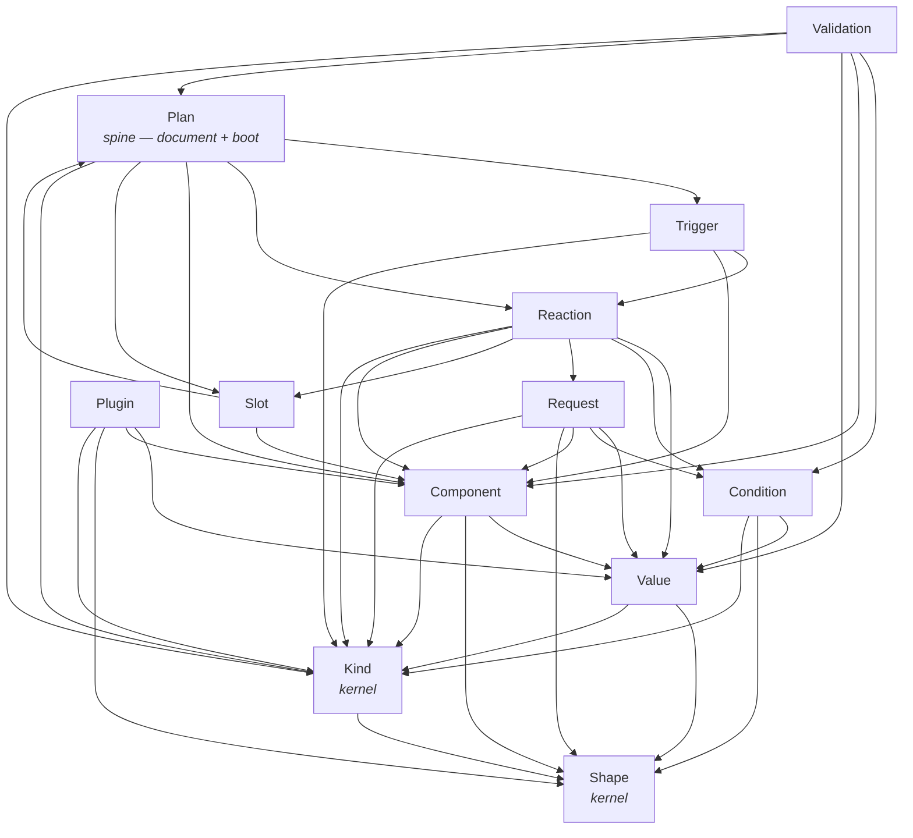

# Micro-Module Architecture for the Redesign

> Source-grounded synthesis. Inputs: the source-verified baseline at
> [`01-connectivity-graph.md`](./01-connectivity-graph.md) and three independent
> micro-module proposals (responsibility-first, lane-first, vocabulary-first).
> This document is the single unified decomposition the naming pass and the
> coverage matrix build on.

## Approach

**One micro-module per DSL graph concept, carried end-to-end as a vertical
concept slice — with two cross-cutting ideas grafted on from the other
proposals where vocabulary alone is not enough.**

The framework has exactly one job and one data flow:

```
Frozen DSL (cshtml)  ->  Rich C# Plan Domain  ->  Generated TS Contract  ->  Runtime executor (browser)
```

The baseline proved the spines are **right in meaning** — one `ValueExpression`,
one `ConditionGraph`, one `Shape`, one `Kind` discriminator, one `PlanDocument`,
one deterministic component id. The debt is in **form**: a hand-authored 1,165-line
TS contract mirror, three serialization strategies, five god-objects, magic
sentinels, runtime singletons, and naming collisions.

The decomposition is driven by the **domain vocabulary a .NET developer already
thinks in** (the audience the rewrite must delight): *Trigger, Reaction,
Condition, Value, Request, Component, Slot, Validation, Plugin*. Each becomes one
self-contained slice carrying its concept across all four layers — the fluent
authoring surface, the plan node family, its single wire shape, and the runtime
executor live together. A developer who wants conditions opens **one** folder and
sees `When/Then`, the `ConditionGraph` node, the camelCase wire shape, and the
compare engine — never five files across four directories.

Three things every concept depends on but **none owns** become thin shared
kernels: **Shape** (the structural type tag), **Kind** (the single C#->TS
discriminator + generated contract), and **Plan** (the document spine:
build-sink -> immutable document -> discover -> boot).

Two ideas are grafted in from the other two proposals because the vocabulary cut
alone under-specifies them:

- **From lane-first** — the sync/async lane is a *plan-carried fact*, not an
  `instanceof Promise` rediscovery; and each concept's runtime executor is split
  into a **pure core** (read a value, compare it — zero IO, zero Promise, zero DOM
  mutation, jsdom-free unit-testable) versus a **dirty edge** (mutate a component,
  fetch, confirm, inject) where the lane boundary actually lives.
- **From responsibility-first** — every authoring **lowerer** has exactly one
  runtime **reader** (one write path, one read path per spine). A feature touches
  one author seam, one node family, and one reader — never a god-object.

The result is **12 modules**: 9 vocabulary concept-slices + 3 shared spines.
Fewer than every proposal (18 / 21 / 14) while fully covering the DSL, because
the concept-slice is the natural unit a matrix row already names.

---

## Module List

`Replaces` names the baseline god-objects / scattered files each module
dissolves. `→` denotes the C#-authoring side; `⇒` the TS-runtime side of the
same concept.

| Module | Single responsibility | Owns | Depends on | Replaces |
|---|---|---|---|---|
| **Shape** *(kernel)* | The structural type tag that rides on every value, operand, gather assignment, and contract member: CLR inference at authoring, one conversion engine at runtime. | → `Shape` + `ShapeStructure` + `ShapeContractCompatibility` value objects (merge/accept algebra). ⇒ `shape-convert.ts` single `applyShape`/`convertByShape` engine. The **shape-once** invariant on the gather egress path. | — | The 3 redundant re-shapings (evaluate / gather re-derive / `formatForWire`); `Shape.cs` hand converter |
| **Kind** *(kernel)* | The single C#->TS discriminator mechanism and the generated TS contract derived from the plan node families. | → ONE polymorphic mechanism emitting `kind` by a compile-enforced base contract; a **reflection-driven `PlanTypeGenerator`** that derives `plan.ts`; `ReactivePlanSerializer` as sole JSON owner (camelCase); a build-time **drift gate**. ⇒ `assert-never` exhaustiveness guard. | Shape | `WriteOnlyPolymorphicConverter` + 11 hand `JsonConverter`s + plain-reflection paths (→ one); the 1,165-line hand-authored `PlanTypeScriptContract` + `TypeScriptContractWriter`; `PlanTerms` op-group `.Values` arrays |
| **Value** | The value spine: every readable value authored through one `TypedSource`, lowered to one `ValueExpression`, read back by one evaluator. Pure-core read (no IO, no DOM mutation). | → `TypedSource<T>` + all concrete source families (Component/Url/Plugin/Payload/Element) collapsed onto it; `ValueExpression` flat family (Literal/Read/Object/Array/ArrayOp); `WholePayload`/`WholeElement` as explicit variants; ArrayOp predicate/projection as per-op variants. ⇒ `evaluate.ts` slim `evaluateValue` dispatcher + a separate **array-op engine** module (count/filter/map/sum/any/all/find/orderBy); dom-read/url-read handlers; `RuntimeValue`/`RuntimeShape`/`RuntimePath`. | Shape, Kind | God-facade `ValueExpression.cs` (590 lines) + `ValueRead`->`ValueReadTarget`->`ValueReadPath` 4-type indirection; god-class `evaluate.ts` (300 lines); `responseBody`/`elementValue` magic sentinels; the gather-source hole; nullable+`[JsonIgnore]` ArrayOp pairs |
| **Condition** | The condition spine: `When/Then/ElseIf/Else` first-match authoring and the deterministic predicate graph over the same value sources, evaluated by ONE compare engine on both lanes. | → `When/Confirm` + `ConditionSourceBuilder`/`GuardBuilder`/`BranchBuilder`/`ConditionContinuation` (with `Standalone.Then` made unrepresentable); `ConditionGraph` (Compare/All/Any/Not/Confirm); `ComparisonOperands` collapsed to one shape; the 21 `CompareOp` tokens as the single op-list source. ⇒ ONE compare engine; `conditions.ts` confirm/async wrapper delegating to the same `sync-condition.ts` core. | Value, Shape, Kind | Dual evaluators (`conditions.ts` vs `sync-condition.ts` divergence); `ValueEvaluator` DI threaded through 8 fns; `StandaloneConditionContinuation.Then` runtime throw |
| **Reaction** | The reaction spine: the `p.Element`/`Component`/`Dispatch`/`Inject`/`ValidationErrors`/`Into` command surface and the executable action graph, with the **lane color carried in the plan**. Effect edge (sync void). | → thin command sink + `ElementBuilder` + `DispatchPayloadBuilder` (each focused); `ReactionPipelineDraft` as a named sync/async/branch sequencer that **stamps the lane** onto each node; `ReactionGraph` family with `RequestReaction.Request` renamed. ⇒ `execute.ts` reduced to switch + `assertNever` routing on the **plan-carried lane**; set/call/dispatch/inject/show-validation/sequence/branch handlers. | Value, Condition, Request, Slot, Component, Kind | God-builder `PipelineBuilder` (4 partials); scattered `instanceof Promise` / `crossedAsyncBoundary` lane re-detection; `RequestReaction.Request`'s `new` collision hack |
| **Request** | The HTTP spine — the only async lane the framework opens for the network: `Get/Post/Put/Delete` with Gather (`target <- value`), Response success/error scopes, Chained, Parallel, `WhileLoading`/`Finally`. Async effect edge. | → `HttpRequestBuilder` + `GatherBuilder`/`Include` + `ResponseBuilder` + `ParallelBuilder`; `RequestPlan` + `GatherRequestInput` + `ResponseRouting`/`Route`/`RequestChain`; payload scopes folded to only those that carry data. ⇒ `http.ts` pipeline (gather -> fetch -> response routing -> finally -> chain) with `gather.ts`/`request-payload-writer.ts`/`http-fetch.ts` as named stages; ONE writer for FormData/File. | Value, Condition, Component, Shape, Kind | The 7-scope-onto-3-field fold; the dead `local` scope; FormData/File knowledge scattered across 3 modules |
| **Trigger** | The trigger spine: `Html.On(...)` authoring of when a behavior starts (PageReady/DocumentEvent/ComponentEvent/ServerPush/SignalR) and the runtime listener wiring that feeds the originating payload into one execution context. | → `Html.On` + `TriggerBuilder`; `StartsWhen` family made **symmetric** (public sealed + explicit `Kind`); `Behavior` (one trigger->reaction edge) + `BehaviorGraph`. ⇒ `trigger.ts` listener wiring per `StartsWhen` kind; `server-push.ts`/`signalr.ts`; ONE `ExecutionContext` carrying the trigger payload; per-trigger error boundary + AbortSignal. | Reaction, Component, Kind | `Behavior`/`StartsWhen` internal-class-with-public-props asymmetry; raw-vs-rich `ExecContext` double threading |
| **Component** | The component-id + browser-object spine: a registered browser object (id/vendor/type/role/binding) with its declared member contract, and the single deterministic id threaded through render, gather, validation, slot, and `getElementById`. The sole vendor seam. | → `IdGenerator` + `ModelBoundInputComponentSlot` + `InputBoundField` + `Html.InputField` as the ONE id regime; `ComponentObject`/`ComponentRole`/`InputBinding`/`ComponentObjects` (repo + same-vendor invariant) extracted clean; `BrowserObjectContract` + `(vendor,kind,id)` `TypeKey` value object; per-vendor slice extensions (`.Reactive()`/mutation/read/Html). ⇒ `RuntimePlan` join split into `RuntimeComponents`/`RuntimeObject` (**memoized**, not rebuilt per read); `ComponentRuntime` vendor driver registry + `event-fusion`/`event-native` as the SOLE vendor seam. | Value, Shape, Kind | God-file `ComponentObject.cs` (677 lines); `RuntimePlan` 4-classes-in-one + per-read rebuild; the stale `resolver.ts` Rule-5 claim; two-id-regime gap; `TypeKey` opaque-string parsing |
| **Slot** | The composition spine: SSR join by `PlanId` and browser partial injection by `SlotId` — load/unload that recomposes the active plan from a boot snapshot plus loaded slots, aborting only slot-owned behavior. | → `PlanScope` (root vs partial) deciding SSR-merge vs slot-loadable. ⇒ `inject.ts` partial injection + `AppliedBrowserPlans` composition state (boot snapshots + slot loads + AbortControllers) with recompose building a **new** `PlanDocument` (not in-place mutation); ONE merge policy (replace-vs-append) shared with the C# container merge. | Plan, Component | In-place `resetPlanDocument` mutation of a shared reference; the cross-language merge-rule divergence (C# replace vs TS append) |
| **Validation** | Client-validation metadata: explicit deterministic rules recorded through `ReactiveValidator<T>`/DI at render time and run inline/summary in the browser. FluentValidation stays server authority. | → `ReactiveValidator<T>` `ClientRule`/`WhenField` + `ClientValidationFieldRuleBuilder` (16 rule types) + the render-time binder; the plan-model validation graph given its **own home** (extracted from `ComponentObject.cs`), flattened; the duplicate `ValidationRule` renamed (screaming); ONE rule-name source (TS union derived from C#); one operand model; a real collection-item binding value object. ⇒ `orchestrator`/`rule-engine`/`error-display`/`live-clear` reusing **Condition's** compare engine for `WhenField`; the `{id}_error`/`{planId}_validation_summary` convention as ONE shared constant. | Condition, Component, Value, Plan, Kind | The validation tower buried in `ComponentObject.cs`; `Validation.ValidationRule` vs `PlanModel.ValidationRule` collision; 3 independent rule-name enumerations; operands modeled twice; substring path arithmetic; ad-hoc `ValidationSurface` rebuild |
| **Plugin** | The intentional escape hatch: declare a plugin object (typed properties + operations) and read/call it through the same object-member and `ValueExpression` concepts. Stringly names allowed ONLY at the plugin boundary. | → ONE plugin-declaration API; ONE args-builder-first read/call surface; `PluginContract` -> `BrowserObjectContract` mapping. ⇒ `BrowserPluginCatalog` (host-registered instances; resolve throws at the boundary — a real external edge). | Value, Component, Shape, Kind | Two parallel declaration APIs (`PluginTypeBuilder` vs `ReactivePlugin`); ~95%-identical `PluginReadBuilder`/`PluginCallBuilder`; the arity-0..3 × member/root × function/command overload explosion (~30 methods) |
| **Plan** *(spine)* | The plan-document spine: `PlanBuildContext` authoring sink -> immutable `PlanDocument` -> serialize -> `root.ts` discovery -> boot. The aggregate root concept-slices write into and the runtime reads from, with explicit plan-scoped state. | → `PlanBuildContext` (narrow Declare/Wire verbs) + `PlanDocument` (version=3: planId/scope/types/components/behaviors) + `PlanExtensions` (`ReactivePlan`/`ResolvePlan`/`RenderPlan`) + ONE id-sanitization rule. ⇒ `root.ts` discovery + `boot.ts` wiring with the active plan **passed explicitly** to `executeReaction`. | Trigger, Reaction, Component, Slot, Kind | Hidden mutable `activeRuntimePlan` singleton; the 4 `reset*ForTests` functions shipped in production; the boot<->browser-plans callback-injection cycle |

---

## Module-Dependency Graph

Acyclic and layered. Arrows point from a module to what it depends on. The two
kernels (**Shape**, **Kind**) sit at the bottom; **Plan** sits at the top as the
aggregate root that wires the concept-slices together. There are no cycles
because the boot<->browser-plans callback injection and the `sync-condition`
DI-threading are both removed by direct, layered dependence.



> **On the `Slot -> Plan` edge.** Slot composition recomposes a `PlanDocument`,
> so it depends on the document concept Plan owns — but Plan does **not** depend
> back on Slot (the runtime boot path calls into slot injection through the
> Reaction `inject` handler, not by Plan importing Slot). This is the layered
> replacement for today's boot<->browser-plans cycle: composition is a downward
> dependency on the document type, never an upward callback into boot.

---

## Why Each Module Is Simpler + More Deterministic Than Today

- **Shape** — Today a single value is shaped up to three times on the gather
  egress path (evaluate, gather re-derive, `formatForWire`). One kernel with a
  **shape-once** invariant makes the structural type a value carried with the
  value, not re-derived per stage — the same bytes shape identically everywhere,
  deterministically.

- **Kind** — This is the single largest correctness fix. Today the C#->TS contract
  is a **hand-authored 1,165-line mirror** with no drift gate (CLAUDE.md *claims*
  it is generated; it is not). One kernel that **reflects** `plan.ts` from the
  actual node families, collapses three serialization strategies into one
  compile-enforced `kind`, and fails the build on drift — a renamed C# property
  can no longer silently disagree with the runtime.

- **Value** — Today `ValueExpression.cs` (590 lines) and `evaluate.ts` (300 lines)
  are god-objects mixing the value union, a 4-type read indirection, the LINQ
  array-op engine, dom/url reads, and magic `responseBody`/`elementValue`
  sentinels. Splitting into a flat node family + a slim evaluator + a separate
  array-op engine, with whole-payload/whole-element as **real variants**, makes a
  C# generation typo a compile error instead of a silent semantics change. The
  gather-source hole closes so every readable value flows one path.

- **Condition** — Today two evaluators (`conditions.ts` async recursion,
  `sync-condition.ts` sync) can diverge, and `ValueEvaluator` is threaded through
  8 functions as cycle-breaking DI. One compare engine consumed by both lanes
  (confirm just wraps it async) removes the divergence; layered dependence on
  Value removes the DI threading. `Standalone.Then` becomes unrepresentable, not a
  runtime throw.

- **Reaction** — Today `PipelineBuilder` is a god-builder (4 partials) and the
  runtime re-detects the async lane via `instanceof Promise` at every node. The
  draft sequencer **stamps the lane onto the plan**; `execute.ts` routes on that
  carried fact instead of probing. The lane is decided once at authoring and
  honored deterministically at runtime — sync stays sync because the plan says so.

- **Request** — The only legitimate async lane, isolated. Folding the 7-scope-onto-3-field
  vocabulary to exactly the scopes that carry data, dropping the dead `local`
  scope, and consolidating FormData/File into one writer removes the
  vocabulary-richer-than-data smell and the vendor `{rawFile}` knowledge scattered
  across three modules.

- **Trigger** — Making `StartsWhen`/`Behavior` symmetric (public sealed + explicit
  `Kind`, like every other node) lets them flow through the same one serialization
  + generated-contract path instead of bespoke reflection. One `ExecutionContext`
  removes the raw-vs-rich double threading built and unwrapped 35+ times.

- **Component** — Today `ComponentObject.cs` (677 lines) holds six unrelated
  concerns and `RuntimePlan` rebuilds a `RuntimeObject` on **every** read/set/call.
  Extracting the object/contract/id concern clean and **memoizing** the runtime
  object makes a sequence of sets resolve the DOM element + vendor root **once**,
  not per step. Naming `ComponentRuntime` the sole vendor seam (and fixing the
  stale `resolver.ts` Rule-5 claim) means a third vendor touches exactly one
  module.

- **Slot** — Today recompose mutates the **same** `PlanDocument` reference in place
  (`resetPlanDocument`) and the C#/TS merge rules diverge (replace vs append).
  Building a **new** document on recompose and sharing ONE merge policy makes
  composition deterministic and snapshot-safe — the boot snapshot is never
  mutated out from under a running plan.

- **Validation** — Today the plan-model validation graph is buried in the
  `ComponentObject` god-file, there are **two** `ValidationRule` types, **three**
  independent rule-name enumerations, and operands modeled twice. Giving validation
  its own home, one rule-name source (TS derived from C#), one operand model, a
  real collection-item binding value object, and reusing **Condition's** compare
  engine for `WhenField` removes the exact C#->TS drift class the framework claims
  to eliminate.

- **Plugin** — Today two parallel declaration APIs and two ~95%-identical
  read/call builders produce one `PluginContract` through ~30 overloads. One
  declaration API and one args-builder-first surface collapse the duplication while
  keeping the stringly escape hatch *only* at the genuine plugin boundary.

- **Plan** — Today a hidden mutable `activeRuntimePlan` singleton means "the active
  plan is whichever booted last" (the reason `resetActivePlanForTests` exists), and
  a callback-injection cycle dodges `boot<->browser-plans`. Passing the active plan
  **explicitly** to `executeReaction` and depending downward on the document type
  removes the singleton, the cycle, and all four `reset*ForTests` functions shipped
  in production — execution state becomes plan-scoped and explicit.

---

## Design Principles (carried into naming + matrix)

1. **One concept, one folder, end-to-end.** Each slice carries its DSL graph
   concept across all four layers (fluent surface, node family, wire shape,
   executor). A developer reasons in domain vocabulary, not in layers.
2. **The matrix row IS the slice.** Every module maps 1:1 to a coverage-matrix row
   (DSL call -> domain term -> runtime behavior). A module mapping to no graph node
   is deleted, not kept.
3. **Only genuine cross-cutting invariants are kernels.** Shape, Kind, and Plan are
   the three things every concept depends on but none owns. No shared base classes
   for behavior between slices (duplication over abstraction).
4. **One write path, one read path per spine.** One `TypedSource`->`ValueExpression`->`evaluateValue`;
   one compare engine on both lanes; one Shape conversion; one Kind discriminator;
   one `PlanDocument` compose path. Every authoring lowerer has exactly one runtime reader.
5. **Make invalid states unrepresentable in C#, not defended in TS.** Magic
   sentinels become variants; nullable+`[JsonIgnore]` pairs become per-op variants;
   `Standalone.Then`'s throw becomes an unreachable type. The runtime stays a dumb
   executor with boundary-only checks (DOM/network/external JSON).
6. **The contract is generated, never hand-mirrored.** Kind owns a reflection-driven
   `PlanTypeGenerator` derived from the node families, with a build-time drift gate.
7. **Sync stays sync; the lane is carried, not re-detected.** The async boundary
   (Request, parallel, confirm, remote trigger, injection) is the only place a
   Promise appears, and the lane color travels in the plan.
8. **No god-objects, no singletons, no fallbacks, no registries-as-control-flow.**
   The five god-objects split along the concerns they already mix; `activeRuntimePlan`
   and the `reset*ForTests` functions are replaced by explicit plan-scoped state.
9. **Screaming names end the collisions.** The two `ValidationRule` types,
   `RequestReaction.Request`'s `new`, and the stale `resolver.ts` Rule-5 claim are
   resolved with names that announce authoring-time vs plan-model vs runtime intent.
10. **One id regime.** `IdGenerator`'s deterministic component id is the single
    thread through render, gather, validation, slot, and `getElementById`; the
    `.Reactive()` event id gets a compile-time link to the rendered id.
