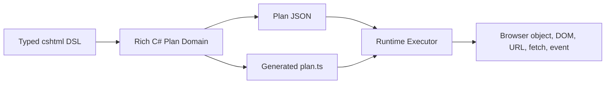
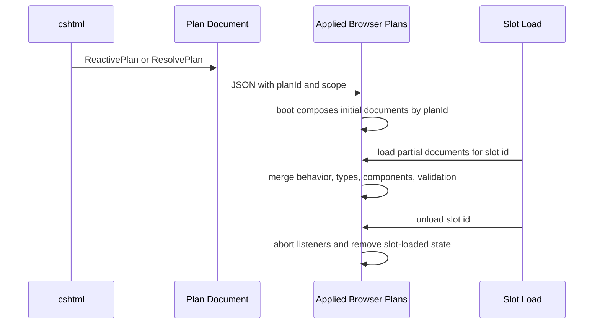

# Reactive Plan Domain Language

This document is the shared language for the rich Reactive Plan refactor. It is
not a second specification. The frozen C# DSL source is the requirement. The C#
plan domain, generated TypeScript contract, runtime, and tests are outputs that
must prove the same intent.

Use this with:

- `docs/reactive-plan-source-blueprint.md` for the input/output matrix.
- `docs/reactive-dsl-feature-atlas.md` for complete facts grounded in actual DSL source.
- `AGENTS.md` for operating rules.

## Design Rule

Every term must survive this walk:

```text
source file + DSL input
  -> rich C# domain output
  -> JSON/TS term
  -> runtime effect
```

If a term cannot be walked through that chain, delete it or rename it. Rich
domain model means fewer, sharper terms that explain the deterministic browser
behavior. It does not mean wrappers, registries, fallback paths, claims,
preflight validation, or impressive names around ordinary execution.

## Core Flow



## Browser Object Model

The framework models deterministic interaction with JavaScript objects:

- a browser object has properties
- a browser object has methods
- a browser object may expose event channels or vendor callbacks
- properties and methods may read, write, accept params, or return values

Components, DOM elements, app-level objects, plugins, event payloads, and HTTP
responses are all modeled by how the plan reads or writes those objects. Runtime
executes the declared member intent; it does not discover framework behavior by
probing live objects.

## Active Terms

| Term | Meaning | Code home |
| --- | --- | --- |
| Public DSL | Typed C# surface used in `.cshtml`. It never executes browser behavior on the server. | `Alis.Reactive/Razor`, `Alis.Reactive/Builders`, component slices |
| Plan Draft | Mutable build-time state used while DSL builders assemble deterministic intent. | `PlanBuildContext`, builder drafts |
| Plan Document | Serialized browser-executable plan for one model identity. It may be root-scoped, partial-scoped, or inline for an action link. | `Plan`, `ReactivePlan<TModel>`, generated `Plan` in `plan.ts` |
| Plan Identity | Stable model-derived key used to compose root and same-model partial plans. | `PlanId`, `PlanIdentity` |
| Plan Scope | Root or partial scope carried in JSON. It tells runtime whether the document boots a page plan or merges into an existing plan. | `PlanScope`, `RootPlanScope`, `PartialPlanScope` |
| Slot Load | Browser lifetime for injected partial HTML. Loading a slot replaces the previous load; unloading removes the state loaded by that slot. | `AppliedBrowserPlans.loadPartialSlot`, `unloadPartialSlot` |
| Slot Id | Runtime handle for browser partial replacement/unload. It is not a component id and not a type key. | `SlotId` |
| Browser Object Contract | Vendor-agnostic JS object contract: properties, methods, events, callback payloads, and value shapes. | `BrowserObjectContract`, `plan.ts` object contracts |
| Object Contract Load | Root or slot-loaded object member declarations. Compatible declarations merge into the active runtime type; unloading a slot releases only declarations loaded by that slot. | `object-contracts.ts` |
| Component Object | Plan entry for a browser component object. It has id, vendor, type key, and role. | `ComponentObject` |
| Component Role | Plan-declared meaning of a component entry: `object-target`, `owned-definition`, `validation-container`, or `layout-object`. | `ComponentObject.Role`, generated component role unions |
| Component Load | Runtime memory of which root or slot load owns component definitions and layout object references. | `component-slots.ts` |
| Controlled Component ID | Absolute join key for a rendered component object. Model-bound input ids are generated from model type and expression and reused by markup, plan, validation, gather, and runtime lookup. | `IdGenerator`, `ComponentRegistration` |
| Component Vertical Slice | Isolated onboarding path for one vendor/component API. It renders markup and exposes compile-time-correct properties, methods, events, and callbacks while sharing core plan primitives. | `Alis.Reactive.Native`, `Alis.Reactive.Fusion` |
| App-Level Component | Fixed-id layout/page object such as drawer, loader, toast, confirm, or action link support. It is modeled as a layout object role, not a normal rendered input. | Native/Fusion app-level slices |
| Behavior Graph | Trigger plus reaction tree. Runtime wires the trigger and executes the tree in order. | `Behavior`, `Reaction` |
| Trigger | Start point for a behavior: page ready, custom event, component event/callback, server push, or SignalR. | `StartsWhen`, trigger builders |
| Reaction Tree | Ordered execution graph: sequence, branch, set, call, dispatch, request, parallel, inject, confirm, validation display. | `Reaction` |
| Immediate Lane | Runtime path for synchronous effects: object set/call when the member is sync, DOM operations, dispatch, validation display, and sync condition terms. | runtime execution modules |
| Async Lane | Runtime path entered only by concepts that are async by nature: HTTP, parallel HTTP, partial injection fetch, remote subscriptions, and confirm/user decision. | runtime execution modules |
| Value Expression | Plan-declared value read or literal: URL, payload, component/object member, plugin member, JSON path, array/object value, response value, or literal. | `ValueProducer`, `Source` |
| Payload Scope | Named value scope such as event, success, error, request, dispatch, or local. | `PayloadSource`, `PayloadScope` |
| JSON Path | Structured path over a payload/value. It is not public DSL string magic. | `Path` |
| Condition Graph | Deterministic predicate graph: compare, all, any, not, and confirm where the DSL allows confirm. | `Condition`, runtime conditions |
| Branch Cases | Ordered branch cases with at most one default case and default last. Multiple branch blocks can appear in a reaction sequence; nested branch blocks are represented only where DSL allows them. | `BranchCase`, conditions builders |
| Request Plan | HTTP request intent: method, URL template, route/header/body assignments, validation gate, response routes, lifecycle reaction slots, chain, and parallel grouping. | request builders, `Request` |
| Request Input Projection | Explicit mapping from readable sources to route values, query/body payload, headers, or all registered inputs. | gather/request payload model |
| Validation Projection | Deterministic client-side validation rules extracted from typed validation DSL or supported FluentValidation client projections. Rules outside that client language are omitted from the browser plan. | validation projection model |
| Validation Container | Component role that owns browser validation rules for a form/container. Partials can add rules to a root container and slot unload removes the exact loaded rule objects. | `validation-container` role, runtime validation |
| Plugin Contract | Declared browser plugin object/function contract for behavior outside deterministic first-class DSL primitives. Public plugin compatibility may use strings; internal plan/runtime terms stay typed. | `ReactivePlugin`, `PluginContract` |

## Component Roles

| Role | Meaning | Runtime behavior |
| --- | --- | --- |
| `owned-definition` | The plan renders or owns the component object definition. | Add/update the component and remember root or slot ownership. Slot unload removes it only if the slot owns it. |
| `object-target` | The plan needs a deterministic handle to an existing or declared browser object. | Join by component id/vendor/type key, or materialize when the plan owns no rendered definition yet. |
| `validation-container` | The plan carries validation rules for a container. | Merge root rules at boot; for slot load, append/replace rules by validated component and remove exact loaded rules on unload. |
| `layout-object` | The plan references a fixed app-level object owned by layout/page lifetime. | Join existing layout object or create a temporary one when needed for partial behavior; unload only slot-created layout references. |

## Partial Plan Flow



Rules:

- SSR partials compose during boot by `planId`.
- Browser partials load through a slot id and can unload.
- Component ids and type keys are runtime join keys.
- Slot id is only the browser load/unload handle.
- The runtime does not validate whether framework-generated JSON is plausible.
  It records what must be removed when a slot unloads.

## Request And Gather

Gather asks two questions:

- Which readable sources does this request need?
- Which request content target receives each value?

Sources include explicit component/object reads, payload reads, URL reads,
plugin reads/calls, literals, and `all-registered-inputs`. Targets include
route parameters, headers, query/body payload values, and request JSON bodies.
Runtime loops the generated assignments and writes the request. It does not own
path dedupe or source ownership policy.

## Validation

Validation projection means browser-executable client rules only.

- FluentValidation rules still execute normally on submit or HTTP endpoints.
- Supported synchronous FluentValidation rules may project client equivalents.
- Async rules and guards outside the client projection language are omitted from browser projection.
- Custom client projection must be explicit and typed.
- Runtime validation executes the projected rule contract; it does not reflect
  over validators or infer missing rules.

## Naming Guard

Avoid these as general-purpose domain words:

- `artifact`
- `contribution`
- `claim`
- `reject`
- `fallback`
- `registry` unless it is truly a lookup service
- `lifecycle` unless naming browser load/unload lifetime

Preferred current terms:

- `PlanDocument`
- `SlotLoad`
- `SlotId`
- `ComponentRole`
- `ComponentLoad`
- `ObjectContractLoad`
- `ValidationProjection`
- `RequestInputProjection`

## Module Closure Checklist

A module is closed only when all are true:

- The DSL source rows exist in the blueprint.
- The C# domain names match those rows.
- Generated `plan.ts` carries the same concepts.
- Runtime code executes those concepts without extra defensive policy.
- Tests prove behavior, not helper internals.
- Stale vocabulary was audited in code, tests, blueprint, and glossary.
