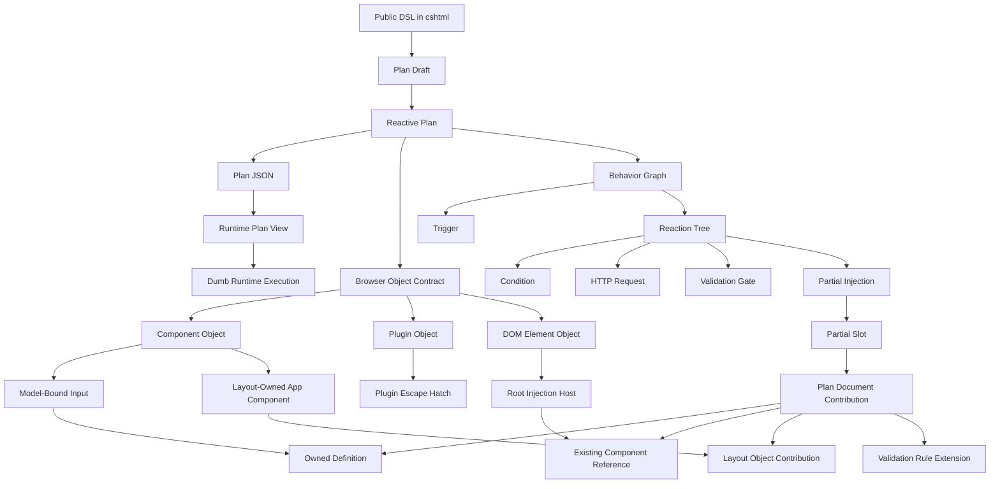
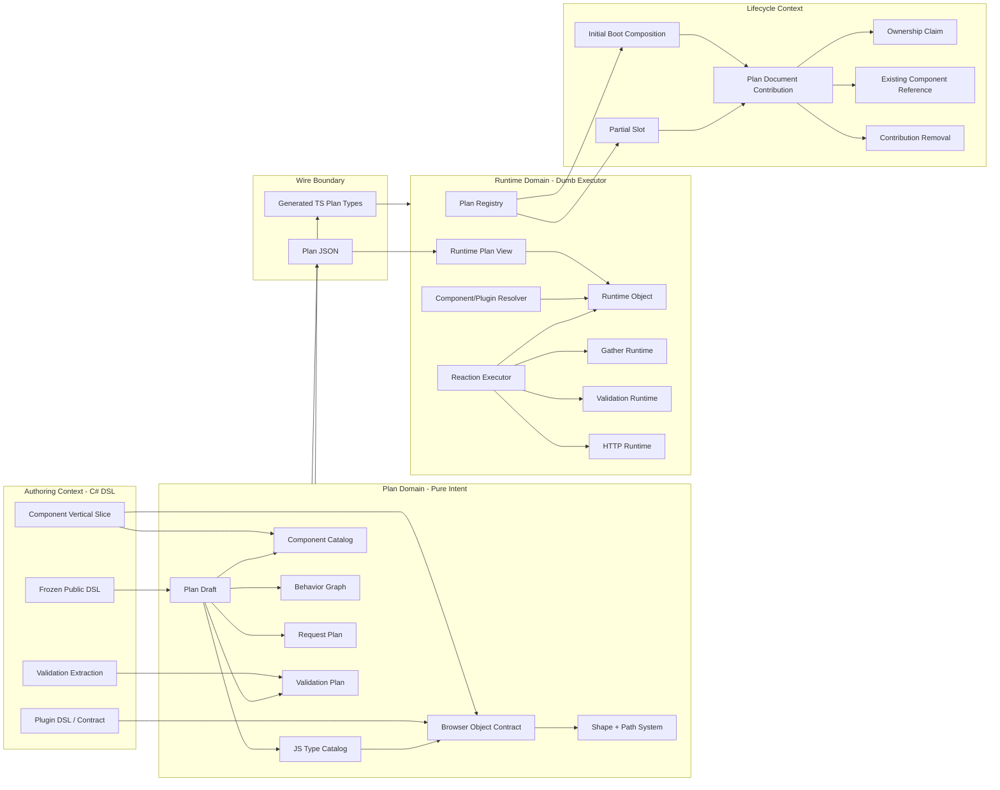
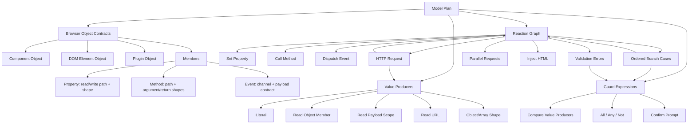
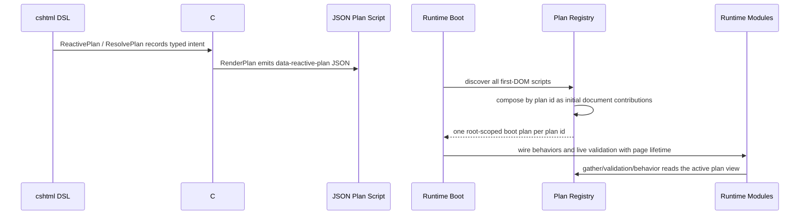
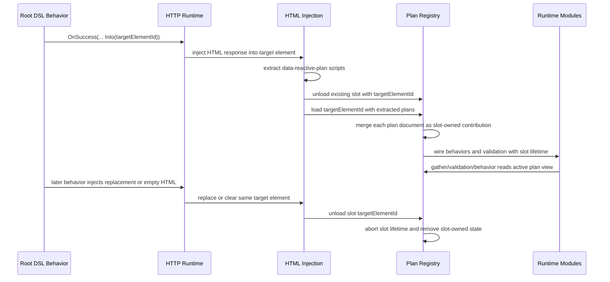

# Reactive Plan Domain Language

This is a living refactor map for the rich Reactive Plan model. It is not a
second specification. The source of truth is the C# plan domain, the generated
TypeScript contract, and the runtime tests that prove the same terms execute in
the browser.

Update this document in the same change that introduces or renames a domain
term. If the code and this document disagree, fix the document immediately.

## Drift Guard

- C# owns the plan domain language and the public DSL remains frozen.
- `PlanTypeGenerator` emits `Alis.Reactive.Assets/runtime/types/plan.ts` from
  the C# plan model. TypeScript must not hand-roll plan wire types.
- Runtime domain objects may add execution vocabulary, but they must map back to
  generated plan terms instead of inventing behavior.
- JSON is the wire representation of the domain model, not the model itself.

## Refactor Discipline

Do not start a broad module rewrite from the current implementation shape. Start
from the frozen DSL and name the vertical behavior:

1. The DSL use case and compile-time API that expresses it.
2. The rich PlanModel term that owns the intent.
3. The generated TypeScript contract term that carries it.
4. The runtime execution behavior and execution lane.
5. The behavior proof: focused domain/runtime test or Playwright vertical slice.

If any of those five are missing, the work is not ready for a large refactor.
Otherwise modules drift into local fixes, defensive runtime design, or tests that
mirror helper classes instead of protecting framework behavior.

## Domain Mind Map



## Working Concept Graph

This graph is the refactor compass. Every new type or rename should be placed
on this map before implementation.



### Plan Domain Kernel

The core model is deterministic browser behavior, not “JSON walking”.



Kernel rules:

- A browser object contract says what can be read, written, called, or listened
  to. Components, DOM elements, and plugins all reduce to this object/member
  model.
- A value producer is any deterministic read or literal construction used as an
  input to conditions, requests, payloads, setters, and method arguments.
- URL, event payload, HTTP response payload, validation error payload, component
  state, and plugin reads are not separate runtime tricks. They are named
  source scopes for the same value-producing language.
- A guard expression is a deterministic condition tree over value producers,
  plus the explicit confirm prompt primitive.
- `.Reactive` branches and validation activation both end as `Condition`.
  Validation starts as `FieldCondition` only because fields must be bound to
  registered component value members during render.
- A reaction graph is deterministic structure. HTTP, parallel, and injection do
  not make it non-deterministic; they are declared reaction nodes with declared
  response routes and follow-up reactions.
- Runtime should resolve declared objects and execute declared member actions.
  It should not infer member capability, discover payload shape, or invent
  fallback behavior.
- Defensive runtime design is a smell when the C# PlanModel can make invalid
  behavior unrepresentable. Runtime checks belong at external corruption,
  lifecycle, and integration-drift boundaries; they should expose domain drift
  with clear context, not become ordinary control flow.

### Classification Rules

Use these rules before changing merge, component onboarding, validation, gather,
or runtime resolution. The same vocabulary must hold in C#, JSON, and
TypeScript.

| Question | Domain Classification | Correct Action | Smell |
| --- | --- | --- | --- |
| Does this code introduce/render the browser object? | Component Definition Contribution | Claim component ownership and declare the object contract | Treating it like a loose reference |
| Does this code only need to call/read/write an existing object? | Existing Component Reference | Require matching id/vendor/type and no binding/container state | Replacing the existing component definition |
| Does this code use a fixed app-level object from layout? | Layout Object Contribution | Materialize or join the fixed id without partial ownership transfer; remove only when a partial materialized it and the last partial reference unloads | Treating layout objects as incidental object targets |
| Does this declaration add members to the same browser object? | Object Contract Fragment Contribution | Record the source-owned fragment, materialize the active merged contract, and widen access on same path/shape | `Object.assign`, `AddOrReplace`, last-writer-wins, or trying to subtract from an already-merged type |
| Does render-time input registration describe a value member? | Input Value Contract Enrichment | Ensure the type exists, then enrich it with readable value metadata | Replacing a writable type with a read-only input type |
| Does gather reserve an HTTP payload path? | Gather Payload Claim | Claim the payload path from explicit component fields, static/event fields, or dynamic input expansion | Letting `IncludeAll` overwrite declared request fields |
| Does a plan script appear during initial page load? | Initial Document Contribution | Compose through the shared contribution policy; coalesce identical owned definitions and validation containers because boot has no unload lifetime | Boot-only shortcut with weaker rules |
| Does an injected partial disappear? | Partial Slot Unload | Abort listeners, remove owned definitions, remove exact validation rule contributions, keep root references | Removing root-owned hosts/app components |
| Does validation project a server rule to browser? | Client Validation Projection | Emit deterministic browser rule intent or record skipped projection | Inferring from implementation details or pretending all server rules are client rules |
| Does runtime need to execute a behavior? | Declared Object Member Execution | Resolve declared object/member and apply call/read/write using the plan contract | Discovering capabilities dynamically from browser objects |

### Concept Flow

The deterministic flow is always:

1. Authoring code expresses intent through typed DSL or typed component/plugin
   onboarding.
2. Plan draft classifies the intent as object contracts, behavior graph,
   request plan, validation plan, and lifecycle scope.
3. The plan emits JSON plus generated TypeScript types.
4. Runtime resolves the declared object and executes the declared member.

No layer after the DSL should rediscover intent. It may only classify,
validate, merge, serialize, resolve, and execute declared intent.

### Partial Plan Lifecycle Sequences

There are two partial-plan paths. They share plan document semantics, but they
do not share lifecycle semantics. This distinction is the design spine for
merge/unmerge work.

#### SSR Partial Composition



SSR facts:

- Parent views call `ReactivePlan<TModel>()`; same-model server-rendered
  partials call `ResolvePlan<TModel>()`.
- `ResolvePlan<TModel>()` is not an arbitrary partial contract. It is a
  same-model contribution: the model type owns the `planId`, so the partial
  contributes to that model's plan. A partial with an independent model is a
  separate model plan and should use `ReactivePlan<TModel>()`; its `planId`
  will naturally differ.
- All plan scripts are already in the first DOM. `root.ts` discovers them
  before boot, and `composeInitialPlans` folds same-`planId` documents into one
  root-scoped boot plan per model plan identity. Different-model partials boot
  as separate model plans.
- SSR partial contributions do not have a removal lifecycle. They are initial
  document contributions, so duplicate initial owned definitions and validation
  containers are coalesced by the shared contribution policy.
- Once composed, runtime modules see one active plan. Gather and validation
  must not need to know whether an input came from the parent view or an SSR
  partial.

#### Browser Partial Slot Lifecycle



Browser slot facts:

- `ResolvePlan<TModel>()` marks a plan document as a partial contribution, but
  dynamic injection deliberately re-scopes loaded plans to the target container
  id. The runtime lifecycle owner is the `Partial Slot`, not the server
  document's original partial scope.
- Browser injection changes lifetime, not model ownership. A returned
  `ResolvePlan<TModel>()` script still belongs to the model-derived `planId`;
  the slot id only owns load/replacement/unload of that contribution.
- A browser slot can load more than one model plan document, but that does not
  make the slot a model owner. Each document keeps its own `Model Plan
  Identity`; the slot owns only the fact that those documents are currently
  mounted in that DOM region.
- The browser slot replaces DOM content, not model identity. Unloading a slot
  removes every contribution loaded by that slot across all affected `planId`s.
- Empty injected HTML means unload this slot. It is not a merge of an empty
  plan.
- Component keys and type keys are `Runtime Join Keys`. They are how behavior,
  gather, validation, and object member execution find active declarations.
  They are not lifecycle ownership ids.
- A partial slot unload should remove `Applied Artifacts` owned by that slot:
  behavior bindings, owned component definitions, layout object references,
  object contract fragments, and validation rule extensions.
- Root-owned hosts, root-owned validation containers, and layout-owned app
  objects survive partial unload unless the partial slot materialized the
  layout object and the last partial reference unloads.

#### Minimal Lifecycle Model

| Term | Meaning | Does It Unload? |
| --- | --- | --- |
| `Plan Document` | One JSON plan script emitted by `RenderPlan`. | Depends on lifecycle context |
| `Model Plan Identity` | The model-derived `planId` that says which model plan the document belongs to. | No |
| `Boot Composition` | First-DOM composition of all plan documents by `planId`. | No |
| `Initial Document Contribution` | One plan document folded into a boot composition. | No |
| `Partial Slot` | Browser container id whose HTML content is replaced by `Into(...)`. | Yes |
| `Slot Load` | One replacement event for a partial slot, containing zero or more plan documents and one lifetime. | Replaced by the next load |
| `Slot Contribution` | One plan document applied under a slot load. | Yes |
| `Applied Slot Contribution` | The reversible effects of applying one slot contribution to a runtime plan. | Yes |
| `Runtime Join Key` | Existing component key or type key used by behavior/gather/validation/object resolution. | No, it is not an owner |

The model should express one simple operation:

```text
replace slot:
  unapply previous AppliedSlotContribution records for this slot
  if new HTML has no plan documents: stop
  create one Slot Load lifetime
  apply each Slot Contribution under that lifetime
  record each AppliedSlotContribution
```

`Applied Slot Contribution` is the correct place to record concrete reversible
effects: behavior bindings, owned component definitions, layout object
references, object contract fragments, and validation rule extensions. The
runtime plan itself remains the active merged view used by gather, validation,
conditions, and behavior execution.

This keeps the design centered on the problem sequence. Stable ids are useful
only as names for applied effects inside a slot contribution; they must not
replace the existing runtime join keys.

Core invariant: `Model Plan Identity` and `Partial Slot` are separate axes.
The model identity answers “which deterministic plan graph owns this intent?”.
The slot answers “which browser replacement lifecycle currently owns this
loaded contribution?”. Mixing those two is a design smell.

#### Two-Step Runtime Composition

Both SSR partials and browser partials should follow the same logical sequence:

```text
plan documents from one HTML fragment
  -> compose by Model Plan Identity
  -> mount each composed model-plan contribution into a lifecycle context
```

The lifecycle context is the only difference:

| Composition Step | Boot Context | Browser Slot Context |
| --- | --- | --- |
| Input | All first-DOM plan scripts | Plan scripts extracted from one injected HTML response |
| Grouping key | `planId` | `planId` |
| Same-model partial rule | `ResolvePlan<TModel>()` contributes to that model's composed plan | `ResolvePlan<TModel>()` contributes to that model's composed slot contribution |
| Different-model partial rule | Different `ReactivePlan<TOtherModel>()` boots as another model plan | Different `ReactivePlan<TOtherModel>()` mounts under the same slot lifetime but keeps its own model plan |
| Output lifetime | Page/root lifetime | Slot load lifetime |
| Unload | None | Remove all composed model-plan contributions loaded by the slot |

This avoids the false choice between “SSR partial” and “browser partial” as
different merge models. They are the same document composition problem followed
by different lifetimes.

Logical matrix:

| HTML Rendering Path | Plan Authoring Call | Model Identity | Lifecycle Context |
| --- | --- | --- | --- |
| Parent view in first DOM | `ReactivePlan<TModel>()` | Model-derived `planId` for `TModel` | Boot composition |
| Same-model SSR partial in first DOM | `ResolvePlan<TModel>()` | Same `planId` as owning model plan | Boot composition, no unload |
| Different-model SSR partial in first DOM | `ReactivePlan<TOtherModel>()` | Different `planId` | Separate boot composition |
| Same-model browser partial via `Into(...)` | `ResolvePlan<TModel>()` | Same `planId` as target model plan | Partial slot load/unload |
| Different-model browser partial via `Into(...)` | `ReactivePlan<TOtherModel>()` | Different `planId` | Same slot lifetime, separate model plan |

### Design Method

Use this loop for each refactor surface before changing code:

1. Name the authoring input: DSL call, component slice, validation adapter
   output, plugin contract, or partial lifecycle event.
2. Name the plan-domain output: object contract fragment, behavior graph,
   request plan, validation plan, shape/path contract, or lifecycle scope.
3. Name the runtime input: generated JSON plus generated TypeScript type.
4. Name the runtime action: resolve object, read property, write property, call
   method, evaluate condition, gather value, validate rule, dispatch request, or
   merge/unload contribution.
5. Record the invariant that prevents guessing at the next layer.

If a step cannot be named cleanly, stop and improve the domain term before
writing implementation. This is the main guard against recycling the same
fallback/wrapper/null/default smells.

### Design Techniques In Use

This refactor should use structured techniques where they fit the problem,
without turning them into ceremony.

| Technique | How It Applies Here | Output |
| --- | --- | --- |
| DSL grammar inventory | Treat the frozen DSL as the complete set of authoring sentences the domain must understand. | `DSL Feature Inventory`, pressure-point list, missing feature checks before refactor |
| Event storming | Model browser behavior as trigger events followed by deterministic reactions, policies, requests, validation gates, and emitted dispatch events. | Behavior graph language: trigger, reaction, branch, request outcome, dispatch payload |
| Context mapping | Separate authoring context, plan domain, wire contract, runtime execution, validation adapter, and component vendor slices. | Module map and coupling decisions |
| Ubiquitous language glossary | Keep terms stable across C#, JSON, generated TS, runtime, and tests. | Layer terms, execution terms, partial terms, component onboarding terms |
| Decision tables | Classify merge/load/unload and gather/validation cases before coding. | Classification rules, decision log, intent matrix |
| Contract-first boundary | C# owns the plan language; generated TypeScript consumes it. | `PlanTypeGenerator`, generated `runtime/types/plan.ts`, typecheck |
| State machine thinking | Treat partial slots, request outcomes, validation activations, and response routing as explicit states/transitions. | No null/default behavior; explicit no-value/missing/no-response states |
| Balanced Coupling | Keep high-strength concepts close in PlanModel; expose stable contracts across C#/TS/runtime/plugin/vendor boundaries. | Coupling decisions table and module ownership boundaries |
| Outside-in BDD | Let Playwright prove user-facing DSL behavior while pure plan/runtime tests pin the rich model rules. | Focused Playwright slices plus unit tests for object contracts and merge |
| Rejected-choice log | Record only stable rejected designs that prevent repeated loops. | Decision log entries with proof surfaces |

### Intent Classification Matrix

| Authoring Input | Plan-Domain Output | Runtime Input | Runtime Action | Invariant |
| --- | --- | --- | --- | --- |
| `p.Component<T>().SetValue(...)` | Writable property contract fragment plus set reaction | Component id, type key, property member, value producer | Resolve component object and assign declared property path | Property must be declared writable or readwrite |
| `comp.Value()` / typed source read | Readable property contract fragment plus value producer | Component id, property member, output shape | Resolve component object and read declared property path | Property must be declared readable or readwrite |
| Model-bound component render | Component registration plus input value contract | Component id, binding path, value member, shape | Gather/validation can read registered value member or canonical alias | Registration enriches the type; it never replaces existing member fragments |
| Component event `.Reactive(...)` | Event contract plus behavior graph | Component id, event name/channel, reaction tree | Wire semantic event and execute reaction | Event listener lifetime follows its plan contribution |
| `p.When(...)` / nested branches | Ordered branch cases with guards/default | Condition tree plus reactions | Evaluate guards synchronously unless an async condition exists | Else is explicit default, not null behavior |
| HTTP `.Post(...).Gather(...).Validate(...).Response(...)` | Request plan with input, validation gate, response routes, completion | Request document and value producers | Prepare request, optionally validate, fetch, route outcome | Validation failure is not an HTTP failure; response unavailable is explicit |
| Validation adapter projection | Client validation fields and skipped projections | Bound validation rules and activations | Evaluate browser rules and display errors | Server rules always remain authoritative; client projection is deterministic subset |
| `IncludeAll()` | Dynamic gather policy plus payload claims | Current runtime plan registered inputs and claimed payload slots | Gather mounted registered inputs whose component and payload slot are not already claimed | Partial load/unload changes the current input set deterministically |
| Partial slot load | Plan contributions under one slot lifetime | Incoming plans and slot id | Merge contributions, wire listeners, and track exact removals | Same contribution policy as initial boot composition, plus unload ownership |
| Partial slot unload | Contribution removal | Tracked owners/listeners/rule objects | Abort listeners, remove owned state, preserve root references | Root-owned hosts/layout-owned app components survive unload |
| Plugin registration/call | Plugin object/function contract | Plugin name, member path, argument/return shapes | Resolve plugin object and call/read declared member | Plugin is an explicit escape hatch, not dynamic runtime discovery |

### DSL Feature Inventory

This inventory is a coverage map for the frozen DSL. Any rich-model refactor
must preserve every authoring shape here.

| DSL Surface | Authoring Forms | Plan Concepts Forced By The DSL |
| --- | --- | --- |
| Trigger DSL | `DomReady`, `CustomEvent`, typed `CustomEvent<TPayload>`, `ServerPush`, typed `ServerPush<TPayload>`, `SignalR`, typed `SignalR<TPayload>`, component `.Reactive(...)` events | `StartsWhen`, payload contract, event channel, behavior graph, listener lifetime |
| Pipeline DSL | `Element`, `Component<T>`, cross-model `Component<T, TOtherModel>`, explicit-id component reference, app component reference, URL source, plugin read/call/property, validation errors | component identity, typed source, object member contract, dispatch/request/validation reactions |
| Element DSL | `SetText`, `SetHtml`, `Show`, `Hide`, `AddClass`, `RemoveClass`, `ToggleClass`, literal/event/response/typed-source values | DOM element as native browser object, property write, method call, value producer shape |
| Component DSL | Vendor-specific `.Value()`, `.SetValue(...)`, `.Show()`, `.Hide()`, `.Open()`, `.Close()`, `.FocusIn()`, component events | component object contract, member name/path, access mode, event payload, vendor resolution |
| Condition DSL | payload source, response source, typed source, `Confirm`, `Eq/NotEq/Gt/Gte/Lt/Lte`, source-vs-source comparisons, truthy/falsy/null/empty, `In/NotIn`, `Between`, text operators, array contains, nested branches, else | comparison source, operand kind, operand shape, branch case, default branch, sync/async condition boundary |
| HTTP DSL | `Get/Post/Put/Delete`, inline gather, `AsJson/AsFormData`, `WhileLoading`, `Finally`, `Validate<TValidator>`, `Response`, `Chained`, `Parallel`, `OnAllSettled` | request endpoint, gather plan, transport, request stages, validation gate, response routing, chain, parallel completion |
| Gather DSL | `IncludeAll`, `Static`, `FromEvent`, `Header`, `RouteParam`, `FromUrl`, plugin result, explicit component include, typed component source include | explicit gather field, dynamic registered input, supplemental field, scalar slot, route template binding, component read |
| Response DSL | untyped/typed `OnSuccess`, any/specific `OnError`, typed error body, chained request | response payload source, response media type, status handler, any-status handler, no-response outcome |
| Dispatch DSL | `Dispatch`, literal typed dispatch, `DispatchWith<TPayload>` with typed field paths and source/literal assignments | dispatch payload contract, nested payload path, object value producer, custom-event payload type |
| Validation DSL | `Validate<TValidator>`, `ValidationErrors`, render-time input registration, FluentValidation client projection, `WhenField*`, peer comparisons | validation extraction request/report, field binding, activation condition, peer operand, server error field name |
| Plugin DSL | string plugin registration, typed `ReactivePlugin`, root/member function, root/member command, readable property, open/exact arguments, literal/source arguments | plugin contract, operation identity, property identity, argument contract, plugin registry entry |
| Partial DSL/Lifecycle | root `ReactivePlan`, partial `ResolvePlan`, `RenderPlan`, `Into(...)`, partial slot load/unload | document contribution, initial composition, partial slot lifetime, ownership, existing component reference, contribution removal |
| App Component DSL | fixed-id `Drawer`, `Loader`, `Toast`, `Confirm`, `ActionLink` inline request | layout-owned fixed component, inline action link plan, layout-object contribution, app-level runtime adapter |

### DSL Pressure Points

These are the authoring forms most likely to expose an anemic model:

| Pressure Point | Why It Matters | Required Model Strength |
| --- | --- | --- |
| Conditions inside HTTP responses and component events | Same branch language must work over event payloads, response bodies, components, plugins, and URL values | Condition source/operand must be source-agnostic but shape-aware |
| `IncludeAll` with partial load/unload | Gather depends on the current runtime plan, not only the original root view | Registered input reachability must be lifecycle-aware |
| Model-bound hidden fields written by conditions | A value can be read for gather/validation and written by behavior | Input value contract enrichment must merge access to `readwrite` |
| App components inside partials | Fixed layout objects are referenced from many plans but owned by the page/layout | Layout-owned fixed components must not be deleted by partial unload |
| Validation peer rules in nested validators | Client projection must bind model field paths to rendered/deferred component ids | Validation binding must be model-shape language, not FluentValidation internals |
| Plugin root/member calls | Plugin fills gaps where deterministic DSL primitives are not enough | Plugin contracts must be explicit object/member contracts, not runtime string probing |
| Initial DOM with multiple same-plan scripts | Root and partial scripts can already be present at first boot | Initial composition and dynamic merge must share contribution policy |
| Payload mutation | Payload objects can be execution context state, not necessarily declared browser object contracts | Either name `Mutable Payload Object` explicitly or bring it under object contracts |

### Module Map

| Module | Domain Role | Must Own | Must Not Own |
| --- | --- | --- | --- |
| `Alis.Reactive/Builders` | DSL translation | Turning typed authoring calls into plan-draft verbs | Plan invariants, runtime execution policy, vendor-specific behavior |
| `Alis.Reactive/PlanModel` | Pure plan domain | Object contracts, shapes, sources, reactions, requests, validation jobs, mergeable member contracts | Razor rendering, JavaScript probing, FluentValidation implementation details |
| `Alis.Reactive/ComponentOnboarding` | Component identity and event bridge | Controlled ids, model-bound slots, object targets, event onboarding | Per-vendor rendering details or request/validation semantics |
| `Alis.Reactive.Native` / `Alis.Reactive.Fusion` | Component vertical slices | Compile-time component API, render-time registration, vendor-specific events/members | Shared plan primitive rules or behavior graph orchestration |
| `Alis.Reactive.FluentValidator` | Client validation projection adapter | Translating supported FluentValidation intent into deterministic client validation projections | Server validation authority, runtime validation execution, reflection-only guesses |
| `Alis.Reactive/Validation` | Validation plan vocabulary | Extracted fields, operands, activation, binding, validation rule intent | FluentValidation-specific APIs or browser DOM behavior |
| `runtime/domain` | Runtime object/value language | Runtime plan view, object/member/path/shape/value abstractions | Lifecycle ownership, HTTP transport, validation rules |
| `runtime/lifecycle` | Plan lifetime | Boot composition, dynamic merge, partial load/unload, ownership, listener lifetime | Component member execution or validation rule semantics |
| `runtime/execution` | Reaction execution | Set/call/request/dispatch/inject/gather execution using declared contracts | Reclassifying plan intent or weakening type/member invariants |
| `runtime/conditions` | Condition execution | Compare/all/any/not/confirm evaluation and sync/async boundary | HTTP response routing or validation extraction |
| `runtime/validation` | Browser validation execution | Rule activation, peer operands, scalar/range comparison, live clear, error display | Server rule extraction or component rendering |
| `runtime/resolution` | Browser object resolution | Vendor adapter lookup, DOM root lookup, semantic event wiring | Plan ownership or member access policy |

When a type seems to belong to two rows, prefer moving the shared concept to the
row closer to the center of the map. For example, a component value member is
not a Native/Fusion-only idea; it is an `Input Value Contract` owned by the plan
domain and consumed by gather/validation/runtime execution.

### Coupling Decisions

This framework intentionally has different coupling shapes at different
boundaries:

| Boundary | Desired Coupling | Reason |
| --- | --- | --- |
| DSL builders -> `PlanModel` | High strength, low distance | The DSL is frozen and typed; builders should speak plan-domain verbs directly so compile-time authoring pressure-tests the rich model. |
| Component vertical slice -> shared plan primitives | Contract coupling | Each component owns its API/rendering, but all components share the same object/member/type/event/value primitives. |
| `PlanModel` -> generated `plan.ts` | Published-language contract coupling | C# owns the language; TS consumes generated types to prevent wire drift. |
| Plan JSON -> runtime executor | Contract coupling | Runtime should execute declared intent without knowing C# builder details. |
| Runtime lifecycle -> execution modules | Model coupling through `RuntimePlan` and contribution ownership | Lifecycle owns plan assembly/unload; execution owns member execution. They share runtime plan vocabulary, not each other's internals. |
| Validation adapter -> validation plan | Anti-corruption boundary | FluentValidation concepts are translated into client projection concepts; unsupported rules are recorded, not leaked into runtime as reflection guesses. |
| Plugin contract -> runtime plugin object | Explicit escape-hatch contract | Plugin behavior is intentionally outside deterministic primitives, so the contract must be stronger, not weaker. |

Unbalanced coupling signals:

- A far boundary shares implementation details, for example TS manually knowing
  C# default/null conventions.
- A close boundary hides a shared concept behind a wrapper, for example every
  builder inventing its own value/member wording.
- A volatile module owns too much, for example partial lifecycle editing
  validation arrays without a `Validation Rule Contribution` concept.

### Design Pressure Points From Review

These are not all implemented yet. They are the next places where code should
move toward the language when touched.

| Pressure Point | Accepted Direction | Current Signal |
| --- | --- | --- |
| Component contribution intent | Keep contribution intent explicit in PlanModel and generated `plan.ts`; do not reintroduce reference/extension inference from empty binding/container state. | `ComponentContributionIntent` now emits `object-target`, `owned-definition`, `validation-container`, and `layout-object`. |
| Shared contribution assembler | Initial boot composition and dynamic partial load should use one contribution policy so merge rules cannot drift. | Boot and dynamic merge now share `ComponentContribution`; boot keeps a named initial validation coalescing path because initial documents have no unload lifetime. |
| Layout-owned fixed components | Drawer, loader, toast, and confirm are layout-owned fixed identities, stronger than incidental root components. | Zero-arg app component DSL emits `layout-object`; explicit-id component references remain `object-target`. |
| Mutable payload object | Payload mutation must be named as execution-context state or brought under object contracts. | Runtime supports payload target mutation; the model should not leave it as an unclassified executor path. |
| Deferred validation model binding | Deferred validation fields bind model-shape knowledge after extraction and should stay outside FluentValidation-specific vocabulary. | `DeferredValidationField` belongs to validation plan binding language, not adapter language. |
| Plugin compatibility overloads | Typed plugin descriptors should be the primary long-term model; string overloads remain compatibility and prototyping surface. | Both string and typed plugin APIs now produce `PluginContract`. |

### Vocabulary Hygiene

- Prefer nouns that classify intent over verbs that describe plumbing.
  `Input Value Contract Enrichment` is better than `AddOrReplace`.
- Do not use `fallback` unless the domain really defines fallback behavior.
  Most current "fallback" impulses are incomplete classification.
- Do not use `server rule` to mean browser validation extraction. FluentValidation
  rules always run on the server; the browser receives a client projection.
- Do not use `component` when the distinction is definition vs reference.
  Say `Component Definition Contribution` or `Reference-Only Component
  Contribution` when discussing merge/lifecycle.
- Do not use `plan merge` as one bucket. Say initial boot composition, dynamic
  partial load, explicit partial unload, root-owned validation extension, or
  existing component reference.
- Every glossary term should have at least one code home. If it does not map to
  a type, method, module, test, or explicit future refactor target, remove or
  rename it.

## Decision Log

Only record decisions that are stable enough to guide code. Revisit this table
when tests or code reveal a better classification.

| Status | Accepted Language | Rejected Choice | Reason | Proof Surface |
| --- | --- | --- | --- | --- |
| Accepted | Browser object contract fragments merge | Last-writer-wins type replacement | One browser object can be declared by reads, writes, events, gather, validation, plugins, root views, and partials. Replacement loses intent. | `JsType.Declare`, `mergeJsTypes`, `WhenDeclaringJsObjectContracts`, `merge-plan.test.ts` |
| Accepted | Input value contract enrichment | Replacing a component type with a read-only registered-input type | Registered input metadata is gather/validation read intent, not exclusive ownership of the browser object contract. A behavior may also write the same member. | `JsTypeCatalog.EnsureInputValueContract`, `WhenDeclaringInputValueContracts`, AdmissionAssessment Playwright slice |
| Accepted | Initial boot composition uses contribution policy | Boot-time `Object.assign` over types/components | Plan scripts present in first DOM can include root and partial contributions in any order. Boot must validate component intent with the same contribution model as dynamic partial merge. | `BootPlanAssembly.accept`, `ComponentContribution`, initial-composition tests, AdmissionAssessment `CareUnit` |
| Accepted | Initial owned definition coalescing | Treating duplicate first-DOM owned inputs as dynamic partial ownership collisions | MVC can render multiple initial plan scripts that mention the same already-mounted input. Boot has no unload lifetime, so identical owned definitions coalesce into the root-scoped boot plan; dynamic partial load remains stricter. | `ComponentContribution.coalescesInitialOwnedDefinition`, AdmissionAssessment Playwright slice |
| Accepted | Reference-only component contribution | Partial component collision or replacement for matching root object | Partials often need to call/write a page-owned object or layout-owned app component without owning its lifecycle. | `ExistingComponentReference`, drawer/host merge tests |
| Accepted | Root-owned validation extension | Partial owns or replaces the root validation container | A partial may contribute fields/rules to a root form/container, but unload must remove only those exact rule objects. | `ComponentValidationRules`, partial lifecycle tests |
| Accepted | Client validation projection | Extracting "server rules" | FluentValidation remains server-authoritative; only deterministic browser projections enter the plan. Unsupported rules must be visible as skipped client projections. | `ValidationExtractionReport`, `SkippedClientRules`, FluentValidator unit tests |
| Accepted | Active client condition scope | Innermost validation guard wins | Nested `WhenField*` scopes are a server predicate stack. The browser projection must carry every active explicit guard, not only the most recent guard. | `ReactiveValidator.ClientConditionScope`, `Nested_WhenField_scopes_project_all_active_guards` |
| Accepted | Complete client condition projection | Partial client guard for mixed server-only conditions | A rule under both `WhenField*` and server-only FluentValidation `When`/`Unless` has an incomplete browser activation. The adapter must skip it instead of projecting only the client-known part. | `ClientConditionProjection`, `Server_only_When_wrapping_WhenField_skips_client_projection` |
| Accepted | Runtime declared object member execution | Runtime probing of arbitrary browser object capabilities | The runtime is intentionally dumb. It executes JSON intent; it does not discover framework behavior at runtime. | `RuntimeObject`, `execute.ts`, generated `plan.ts` |
| Accepted | PlanModel prevents invalid behavior | Defensive runtime design as normal behavior handling | DSL and rich PlanModel should make invalid framework behavior unrepresentable before JSON exists. Runtime checks are for external corruption, lifecycle absence, or integration drift. | `PlanModel`, generated `plan.ts`, runtime execution errors |
| Accepted | Explicit plugin contract | Plugin as stringly dynamic escape hatch | Plugins cover behavior outside deterministic primitives, but still need declared argument/property/method/return contracts. | `PluginContract`, `ReactivePlugin`, plugin runtime tests |
| Accepted | Explicit partial slot unload | Treating partial load as append-only | Server partials can load and unload. Gather, validation, behavior listeners, type fragments, and owned components must follow slot lifetime. | `PlanRegistry.unloadPartialSlot`, partial lifecycle tests |
| Accepted | Distinct no-value states | Treating `none`, missing, and literal `null` as one behavior | `none` is a declared no-value contract, missing is lifecycle/path absence, and literal `null` is a present value. Collapsing them creates hidden behavior. | `ValueProducer`, `Comparison Right Operand`, validation operand tests |
| Accepted | Execution lanes | Making every reaction async for implementation convenience | Component event mutations need same-tick visibility. The immediate lane handles set/call/dispatch/inject/validation display and sync guards; the async lane is entered only when execution reaches request, parallel, or a prompt/user-decision guard such as confirm. | `Immediate Execution Lane`, `Async Execution Lane`, `Reaction Completion`, trigger/runtime tests |
| Accepted | Lifecycle stages carry reaction graphs | Rejecting branch/request/parallel just because a lifecycle callback was originally command-oriented | If the frozen DSL can express a deterministic reaction graph, the plan should preserve it. Runtime execution lanes decide when to stay immediate and when to await selected async concepts. | `RequestLifecycle`, `WhileLoading`, `Finally`, `ParallelCompletion.OnSettled`, `WhenBuildingLifecycleReactionGraphs` |
| Accepted | Unique last default branch | Allowing default branch cases anywhere in the list | `default` is else, so it must be the final branch and can appear only once. The DSL already guides this; PlanModel now enforces it as an invariant. | `BranchCases`, `WhenBuildingConditionalBranches` |
| Accepted | Gather payload claims | Treating `IncludeAll` as a raw append of every registered input | Explicit component fields, static/event fields, and dynamic registered inputs all compete for the same HTTP payload paths. `IncludeAll` must respect exact and parent/child path claims and stay serialized so future partial inputs can be gathered. | `GatherPayloadClaims`, `GatherPayloadSlots`, partial gather tests |
| Accepted | Contribution removal is domain cleanup | Treating unload as DOM cleanup only | Unload must remove listeners, owned component definitions, type fragments, exact validation rule contributions, and dynamic gather reachability. | `Partial Listener Lifetime`, `Validation Rule Contribution`, partial lifecycle tests |
| Accepted | Subtractive object contract fragments | Keeping merged type members until every owner disappears | Root and partial type fragments are source-owned contributions. Partial unload recomputes the active object contract from remaining fragments so root-owned app components and injection hosts keep root members but lose unloaded partial members. | `ObjectContractFragmentOwnership`, merge-plan fragment lifecycle tests |
| Accepted | Server error placement target | Silently dropping server errors for known but currently missing fields | Server errors are deterministic placement decisions: mounted known fields render inline; known but missing/unmounted fields route to summary; unknown server fields route to summary. | `ServerErrorPlacementTarget`, validation orchestrator tests |
| Accepted | Explicit component contribution intent | Runtime-only inference from empty binding/container | Component entries now declare whether they are an object target, owned definition, validation container, or layout object contribution. Runtime computes merge outcome from declared intent plus ownership; malformed reference intents cannot fall through to ordinary ownership. | `ComponentContributionIntent`, generated `plan.ts`, merge-plan intent tests |
| Accepted | Shared component contribution policy | Boot-only component checks beside partial merge checks | Initial DOM scripts and dynamic partial loads are both document contributions. Object-target, layout-object, and validation-container contributions must reject the same malformed owned state and identity mismatches before mutating the composed plan. | `ComponentContribution`, `BootPlanAssembly.accept`, `PlanRegistry.mergeContribution`, initial-composition tests |
| Accepted | Layout-owned fixed app component | Treating fixed app components as incidental root components | Drawer, loader, toast, and confirm have fixed identity and layout/page ownership. That should be visible in model language. | App-level Native/Fusion slices, drawer Playwright slice |
| Accepted | Mutable payload object classification | Payload mutation as an uncontracted executor path | Payload mutation can be valid execution-context behavior, but it needs a named boundary or object contract semantics. | Runtime `ReactionTarget` pressure point |
| Accepted | Deferred validation model binding | Treating deferred validation as FluentValidation extraction detail | Deferred binding resolves model-shape and component id after extraction, so it belongs to validation plan binding language. | `DeferredValidationField`, validation partial tests |
| Accepted | Runtime reaction tree | Each feature hand-walking only the reaction kinds it cares about | Sequence, branch, parallel completion, and request nodes are one deterministic graph. App-level components such as NativeActionLink should ask the graph for declared request nodes instead of maintaining partial switches. | `RuntimeReactionTree`, reaction-tree tests, `NativeActionLinkRequestTarget` |

The central question for merge is not "does this key already exist?" The richer
question is: **is the incoming plan defining a browser object, referencing an
existing page-owned object, or extending a validation container?** Those are
different domain actions and must not share one collision rule.

| Classification | Owner | Merge Rule | Unload Rule |
| --- | --- | --- | --- |
| Owned Component Definition | The source that renders/introduces the component object | Key must be unowned or already owned by the same partial slot | Remove component, type ownership contribution, behavior listeners, and validation/gather reachability owned by the slot |
| Object Target Contribution | The source needs a deterministic browser object handle. If the component key is unowned, the source may claim it; if root already owns the same id/vendor/type, the contribution joins it. | Component identity must match an existing root-owned object before it can join; object-target contributions must not carry binding/container state | Remove the component only when the source claimed it; otherwise release only the source's type fragment/listeners |
| Root Injection Host | Root page owns the container receiving `Into(...)` content | Same as existing component reference; the partial may reference the host for follow-up injections or visibility changes | Unload slot content/listeners without deleting the host |
| Root-Owned Validation Extension | Root page owns the validation container; partial contributes fields/rules | Append or replace validation rules by validated component key | Remove only the exact rule contribution |
| Layout Object Contribution | Layout owns one fixed-id object such as drawer, loader, toast, confirm | Materialize the fixed object only when no root object exists; otherwise join the matching id/vendor/type | Keep root-owned layout objects; remove a partial-materialized layout object only after the last referencing partial unloads |
| Inline ActionLink Plan | The link element carries an inline mini-plan for a single request reaction | Not a shared app component; it is a plan carrier executed from `data-reactive-link` | No slot lifecycle; normal click execution only |

## Layer Terms

| Term | Meaning |
| --- | --- |
| Public DSL | Typed C# surface used in `.cshtml` to express browser behavior. It never executes server-side browser behavior. |
| Plan Draft | Mutable build-time composition state used by builders before a deterministic plan exists. |
| Reactive Plan | Immutable intent document emitted by the DSL. It contains component contracts, types, triggers, reactions, validation, HTTP, conditions, plugins, and partial scope. |
| Plan JSON | Serialized form of the Reactive Plan. It is allowed to evolve when the rich model evolves. |
| Generated Runtime Contract | TypeScript `plan.ts` emitted from the C# plan domain. `WhenGeneratingRuntimePlanTypes` fails when the checked-in runtime contract is stale. |
| Initial Plan Composition | Browser boot assembly of all plan scripts present in the first DOM. Contributions keep DOM order, but the assembled boot document is root-scoped even when a partial contribution appears first. |
| Initial Document Contribution | One plan script discovered during browser boot. It may be a root view plan or a partial contribution already present in the first DOM; boot composition must use the same merge language as dynamic partial loading. |
| Initial Owned Definition Coalescing | Boot-time merge for duplicate owned component definitions already present in the first DOM. It requires the same component contribution kind, id, vendor, type, binding, and container state, then merges object contract fragments without creating a partial owner. Dynamic partial load still rejects a partial owned definition for a root-owned component key. |
| Initial Validation Container Coalescing | Boot-time validation-container merge for the first DOM. Because initial documents have no later partial unload lifetime, duplicate validation rules are coalesced by validated component key and later DOM fragments replace earlier ones. Dynamic partial load uses exact rule contribution tracking instead. |
| Runtime Plan View | TypeScript view of a booted or merged plan used to resolve components, types, plugins, payloads, and validation scopes. |
| Active Execution Context | Runtime context used only when an executor call does not receive an explicit plan. Boot sets it; test/reset lifecycles must clear it so stale plans cannot survive across boots. |
| Browser Object | The core abstraction of the framework: a browser object with declared properties, methods, events, and member paths. Components, plugins, DOM elements, payload objects, and response bodies are all modeled through this concept when behavior needs to read, write, call, or dispatch. |
| Runtime Object | Runtime view of a browser object boundary: a component root, plugin instance, DOM element, or payload object with declared properties and methods. |
| Object Contract Fragment | Partial declaration of one browser object. Fragments may come from component onboarding, behavior reads/writes, plugin registration, validation, gather, root views, or partials; compatible fragments merge into one object contract. |
| Object Contract Fragment Contribution | Source-owned object contract fragment. Root fragments and partial-slot fragments are stored separately, then materialized into the active `JsType`; unloading a partial releases only that source's fragment and recomputes the remaining contract. |
| Mutable Payload Object | Execution-context object that may be mutated during a reaction. It is not a rendered component, but it still needs explicit language because payload mutation otherwise becomes an uncontracted executor path. |
| Declared Object Member Execution | Runtime rule that a read/write/call must target a member declared by the plan. The executor does not inspect JavaScript objects to decide whether behavior is allowed. |
| Component Runtime | Browser-side adapter for one component vendor. It owns the vendor root resolution and semantic event subscription for a component object, so adding another vendor has one runtime integration point while component slices keep their compile-time APIs isolated. |
| Runtime Resolution Error | Typed runtime failure for a missing plan component or missing DOM element. Validation may suppress this lifecycle absence during partial load/unload, but it must not suppress unrelated contract errors by matching message text. |
| Runtime Component Readiness Error | Typed runtime lifecycle failure for a rendered component whose vendor root is not initialized yet. Live wiring may defer this state and retry later; malformed vendor objects are still contract errors. |
| Runtime Property Access | Runtime enforcement of a declared property member as `read`, `write`, or `readwrite`. A plan cannot read a write-only member or write a read-only member just because the underlying JavaScript object would allow it. |
| Plan Path | Structured dot-path used for payload reads and component/plugin member declarations. Empty path is reserved for whole-object/root-function access; non-empty paths reject empty segments instead of silently collapsing malformed strings. |
| Runtime Declared Property Path | Strict path through a component or plugin object declared by its object contract. Missing payload paths are allowed to produce missing values, but a missing declared browser object member is a broken component/plugin contract. |
| Runtime Shape | Runtime representation of declared value shape used for wire formatting and validation/gather consistency. |
| Value Producer Output | Runtime value emitted by any `ValueProducer`. Literal, read, object, and array producers all pass through their declared output shape before downstream reactions, conditions, requests, or dispatches consume them. |
| Value Producer Output Shape | Build-time shape contract emitted by a value producer. Object producers derive a closed object shape from their field producers and array producers derive an array output contract from their item producers unless a caller supplies a more explicit shape. |
| Value Array Output Contract | Build-time array shape derived from ordered item producers. Homogeneous item outputs become `array` of that item shape; empty, mixed, or null-only arrays remain arrays with unconstrained `any` items instead of pretending there is no value. |
| Object Shape Projection | Runtime application of an object shape. Declared fields are recursively shaped; undeclared fields survive only when the shape allows `additional` fields. |
| Runtime Numeric Shape Value | Runtime number conversion accepts only finite numbers. Malformed numeric text stays unconverted so conditions, validation, and request shaping do not silently treat bad data as `0`. |
| Runtime Date Shape Value | Runtime date conversion accepts valid date text, valid date-only text, `Date` objects, or finite timestamps. Malformed date text stays unconverted so request shaping and comparisons do not emit `NaN` as domain behavior. |
| Shape Declaration Merge | Build-time policy for merging two declarations of the same member. `none` means no value and is never a wildcard; `any` can be refined by a later declared shape. |
| Shape Use-Site Compatibility | Use-site policy for checking whether a value can be passed to an already declared member or plugin argument. This is separate from declaration merge so dynamic `any` does not make `none` behave like a value. |
| Collection Element Shape | Build-time projection from a CLR collection type to the shape of its items. Only explicit collection contracts such as arrays, `IEnumerable<T>`, `IReadOnlyList<T>`, and `List<T>` produce item shape; nullable scalars and dictionaries do not. |
| Collection Item Operand | Comparison operand for operators such as `array-contains`. The collection keeps its own shape, and the searched item carries a separate item shape so the runtime does not coerce the item as though it were the collection. |

## Execution Terms

| Term | Meaning |
| --- | --- |
| Behavior | A trigger plus a reaction tree. Behavior ownership matters for partial unload because listeners must be aborted as one contribution. |
| Reaction | A deterministic executable node: sequence, parallel, branch, set, call, request, dispatch, inject, or show validation errors. |
| Runtime Reaction Tree | Browser-side traversal model for one reaction graph. It owns which nested reactions contain declared HTTP request nodes, including branch cases and parallel completion, so app-level components do not reimplement partial reaction walkers. |
| Execution Lane | Runtime classification of whether the currently reached reaction work must complete in the same browser tick or may suspend. This is a behavior guarantee, not an implementation convenience. |
| Immediate Execution Lane | Same-tick lane for component/event mutations and deterministic local work: set, call, dispatch, inject, show validation errors, sync validation activation, and branch guards that do not reach async terms. Syncfusion event args depend on this lane. |
| Async Execution Lane | Suspended lane entered only by declared async behavior: HTTP request, parallel execution, or a reached prompt/user-decision guard such as confirm. A later unreachable async term does not move earlier behavior to this lane. |
| Reaction Completion | Runtime value object over the lane result: `void` for immediate completion, `Promise<void>` only after execution actually crosses into the async lane. |
| Branch Case | One ordered branch option pairing a `Branch Guard` with a reaction. |
| Branch Guard | Explicit branch selection contract. `when` carries a condition; `default` is the else case, so absence/null is never behavior. |
| Sequential Branch Execution | Runtime branch evaluator that walks cases in declaration order and crosses into async only when the reached guard needs async condition evaluation. Later confirm guards do not make earlier matching cases asynchronous. |
| Current-Lane Guard Evaluation | Guard evaluation that preserves the current lane while compare/all/any/not can decide synchronously, including short-circuit terms. It crosses to async only when a reached term requires confirm. |
| Runtime Condition | Browser-side execution object for compare, all, any, not, and confirm conditions. It owns condition semantics; branch execution owns ordered first-match selection. |
| Lifecycle Reaction Stage | Request or parallel lifecycle slot that carries a reaction graph: request `before`, request `complete`, and parallel `on-settled`. These stages do not narrow the DSL to command-only behavior; runtime lanes execute the selected graph deterministically. |
| Dispatch Payload | Explicit custom-event payload contract. `none` dispatches an empty event detail; `value` carries the `ValueProducer` and its payload type contract for typed event consumers. |
| HTTP Request Method | Runtime value object over generated `HttpMethod`. It owns whether gathered input goes into the query string or request body so GET/body behavior is not repeated as string comparisons. |
| Request Dispatch Attempt | Runtime boundary between plan reactions and browser transport. Validation and `before` reactions are not HTTP failures; request preparation, fetch, and response body reads are translated into request outcomes. |
| Request Outcome | HTTP execution result routed by status or failure kind. Network/client failures are distinct from HTTP status responses. |
| Any Status Response Handler | Intentional HTTP response handler whose match is `any`. It is tried only after exact status handlers and is not a runtime fallback. |
| Request Completion Stage | HTTP `complete` reactions that run after a request outcome exists. They are guaranteed around response/error routing failures, but they do not run when the request is blocked before dispatch, such as a failing `before` reaction or failed validation gate. |
| No Response Outcome | Request outcome for failures before a readable HTTP response exists. It still routes error and complete handlers with the prepared request context when gathering succeeded. |
| Response Media Type | Runtime classification of an HTTP response `Content-Type`. JSON includes both `application/json` and structured syntax suffixes such as `application/problem+json`; text includes text and HTML media types. |
| Gather Selection | Request input policy. `explicit` gathers declared fields only; `all-registered-inputs` expands against the current Runtime Plan View so partial load and unload affect gather deterministically. |
| Gather Payload Claim | Ownership of an HTTP payload path during gather construction/execution. Build time claims explicit component fields and supplemental static/event fields before expanding registered inputs; runtime claims explicit/static fields before mounted partial inputs. Parent and child paths overlap, so `Address.City` claims enough intent to block dynamic `Address` from `IncludeAll`. |
| Gathered Field Set | Request-time view of explicit gather fields. It records HTTP payload keys and component reads because IncludeAll must avoid both duplicate component reads and partial-loaded inputs overwriting an explicit field that already owns the same payload key. Prefer `Gather Payload Claim` when the concept also includes static/event fields. |
| Gathered Component Read | Explicit classification of a selected gather field whose value producer reads a component source. Build-time IncludeAll and runtime dynamic expansion use the component identity, not the HTTP payload key, to avoid gathering the same component twice when an explicit field aliases the request key. Non-component gather fields are represented as their own no-op classification rather than nullable absence. |
| Dynamic Gather Component | Runtime contribution included by `all-registered-inputs` after partial plan merge. It is skipped when an explicit field already selected the component or payload key, or when the component is not mounted; if mounted and selected, its declared binding member must exist and be readable on the component contract. |
| Supplemental Gather Fields | Explicit request-input contract for supplemental fields. `none` means no supplemental fields; `value` carries the static/event `ValueProducer`, so missing JSON is never behavior. |
| Declared Object Value Fields | Runtime request-body/gather view of an `object` `ValueProducer`. Each field is emitted from its own `ValueProducer` and shape so dates, arrays, and nullable values keep their declared wire behavior instead of becoming loose properties on an already-evaluated object. |
| Gather Scalar Wire Value | Runtime scalar serialization boundary for query string and form-data slots. Values that cannot become one text value are contract errors; they are not silently sent as empty strings. |
| Payload Read Path | Structured path carried by payload reads. C# translates typed payload member intent into `Path`; runtime only accepts a structured path or the explicit whole-body `responseBody` member. |
| Request Scalar Slot | A named HTTP destination that must serialize to one text value: header, route parameter, or URL query parameter. The slot owns the scalar shape guard instead of passing loose name/context strings. |
| Request Header Wire Value | Runtime scalar serialization boundary for HTTP headers. Missing nullable header values are omitted; present values that cannot become one text value are request-preparation failures. |
| Request Route Template Placeholders | Build-time and runtime view of `{name}` placeholders in an HTTP route template. It owns placeholder syntax, exact placeholder matching, and missing-binding failure so route parameters bind to declared slots instead of relying on ad hoc string containment. |
| Reconnect Delay Schedule | SignalR startup retry policy. The schedule owns both the allowed attempt count and per-attempt delay; asking for an undeclared attempt is a lifecycle invariant failure, not a fallback delay. |
| Explicit Null Literal | A literal null value in the plan. It carries `shape: none` so null does not accidentally act like an unknown `any` contract. |
| Comparison Right Operand | Explicit compare-condition operand. `none` is used by unary operators such as `truthy`; `value` carries the right-side `ValueProducer`, so a literal null can be a present comparison value. |
| Ordered Condition Value | Runtime comparable value for condition `gt`, `gte`, `lt`, `lte`, and `between`. Numbers/dates must be finite, strings compare with the browser's existing lexical ordering, booleans compare as `false < true`, and mixed or missing domains make the condition false. |
| Condition Ordering | Runtime policy object that owns ordered comparison evaluation. It prevents condition operators from relying on TypeScript casts or accidental JavaScript coercion. |
| Condition Collection Operand Shape | Build-time shape for condition operands that are structurally collections, including `in`, `not-in`, and `between`. Known source shapes produce `array` of that source shape; missing source shape still produces `array<any>` rather than losing the collection contract. |
| Comparison Range Descriptor | Two-bound condition operand for `between`. Runtime accepts exactly two bounds; extra or missing bounds are malformed plan contracts, while non-comparable bound domains make the condition false. |
| Text Condition Operand | Build-time operand for text-only condition operators. It carries `Shape.String` even though the compared source keeps its own shape. |
| Minimum Text Length | Build-time and runtime condition constraint for `min-length`. The public condition DSL and validation `WhenFieldMinLength` reject negative lengths before plan JSON exists; the runtime still owns the finite non-negative number invariant for malformed external plan operands so they make the condition false instead of becoming `NaN` behavior. |
| Comparison Literal Constraint | FluentValidation fixed comparison operand extracted into the plan. Null becomes an explicit null literal; date values are serialized before they become validation rule operands. |
| Composite Condition Terms | Non-empty child condition list for `all` and `any`. Empty composites are malformed plan contracts; runtime must not inherit JavaScript `every([])` or `some([])` behavior as domain behavior. |
| Validation Extraction Request | Integration contract given to a render-time validation adapter. It carries the validator type and `Validation Container Id`, so extraction is anchored to the validation boundary instead of a loose form string. |
| Validation Extraction Report | Integration result from a validation adapter. It separates fields projected into browser validation from skipped client projections, so unsupported browser extraction remains visible and reasoned instead of disappearing. Server validation remains authoritative for every FluentValidation rule. |
| Client Validation Field | Extracted validation field whose rules can be represented deterministically in the Reactive Plan and executed by the browser runtime. |
| Explicit Client Rule Projection | FluentValidation rule metadata declared with `ProjectToClient(...)`. It lets custom server validators state their deterministic browser rule using typed runtime validation primitives, so the adapter does not infer behavior from custom validator implementation details. |
| Skipped Client Rule Projection | Validation rule omitted from the browser projection because the adapter cannot prove an equivalent deterministic browser rule. The report records the field, validator, and reason, such as FluentValidation conditions without a client guard, cross-object peer comparisons, missing range metadata, or unsupported validator shapes. |
| Extracted Validation Rule Intent | Compile-time validation rule contract before render-time component binding. It names the constraint operand, peer-field operand, activation, and comparison shape without using null as behavior. |
| Extracted Validation Operand | Validation extraction operand before it becomes a plan `ValueProducer`. `none`, `literal`, `range`, and `peer-field` are separate cases so literal null and no operand are not confused. |
| Extracted Validation Activation | Validation extraction activation before render-time binding. `always` means unconditional; `when` carries the symbolic `FieldCondition` tree that will resolve against registered component values. |
| Active Client Condition Scope | The current stack of ReactiveValidator `WhenField*`/`WhenFields` scopes while a rule is declared. A rule inside one scope uses that guard directly; a rule inside nested scopes projects `all(...)` in server nesting order so browser activation matches the server predicate stack. |
| Client Condition Projection | ReactiveValidator metadata for a rule-level condition. It is either a complete symbolic client guard or a skipped projection when the rule was also declared under a server-only FluentValidation condition scope. |
| Validation Field Guard | FluentValidation extraction object that pairs the server predicate with the symbolic `FieldCondition`. Legacy protected `WhenField*` helpers and composed `WhenFields` build through the same guard so server and client conditions cannot drift; composed server predicates short-circuit with the same logical shape as runtime `all`/`any`. |
| Field Comparison Array Operand Shape | Build-time shape for symbolic validation field-condition operands such as `WhenFieldIn` and `WhenFieldBetween`. The operand is an array of the compared field shape; if the compared field has no declared shape, the operand remains an array with `any` items. The comparison itself keeps the scalar field shape. |
| Validation Field Path | Dotted model field path extracted from a validator. It owns segment parsing and rejects empty segments before deferred partial binding resolves model shape or component ids. |
| Same-Object Peer Comparison | FluentValidation comparison whose peer member belongs to the same CLR object scope as the field being validated. The peer is resolved under the validated field's parent path, so inline nested rules and nested validators both emit the same browser field path. Cross-object peer comparisons are skipped for client projection when FluentValidation exposes only the leaf member and the full path cannot be recovered. |
| Validation Field Binding | Render-time binding from an extracted model field path to the component value the browser will read. Registered fields use their rendered component contract; deferred fields use the deterministic component id a partial will contribute later and keep the model field shape for validation/condition comparison. |
| Validation Resolution Scope | Render-time context that owns all bindings from extracted validation intent to component value contracts. It is created from the registered input catalog and root model type, then binds rules, peer fields, and field conditions through the same field catalog. |
| Bound Validation Field | An extracted validation field paired with its `Validation Field Binding`. It emits one `Component Validation Rules` entry, including the server field name, component value producer, and plan-bound rule executions. |
| Validation Plan Binding | Domain service used while emitting validation plan rules. It resolves peer-field operands and `when` conditions through `Validation Field Binding`, so registered components read their declared value member and deferred partial fields keep deterministic ids. |
| Validation Date Literal | Date-shaped literal emitted by FluentValidation extraction for both rule constraints and `WhenField` conditions. Date-only values use `yyyy-MM-dd`; date-time values use the same sortable text form, so runtime date shape conversion does not depend on a component returning a Unix timestamp. |
| Validation Rule Execution | Explicit plan contract for how one validation rule runs: fixed constraint operand, peer-value operand, activation condition, and comparison shape. Runtime reads this object instead of guessing from optional fields. |
| Validation Rule Operand | Discriminated validation operand. `none` means the rule has no operand; `value` carries a `ValueProducer`, so a literal null is still a present operand. |
| Validation Rule Activation | Discriminated validation activation. `always` means the rule is unconditional; `when` carries the plan `Condition` that must pass before evaluation. |
| Server Error Field Name | Plan-declared field name used to place server-returned validation errors. Runtime maps server errors through this field name only; component keys are not fallback field names. |
| Server Error Placement Target | Runtime classification for one server validation error. `InlineServerErrorTarget` requires a known validation field, plan component, mounted DOM element, and rendered inline validation message slot. `SummaryServerErrorTarget` is used for unknown fields, currently missing/unmounted fields, and fields whose inline message slot is absent or hidden. |
| Component Validation Rules | Runtime lifecycle view of the validation rules carried by one validation-container component. It owns replacement by validated component key, root-container extension, and partial contribution removal so plan merging does not edit rule arrays directly. |
| Runtime Validation Rule | Runtime view of one validation rule. It owns activation checks and peer operand resolution before delegating pure rule failure evaluation to the rule engine. |
| Runtime Validation Activation | Browser execution object for validation activation. It keeps `always`, `when`, and resolution-error skip behavior in one place. |
| Runtime Validation Peer Operand | Browser execution object for `otherValue`. It resolves peer values before rule evaluation and treats missing peer components as an absent peer, not as a failed DOM read. |
| Live Validation Wire Registry | Runtime lifecycle registry that tracks DOM field events separately from vendor semantic change events. A field can have DOM events wired while its component change event is still waiting for vendor readiness. |
| Runtime Validation Scalar Target | Rule-engine scalar target used by equality, regex, and ordered comparisons. It may come from a fixed validation constraint or a resolved peer value; unresolved constraint producers are contract errors rather than missing values. |
| Runtime Validation Length Constraint | Rule-engine value object for `minLength` and `maxLength`. It owns the finite-number invariant so malformed length operands cannot silently become `NaN` behavior. |
| Runtime Validation Range Target | Rule-engine range target resolved directly from a validation rule operand. It owns the two-bound descriptor so scalar constraint targets do not need range behavior. |
| Comparable Validation Value | Runtime ordered-comparison value produced only after the declared `Runtime Shape` converts to a finite number. Number and date comparisons are explicit; string subtraction is not plan behavior. |
| Validation Range Descriptor | Two-bound validation constraint value. The descriptor is an array value whose shape is `array` of the endpoint shape, or `array<any>` when no endpoint shape is declared, while the rule comparison shape remains the scalar endpoint shape. Runtime accepts exactly two bounds; extra or missing bounds are malformed plan contracts, not values to interpret. |

## Partial Terms

| Term | Meaning |
| --- | --- |
| Partial Slot | Browser lifetime boundary for injected HTML. Loading a slot replaces its previous contributions; unloading removes them explicitly. |
| Plan Document Contribution | One plan document merged into a booted Runtime Plan View from a root source or partial source. |
| Component Contribution Intent | Plan-declared merge meaning for one component entry. `object-target` declares a deterministic browser object handle, `owned-definition` declares authoritative component state such as registered input binding, `validation-container` declares validation container rules, and `layout-object` declares a fixed app-level object owned by layout/page lifetime. Runtime computes ownership outcomes from this intent plus the current ownership ledger. |
| Component Definition Contribution | `owned-definition` contribution that owns authoritative rendered object state for a component key. It may carry binding or other ownership state; unloading removes it only when its source owns it. |
| Object Target Contribution | `object-target` contribution used by property reads, property writes, method calls, injection hosts, and explicit-id component references. It can claim an unowned component key, or join an existing root-owned component when id/vendor/type match and it carries no binding/container state. |
| Partial Listener Lifetime | Abort-signal lifetime owned by one partial contribution. Component-event behavior and live validation listeners attach to it so unload can stop browser callbacks deterministically. |
| Ownership Claim | Runtime record of which source owns a type or component key. Root-owned keys cannot be deleted by partial unload. |
| Component Ownership Ledger | Runtime lifecycle ledger of component definition ownership. It answers whether a component key can be claimed, referenced, extended, or removed for a plan document contribution. |
| Object Contract Fragment Ledger | Runtime lifecycle ledger of object contract fragment contributions. It keeps root and partial fragments separate, lets compatible fragments merge into the active type, and materializes the remaining contract after unload. |
| Shared Type Ownership | Runtime ownership rule for plan type keys. Multiple sources may declare the same JavaScript object type when overlapping members have compatible contracts; non-overlapping members are fragments of the same browser object contract. Unload releases only the contributing source's fragment and removes the type only after no live source needs it. |
| Plan Merge Collision | Fail-fast partial merge invariant for non-shareable keys. Component definitions have one owner, root-owned validation containers may accept rule extensions, and root-owned page objects may be referenced by compatible partial fragments. A failed merge must not mutate the target runtime plan. |
| Reference-Only Component Contribution | Shared runtime lifecycle policy for `object-target` and `layout-object` entries. It requires an accepted reference intent, no binding/container ownership state, and matching id/vendor/type when an existing component key is present. Boot composition and dynamic partial merge use this same classifier. |
| Merged Plan Pruning | Runtime lifecycle decision for deleting a non-root merged plan after partial unload. A plan may be pruned only when no root boot owns it and no behaviors, components, or types remain; type-only contributions are still live plan state. |
| Validation Rule Contribution | The exact validation rule objects a partial appended to an existing validation container. Unload removes those objects without damaging root rules. |
| Root-Owned Validation Extension | The only permitted partial collision with a root-owned component key: adding missing rules to a root validation container. |
| Existing Component Reference | Runtime outcome for an object-target contribution that joins a component object already owned by the root page or an earlier boot contribution. The incoming component id, vendor, and type key must match; it must not carry input binding or container ownership. This is how root hosts are used from partial behavior without being deleted on unload. |
| Layout Object Contribution | `layout-object` contribution emitted by the zero-argument app component DSL for `IAppLevelComponent`. It joins a matching root-owned layout object or materializes a temporary page-owned object for partial behavior. Partial unload removes that object only when it was partial-materialized and no other partial still references it. |
| Root Injection Host | Root-owned DOM element that receives `Into(...)` content. Partial plans may reference it for follow-up injection or visibility behavior, but the host's component definition belongs to the page, not the partial slot. |
| Canonical Input Value Member | The internal `value` member alias every model-bound input can expose for deferred validation. If a component's real readable member is `checked`, `currentText`, or another vendor-specific path, `InputValueContract` declares both the real member and a canonical `value` alias pointing at the same path. This is not public DSL stringness; it is the validation/gather bridge for partial fields that are known by model binding before their component slice is loaded. |
| Layout-Owned App Component | Layout-scoped component with a fixed identifier, such as `NativeDrawer`, `NativeLoader`, `FusionToast`, or `FusionConfirm`. Plans may declare member fragments needed by each behavior through `layout-object`, but the rendered object belongs to layout/page lifetime rather than a partial slot. |

## Component Onboarding Terms

| Term | Meaning |
| --- | --- |
| Component Registration | Render-time input component registration that tells the plan which JavaScript object is available for a model binding path, which value member to read, and which value shape gather and validation must use. |
| Input Value Contract | Registered input value member plus its model binding path and shape. It is the gather/validation read contract for a rendered input component. |
| Input Value Contract Enrichment | Plan-domain operation that adds readable value metadata to an existing component object type. It must merge with existing write/member fragments and must not replace the type contract. |
| Controlled Component ID | Absolute join key for one rendered component object. It is generated from the model scope and expression for model-bound inputs, then reused as the DOM id, plan component id, validation target, gather source, partial contribution key, and runtime lookup key. Component slices must render with this id; overriding it breaks the framework contract. |
| Model-Bound Input Component Slot | Render-time slot produced from a model expression and binding path. It owns the controlled component id, binding path, CLR-derived value shape, and registration handoff into a component vertical slice. |
| Input Component Render Target | Narrow rendering view of a model-bound slot. Native and Fusion renderers consume it for DOM `id` and binding `name` so markup cannot drift from the plan-owned component id. |
| Component Object Target | Deterministic browser object reference used by property reads, property writes, and method calls. It pairs the controlled component id with the component vendor before member contracts are declared. |
| Component Event Onboarding | Shared wiring path from a typed component event descriptor to plan behaviors. Vertical slices still expose component-specific event selectors, but pipeline creation and plan event registration happen once in core. |
| Component Object Contract | Vendor-agnostic contract for a JavaScript component object: identity, vendor, binding when it is an input, readable/writable properties, callable methods, and event channels. Vertical slices expose compile-time-correct APIs for each component, but the plan model stores the same object semantics for every vendor. |
| Component Vendor Token | Open, deterministic component vendor identifier. Built-in slices use `native` and `fusion`; future component libraries may introduce their own token without changing the generic plan executor. |
| Component Object Type Key | Plan type key for a component JavaScript object. It keeps the vendor prefix for discovery but reserves a `component` namespace segment so component object contracts cannot collide with browser-element contracts for the same DOM id. |
| Component Runtime Registry | Browser runtime catalog from vendor token to component-object adapter. An adapter only resolves the JavaScript root object and wires events; property reads/writes and method calls still execute through the shared component object contract. |
| Registered Component Identity | The DOM component identity for one registered JavaScript object. It is unique inside a plan; one component identity cannot bind to two model paths because gather and validation must resolve one deterministic source object. |
| Component Member | A typed property or method in the component contract. This is the shared primitive behind conditions, reactions, gather, and validation. A member name owns one JavaScript path; reusing the same name with a different path is a plan invariant violation. |
| Method Argument Contract | Discriminated method-call argument policy shared by components and plugins. `open` preserves intentionally unconstrained browser calls; `exact` carries ordered argument shapes and validates plugin invocation arity before JSON is emitted. |
| Runtime Method Argument Values | Browser-side preparation of evaluated method arguments before invoking a component or plugin method. Open contracts pass values through; exact contracts apply each declared argument shape after validating arity. |
| Runtime Property Write Value | Browser-side preparation of an evaluated value before assigning a declared component property. The target property shape owns this boundary, so a raw producer can still satisfy a typed target without executor-specific coercion. |
| Shape Compatibility Policy | Plan-model rule for deciding whether a produced value shape can satisfy a consumer shape. `any` refines structurally inside arrays and objects, `none` never acts as a value wildcard, and object consumers require declared fields unless the producer is an open object. |
| Registered Input Binding | Component binding that participates in gather/validation through a binding path and value member. |
| Plugin Contract | Registered JavaScript function/object contract for behavior that is intentionally outside deterministic plan primitives, while still carrying typed argument and return shapes. |
| Plugin Operation Identity | C# value object for a plugin call target. It owns the plugin name, root/member target, plan method key, invocation path, and diagnostic label so string plugin DSL and typed plugin descriptors produce the same plan contract. |
| Plugin Property Identity | C# value object for a readable property on a plugin object. It owns the plugin name, member key, invocation path, and diagnostic label so plugin objects can expose data through the same runtime object property primitive as components. |
| Plugin Argument Contract Builder | Fluent C# builder for exact plugin argument lists. Both string plugin registration and typed `ReactivePlugin` descriptors use this so plugin contracts are not limited by fixed generic overload arity. |
| Plugin Invocation Argument | One argument supplied to a plugin function or command. It carries the `ValueProducer` and declared shape together, so invocation validation never handles a loose producer/shape pair. |
| Plugin Literal Argument | Explicit plugin invocation value added with `ArgValue<TValue>`. Its value is serialized as a literal producer and its CLR-derived shape is validated against the plugin argument contract before plan JSON exists. |
| Runtime Plugin Registry | Browser singleton that stores plugin implementation objects. Boot reset clears it with the rest of runtime lifecycle state so a plugin instance from one boot cannot satisfy a later plan accidentally. |

## Pressure Tests

These features must keep the same language across C#, JSON, and TypeScript:

- validation extraction, including client conditions and peer comparisons;
- HTTP simple, chained, parallel, route params, headers, payloads, response
  routing, completion, and validation gates;
- branch conditions, nested branches, and default else;
- gather explicit values, statics, payload values, files, arrays, and dynamic
  `all-registered-inputs`;
- partial load and unload across components, types, validation, gather, and
  behavior listeners;
- plugin registration and typed call/read contracts.
