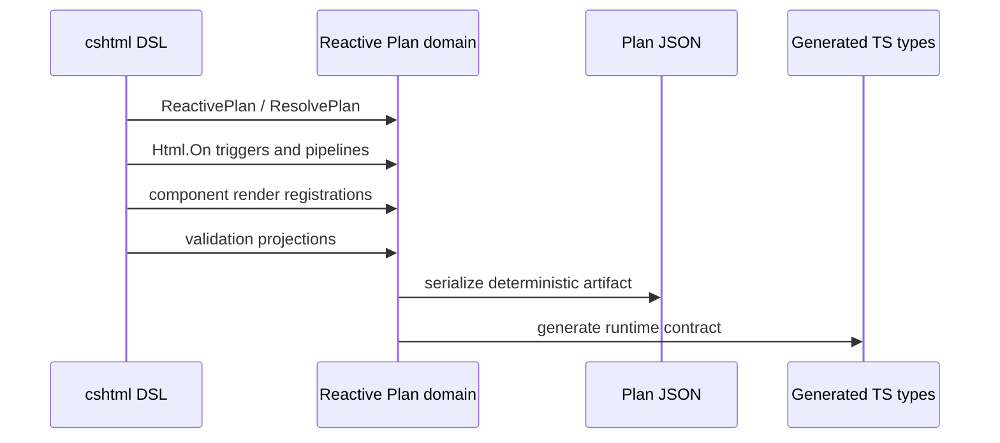
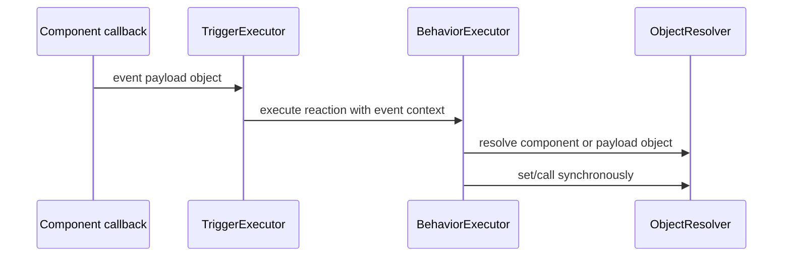
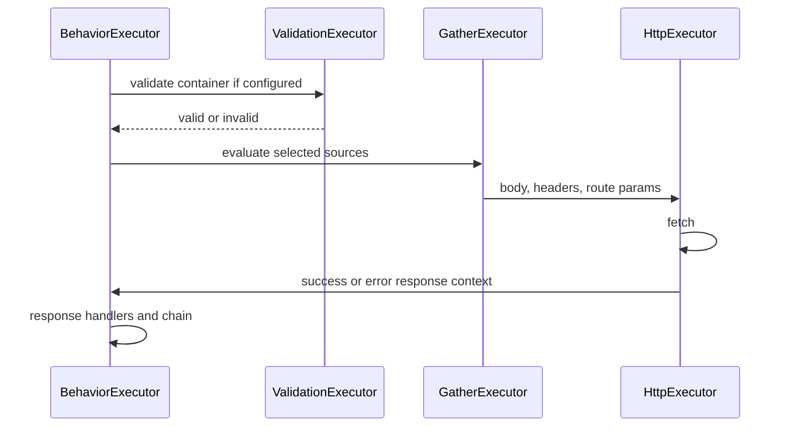
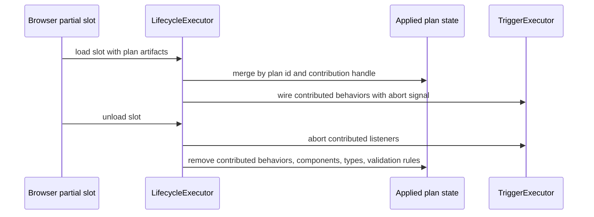
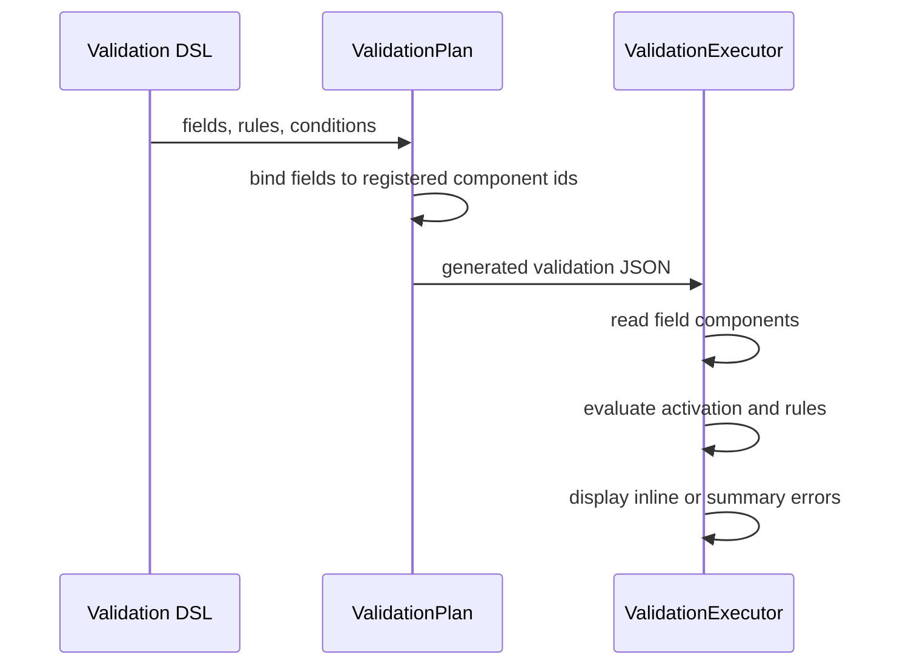

# Reactive Plan Source Blueprint

This document is the design proof for the refactor. The public DSL is the source of truth. XML docs, schema files, and the current runtime are not design sources.

The required flow is:

```text
typed cshtml DSL -> rich Reactive Plan domain model -> generated Plan JSON and TypeScript contract -> runtime executor
```

The runtime executes the plan. It does not infer missing behavior and it does not defend against shapes that the generated domain model cannot emit.

## Source Roots

The blueprint is grounded in these source families:

| Source family | Role in the DSL |
| --- | --- |
| `Alis.Reactive/Razor/Extensions/PlanExtensions.cs` | View, same-model partial, render lifecycle |
| `Alis.Reactive/Razor/Extensions/HtmlExtensions.cs` | `Html.On` behavior attachment |
| `Alis.Reactive/Razor/Extensions/InputFieldExtensions.cs` | Model-bound input field surface |
| `Alis.Reactive/ReactivePlan.cs` | Plan artifact, plugin registration, input registration, validation projection binding |
| `Alis.Reactive/Builders/TriggerBuilder.cs` | Page-ready, custom event, server push, SignalR triggers |
| `Alis.Reactive/Builders/PipelineBuilder*.cs` | Ordered reaction graph, target selection, dispatch, value source reads, HTTP, conditions |
| `Alis.Reactive/Builders/ElementBuilder.cs` | DOM element object property/method operations |
| `Alis.Reactive/Builders/Conditions/*.cs` | Compare, all, any, not, confirm, then, else-if, else |
| `Alis.Reactive/Builders/Requests/*.cs` | Request endpoint, gather, headers, route params, response, chain, parallel |
| `Alis.Reactive/Builders/DispatchPayloadBuilder.cs` | Runtime-computed custom event payload object |
| `Alis.Reactive/ReactivePlugin.cs`, `Alis.Reactive/PlanModel/PluginContract.cs`, and `Alis.Reactive/Builders/Plugin*.cs` | Plugin object contracts, reads, calls, properties, arguments |
| `Alis.Reactive/Validation/*.cs` | Direct client validation projection DSL and projection registry |
| `Alis.Reactive.FluentValidator/*.cs` | FluentValidation client-rule projection bridge |
| `Alis.Reactive/ComponentRef.cs` and `Alis.Reactive/ComponentMember.cs` | JS object property/method contract emission |
| `Alis.Reactive/ComponentOnboarding/*.cs` and `Alis.Reactive/ComponentRegistration.cs` | Component identity, render binding, gather and validation join keys |
| `Alis.Reactive.Native/**` | Native component vertical slices, native app-level components, native gather |
| `Alis.Reactive.Fusion/**` | Fusion component vertical slices, app-level components, Syncfusion event payload commands |
| `Alis.Reactive.Fusion/Templates/*.cs` | Render-only template DSL |
| `Alis.Reactive.Assets/runtime/types/plan.ts` | Generated TS contract target, not hand-written source |
| `Alis.Reactive.Assets/runtime/domain`, `runtime/execution`, `runtime/lifecycle`, `runtime/validation` | Runtime role evidence |

Every public DSL method in these roots needs one row in the traceability tables before implementation work is treated as complete.

## Source-Grounded Rule

This blueprint is not allowed to infer from current JSON shape, schema files, XML comments, or runtime defensive branches. The design input is the C# DSL source. A design row is complete only when it can point to an actual source method, event descriptor, component extension, or builder API and explain:

```text
source API -> developer intent -> domain concept -> JSON concept -> runtime executor
```

The rich model should be smaller than the source inventory. Public DSL variations are many, but they collapse to a short set of deterministic browser concepts: artifact, trigger, behavior, value, condition, request, gather source, validation projection, object contract, component slice, plugin contract.

## Verbatim DSL Inventory

This inventory uses source names from the DSL. It is the design checklist for implementation.

### Artifact And View DSL

| Source API | Source path | Developer intent | Domain concept | Runtime executor |
| --- | --- | --- | --- | --- |
| `ReactivePlan<TModel>(this IHtmlHelper<TModel> html)` | `Alis.Reactive/Razor/Extensions/PlanExtensions.cs` | Start a root view plan for the current model | `PlanArtifact.RootView` | `LifecycleExecutor.boot` |
| `ResolvePlan<TModel>(this IHtmlHelper<TModel> html)` | `Alis.Reactive/Razor/Extensions/PlanExtensions.cs` | Start same-model partial contribution | `PlanArtifact.PartialContribution` | `LifecycleExecutor.loadPartialSlot` |
| `RenderPlan<TModel>(this IHtmlHelper<TModel> html, ReactivePlan<TModel> plan)` | `Alis.Reactive/Razor/Extensions/PlanExtensions.cs` | Serialize plan into a browser plan artifact | `PlanArtifact.SerializationBoundary` | Browser boot/load plan discovery |
| `On<TModel>(this IHtmlHelper<TModel> html, ReactivePlan<TModel> plan, Action<TriggerBuilder<TModel>> trigger)` | `Alis.Reactive/Razor/Extensions/HtmlExtensions.cs` | Add behaviors to a plan | `BehaviorDefinitionSet` | `TriggerExecutor` |
| `InputField<TModel,TProp>(html, plan, expression)` | `Alis.Reactive/Razor/Extensions/InputFieldExtensions.cs` | Create a controlled input slot from model path | `InputBindingSlot` | render + validation/gather lookup |
| `InputField<TModel,TProp>(html, plan, expression, configure)` | `Alis.Reactive/Razor/Extensions/InputFieldExtensions.cs` | Same with label/required render options | `InputBindingSlot` plus render metadata | render + validation/gather lookup |
| `ReactivePlan<TModel>.RegisterPlugin(string, Action<PluginTypeBuilder>)` | `Alis.Reactive/ReactivePlan.cs` | Register string-based plugin contract | `PluginContract` | `PluginExecutor` |
| `ReactivePlan<TModel>.RegisterPlugin(ReactivePlugin)` | `Alis.Reactive/ReactivePlan.cs` | Register typed plugin contract | `PluginContract` | `PluginExecutor` |
| `ReactivePlan<TModel>.RegisterPlugin<TPlugin>()` | `Alis.Reactive/ReactivePlan.cs` | Construct/register typed plugin | `PluginContract` | `PluginExecutor` |
| `ReactivePlan<TModel>.Render()` and `RenderFormatted()` | `Alis.Reactive/ReactivePlan.cs` | Resolve registrations and emit JSON | `PlanDocument` | consumed by runtime |

### Trigger DSL

| Source API | Developer intent | Domain concept | JSON concept | Runtime executor |
| --- | --- | --- | --- | --- |
| `DomReady(Action<PipelineBuilder<TModel>> pipeline)` | Run when page is ready | `Trigger.PageReady` | `startsWhen.kind = page-ready` | sync deferred listener |
| `CustomEvent(string eventName, Action<PipelineBuilder<TModel>> pipeline)` | Listen to untyped document event | `Trigger.DocumentEvent` | `document-event` | sync DOM listener |
| `CustomEvent<TPayload>(string eventName, Action<TPayload, PipelineBuilder<TModel>> pipeline)` | Listen to typed document event payload | `Trigger.DocumentEvent<TPayload>` | `document-event` + `PayloadContract.typed` | sync DOM listener |
| `ServerPush(string url, Action<PipelineBuilder<TModel>> pipeline)` | Listen to SSE endpoint | `Trigger.ServerPush` | `server-push` | async remote trigger |
| `ServerPush(string url, string eventType, Action<PipelineBuilder<TModel>> pipeline)` | Listen to named SSE event | `Trigger.ServerPush.Named` | `server-push` + event type | async remote trigger |
| `ServerPush<TPayload>(string url, string eventType, Action<TPayload, PipelineBuilder<TModel>> pipeline)` | Listen to named typed SSE event | `Trigger.ServerPush<TPayload>` | `server-push` + typed payload | async remote trigger |
| `SignalR(string hubUrl, string methodName, Action<PipelineBuilder<TModel>> pipeline)` | Listen to SignalR method | `Trigger.SignalR` | `signalr` | async remote trigger |
| `SignalR<TPayload>(string hubUrl, string methodName, Action<TPayload, PipelineBuilder<TModel>> pipeline)` | Listen to typed SignalR method | `Trigger.SignalR<TPayload>` | `signalr` + typed payload | async remote trigger |
| `Reactive<TModel,TArgs>(..., TypedEvent<TArgs>, Action<TArgs, PipelineBuilder<TModel>>)` in component slices | Listen to component event/callback | `Trigger.ComponentEvent` | `component-event` | sync component callback listener |

### Pipeline DSL

| Source API | Developer intent | Domain concept | JSON concept | Runtime executor |
| --- | --- | --- | --- | --- |
| `Dispatch(string eventName)` | Dispatch document event without payload | `Behavior.Dispatch` | `reaction.kind = dispatch` | sync dispatch |
| `Dispatch<TPayload>(string eventName, TPayload payload)` | Dispatch literal typed payload | `Behavior.Dispatch` + literal payload | `dispatch.payload.literal` | sync dispatch |
| `DispatchWith<TPayload>(string eventName, Action<DispatchPayloadBuilder<TPayload,TModel>> configure)` | Dispatch computed runtime payload | `Behavior.Dispatch` + `ObjectValue` | `dispatch.payload.object` | sync value evaluation then dispatch |
| `Element(string elementId)` | Target DOM element object | `ObjectTarget.DomElement` | component source for browser element | object resolver |
| `Component<TComponent>(Expression<Func<TModel, object>> expr)` | Target model-bound component | `ObjectTarget.ComponentByModelPath` | component source | object resolver |
| `Component<TComponent,TOtherModel>(Expression<Func<TOtherModel, object>> expr)` | Target component from another model plan id/id convention | `ObjectTarget.ComponentByOtherModelPath` | component source | object resolver |
| `Component<TComponent>(string refId)` | Target explicit component id | `ObjectTarget.ComponentById` | component source | object resolver |
| `Component<TComponent>() where TComponent : IAppLevelComponent` | Target layout/app-level component by fixed id | `ObjectTarget.LayoutObject` | layout object component | object resolver |
| `FromUrl(string paramName)` | Read string query parameter | `Value.UrlParameter` | value read url | `ValueEvaluator` |
| `FromUrl<T>(string paramName)` | Read typed query parameter | `Value.UrlParameter<T>` | value read url + shape | `ValueEvaluator` |
| `Plugin<T>(string pluginName, string member)` | Read plugin method result | `Value.PluginMethodCall` | value read plugin method | `PluginExecutor` |
| `Plugin<T>(string pluginName)` | Read plugin root function result | `Value.PluginRootCall` | value read plugin `$call` | `PluginExecutor` |
| `PluginProperty<T>(string pluginName, string member)` | Read plugin property | `Value.PluginPropertyRead` | value read plugin property | `PluginExecutor` |
| `Plugin<T>(PluginFunction<T> function)` | Read typed plugin function | `Value.PluginMethodCall` | value read plugin method | `PluginExecutor` |
| `Plugin<T>(PluginProperty<T> property)` | Read typed plugin property | `Value.PluginPropertyRead` | value read plugin property | `PluginExecutor` |
| `Plugin(string pluginName, string member)` | Call plugin command method | `Behavior.PluginCall` | `reaction.kind = call` on plugin source | `PluginExecutor` |
| `Plugin(string pluginName)` | Call plugin root command | `Behavior.PluginCall` | call `$call` on plugin source | `PluginExecutor` |
| `Plugin(PluginCommand command)` | Call typed plugin command | `Behavior.PluginCall` | call plugin source | `PluginExecutor` |
| `ValidationErrors(string formId)` | Show current validation/server errors | `Behavior.ShowValidationErrors` | `show-validation-errors` | `ValidationExecutor` |
| `Into(string elementId)` | Inject response HTML into element/partial slot | `Behavior.InjectHtml` | `inject` | `InjectionExecutor` + lifecycle boot for nested plans |

### Element DSL

| Source API | Developer intent | Domain concept | JS member contract | Runtime executor |
| --- | --- | --- | --- | --- |
| `AddClass(string className)` | Call `classList.add` | `Behavior.ObjectMethodCall` | `classAdd -> classList.add(string)` | sync call |
| `RemoveClass(string className)` | Call `classList.remove` | `Behavior.ObjectMethodCall` | `classRemove -> classList.remove(string)` | sync call |
| `ToggleClass(string className)` | Call `classList.toggle` | `Behavior.ObjectMethodCall` | `classToggle -> classList.toggle(string)` | sync call |
| `SetText(string text)` | Set literal text | `Behavior.ObjectPropertySet` | `text -> textContent` | sync set |
| `SetText<TSource>(TSource source, Expression<Func<TSource, object>> path)` | Set text from event args | `Behavior.ObjectPropertySet` | `text -> textContent` | sync set |
| `SetText<TResponse>(ResponseBody<TResponse> source, Expression<Func<TResponse, object>> path)` | Set text from response body | `Behavior.ObjectPropertySet` | `text -> textContent` | sync set after HTTP |
| `SetText<TProp>(TypedSource<TProp> source)` | Set text from typed value source | `Behavior.ObjectPropertySet` | `text -> textContent` | sync set |
| `SetHtml(string html)` | Set literal HTML | `Behavior.ObjectPropertySet` | `html -> innerHTML` | sync set |
| `SetHtml<TSource>(TSource source, Expression<Func<TSource, object>> path)` | Set HTML from event args | `Behavior.ObjectPropertySet` | `html -> innerHTML` | sync set |
| `SetHtml<TProp>(TypedSource<TProp> source)` | Set HTML from typed value source | `Behavior.ObjectPropertySet` | `html -> innerHTML` | sync set |
| `Show()` | Set hidden false | `Behavior.ObjectPropertySet` | `hidden` | sync set |
| `Hide()` | Set hidden true | `Behavior.ObjectPropertySet` | `hidden` | sync set |

### Condition DSL

| Source API | Developer intent | Domain concept | JSON concept | Runtime executor |
| --- | --- | --- | --- | --- |
| `When<TPayload,TProp>(TPayload payload, Expression<Func<TPayload,TProp>> path)` | Start branch from event payload path | `ConditionOperand.PayloadRead` | compare left value producer | `ConditionEvaluator` |
| `When<TPayload,TProp>(ResponseBody<TPayload> responseBody, Expression<Func<TPayload,TProp>> path)` | Start branch from response body path | `ConditionOperand.ResponseRead` | compare left value producer | `ConditionEvaluator` |
| `When<TProp>(TypedSource<TProp> source)` | Start branch from typed source | `ConditionOperand.ValueExpression` | compare left value producer | `ConditionEvaluator` |
| `Confirm(string message)` | User confirmation guard | `Condition.Confirm` | confirm condition | async lane |
| `Eq`, `NotEq`, `Gt`, `Gte`, `Lt`, `Lte` with literal operand | Binary compare to literal | `Condition.Compare` | `compare.operator` + literal right | sync condition |
| `Truthy`, `Falsy`, `IsNull`, `NotNull`, `IsEmpty`, `NotEmpty` | Unary compare | `Condition.Compare` | `compare.operator` no right operand | sync condition |
| `In`, `NotIn` | Membership compare | `Condition.Compare` | array operand | sync condition |
| `Between` | Inclusive range compare | `Condition.Compare` | range operand | sync condition |
| `Contains`, `StartsWith`, `EndsWith`, `Matches`, `MinLength` | Text compare | `Condition.Compare` | text/numeric operand | sync condition |
| `ArrayContains` | Collection membership compare | `Condition.Compare` | collection item operand | sync condition |
| `Eq`, `NotEq`, `Gt`, `Gte`, `Lt`, `Lte` with `TypedSource<TProp>` | Source-to-source compare | `Condition.Compare` | right value producer | sync condition |
| `And(payload/path)`, `And(response/path)`, `And(TypedSource<T>)` | Add `all` condition | `Condition.All` | `condition.kind = all` | sync condition |
| `Or(payload/path)`, `Or(response/path)`, `Or(TypedSource<T>)` | Add `any` condition | `Condition.Any` | `condition.kind = any` | sync condition |
| `And(Func<ConditionStart<TModel>, GuardBuilder<TModel>> inner)` | Nested all | `Condition.All` | nested/flattened all | sync condition |
| `Or(Func<ConditionStart<TModel>, GuardBuilder<TModel>> inner)` | Nested any | `Condition.Any` | nested/flattened any | sync condition |
| `Not()` | Negate current guard | `Condition.Not` | `condition.kind = not` | sync condition |
| `Then(Action<PipelineBuilder<TModel>> pipeline)` | Guarded branch body | `BranchCase.Guarded` | branch case | behavior executor |
| `ElseIf(payload/path)`, `ElseIf(response/path)`, `ElseIf(TypedSource<T>)` | Additional guarded branch | `BranchCase.Guarded` | branch case | behavior executor |
| `Else(Action<PipelineBuilder<TModel>> pipeline)` | Default branch body | `BranchCase.Default` | default branch case | behavior executor |

### HTTP, Gather, And Response DSL

| Source API | Developer intent | Domain concept | JSON concept | Runtime executor |
| --- | --- | --- | --- | --- |
| `Get(string url)`, `Post(string url)`, `Put(string url)`, `Delete(string url)` | Select endpoint | `RequestEndpoint` | request method/url | `HttpExecutor` |
| `Post(string url, Action<GatherBuilder<TModel>> gather)` | POST with inline gather | `RequestEndpoint` + `GatherInput` | request input | `HttpExecutor` |
| `Put(string url, Action<GatherBuilder<TModel>> gather)` | PUT with inline gather | `RequestEndpoint` + `GatherInput` | request input | `HttpExecutor` |
| `Parallel(params Action<HttpRequestBuilder<TModel>>[] branches)` | Concurrent HTTP group | `Behavior.ParallelRequests` | parallel reaction | async parallel executor |
| `Gather(Action<GatherBuilder<TModel>> gather)` | Build request input | `GatherInput` | `request.input` | `GatherExecutor` |
| `AsJson()` | JSON payload format | `RequestBodyFormat.Json` | `bodyFormat = json` | fetch resolver |
| `AsFormData()` | FormData payload format | `RequestBodyFormat.FormData` | `bodyFormat = form-data` | fetch resolver |
| `WhileLoading(Action<PipelineBuilder<TModel>> pipeline)` | Before-request behavior | `RequestStage.Before` | `request.before[]` | behavior executor before fetch |
| `Finally(Action<PipelineBuilder<TModel>> pipeline)` | Always-after behavior | `RequestStage.Complete` | `request.complete[]` | behavior executor after fetch |
| `Validate<TValidationSource>(string formId)` | Client validation gate | `RequestValidationTarget` | `request.validation` | `ValidationExecutor` before fetch |
| `Response(Action<ResponseBuilder<TModel>> response)` | Route response outcomes | `ResponseRouteSet` | success/error/chain | `HttpExecutor` |
| `OnSuccess(Action<PipelineBuilder<TModel>> pipeline)` | Any success response | `ResponseHandler.Success` | success handler | behavior executor with success context |
| `OnSuccess<TResponse>(Action<ResponseBody<TResponse>, PipelineBuilder<TModel>> pipeline)` | Typed success body | `ResponseHandler.Success<T>` | success handler + payload contract | behavior executor with success payload |
| `OnError(Action<PipelineBuilder<TModel>> pipeline)` | Any error response | `ResponseHandler.Error` | error handler | behavior executor with error context |
| `OnError(int statusCode, Action<PipelineBuilder<TModel>> pipeline)` | Status-specific error | `ResponseHandler.ErrorStatus` | exact status match | behavior executor |
| `OnError<TError>(...)` and `OnError<TError>(int statusCode, ...)` | Typed error body | `ResponseHandler.Error<T>` | error handler + payload contract | behavior executor with error payload |
| `Chained(Action<HttpRequestBuilder<TModel>> request)` | Follow-up request after success | `RequestChain.FollowUp` | `chain.kind = follow-up` | `HttpExecutor` |
| `OnAllSettled(Action<PipelineBuilder<TModel>> pipeline)` | Parallel completion behavior | `ParallelCompletion.OnSettled` | `parallel.completion` | async parallel executor |

### Gather Sources

| Source API | Developer intent | Domain concept | Runtime executor |
| --- | --- | --- | --- |
| `IncludeAll()` | Include all registered input bindings | `GatherSourceSelection.AllRegisteredInputs` | reads registered component values |
| `Static(string param, object value)` | Literal request field | `PayloadAssignment.Literal` | payload writer |
| `FromEvent<TArgs,TProp>(TArgs args, Expression<Func<TArgs,TProp>> path, string param)` | Request field from event payload | `PayloadAssignment.EventPayloadRead` | payload writer |
| `Header(string name, string value)` | Literal header | `RequestHeader.Literal` | fetch resolver |
| `Header<TProp>(string name, TypedSource<TProp> source)` | Header from typed source | `RequestHeader.ValueExpression` | fetch resolver |
| `Header<TArgs,TProp>(string name, TArgs args, Expression<Func<TArgs,TProp>> path)` | Header from event payload | `RequestHeader.EventPayloadRead` | fetch resolver |
| `RouteParam(string paramName, int/string/long value)` | Literal route template replacement | `RouteParameter.Literal` | fetch resolver |
| `RouteParam<TProp>(string paramName, TypedSource<TProp> source)` | Route parameter from typed source | `RouteParameter.ValueExpression` | fetch resolver |
| `RouteParam<TArgs,TProp>(string paramName, TArgs args, Expression<Func<TArgs,TProp>> path)` | Route parameter from event payload | `RouteParameter.EventPayloadRead` | fetch resolver |
| `FromUrl(string paramName)`, `FromUrl(string paramName, string asParam)` | URL query to request field | `PayloadAssignment.UrlRead` | payload writer |
| `FromUrl<T>(string paramName)`, `FromUrl<T>(string paramName, string asParam)` | Typed URL query to request field | `PayloadAssignment.UrlRead<T>` | payload writer |
| `Plugin<T>(TypedPluginSource<T> source, string paramName)` | Plugin read to request field | `PayloadAssignment.PluginRead` | payload writer |
| `Include<TComponent,TModel>(Expression<Func<TModel, object>> expr)` | Model-bound component value | `PayloadAssignment.ComponentValueRead` | component resolver |
| `Include<TComponent,TModel>(string refId, string name)` | Explicit component value/property | `PayloadAssignment.ComponentValueRead` | component resolver |
| `Include<TModel,TProp>(TypedComponentSource<TProp> source)` | Typed component property read | `PayloadAssignment.ComponentPropertyRead` | component resolver |
| `Include<TModel,TProp>(TypedComponentSource<TProp> source, string paramName)` | Typed component property read to explicit field | `PayloadAssignment.ComponentPropertyRead` | component resolver |
| Native `Include<TModel>(this GatherBuilder<TModel>, Expression<Func<TModel, object>> expr)` | Native convenience gather | same `ComponentValueRead` | component resolver |

### Dispatch Payload DSL

| Source API | Developer intent | Domain concept | Runtime executor |
| --- | --- | --- | --- |
| `Set<TProp>(Expression<Func<TPayload,TProp>> field, TypedSource<TProp> source)` | Payload field from runtime source | `ObjectValue.Field.ValueExpression` | `ValueEvaluator` |
| `Set(Expression<Func<TPayload,string>> field, string value)` | Literal string payload field | `ObjectValue.Field.Literal` | `ValueEvaluator` |
| `Set(Expression<Func<TPayload,int>> field, int value)` | Literal int payload field | `ObjectValue.Field.Literal` | `ValueEvaluator` |
| `Set(Expression<Func<TPayload,bool>> field, bool value)` | Literal bool payload field | `ObjectValue.Field.Literal` | `ValueEvaluator` |

### Validation DSL

| Source API | Developer intent | Domain concept | Runtime executor |
| --- | --- | --- | --- |
| `ClientValidationProjectionRegistry.Create(...)` | Build direct validation projection source | `ValidationProjectionRegistry` | validation plan source |
| `For<TValidationSource,TModel>(Action<ClientValidationProjectionBuilder<TModel>> define)` | Bind validation source type to model projection | `ValidationProjection` | request validation lookup |
| `Field<TValue>(Expression<Func<TModel,TValue>> field)` | Register a model validation field | `ValidationField` | component binding lookup |
| `Field<TValue>(ClientValidationFieldToken<TModel,TValue> field)` | Register reusable validation field token | `ValidationField` | component binding lookup |
| `Required`, `Empty`, `Email`, `Url`, `CreditCard`, `AtLeastOne` | No-operand client rule | `ValidationRule.NoOperand` | rule engine |
| `MinLength`, `MaxLength`, `Regex` | Text/numeric constrained client rule | `ValidationRule.Constraint` | rule engine |
| `Range`, `ExclusiveRange` | Range constrained client rule | `ValidationRule.Range` | rule engine |
| `Min`, `Max`, `GreaterThan`, `LessThan` | Ordered scalar client rule | `ValidationRule.OrderedComparison` | rule engine |
| `EqualTo(TValue)`, `NotEqual(TValue)` | Literal equality rule | `ValidationRule.LiteralEquality` | rule engine |
| `EqualTo(Expression<...>)`, `EqualTo(ClientValidationFieldToken<...>)` | Peer equality rule | `ValidationRule.PeerEquality` | rule engine reads peer component |
| `NotEqualTo(Expression<...>)`, `NotEqualTo(ClientValidationFieldToken<...>)` | Peer inequality rule | `ValidationRule.PeerEquality` | rule engine reads peer component |
| `When(condition, define)` | Conditional client rule scope | `ValidationRuleActivation.When` | validation condition evaluator |
| Validation condition `Field(...).Truthy/Falsy/Eq/Neq/Gt/Gte/Lt/Lte/IsNull/NotNull/IsEmpty/NotEmpty/In/NotIn/Between/Contains/StartsWith/EndsWith/Matches/MinLength/ArrayContains` | Field condition | `FieldCondition.Compare` | validation condition evaluator |
| Validation condition `And`, `Or`, `Not` | Condition composition | `FieldCondition.All/Any/Not` | validation condition evaluator |

### FluentValidation Client Projection DSL

| Source API | Developer intent | Domain concept | Projection rule |
| --- | --- | --- | --- |
| `ProjectToClient(...)` | Mark one FluentValidation property validator as client-executable | `ExplicitClientRuleProjection` | projected unless property validator is async |
| `ClientValidationRuleWriter.Required/Empty/Email/Url/CreditCard/AtLeastOne` | Explicit no-operand client rule | `ValidationRule.NoOperand` | projected |
| `ClientValidationRuleWriter.Min/Max/GreaterThan/LessThan/EqualTo/NotEqual` | Explicit literal comparison | `ValidationRule.Constraint` | projected |
| `ClientValidationRuleWriter.MinLength/MaxLength/Regex/Range/ExclusiveRange` | Explicit constrained rule | `ValidationRule.Constraint` / `Range` | projected |
| `ClientValidationRuleWriter.EqualTo/NotEqualTo/GreaterThan/GreaterThanOrEqualTo/LessThan/LessThanOrEqualTo(peerField)` | Explicit peer comparison | `ValidationRule.Peer` | projected |
| `ReactiveValidator.WhenField*` methods | Server predicate plus matching client activation | `ClientConditionProjection` | projected |
| `ReactiveValidator.WhenFields(Func<FieldConditionBuilder<T>, FieldGuard<T>> buildCondition, Action defineRules)` | Complex field condition | `ClientConditionProjection` | projected |
| `ReactiveValidator.When/Unless/WhenAsync/UnlessAsync` | Server-only condition | no client rule activation | skipped for client projection |
| FluentValidation async property validators | Server-only validator | no client rule | skipped |
| Child validators/includes | Nested projection | prefixed `ValidationFieldPath` | projected recursively when deterministic |

### Plugin DSL

| Source API | Developer intent | Domain concept | Runtime executor |
| --- | --- | --- | --- |
| `PluginTypeBuilder.Method<T>(string name)` | Open-args method returning `T` | `PluginMethodContract.Open` | plugin method call/read |
| `PluginTypeBuilder.Method<TReturn>(string name, Action<PluginArgumentTypes> arguments)` | Exact-args method returning `T` | `PluginMethodContract.Exact` | plugin method call/read |
| `PluginTypeBuilder.Method<TReturn,TArg1/TArg2/TArg3>(string name)` | Typed arity method | `PluginMethodContract.Exact` | plugin method call/read |
| `PluginTypeBuilder.Property<T>(string name)` | Readable plugin property | `PluginPropertyContract.Read` | plugin property read |
| `PluginTypeBuilder.Function<T>()`, `Function<TReturn>(Action<...>)`, `Function<TReturn,TArg...>()` | Root plugin function | `PluginMethodContract.RootCall` | plugin `$call` read |
| `PluginTypeBuilder.Void/Command(...)` overloads | Plugin method/root command returning none | `PluginCommandContract` | plugin call reaction |
| `PluginArgumentTypes.Arg<T>()` | Add exact argument shape | `MethodArgumentShape` | argument shaper |
| `ReactivePlugin.Function/Property/Command` protected overloads | Typed plugin descriptor without consumer strings | `PluginContract` | plugin read/call |
| `PluginReadBuilder.Arg(...)` overloads | Plugin read argument from response/event/source/literal | `InvocationArgument` | value evaluator |
| `PluginCallBuilder.Arg(...)` overloads + `Fire()` | Plugin command argument from response/event/source/literal | `InvocationArgument` + `Behavior.PluginCall` | plugin executor |

### Component DSL Inventory

Every component slice maps to the same domain shape:

```text
render method -> optional controlled id/input binding
Reactive(...) -> component event trigger
ComponentRef extension returning ComponentRef -> method call or property write
extension returning TypedComponentSource<T> -> property read
event args extension -> payload object method call/property write
```

Native source-backed component surface:

| Component | Render/reactive APIs | Object APIs | Event descriptors |
| --- | --- | --- | --- |
| `NativeActionLink` | `NativeActionLink<TModel>(...)` | inline action plan carrier | click from generated anchor |
| `NativeButton` | `NativeButton<TModel>(...)`, `Reactive<TModel,TArgs>(...)` | `SetText`, `FocusIn` | `Click` |
| `NativeTextBox` | `NativeTextBox<TModel,TProp>(...)`, `Reactive<TModel,TProp,TArgs>(...)` | `SetValue`, `FocusIn`, `Value` | `Changed(Value)` |
| `NativeTextArea` | `NativeTextArea<TModel,TProp>(...)`, `Reactive<TModel,TProp,TArgs>(...)` | `SetValue`, `FocusIn`, `Value` | `Changed(Value)` |
| `NativeHiddenField` | `HiddenFieldFor<TModel,TProp>(...)`, `Reactive<TModel,TProp,TArgs>(...)` | `SetValue` literal/source/response, `Value` | `Changed(Value)` |
| `NativeCheckBox` | `NativeCheckBox<TModel>(...)`, `Reactive<TModel,TProp,TArgs>(...)` | `SetChecked`, `FocusIn`, `Value` | `Changed(Checked)` |
| `NativeCheckList` | `NativeCheckList<TModel,TProp>(...)`, `Reactive<TModel,TProp,TArgs>(...)` | `SetValue` literal/source, `FocusIn`, `Value` | `Changed(Value)` |
| `NativeDropDown` | `NativeDropDown<TModel,TProp>(...)`, `Reactive<TModel,TProp,TArgs>(...)` | `SetValue`, `FocusIn`, `Value` | `Changed(Value)` |
| `NativeRadioGroup` | `NativeRadioGroup<TModel,TProp>(...)`, `Reactive<TModel,TProp,TArgs>(...)` | `SetValue` literal/source, `FocusIn`, `Value` | `Changed(Value)` |
| `NativeDrawer` | `NativeDrawer(this IHtmlHelper)` | fixed id app object: `SetSize`, `Open`, `Close` | app-level |
| `NativeLoader` | `NativeLoader(this IHtmlHelper)` | fixed id app object: `SetTarget`, `SetTimeout`, `Show`, `Hide` | app-level |

Fusion source-backed component surface:

| Component | Render/reactive APIs | Object APIs | Event descriptors |
| --- | --- | --- | --- |
| `FusionAccordion` | `FusionAccordion<TModel>`, `Reactive<TModel,TArgs>` | `ExpandItem`, `EnableItem` | `Expanded(Index, IsExpanded)` |
| `FusionAutoComplete` | `Fields<TItem>`, `FusionAutoComplete<TModel,TProp>`, `Reactive<TModel,TArgs>` | `SetValue`, `SetText`, `SetDataSource`, `DataBind`, `FocusIn`, `FocusOut`, `ShowPopup`, `HidePopup`, `Enable`, `Disable`, `Value` | `Changed`, `Filtering`; filtering args `PreventDefault`, `UpdateData<TResponse>` |
| `FusionColorPicker` | `FusionColorPicker<TModel,TProp>`, `Reactive<TModel,TArgs>` | `SetValue`, `Toggle`, `Disable`, `Value` | `Changed` |
| `FusionDatePicker` | `FusionDatePicker<TModel,TProp>`, `Reactive<TModel,TArgs>` | `SetValue`, `FocusIn`, `FocusOut`, `Value` | `Changed` |
| `FusionDateRangePicker` | `FusionDateRangePicker<TModel,TProp>`, `Reactive<TModel,TArgs>` | `StartDate`, `EndDate`, `Value` | `Changed` |
| `FusionDateTimePicker` | `FusionDateTimePicker<TModel,TProp>`, `Reactive<TModel,TArgs>` | `SetValue`, `FocusIn`, `FocusOut`, `Value` | `Changed` |
| `FusionDialog` | `FusionDialog<TModel>`, `Reactive<TModel,TArgs>` | `Show`, `Hide`, `RefreshPosition` | `BeforeOpen`, `BeforeClose`, `Opened`, `Closed`, `OverlayClick` |
| `FusionDropDownList` | `Fields<TItem>`, `FusionDropDownList<TModel,TProp>`, `Reactive<TModel,TArgs>` | `SetValue`, `SetText`, `SetDataSource`, `DataBind`, `FocusIn`, `FocusOut`, `ShowPopup`, `HidePopup`, `Value` | `Changed`, `Focus`, `Blur` |
| `FusionFileUpload` | `FusionFileUpload<TModel,TProp>`, `Reactive<TModel,TArgs>` | `Value` | `Selected` |
| `FusionGrid` | `FusionGrid<TModel>`, `Reactive<TModel,TArgs>` | `SetDataSource`, `Refresh` | `DataStateChange` |
| `FusionInPlaceEditor` | `FusionInPlaceEditor<TModel,TProp>`, `Reactive<TModel,TArgs>` | `SetValue`, `Enable`, `Disable`, `Save`, `Focus`, `AddClass`, `RemoveClass`, `Value` | `BeginEdit`, `EndEdit`, `Changed`, `ActionBegin`, `ActionSuccess`, `SubmitClick`, `CancelClick`; prevent-default args |
| `FusionInputMask` | `FusionInputMask<TModel,TProp>`, `Reactive<TModel,TArgs>` | `SetValue`, `FocusIn`, `Value` | `Changed` |
| `FusionMultiColumnComboBox` | `Fields<TItem>`, `FusionMultiColumnComboBox<TModel,TProp>`, `Reactive<TModel,TArgs>` | `SetValue`, `SetText`, `SetDataSource`, `DataBind`, `FocusIn`, `FocusOut`, `ShowPopup`, `HidePopup`, `Value` | `Changed` |
| `FusionMultiSelect` | `Fields<TItem>`, `FusionMultiSelect<TModel,TProp>`, `Reactive<TModel,TArgs>` | `SetValue`, `SetDataSource`, `DataBind`, `ShowPopup`, `HidePopup`, `Value` | `Changed`, `Filtering`; filtering args `PreventDefault`, `UpdateData<TResponse>` |
| `FusionNumericTextBox` | `FusionNumericTextBox<TModel,TProp>`, `Reactive<TModel,TArgs>` | `SetValue`, `SetMin`, `FocusIn`, `FocusOut`, `Increment`, `Decrement`, `Value` | `Changed`, `Focus`, `Blur` |
| `FusionRichTextEditor` | `FusionRichTextEditor<TModel,TProp>`, `Reactive<TModel,TArgs>` | `SetValue`, `FocusIn`, `Value` | `Changed` |
| `FusionSchedule` | `FusionSchedule<TModel>`, `Reactive<TModel,TArgs>` | `CurrentView`, `SelectedDate`, `SetDataSource`, `AddEvent`, `SaveEvent`, `DeleteEvent`, `OpenEditor`, `CloseEditor`, `RefreshEvents`, `Print`, `ScrollTo` | `CellClicked`, `EventClicked`, `ActionBegin`, `ActionComplete`, `Navigating`, `PopupOpen`, `PopupClose`, `DataBound`, `EventRendered`; popup args `PreventDefault` |
| `FusionSwitch` | `FusionSwitch<TModel>`, `Reactive<TModel,TArgs>` | `SetChecked`, `Value` | `Changed` |
| `FusionTab` | `FusionTab<TModel>`, `Reactive<TModel,TArgs>` | `Select`, `HideTab`, `SetSelectedItem` | `Selected` |
| `FusionTimePicker` | `FusionTimePicker<TModel,TProp>`, `Reactive<TModel,TArgs>` | `SetValue`, `FocusIn`, `FocusOut`, `Value` | `Changed` |
| `FusionTooltip` | `FusionTooltip<TModel>`, `Reactive<TModel,TArgs>` | `Open`, `Close`, `Refresh` | `BeforeOpen`, `BeforeClose`, `Opened`, `Closed`, `BeforeRender` |
| `FusionConfirm` | `FusionConfirmDialog(this IHtmlHelper)` | fixed id app object: `SetContent`, `Show`, `Hide` | app-level |
| `FusionToast` | `FusionToast(this IHtmlHelper)` | fixed id app object: `SetTitle`, `SetContent`, `SetTimeout`, `ShowCloseButton`, `ShowProgressBar`, `Success`, `Warning`, `Danger`, `Info`, `Show`, `Hide` | app-level |

Fusion template DSL is render-only unless nested render output registers ids or behavior: `FusionTemplate.Create`, `Id`, `Class`, `Attr`, `Text`, `Span`, `Img`, `Div`, `Badge`, `Icon`, `Button`, `ButtonFor`, `EventButton`, `Link`, `When`, `ShowIf`, `Raw`, `Render`.

## Core Language

The central model is a deterministic browser object graph.

| Term | Meaning |
| --- | --- |
| `PlanArtifact` | A rendered plan document: root view, same-model partial contribution, independent partial root, or inline action-link plan. |
| `ContributionHandle` | Stable ownership handle for load/unload rollback. It is not a component id and not a type key. |
| `RuntimeJoinKey` | Component id, type key, plugin name, event name, or plan id used by runtime lookup. |
| `JsObjectContract` | Object members the runtime may read, write, call, or listen to. Applies to DOM elements, vendor components, app-level components, plugins, and event payload objects. |
| `PropertyMember` | Readable and/or writable JS object property with path, shape, and access. |
| `MethodMember` | Callable JS object method with path, argument shapes, and return shape. |
| `EventOrCallbackMember` | JS event or vendor callback channel that starts a reaction with optional payload contract. |
| `InputBinding` | Model path joined to rendered component id, value member, and value shape. |
| `ValueExpression` | Deterministic value producer: literal, object, array, URL read, payload read, property read, method read. |
| `BehaviorGraph` | Runtime executable reaction graph: sequence, set, call, dispatch, branch, request, parallel, inject, validation display. |
| `ConditionGraph` | Compare/all/any/not/confirm expression over value expressions. |
| `RequestPlan` | HTTP endpoint, route/header params, optional input payload, validation gate, lifecycle handlers, response handlers, chain. |
| `ValidationPlan` | Client-executable validation fields, rules, operands, activation conditions, display binding. |
| `PluginContract` | Browser plugin JS object contract: root/member functions, commands, properties, argument contracts. |
| `RenderContract` | Render-only options/templates. These do not become runtime behavior unless they register ids, bindings, or events. |

## DSL Grammar Matrix

### Plan Artifacts

| DSL source | Domain concept | JSON contract | Runtime role |
| --- | --- | --- | --- |
| `Html.ReactivePlan<TModel>()` | Root `PlanArtifact` for model type | `Plan.scope = root`, `planId` from model | Booted root plan registered and wired |
| `Html.ResolvePlan<TModel>()` | Same-model partial contribution | `Plan.scope = partial`, same `planId` as root model | Merge into booted plan; unload by contribution handle |
| Independent partial with its own `ReactivePlan` | Independent root artifact | Different `planId` | Boot or merge as separate plan document |
| `Html.RenderPlan(plan)` | Artifact serialization boundary | JSON script tag plus root validation summary for root plans | Boot/load consumes JSON; partial unload removes contribution |
| Native action link inline plan | Inline `PlanArtifact` carried in attributes | Serialized request/behavior fragment | Runtime executes the inline artifact when clicked |

### Triggers

| DSL source | Domain concept | JSON contract | Runtime role |
| --- | --- | --- | --- |
| `Html.On(plan, t => ...)` | Attach behavior definitions to artifact | `behaviors[]` | Trigger wiring scans behavior starts |
| `t.DomReady(...)` | Page-ready trigger | `startsWhen.kind = page-ready` | Deferred after non-page-ready listeners wire |
| `t.CustomEvent(name, ...)` | Document event trigger | `document-event` with untyped payload | `document.addEventListener` and payload context |
| `t.CustomEvent<TPayload>(name, ...)` | Typed document event trigger | `document-event` with `PayloadContract.typed` | Payload paths are typed at plan build |
| `t.ServerPush(url, ...)` | SSE trigger | `server-push` any event | Async event source listener |
| `t.ServerPush(url, eventType, ...)` | Named SSE trigger | `server-push` named event filter | Async event source listener |
| `t.ServerPush<TPayload>(...)` | Typed SSE trigger | `server-push` with typed payload | Payload paths are typed at plan build |
| `t.SignalR(hubUrl, method, ...)` | SignalR trigger | `signalr` | Async hub listener |
| `t.SignalR<TPayload>(...)` | Typed SignalR trigger | `signalr` with typed payload | Payload paths are typed at plan build |
| `builder.Reactive(plan, event, ...)` in component slices | Component event/callback trigger | `component-event` with component key and event name | Vendor event wiring resolves component object |

### Behavior Graph

| DSL source | Domain concept | JSON contract | Runtime role |
| --- | --- | --- | --- |
| Sequential calls inside pipeline | Ordered `BehaviorGraph.Sequence` | `sequence.steps[]` or single reaction | Execute in order |
| `p.Element(id)` | DOM element object target | Component object target with browser element type | Resolve `document.getElementById` as JS object |
| `SetText`, `SetHtml`, `Show`, `Hide` | Property write | `set` reaction | Sync property assignment |
| `AddClass`, `RemoveClass`, `ToggleClass` | DOM method call | `call` reaction | Sync method invocation |
| `p.Component<T>(expr)` | Model-bound component target | `component` source by deterministic id | Resolve vendor runtime object |
| `p.Component<T, TOtherModel>(expr)` | Cross-model component target | `component` source by other model id | Resolve vendor runtime object |
| `p.Component<T>(id)` | Explicit component target | `component` source by id | Resolve vendor runtime object |
| `p.Component<TApp>()` | App-level component target | Layout object component with fixed id | Resolve layout-owned object |
| Component extension `Set*` | JS property write | `set` reaction | Sync property assignment |
| Component extension method call | JS method call | `call` reaction | Sync method invocation |
| Component extension `Value` or readable property | Component property read | `ValueExpression.read(component)` | Evaluate value |
| `p.Dispatch(name)` | Event dispatch without payload | `dispatch` with none | Sync document `CustomEvent` |
| `p.Dispatch<TPayload>(name, literal)` | Event dispatch with literal payload | `dispatch` with literal data and payload contract | Sync document `CustomEvent` |
| `p.DispatchWith<TPayload>(...)` | Event dispatch with runtime-computed payload | `dispatch` with object `ValueExpression` | Evaluate values then dispatch |
| `p.ValidationErrors(containerId)` | Display validation errors | `show-validation-errors` | Client validate or server-error display |
| `p.Into(elementId)` | HTML injection from response body | `inject` | Inject string HTML and boot nested plans |

### Value Expressions

| DSL source | Domain concept | JSON contract | Runtime role |
| --- | --- | --- | --- |
| Literal strings, numbers, bools, dates, raw objects | Literal value | `ValueProducer.literal` with shape | Shape conversion |
| `p.FromUrl(name)` and `p.FromUrl<T>(name)` | URL query read | `read` from `url` | Read `URLSearchParams` |
| Event payload expressions | Payload path read | `read` from `payload:event` | Read typed event payload path |
| `ResponseBody<T>` expressions | Response payload read | `read` from `payload:success` or `payload:error` | Read typed response body path |
| `responseBody` whole body | Whole payload read | `member = responseBody` | Read payload root |
| Component readable property | JS object property read | `read` from `component` with property access | Runtime object read |
| Plugin property | JS object property read | `read` from `plugin` with property access | Runtime plugin object read |
| Plugin function | JS object method read | `read` from `plugin` with method access and args | Runtime plugin call returning value |
| Dispatch payload object | Object value | `ValueProducer.object` | Recursively evaluate fields |
| Membership/range operands | Array value | `ValueProducer.array` | Recursively evaluate items |

### Conditions

| DSL source | Domain concept | JSON contract | Runtime role |
| --- | --- | --- | --- |
| `p.When(payload, path)` | Event-payload compare start | `Condition.compare.left = payload read` | Evaluate compare |
| `p.When(responseBody, path)` | Response-body compare start | `Condition.compare.left = response read` | Evaluate compare |
| `p.When(typedSource)` | Typed source compare start | `Condition.compare.left = value expression` | Evaluate compare |
| `p.Confirm(message)` | User confirmation guard | `Condition.confirm` | Async lane because browser prompt/confirm can pause |
| `Eq`, `NotEq`, `Gt`, `Gte`, `Lt`, `Lte` | Binary comparison | `compare` with operator and right value | Compare shaped values |
| `Truthy`, `Falsy`, `IsNull`, `NotNull`, `IsEmpty`, `NotEmpty` | Unary comparison | `compare` with no right operand | Compare shaped value |
| `In`, `NotIn` | Membership comparison | `compare` with array operand | Evaluate membership |
| `Between` | Range comparison | `compare` with two-item array | Evaluate range |
| `Contains`, `StartsWith`, `EndsWith`, `Matches`, `MinLength` | Text comparison | `compare` with text/number operand | Evaluate text condition |
| `ArrayContains` | Collection item comparison | `compare` with literal item | Evaluate collection membership |
| `Eq/Gt/... (TypedSource<T>)` | Source-vs-source compare | `compare` with right value expression | Evaluate both sources |
| `And`, `Or` from sources | Condition composition | `all` or `any` | Short logical evaluation |
| Nested `And(start => ...)`, `Or(start => ...)` | Nested condition composition | Nested or flattened `all`/`any` | Logical evaluation |
| `Not()` | Negation | `not` | Logical not |
| `Then(...)` | Branch case | `branch.cases[].guard = when` | Execute first matching case |
| `ElseIf(...)` | Additional branch case | Additional `branch.cases[]` | Continue matching in order |
| `Else(...)` | Default branch case | `branch.cases[].guard = default` | Execute when no previous match |

### HTTP

| DSL source | Domain concept | JSON contract | Runtime role |
| --- | --- | --- | --- |
| `p.Get/Post/Put/Delete(url)` | Request endpoint | `Request.method`, `Request.url` | Async fetch lane |
| Inline `Post(url, gather)` and `Put(url, gather)` | Endpoint plus gather | `Request.input = gather` | Async fetch lane |
| `.Gather(...)` | Request input builder | `GatherInput` | Build request payload |
| `.AsJson()` | JSON body format | `bodyFormat = json` | Serialize JSON |
| `.AsFormData()` | Form data body format | `bodyFormat = form-data` | Serialize `FormData` |
| `.WhileLoading(...)` | Before request reaction stage | `Request.before[]` | Execute before fetch |
| `.Finally(...)` | Complete reaction stage | `Request.complete[]` | Execute after fetch settles |
| `.Validate<TValidationSource>(formId)` | Client validation gate | `Request.validation.container` | Validate before fetch; stop request on invalid |
| `.Response(r => ...)` | Response routing | `success[]`, `error[]`, `chain` | Route by fetch result |
| `r.OnSuccess(...)` | Any success handler | `success` handler any | Execute with success context |
| `r.OnSuccess<TResponse>(...)` | Typed success handler | `success` handler with typed payload contract | Typed response reads |
| `r.OnError(...)` | Any error handler | `error` handler any | Execute with error context |
| `r.OnError(status, ...)` | Status error handler | `error.match.status` | Execute matching status |
| `r.OnError<TError>(...)` | Typed error handler | `error` handler with typed payload contract | Typed error reads |
| `r.Chained(...)` | Follow-up request | `Request.chain.follow-up` | Execute next request after current response |
| `p.Parallel(...)` | Concurrent request group | `parallel.steps[]` | Async `Promise.allSettled` |
| `.OnAllSettled(...)` | Parallel completion reaction | `parallel.completion.on-settled` | Execute after all settle |

### Gather

| DSL source | Domain concept | JSON contract | Runtime role |
| --- | --- | --- | --- |
| `g.IncludeAll()` | Select all registered input bindings | `sourceSelection = all-registered-inputs` | Read all registered component values |
| `g.Static(name, value)` | Literal payload assignment | `payloadAssignments[]` | Write into payload path |
| `g.FromEvent(args, path, param)` | Event payload assignment | Payload read assignment | Write into payload path |
| `g.Header(name, value/source/event)` | Header source | `Request.headers` | Evaluate scalar header |
| `g.RouteParam(name, value/source/event)` | Route placeholder source | `Request.routeParams` | Fill URL template |
| `g.FromUrl(...)` | URL query assignment | URL read assignment | Write into payload path |
| `g.Plugin(source, param)` | Plugin read assignment | Plugin read assignment | Write into payload path |
| `g.Include<TComponent>(expr)` | Model-bound component value | Component read assignment plus component binding | Read registered input |
| `g.Include<TComponent>(id, name)` | Explicit component value | Component read assignment | Read component property/value member |
| `g.Include(typedComponentSource)` | Typed component property read | Component read assignment | Write into payload path |
| Native gather extensions | Native field groups | Same gather assignments | Runtime is vendor-agnostic |

### Validation

| DSL source | Domain concept | JSON contract | Runtime role |
| --- | --- | --- | --- |
| `ClientValidationProjectionBuilder<T>.Field(expr/token)` | Projected client field | `ComponentValidation.component/value/serverFieldName` | Resolve bound component and read value |
| `ClientValidationProjectionRegistry.Create(... For<TValidationSource,TModel>)` | Validation projection source keyed by validation source type | Validation rules bound to a validation container | Request validation resolves the client projection by source type |
| Direct rules `Required`, `Empty`, `Email`, `Url`, `CreditCard`, `AtLeastOne` | No-operand client rules | Rule with `constraint:none` | Rule engine |
| `MinLength`, `MaxLength`, `Regex` | Text/numeric constraint rules | Rule with literal constraint | Rule engine |
| `Range`, `ExclusiveRange` | Range constraint rules | Rule with range constraint | Rule engine |
| `Min`, `Max`, `GreaterThan`, `LessThan` | Ordered comparison rules | Rule with scalar constraint | Rule engine |
| `EqualTo`, `NotEqual` literal | Literal equality rules | Rule with scalar constraint | Rule engine |
| `EqualTo`, `NotEqualTo` peer field | Peer equality rules | Rule with peer read | Rule engine reads peer component |
| Projection `.When(condition, define)` | Rule activation | `activation.when` with validation condition | Rule active only if condition passes |
| Validation condition `Field(...).Truthy/Falsy/...` | Field condition compare | `ValidationCondition.compare` | Condition evaluator over current form values |
| Validation condition `And/Or/Not` | Validation condition composition | `all`, `any`, `not` | Logical evaluation |
| FluentValidation `.ProjectToClient(...)` | Explicit client projection marker | Registered projected rule | Adapter emits only client rule |
| `.ProjectToClient(...)` on async FluentValidation property validator | Server-only rule | No client projection | Runtime has no role |
| `ReactiveValidator.WhenField*` and `WhenFields` | Projectable client condition plus server predicate | Rule activation condition | Same condition also guards server rule |
| FluentValidation ordinary `When/Unless` | Server-only condition | No client projection | Adapter skips client projection under server-only condition |
| FluentValidation `WhenAsync/UnlessAsync` and async validators | Server-only validation | No client projection | Runtime never executes it |
| FluentValidation member-to-member comparison without explicit projection | Server-only comparison | No client projection | Peer client comparisons require `.ProjectToClient(...)` |
| Child validators/includes | Nested validation projection | Prefixed field paths | Runtime reads prefixed components |

### Plugin

| DSL source | Domain concept | JSON contract | Runtime role |
| --- | --- | --- | --- |
| `plan.RegisterPlugin(name, p => ...)` | String plugin contract | `JsType` plus plugin source | Resolve browser plugin by name |
| `plan.RegisterPlugin(ReactivePlugin)` | Typed plugin contract | `JsType` plus plugin source | Resolve browser plugin by name |
| `plan.RegisterPlugin<TPlugin>()` | Construct typed plugin contract | Same | Same |
| `PluginTypeBuilder.Method<T>` | Member function returning value | Method member with return shape | Runtime object call in value evaluation |
| `PluginTypeBuilder.Property<T>` | Readable property | Property member read access | Runtime object property read |
| `PluginTypeBuilder.Function<T>` | Root function returning value | Method member `$call` with root path | Runtime object call |
| `PluginTypeBuilder.Void/Command` | Command method/root command | Method member returning none | Runtime call reaction |
| `ReactivePlugin.Function/Property/Command` | Typed descriptors | Same contracts without string use by consumer | Same |
| `PluginTypeBuilder.Method<T>` and `Void/Command` without arg contract | Open argument contract | Method arguments `open` | Runtime passes evaluated args |
| `PluginArgumentTypes.Arg<T>` and typed arity overloads | Exact argument contract | Method arguments `exact` with shapes | Runtime applies argument shapes |
| `ReactivePlugin.Function/Command` descriptors | Exact argument list from descriptor | Method arguments `exact`, including empty exact list | Runtime applies argument shapes |
| `p.Plugin<T>(name/member/function)` | Plugin function read | `ValueExpression.read(plugin, method)` | Evaluate by calling plugin |
| `p.PluginProperty<T>(...)` or `p.Plugin(property)` | Plugin property read | `ValueExpression.read(plugin, property)` | Evaluate by reading plugin |
| `p.Plugin(name/member/command).Arg(...).Fire()` | Plugin command call | `call` reaction on plugin source | Sync method invocation |
| Plugin arg from response/event/typed source/literals | Argument value expressions | Method access args | Evaluate args then call |
| Plugin event arg overloads | Event payload read by expression path | Payload read arg | Runtime reads event payload; the C# args instance is not serialized |

### Component Vertical Slices

The component DSL is deliberately vertical. The rich model underneath must be shared.

| Slice source | Domain concept | Runtime effect |
| --- | --- | --- |
| `*HtmlExtensions.cs` | Render component and register controlled id/binding when model-bound | Emits HTML and input registration |
| `*Builder.cs` | Render-only options | No runtime behavior unless registration/events are added |
| `*Events.cs` and `Events/*.cs` | Event/callback descriptors and payload objects | Payload contract for typed event reads |
| `*ReactiveExtensions.cs` | Component event/callback trigger DSL | Adds `component-event` behavior |
| `*Extensions.cs` | Component property read/write and method calls | Emits JS object contract and reactions |
| `*GatherExtensions.cs` | Component value source selection | Emits gather value read |
| App-level components | Fixed layout object id | Join existing layout object, do not own model binding |
| Event arg extensions like `PreventDefault` and `UpdateData` | Event payload object property set/method call | Sync payload mutation inside event callback |
| Fusion templates | Render contract | No runtime behavior unless nested DSL registers behavior |

Component onboarding reduces to:

```text
component id + vendor + type key + object contract + optional input binding + optional event contracts
```

## Rich Domain Model Target

The C# model should be organized around the DSL language, not around serialization plumbing.

| Module | Owns | Does not own |
| --- | --- | --- |
| `Artifacts` | Root, partial contribution, independent partial root, inline artifact, contribution handle | Component lookup rules |
| `Objects` | JS object contracts, members, paths, shapes, access, method signatures | HTTP, validation, trigger policy |
| `Components` | Component identity, vendor, type key, contribution intent, input binding, event/callback contract | Vendor rendering details |
| `Values` | Literals, object/array producers, URL reads, payload reads, object reads/calls | Runtime DOM lookup |
| `Behaviors` | Sequence, set, call, dispatch, branch, request, parallel, inject, validation display | Browser APIs directly |
| `Conditions` | Compare/all/any/not/confirm, operands, shaped comparison intent | Request lifecycle |
| `Requests` | Endpoint, params, gather, body format, validation gate, response routes, chain, parallel | Component registration |
| `Validation` | Client projection, fields, rules, operands, activation, binding to components | Server-only FluentValidation behavior |
| `Plugins` | Plugin contract and invocation language | Vendor component APIs |
| `Rendering` | HTML-only options/templates and registration hooks | Executable behavior |

The generated JSON and TS contract should be emitted from these modules. No hand-written TS type should describe plan concepts independently from C#.

## Concrete Domain Blueprint

The implementation target is this source-derived model. These names are allowed because each one directly names DSL behavior above.

| Domain type | Represents | Created by DSL source | Emits |
| --- | --- | --- | --- |
| `PlanArtifact` | Root view, same-model partial contribution, independent root, inline action plan | `ReactivePlan`, `ResolvePlan`, action-link render | `PlanDocument` |
| `PlanIdentity` | Plan id plus root/partial scope | model type + plan scope | `planId`, `scope` |
| `ContributionHandle` | Browser slot load/unload handle | partial slot load | not a component key; runtime bookkeeping only |
| `BrowserObjectContract` | JS object capabilities: properties, methods, events/callbacks | component extensions, plugin registration, DOM element DSL | `JsType` |
| `ObjectProperty` | Read/write property with member name, JS path, shape, access | `Set*`, `Value`, plugin property, element text/html/hidden | `properties[member]` |
| `ObjectMethod` | Callable method with member name, JS path, argument shapes, return shape | `FocusIn`, `DataBind`, plugin methods, event-arg commands | `methods[member]` |
| `ObjectEvent` | Event/callback channel with payload contract | `TypedEvent<TArgs>` descriptors and `Reactive(...)` | `events[member]` |
| `ComponentObject` | Runtime object id/vendor/type/role | component render, `p.Component`, app-level component references | `components[key]` |
| `InputBinding` | Model path joined to component id/value member/shape | `InputField`, model-bound render extensions | registered input binding |
| `ValueExpression` | Runtime-computable value | literals, URL, payload, response body, component property, plugin call/property, object payload | `ValueProducer` |
| `Behavior` | Executable reaction | pipeline DSL, component/event-arg extensions | `Reaction` |
| `Condition` | Deterministic guard | `When`, comparison operators, `And`, `Or`, `Not`, `Confirm` | `Condition` |
| `Request` | HTTP exchange intent | `Get/Post/Put/Delete`, gather, validation, response, chain | `Request` |
| `GatherPlan` | What sources are read and where they are written | `GatherBuilder` and gather extensions | `RequestInput`, headers, route params |
| `ResponseRoute` | Success/error/status branch | `ResponseBuilder` | response handlers |
| `ValidationProjection` | Client-executable validation rules | direct validation DSL and FluentValidation projection | validation container rules |
| `PluginContract` | Browser plugin object contract | `RegisterPlugin`, `ReactivePlugin`, `PluginTypeBuilder` | plugin `JsType` + source |
| `RenderContract` | Render-only configuration/templates | component builders, Fusion templates | HTML only unless it also registers id/event/input |

### Type Boundaries

| Boundary | Allowed knowledge | Forbidden knowledge |
| --- | --- | --- |
| DSL builders | C# expressions, component type, plugin descriptors, model-bound id generation | Runtime fallback rules |
| Domain model | Deterministic browser concepts and invariants that source DSL can express | Defensive validation of impossible generated plan shapes |
| JSON emitter | Stable serialized contract from domain concepts | Independent schema decisions |
| TS generated contract | Runtime importable representation of domain concepts | Hand-written duplicate interpretation |
| Runtime executors | Browser APIs, object resolution, value execution, fetch, validation display, partial load/unload | Inferring missing plan intent or re-validating framework-generated shape |

### Mapping Rules

1. `ComponentRef` extension returning `ComponentRef<...>` becomes either `SetProperty` or `CallMethod`.
2. Extension returning `TypedComponentSource<T>` becomes `ValueExpression.ObjectPropertyRead`.
3. Plugin read builders become `ValueExpression.ObjectMethodCall` or `ObjectPropertyRead`; plugin call builders become `Behavior.CallMethod`.
4. Event args command extensions become payload object `SetProperty` or `CallMethod`, and must stay in the sync lane.
5. `Gather` is a payload projection: each source says what it reads and the request path/header/route target it writes.
6. Validation projection is only client-executable validation. Server-only FluentValidation remains server-side and does not need a runtime model.
7. Partial merge uses `planId` to find the applied plan, runtime join keys to find objects, and contribution handles only to remove what a slot loaded.

## JSON Contract Target

The JSON should remain a small published language:

| Domain concept | JSON discriminant |
| --- | --- |
| Plan artifact | `Plan.scope: root | partial` |
| JS object contract | `JsType.properties`, `methods`, `events` |
| Component role | `Component.contribution: owned-definition | object-target | validation-container | layout-object` |
| Input binding | `binding: registered-input` |
| Validation container | `container: validation-container` |
| Trigger | `startsWhen.kind` |
| Reaction | `reaction.kind` |
| Value expression | `ValueProducer.kind` plus read source/access |
| Condition | `Condition.kind` |
| Request input | `RequestInput.kind` |
| Request chain | `RequestChain.kind` |
| Rule activation | `ValidationRuleActivation.kind` |

The TS runtime type contract is generated from this C# domain. Runtime implementation imports generated types but does not duplicate domain rules as a second schema.

## Runtime Executors

| Executor | Responsibility | Lane |
| --- | --- | --- |
| `LifecycleExecutor` | Boot root plans, compose initial plans, load partial slots, unload partial slots | Sync orchestration with async listener cleanup |
| `TriggerExecutor` | Wire page-ready, document events, component events, SSE, SignalR | Sync for DOM/component events; async for remote event streams |
| `ObjectResolver` | Resolve component/plugin/event-payload object roots and member paths | Sync |
| `ValueEvaluator` | Evaluate literals, object/array values, URL reads, payload reads, object reads/calls | Sync unless future value source is explicitly async |
| `ConditionEvaluator` | Evaluate compare/all/any/not/confirm | Sync except confirm |
| `BehaviorExecutor` | Execute set/call/dispatch/inject/branch/sequence/show-validation | Sync until it reaches an async concept |
| `HttpExecutor` | Validate, gather, route params, headers, fetch, route response, chain | Async |
| `ValidationExecutor` | Evaluate client rules, display inline/summary/server errors, live revalidation | Sync |
| `PluginExecutor` | Resolve plugin object and execute declared property/method access | Sync |

The sync lane is required for component event payload mutations such as Syncfusion cancel/prevent-default operations. HTTP, remote triggers, parallel requests, and confirm are the selected async concepts.

## Partial Plan Matrix

| Scenario | Identity rule | Merge behavior | Unload behavior |
| --- | --- | --- | --- |
| MVC renders root and same-model partial together | Same `planId`, partial scope contribution | Compose initial plan by plan id before boot | Not applicable unless later slot owns it |
| Browser loads same-model partial into slot | Same `planId`, slot contribution handle | Merge behavior, types, components, validation rules into booted plan | Abort listeners, remove contributed behavior/types/components/rules |
| Browser loads independent partial model | Different `planId` | Create or merge independent plan document | Remove that plan if contribution leaves it empty |
| Partial references root-owned component | Component id/type/vendor must match root runtime identity | Join as object target or validation extension | Remove only contributed references/rules |
| Partial owns new component | Component key owned by contribution handle | Add component and type fragments | Remove component and any live validation wiring |
| Partial contributes layout object reference | Fixed app-level id/type/vendor | Materialize if absent, otherwise join matching root object | Remove only if materialized by that partial and no remaining partial references |
| Partial contributes object type fragment | Type key is runtime join key | Merge compatible member fragments | Recompute remaining type from root plus other partial fragments |
| Partial contributes validation rules | Container identity must match root container | Append/replace by validated component rules | Remove only contributed rule objects |

## Design Sequences

### DSL Build



### Component Event



### HTTP



### Partial Load And Unload



### Validation Projection



## Proof Bar

No implementation refactor is complete until these checks pass:

1. Every public DSL method in the source roots appears in a traceability row.
2. Every row maps to one domain concept, one JSON concept, and one runtime executor role.
3. Every component vertical slice maps to the shared component object contract: properties, methods, events/callbacks, optional input binding, optional render-only options.
4. Validation distinguishes client projection from server validation. Server-only and async FluentValidation behavior is not projected.
5. Partial merge/unmerge uses contribution handles for rollback and runtime join keys for lookup.
6. Runtime preserves sync execution for ordinary object and payload mutations.
7. Runtime async appears only on explicit async concepts: HTTP, parallel, remote triggers, confirm.
8. No generated plan schema is treated as design authority. C# rich domain model emits JSON and TS contracts.
9. Defensive runtime validation is limited to external integration failure messages: missing DOM element, missing browser plugin, missing vendor runtime, corrupted external JSON. It is not a second plan validator.
10. Tests are behavior documents by module: lifecycle, object contracts, pipeline execution, HTTP/gather, conditions, validation, plugin, component trigger wiring.

## Immediate Implementation Order

1. Close the DSL matrix with source review comments.
2. Rename and arrange plan-domain files around the module map above.
3. Replace anemic plan construction with domain concepts from this blueprint.
4. Generate `runtime/types/plan.ts` from the rich domain contract.
5. Trim runtime to the executor modules listed above.
6. Rearrange tests by behavior module and delete implementation-shaped tests.
7. Only then continue component-specific onboarding cleanup.
