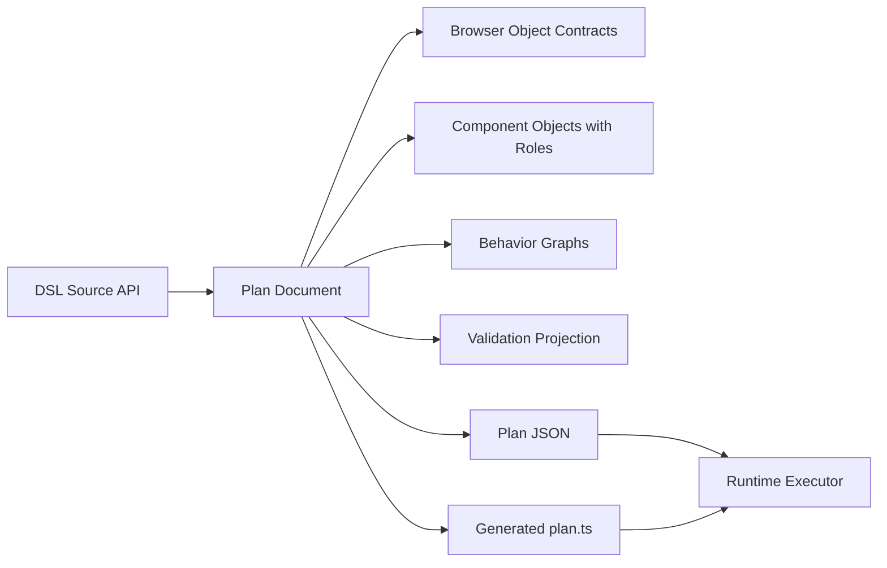
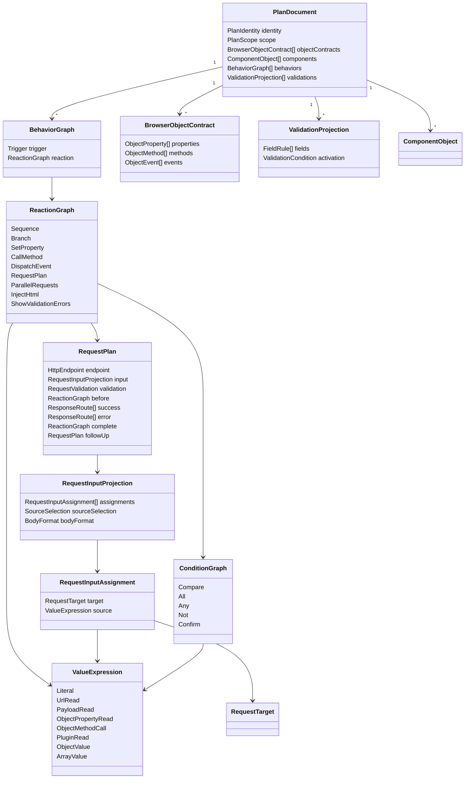
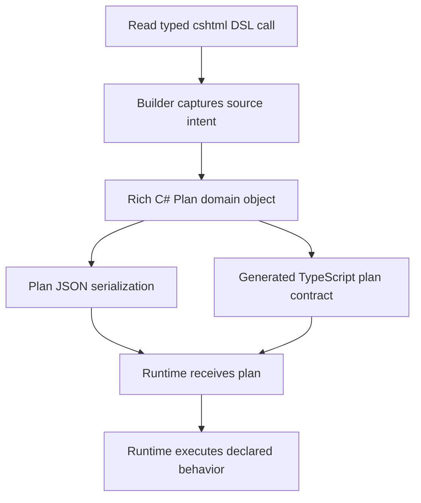
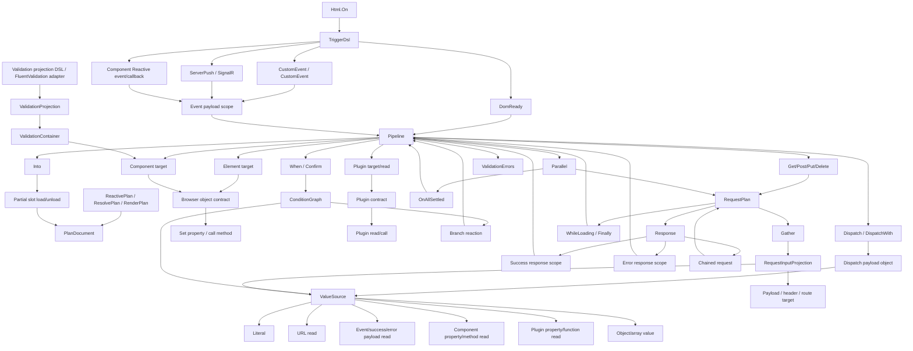
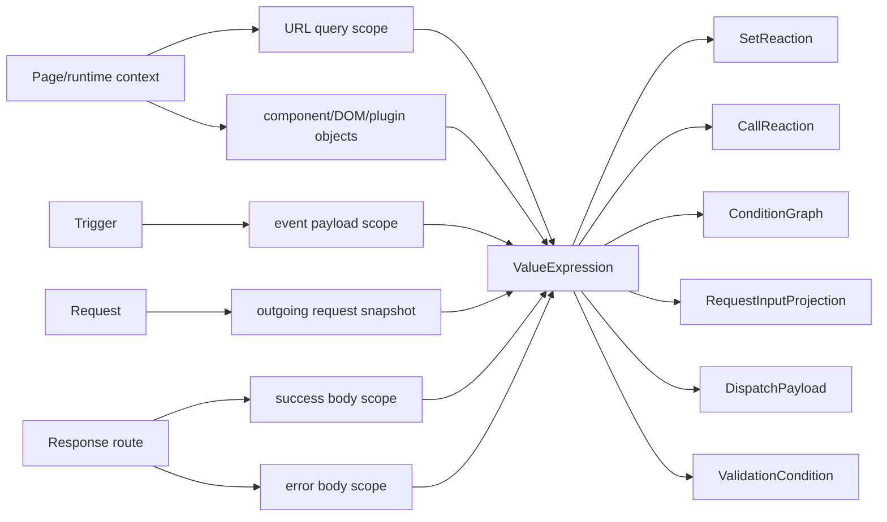
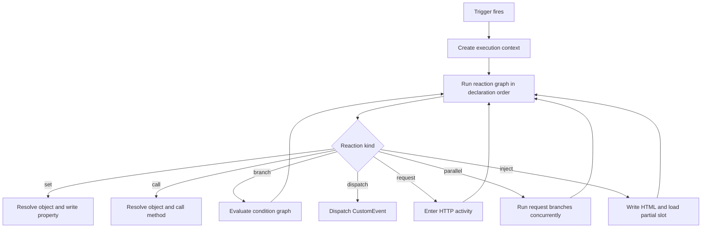
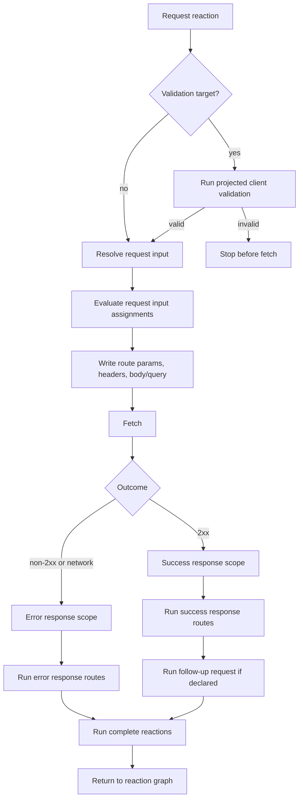
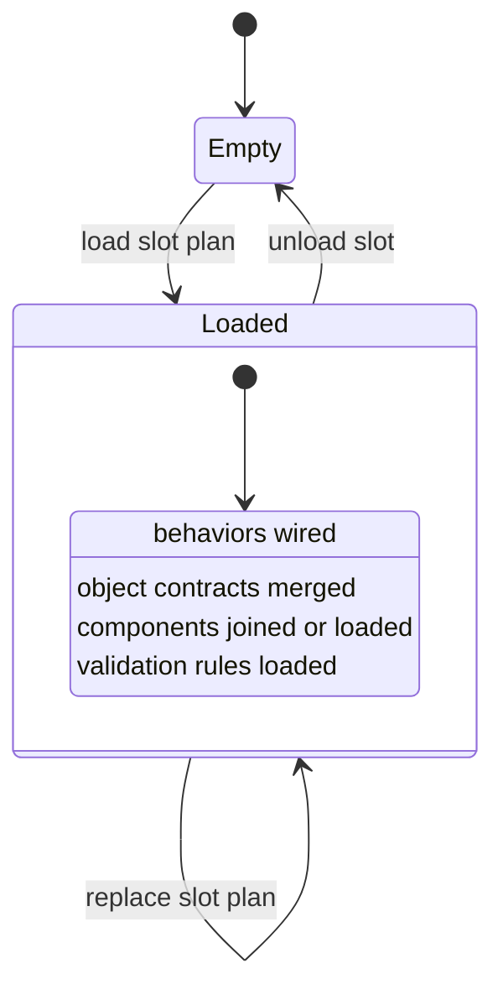
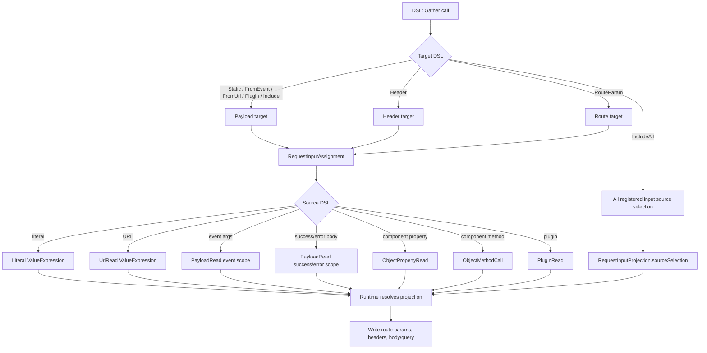
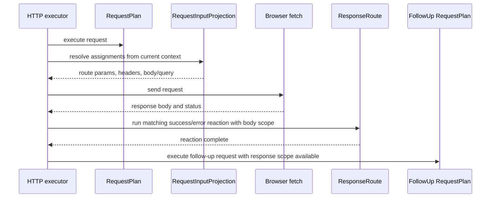

# Reactive Plan Source Blueprint

This blueprint is the design gate for the rich Reactive Plan refactor. The
frozen public DSL source is the requirement. Current JSON shape, old unit tests,
XML docs, and runtime defensive branches are not design sources.

Required flow:

```text
typed cshtml DSL -> rich C# Plan Domain -> Plan JSON + generated plan.ts -> runtime executor
```

Runtime executes the generated plan. It does not invent missing behavior and it
does not validate impossible framework-generated shapes.

## Source Roots

| Source root | DSL role |
| --- | --- |
| `Alis.Reactive/Razor/Extensions/PlanExtensions.cs` | root plan, same-model partial plan, serialization |
| `Alis.Reactive/Razor/Extensions/HtmlExtensions.cs` | attach behaviors to a plan |
| `Alis.Reactive/Razor/Extensions/InputFieldExtensions.cs` | model-bound input slot authoring |
| `Alis.Reactive/ReactivePlan.cs` | plan identity, plugin registration, input registration, validation binding |
| `Alis.Reactive/Builders/TriggerBuilder.cs` | page, document, SSE, SignalR triggers |
| `Alis.Reactive/Builders/PipelineBuilder*.cs` | reaction graph, component/object targets, URL reads, plugins, HTTP, conditions |
| `Alis.Reactive/Builders/Conditions/*.cs` | compare/all/any/not/confirm/then/else-if/else |
| `Alis.Reactive/Builders/Requests/*.cs` | request endpoint, gather, validation gate, response routing, chain, parallel |
| `Alis.Reactive/Builders/DispatchPayloadBuilder.cs` | custom event payload object |
| `Alis.Reactive/ReactivePlugin.cs`, `Alis.Reactive/Builders/Plugin*.cs` | plugin contract and plugin invocation |
| `Alis.Reactive/Validation/*.cs` | direct deterministic client validation projection |
| `Alis.Reactive.FluentValidator/*.cs` | ReactiveValidator client-rule metadata and DI-backed rule source |
| `Alis.Reactive/ComponentRef.cs`, `Alis.Reactive/ComponentMember.cs` | browser object property/method contract emission |
| `Alis.Reactive/ComponentOnboarding/*.cs` | component identity, event onboarding, model-bound slots |
| `Alis.Reactive.Native/**` | Native vertical slices, app-level objects, native gather, action link |
| `Alis.Reactive.Fusion/**` | Fusion vertical slices, app-level objects, Syncfusion event/callback payloads |

## Domain Map



## Structural Design

The design is organized around deterministic browser behavior, not current
helper classes. This class diagram is the target shape every module must map to.



## Execution Activities

### DSL Build To Runtime Contract



## DSL Capability Graph

This graph is the source-derived design map. A DSL capability is covered only
when its edge from authoring context to runtime executor is explicit here and in
the source matrix below.



### Context And Scope Graph



### Behavior Execution



### HTTP Request Activity



### Partial Slot State



Core domain terms:

| Domain term | JSON/TS term | Runtime term |
| --- | --- | --- |
| Plan Document | `Plan` | `RuntimePlan` / applied browser plan |
| Plan Identity | `planId` | plan lookup key |
| Plan Scope | `scope.kind=root|partial` | root boot or slot load |
| Browser Object Contract | `types[typeKey]` | runtime object contract |
| Component Object | `components[componentId]` | runtime component entry |
| Component Role | `component.role.kind` | component slot merge behavior |
| Behavior Graph | `behaviors[]` | trigger wiring + reaction execution |
| Reaction Tree | `Reaction` union | sync/async executor |
| Value Expression | `ValueProducer` union | value resolver |
| Condition Graph | `Condition` union | condition evaluator |
| Request Plan | `Request` | HTTP executor |
| Request Input Projection | `GatherInput` / request input | request payload writer |
| Validation Projection | validation-container component rules | validation orchestrator |
| Plugin Contract | plugin object contract | plugin resolver/invoker |
| Partial Slot | partial plans loaded into an `Into(...)` host | slot source for active plan recomposition |

## Source Matrix

Each row is an input/output proof. A module is not closed until its code and
tests match the row language.

| Source API | DSL input | Rich domain output | JSON/TS term | Runtime output |
| --- | --- | --- | --- | --- |
| `Html.ReactivePlan<TModel>()` | `var plan = Html.ReactivePlan<Order>()` | root `PlanDocument` with model-derived `PlanIdentity` | `scope.kind="root"`, `planId` | booted plan with validation summary |
| `Html.ResolvePlan<TModel>()` | partial view starts `ResolvePlan<Order>()` | partial `PlanDocument` sharing model `PlanIdentity` | `scope.kind="partial"`, same `planId` | initial SSR composition or browser slot load |
| `Html.RenderPlan(plan)` | render plan script | serialization boundary for the plan document | JSON `<script data-reactive-plan>` | plan discovery at boot or injection |
| `Html.On(plan, t => ...)` | attach one or more triggers | behavior definitions added to plan | `behaviors[]` | trigger wiring scans behavior starts |
| `TriggerBuilder.DomReady` | `t.DomReady(p => ...)` | page-ready behavior graph | `startsWhen.kind="page-ready"` | execute after page boot |
| `TriggerBuilder.CustomEvent` | `t.CustomEvent("saved", p => ...)` | document event behavior | `document-event` | subscribe to document event |
| `TriggerBuilder.CustomEvent<T>` | typed payload callback | document event with payload contract | event payload shape | read `event.detail` through payload scope |
| `TriggerBuilder.ServerPush` | SSE URL and optional event type | server-push behavior | `server-push` | subscribe through EventSource, async boundary |
| `TriggerBuilder.ServerPush<T>` | typed SSE payload | server-push with payload contract | payload shape | parse event data into payload scope |
| `TriggerBuilder.SignalR` | hub URL + method name | SignalR behavior | `signalr` | subscribe to hub method, async boundary |
| `TriggerBuilder.SignalR<T>` | typed hub payload | SignalR behavior with payload contract | payload shape | payload scope for reaction graph |
| component `.Reactive(...)` extensions | vendor event/callback selector | component event behavior and event contract | `component-event` + object event member | vendor adapter wires event/callback channel |
| `p.Dispatch(name)` | no payload custom event | dispatch reaction | `reaction.kind="dispatch"` | `document.dispatchEvent` |
| `p.Dispatch(name, payload)` | literal typed payload | dispatch reaction with literal payload | payload value + contract | dispatch `CustomEvent.detail` |
| `p.DispatchWith<T>` | field assignments from sources/literals | object value expression for payload | object `ValueProducer` | resolve fields, then dispatch |
| `p.Element(id)` | DOM element target | component object with DOM type contract | component role `object-target`; element type members | DOM object lookup by id |
| `Element.AddClass/RemoveClass/ToggleClass` | class mutation | method call reaction on DOM contract | `call` + method path `classList.*` | call DOM classList method |
| `Element.SetText/SetHtml` | literal, event, response, typed source | property set reaction | `set` + `ValueProducer` | write DOM text/html |
| `Element.Show/Hide` | visibility mutation | hidden property write | `set hidden=false|true` | toggle hidden property |
| `p.Component<TComponent>(expr)` | model-bound component target | object target from generated component id | component id from model expression | join rendered component object |
| `p.Component<TComponent, TOtherModel>(expr)` | cross-model component target | object target from other model id | component id from other model expression | join component in partial/root composition |
| `p.Component<TComponent>(id)` | explicit component id | explicit object target | component id literal | join explicit component object |
| `p.Component<TAppLevel>()` | fixed app-level target | layout object role | `role.kind="layout-object"` | join/create fixed layout object |
| vendor `Set*` methods | `p.Component<FusionX>(...).SetValue(...)` | component property write contract | `set` reaction, property contract | write JS object property/path |
| vendor command methods | `FocusIn`, `ShowPopup`, `DataBind`, etc. | component method contract | `call` reaction, method contract | call JS object method/path |
| vendor `Value()` reads | condition/gather source | typed component value source | `ValueProducer` component read | read JS object property/path |
| component events classes | `events.Changed`, `events.Opened`, callback-like selectors | event channel contract | object event member + payload contract | adapter invokes behavior on channel |
| `p.FromUrl<T>` | query string source | URL value expression | URL `ValueProducer` with shape | read URLSearchParams and convert |
| event payload expressions | `(args,p) => p.Element(...).SetText(args,x=>x.Name)` | payload value expression | payload scope `event` + path | read `event.detail` path |
| response body expressions | `OnSuccess<T>((body,p)=>...)` | payload value expression | payload scope `success/error` + path | read response body path |
| `p.Plugin<T>(name, member)` | plugin method read | plugin operation contract + value source | plugin source call with return shape | invoke plugin and use return value |
| `p.PluginProperty<T>(name, member)` | plugin property read | plugin property contract + value source | plugin source read | read plugin property |
| `p.Plugin(name, member).Arg(...).Fire()` | plugin command | call reaction on plugin object | `call` reaction on plugin source | invoke plugin command |
| typed `ReactivePlugin` descriptors | subclass declares functions/properties/commands | plugin contract from typed descriptors | plugin type contract | runtime uses declared args/returns |
| `PluginTypeBuilder` compatibility API | string plugin declaration | plugin contract | plugin type contract | same runtime plugin invocation |
| plugin `.Arg(...)` overloads | literal/source/event/response args | ordered call arguments | `ValueProducer[]` | resolve args before plugin call |
| `p.When(event, path)` | condition from event payload | compare source from payload | `Condition.Compare` | evaluate payload read |
| `p.When(responseBody, path)` | condition from response body | compare source from success/error payload | `Condition.Compare` | evaluate response read |
| `p.When(source)` | condition from URL/component/plugin source | compare source from typed value expression | `Condition.Compare` | evaluate source |
| condition operators | `Eq`, `NotEq`, `Gt`, `Gte`, `Lt`, `Lte` | binary comparison | compare op + operands | compare converted values |
| presence operators | `Truthy`, `Falsy`, `IsNull`, `NotNull`, `IsEmpty`, `NotEmpty` | unary comparison | compare op + left operand | evaluate presence |
| collection/text operators | `In`, `NotIn`, `Between`, `Contains`, `StartsWith`, `EndsWith`, `Matches`, `MinLength`, `ArrayContains` | typed comparison operands | compare op + literal/array operand | evaluate in condition engine |
| source-vs-source compare | `Eq(TypedSource<T>)`, etc. | binary comparison of two value expressions | compare op + two `ValueProducer`s | resolve both sources |
| `Guard.And/Or(source)` | chained condition terms | flattened `all` or `any` | `condition.kind="all|any"` | short-circuit terms |
| `Guard.And/Or(inner)` | nested condition expression | composed condition graph | nested `all|any|not` | evaluate graph |
| `Guard.Not()` | negated condition | `not` condition | `condition.kind="not"` | invert result |
| `Guard.Then` | branch reaction | branch case with reaction tree | `reaction.kind="branch"` | execute first matching branch |
| `BranchBuilder.ElseIf` | ordered else-if branch | additional branch case | `BranchCase` | preserve branch order |
| `BranchBuilder.Else` | default branch | default final branch | default branch case | execute when no conditions match |
| multiple `p.When(...).Then(...)` blocks | branch, then later request/dispatch/branch | sequence containing multiple branch reactions | `sequence` with branch/request/etc. in order | preserve declaration order |
| `p.Confirm(message).Then(...)` | confirmation guard | confirm condition + branch | `condition.kind="confirm"` | prompt/user decision async boundary |
| `p.Get/Post/Put/Delete` | request start | request reaction draft | `reaction.kind="request"` | HTTP executor |
| `HttpRequestBuilder.Gather` | ordered request source-to-target mapping | request input projection | `GatherInput.assignments` | write route/header/body/query payload in declaration order |
| `Gather.IncludeAll` | all registered inputs | source selection for registered inputs | `sourceSelection.kind="all-registered-inputs"` | read mounted registered input values |
| `Gather.Static` | literal payload assignment | payload assignment | request payload target + literal | write request body/query |
| `Gather.FromEvent` | event payload into request | payload assignment from event scope | event payload `ValueProducer` | read event detail path |
| `Gather.Header` | literal/source/event header | header assignment | header target | write request header |
| `Gather.RouteParam` | literal/source/event/URL/component/plugin route param | route assignment bound to URL template | route target | substitute URL placeholder |
| `Gather.FromUrl` | query value into request | URL read assignment | URL `ValueProducer` | read query param |
| `Gather.Plugin` | plugin read into request | plugin value assignment | plugin `ValueProducer` | invoke/read plugin before fetch |
| `Gather.Include(TypedComponentSource<T>)` | component property or method value source | component member assignment | component read/call `ValueProducer` | read property or call method before fetch |
| explicit component gather include | `g.Include(componentId, vendor, propertyName, valueMember)` | old-app controlled-id escape hatch; component value assignment resolved through registered input contract | component object read using declared member | read component value for request without runtime guessing |
| typed component gather include | `g.Include<Component,TModel>(...)`, native shorthand, or `g.Include(TypedComponentSource<T>)` | component value assignment + input/member contract | component property or method read | read component member value for request |
| `HttpRequestBuilder.AsJson/AsFormData` | request content type | request body format | `bodyFormat` | JSON or FormData writer |
| `HttpRequestBuilder.Validate<T>` | form validation gate | validation target for request | request validation target | run projected client rules before fetch |
| `HttpRequestBuilder.WhileLoading` | pre-request reaction graph | request before reactions | `before[]` | execute before fetch |
| `HttpRequestBuilder.Finally` | settle reaction graph | request finally reactions | `finally[]` | execute after success/error/network failure |
| `Response.OnSuccess` | success handler | success reaction graph | `success[]` | execute on 2xx response |
| `Response.OnSuccess<T>` | typed success body | success payload contract + reactions | success payload shape | read typed response body |
| `Response.OnError` | error handler | error reaction graph | `error[]` | execute on non-2xx/network error |
| `Response.OnError(status)` | status-specific error handler | error route by status code | status handler | choose matching error route |
| `Response.OnError<T>` | typed error body | error payload contract + reactions | error payload shape | read typed error body |
| `Response.Chained` | follow-up request | request chain | nested request | execute next request after response route |
| `p.Parallel(...)` | concurrent request branches | parallel request reaction | `reaction.kind="parallel"` | execute requests concurrently |
| `Parallel.OnAllSettled` | post-parallel reaction graph | completion reaction | parallel completion | execute after every branch settles |
| `p.Into(elementId)` | inject success body into host | inject reaction with success payload body | `reaction.kind="inject"` | write HTML, discover plans, load slot |
| direct client validation `ClientValidationRules.For(...).Field(...)` | field rule metadata | `ClientValidationField` with rules | validation rules in plan | browser validation runtime |
| direct validation `When(...)` | conditional client rules | validation rule activation condition | validation condition | run rule only when condition passes |
| direct validation field rules | `Required`, `Empty`, `Email`, `Url`, `CreditCard`, `AtLeastOne`, length/range/compare/peer rules | deterministic client validation rule | validation rule name + operand | rule engine evaluation |
| `ReactiveValidator.ClientRule(...)` | explicit browser rule metadata | client validation rule | validation rule | browser executes declared primitive |
| `ReactiveValidator.WhenField*` | browser-known condition | client rule activation | validation activation condition | browser evaluates same guard |
| FluentValidation `When/Unless/Async` outside `WhenField*` | server-only guard | no client metadata | no browser rule | normal validator execution still runs |
| `NativeActionLink` | link with one request reaction tree | inline plan payload + projected request | `data-reactive-link` payload | click executes inline request plan |
| Fusion template DSL | render-only templates | no reactive plan behavior unless event button dispatches | HTML template text | vendor template rendering |

## Cross-Module Proof Cases

These are the rows that catch local-only refactors.

| Case | DSL input | Required behavior |
| --- | --- | --- |
| multiple branches around HTTP | `When(...).Then(...).Else(...); Get(...).Response(...); When(...).Then(...)` | reaction order is exactly branch, request, branch |
| branch inside request lifecycle | `Get(...).WhileLoading(p => p.When(...).Then(...)).Finally(...)` | lifecycle slots carry reaction graphs, not command-only lists |
| typed response chain | `OnSuccess<T>((body,p)=> p.When(body,x=>x.Flag)... Response.Chained(...))` | success payload remains readable by response handlers; chained request is separate request plan |
| parallel plus completion graph | `Parallel(a,b).OnAllSettled(p => p.Dispatch(...))` | requests run concurrently; completion graph executes after all settle |
| gather from mixed sources | `Header(source)`, `RouteParam(event)`, `FromUrl<T>`, `Plugin(source)`, `IncludeAll` | request input projection preserves source and target kind |
| component event to HTTP | component `.Reactive(events => events.Changed, (args,p)=> p.Post(...))` | event payload is available to gather/conditions/plugin args in the HTTP graph |
| partial load and unload | request success `Into("slot")` returns HTML with same-model `ResolvePlan` | runtime loads returned plans into the target slot, wires slot behavior, and slot unload recomposes from boot plus remaining slots |
| app-level object from partial | partial references drawer/toast/confirm | layout object role joins fixed object and survives slot unload unless slot created it |
| validation extension from partial | partial adds fields to root form validation container | rules are composed from boot plus active slots; unload removes rules by recomposition |
| action link request | `NativeActionLink(..., p => p.Get(url).Gather(...))` | inline payload carries one request and object contracts needed to execute it |

## Graph Test Vectors

These are executable design checks. Each vector starts with real DSL syntax and
ends at the runtime behavior that must be proven. When implementation changes a
module, at least the matching vectors must stay true.

| Vector | DSL input | Expected C# domain output | Expected JSON/TS output | Runtime effect | Proof |
| --- | --- | --- | --- | --- | --- |
| T1 page trigger order | `t.DomReady(p => { p.Element("a").SetText("A"); p.Dispatch("ready"); })` | one `BehaviorGraph` with `page-ready` trigger and `Sequence(Set, Dispatch)` | `startsWhen.page-ready`, `reaction.sequence.steps=[set,dispatch]` | DOM text write happens before event dispatch | runtime execute test |
| T2 typed custom event payload | `t.CustomEvent<Saved>("saved", (e,p)=> p.Element("name").SetText(e,x=>x.Name))` | document trigger with event payload contract; `Set` reads event scope path | event payload shape + payload read scope `event` | event detail path is written to DOM | core behavior Playwright |
| T3 multiple condition blocks around request | `p.When(src).Eq(1).Then(...); p.Get(url)...; p.When(src).Eq(2).Then(...)` | `Sequence(Branch, Request, Branch)` | ordered sequence retains all three reactions | branches and request execute in authored order | conditions/http mixing Playwright |
| T4 condition source matrix | `p.When(p.FromUrl<int>("age")).Gt(p.Component<...>(...).Value())` | compare condition with two `ValueExpression`s | compare operands are URL read and component read | resolves both sources then compares | conditions projection/runtime |
| T5 confirm branch | `p.Confirm("Delete?").Then(p=>p.Delete(url))` | branch with `Confirm` condition and request reaction | `condition.confirm`, branch case reaction request | prompt gates request; request runs only when accepted | confirm Playwright/runtime |
| T6 gather mixed sources | `g.Header("X", p.FromUrl("tab")).RouteParam("id", args,x=>x.Id).FromUrl<int>("facilityId","facility").Plugin(plugin,"count")` | `RequestInputProjection` assignments to header, route, payload, payload | ordered `assignments[]` with target kind and source kind | header written, route substituted, body/query filled | gather projection + runtime |
| T7 gather component method | `g.Include(p.Component<FusionSchedule>("s").GetEvents(), "events")` | component method value expression with return shape array | assignment source component member access `method` | method called before request and value assigned | gather projection |
| T8 success response drives follow-up request | `OnSuccess<Resident>((json,s)=> s.Get("/r/{id}").Gather(g=>g.RouteParam("id", json.Read(x=>x.Id))))` | success route reaction containing request; request input reads success payload | payload scope `success` read in nested request assignment | first response id becomes second route param | HTTP runtime + Playwright |
| T9 response chained request | `Response(r=>r.OnSuccess(...).Chained(c=>c.Get(url)))` | `RequestPlan` with `ResponseRoute` and follow-up request | request chain/follow-up request JSON | follow-up request executes after response route | HTTP runtime/Playwright |
| T10 parallel requests | `p.Parallel(a=>a.Get("/a"), b=>b.Get("/b")).OnAllSettled(p=>p.Dispatch("done"))` | `ParallelRequests` with two request reactions and completion graph | `parallel.steps[]`, `completion.on-settled` | both fetches start; completion runs after all settle | HTTP runtime/Playwright |
| T11 validation client metadata | `ClientValidationRules.For<V,M>(v=>v.Field(m=>m.Name).Required("Name"))` | validation field metadata bound to model path and rule | validation-container rules include required rule | browser blocks request and displays rule | validation metadata + Playwright |
| T12 FluentValidation server-only guard | `WhenAsync(...); RuleFor(x=>x.Name).NotEmpty()` outside client guard | server validator remains normal; client projection omits unprojectable guard/rule path as required | no browser rule for async-only guarded behavior | server still validates; client does not invent condition | validation projection |
| T13 partial SSR same model | root and partial both use `ReactivePlan/ResolvePlan<TModel>` | two `PlanDocument`s with same `planId` | root + partial docs share plan id | boot composes documents before wiring triggers | boot composition runtime |
| T14 partial browser load/unload | success `p.Into("slot")` injects HTML containing `ResolvePlan<TModel>` | slot load records returned plans under target slot id | partial plan documents + partial slot | load wires slot behavior; unload aborts slot wiring and recomposes behavior/rules/components from boot plus remaining slots | partial Playwright/runtime |
| T15 app-level component | `p.Component<FusionToast>().SetContent("Saved").Show()` | fixed-id layout component object with property write and method call | component role `layout-object` | runtime joins fixed object and calls show | app-level Playwright |
| T16 component callback sync mutation | Syncfusion callback DSL calls `args.PreventDefault()` / `args.UpdateData(...)` | event payload object method/property call in immediate lane | payload object method call reaction | mutation happens synchronously before vendor continues | fusion component Playwright |
| T17 plugin read and command | `p.Plugin<int>(fn).Arg(p.FromUrl<int>("id"))` and `p.Plugin(cmd).Arg("x").Fire()` | plugin contract with typed args/return; read value expression and call reaction | plugin object contract + value/call entries | runtime resolves plugin, args, return/call | plugin runtime tests |
| T18 action link inline request | `Html.NativeActionLink(..., p=>p.Post(url,g=>...))` | inline plan document carrying request graph and needed object contracts | action link data payload with request plan | click executes inline request without page trigger | native action link tests |

### Coverage Rule

The graph is not complete until every public DSL method family maps to at least
one vector, and every vector maps to a behavior proof. If a later implementation
step finds a missing vector, the graph was incomplete and must be fixed before
more code is written.

## Module Design: HTTP, Gather, Response

Covered vectors: T6, T7, T8, T9, T10.

### Source Method Inventory

| Source file | Public DSL methods | Design node |
| --- | --- | --- |
| `PipelineBuilder.Http.cs` | `Get`, `Post`, `Post(url,gather)`, `Put(url,gather)`, `Delete`, `Parallel` | request reaction or parallel reaction |
| `HttpRequestBuilder.cs` | `Get`, `Post`, `Put`, `Delete`, `Gather`, `AsJson`, `AsFormData`, `WhileLoading`, `Finally`, `Validate`, `Response` | `RequestPlan` |
| `GatherBuilder.cs` | `IncludeAll`, `Static`, `FromEvent`, `Header`, `RouteParam`, `FromUrl`, `Plugin`, vendor `Include` bridge | `RequestInputProjection` |
| `GatherExtensions.cs` | typed component include overloads | component value source assignment |
| `ResponseBuilder.cs` | `OnSuccess`, `OnSuccess<T>`, `OnError`, `OnError(status)`, `OnError<T>`, `Chained` | `ResponseRoute` and follow-up request |
| `ParallelBuilder.cs` | `OnAllSettled` | parallel completion graph |
| `ResponseBody.cs` | `Read(x => x.Prop)` | success/error payload value source |

### Request Input Activity



### Response And Follow-Up Sequence



### HTTP/Gather Input Output Matrix

| Vector | DSL input | Domain output | JSON/TS output | Runtime proof |
| --- | --- | --- | --- | --- |
| T6 mixed source targets | `Header(url)`, `RouteParam(event)`, `FromUrl<T>`, `Plugin(source)` | `RequestInputProjection` with ordered `RequestInputAssignment`s | `assignments[]` target kinds `header`, `route-param`, `payload` with source kinds `url`, `payload:event`, `plugin` | projection test + `resolveGather` runtime test |
| T7 component method source | `g.Include(p.Component<FusionSchedule>("s").GetEvents(), "events")` | assignment source is object method value expression | component source with `access.kind="method"` and return `array` | projection test |
| T8 success response source in request | `OnSuccess<T>((json,s)=> s.Get(...).Gather(g=>g.RouteParam("id", json.Read(...))))` | success route contains nested request; nested gather reads success payload | nested request assignment source is payload scope `success` | runtime test + Playwright section 17 |
| T9 chained request | `.Response(r => r.OnSuccess(...).Chained(c => c.Get(...)))` | request has follow-up request | request chain/follow-up in plan | runtime test + existing chain Playwright |
| T10 parallel | `p.Parallel(a=>a.Get(...), b=>b.Get(...)).OnAllSettled(...)` | parallel reaction with request branches and completion graph | `parallel.steps`, `completion` | runtime test + Playwright section 4 |

### Closure Criteria

- The request domain uses `RequestPlan`, `RequestInputProjection`,
  `RequestInputAssignment`, `RequestInputTarget`, `ResponseRoute`, and
  `ParallelCompletion` language.
- Headers, route params, and payload/body are one assignment model, not parallel
  ad hoc dictionaries in the C# plan.
- Success/error response bodies are payload scopes available to response route
  graphs and success-declared follow-up requests.
- Runtime request execution only resolves the declared projection and sends it.
- Tests prove T6-T10; tests that only pin old helper fields are deleted or
  rewritten.

## Closure Rules

- No module is done from code inspection alone. The source row, C# domain,
  generated TypeScript, runtime executor, and behavior tests must use the same
  language.
- Rename work must audit code, tests, generated contract, this blueprint, and
  `docs/reactive-plan-domain-language.md`.
- Do not add runtime preflight or fallback for generated plan shapes. Put
  impossible behavior behind typed C# domain construction.
- Component vertical slices stay isolated; shared plan primitives stay shared.
