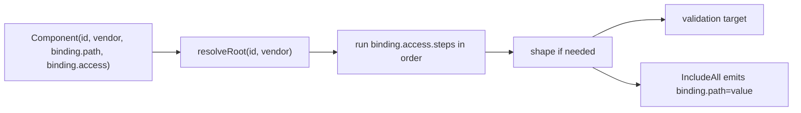
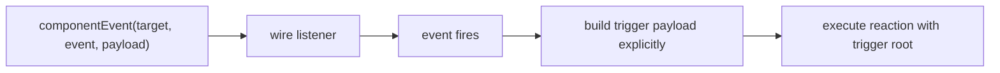
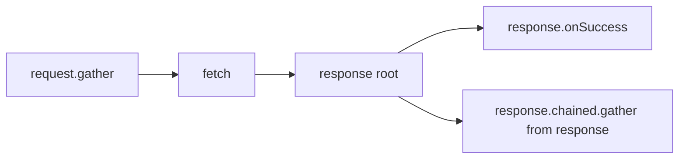

# Issue #86 Runtime / Schema Proof

## Why This Exists

The next step cannot be another abstract schema draft.

The framework already has enough real code to prove what the runtime actually
needs, where the current plan shape is lying, and which schema objects earn
their place. This document is that proof.

The goal here is not migration strategy and not compatibility strategy. The goal
is to show a smaller end-state schema that lowers directly into the real runtime
mechanics:

1. resolve a root object
2. walk a member path
3. get a raw JS value
4. shape it if needed
5. consume it

## Code-Backed Runtime Truths

### 1. Binding participation and `.Reactive(...)` triggers are already different

The current code already proves there are two different concerns:

- Component registration with optional model/binding participation:
  - [ReactivePlan.cs](/Users/muhammadadnanrafiq/Documents/alis-reactive-framework-1-0/.codex-worktrees/issue-86-capability-matrix/Alis.Reactive/ReactivePlan.cs)
  - [ComponentRegistration.cs](/Users/muhammadadnanrafiq/Documents/alis-reactive-framework-1-0/.codex-worktrees/issue-86-capability-matrix/Alis.Reactive/ComponentRegistration.cs)
- Component event trigger:
  - [ComponentEventTrigger.cs](/Users/muhammadadnanrafiq/Documents/alis-reactive-framework-1-0/.codex-worktrees/issue-86-capability-matrix/Alis.Reactive/Descriptors/Triggers/ComponentEventTrigger.cs)
  - [trigger.ts](/Users/muhammadadnanrafiq/Documents/alis-reactive-framework-1-0/.codex-worktrees/issue-86-capability-matrix/Alis.Reactive.SandboxApp/Scripts/execution/trigger.ts)

They may refer to the same component id, but they do not have the same
responsibility.

- Binding participation exists so model-driven consumers can find the live
  component and obtain its canonical semantic value.
- `.Reactive(...)` exists so a reaction can attach to an event source and emit a
  trigger payload.

That distinction must stay visible in the schema, but it does not require two
different top-level registries.

### 2. The runtime really does start from roots, not values

The runtime already has one vendor-aware resolution seam:

- [component.ts](/Users/muhammadadnanrafiq/Documents/alis-reactive-framework-1-0/.codex-worktrees/issue-86-capability-matrix/Alis.Reactive.SandboxApp/Scripts/resolution/component.ts)

`resolveRoot()` returns:

- native: the DOM element itself
- fusion: `el.ej2_instances[0]`

After that, everything is member access via `walk(...)`.

This is the actual runtime algebra:

- read member path
- write property
- call method
- subscribe to event

### 3. C# already separates bound inputs from explicit component refs

The public C# DSL already proves three different lowering paths:

- generic component surface:
  - [IComponent.cs](/Users/muhammadadnanrafiq/Documents/alis-reactive-framework-1-0/.codex-worktrees/issue-86-capability-matrix/Alis.Reactive/IComponent.cs)
  - [ComponentRef.cs](/Users/muhammadadnanrafiq/Documents/alis-reactive-framework-1-0/.codex-worktrees/issue-86-capability-matrix/Alis.Reactive/ComponentRef.cs)
- input-capable component:
  - [IComponent.cs](/Users/muhammadadnanrafiq/Documents/alis-reactive-framework-1-0/.codex-worktrees/issue-86-capability-matrix/Alis.Reactive/IComponent.cs)
  - `IInputComponent` adds `ReadExpr`
- app-level component:
  - [IComponent.cs](/Users/muhammadadnanrafiq/Documents/alis-reactive-framework-1-0/.codex-worktrees/issue-86-capability-matrix/Alis.Reactive/IComponent.cs)
  - `IAppLevelComponent` adds `DefaultId`

And [PipelineBuilder.cs](/Users/muhammadadnanrafiq/Documents/alis-reactive-framework-1-0/.codex-worktrees/issue-86-capability-matrix/Alis.Reactive/Builders/PipelineBuilder.cs)
already exposes those as:

- `Component<TComponent>(expr)` for prop-expression-backed bound fields
- `Component<TComponent>(string refId)` for explicit non-input or manually-named components
- `Component<TComponent>()` for app-level components like toast/confirm

This means the end-state schema must not collapse all component surfaces into
an input-only registry.

### 4. Non-input components are still component surfaces, not special cases

Examples already in the codebase:

- [FusionTab.cs](/Users/muhammadadnanrafiq/Documents/alis-reactive-framework-1-0/.codex-worktrees/issue-86-capability-matrix/Alis.Reactive.Fusion/Components/FusionTab/FusionTab.cs)
  has no `ReadExpr`, but does expose methods/properties through
  [FusionTabExtensions.cs](/Users/muhammadadnanrafiq/Documents/alis-reactive-framework-1-0/.codex-worktrees/issue-86-capability-matrix/Alis.Reactive.Fusion/Components/FusionTab/FusionTabExtensions.cs)
- [FusionAccordion.cs](/Users/muhammadadnanrafiq/Documents/alis-reactive-framework-1-0/.codex-worktrees/issue-86-capability-matrix/Alis.Reactive.Fusion/Components/FusionAccordion/FusionAccordion.cs)
  explicitly proves “component but not field”
- [FusionToast.cs](/Users/muhammadadnanrafiq/Documents/alis-reactive-framework-1-0/.codex-worktrees/issue-86-capability-matrix/Alis.Reactive.Fusion/AppLevel/FusionToast/FusionToast.cs)
  plus
  [FusionToastExtensions.cs](/Users/muhammadadnanrafiq/Documents/alis-reactive-framework-1-0/.codex-worktrees/issue-86-capability-matrix/Alis.Reactive.Fusion/AppLevel/FusionToast/FusionToastExtensions.cs)
  prove app-level component refs still emit the same `set-prop` / `call`
  algebra

So the honest split is:

- `Component` for any resolvable component surface
- optional `binding` on a component for model/request/validation participation
- `ComponentRef` for any explicit component surface use at a read/write/call
  site

### 5. Request is already a complete DSL unit

The C# DSL and TS runtime already agree that HTTP is one unit with stages:

- [HttpRequestBuilder.cs](/Users/muhammadadnanrafiq/Documents/alis-reactive-framework-1-0/.codex-worktrees/issue-86-capability-matrix/Alis.Reactive/Builders/Requests/HttpRequestBuilder.cs)
- [ResponseBuilder.cs](/Users/muhammadadnanrafiq/Documents/alis-reactive-framework-1-0/.codex-worktrees/issue-86-capability-matrix/Alis.Reactive/Builders/Requests/ResponseBuilder.cs)
- [ParallelBuilder.cs](/Users/muhammadadnanrafiq/Documents/alis-reactive-framework-1-0/.codex-worktrees/issue-86-capability-matrix/Alis.Reactive/Builders/Requests/ParallelBuilder.cs)
- [RequestDescriptor.cs](/Users/muhammadadnanrafiq/Documents/alis-reactive-framework-1-0/.codex-worktrees/issue-86-capability-matrix/Alis.Reactive/Descriptors/Requests/RequestDescriptor.cs)
- [http.ts](/Users/muhammadadnanrafiq/Documents/alis-reactive-framework-1-0/.codex-worktrees/issue-86-capability-matrix/Alis.Reactive.SandboxApp/Scripts/execution/http.ts)

The real request stages are:

- `gather`
- `as`
- `whileLoading`
- `validate`
- `response.onSuccess`
- `response.onError`
- `response.chained`

`parallel` is a separate unit with `onAllSettled`.

The end-state schema should keep those names and boundaries.

### 6. Validation is a pure ruleset plus a join to live components

Current validation flow:

- rules are extracted in C#
- then validation fields are enriched from the plan’s component map
- then TS resolves the live root and reads the value

Proof:

- [ValidationResolver.cs](/Users/muhammadadnanrafiq/Documents/alis-reactive-framework-1-0/.codex-worktrees/issue-86-capability-matrix/Alis.Reactive/Resolvers/ValidationResolver.cs)
- [orchestrator.ts](/Users/muhammadadnanrafiq/Documents/alis-reactive-framework-1-0/.codex-worktrees/issue-86-capability-matrix/Alis.Reactive.SandboxApp/Scripts/validation/orchestrator.ts)

This means validation should not carry copied runtime lookup details in its own
DTO family. It should target the canonical component id and reuse the component
registry, reading only components that opt into `binding`.

### 7. The current schema is forcing runtime invention in exactly two places

The current runtime still invents or re-enriches meaning where the schema should
already be explicit:

- Native component events invent payload shape in
  [trigger.ts](/Users/muhammadadnanrafiq/Documents/alis-reactive-framework-1-0/.codex-worktrees/issue-86-capability-matrix/Alis.Reactive.SandboxApp/Scripts/execution/trigger.ts)
  by synthesizing `{ [readExpr]: currentValue, event: e }`.
- Validation enrichment copies `fieldId`, `vendor`, `readExpr`, and `coerceAs`
  out of the component map in
  [ValidationResolver.cs](/Users/muhammadadnanrafiq/Documents/alis-reactive-framework-1-0/.codex-worktrees/issue-86-capability-matrix/Alis.Reactive/Resolvers/ValidationResolver.cs).

Those are schema bugs, not “runtime complexity we must live with”.

### 8. Partial lifecycle already proves two different resolution modes

Plan merge in
[merge-plan.ts](/Users/muhammadadnanrafiq/Documents/alis-reactive-framework-1-0/.codex-worktrees/issue-86-capability-matrix/Alis.Reactive.SandboxApp/Scripts/lifecycle/merge-plan.ts)
already proves this split:

- event triggers are wired from self-sufficient trigger data
- model-driven consumers read through the merged component registry

That is the honest lifecycle split:

- component event trigger: self-sufficient at wire time
- validation and `IncludeAll`: lazy against latest merged component registry,
  filtered to binding participants

The schema should express that directly instead of hiding it behind enrichment.

### 9. SSE and SignalR already behave like carried host roots

Server push wiring in
[server-push.ts](/Users/muhammadadnanrafiq/Documents/alis-reactive-framework-1-0/.codex-worktrees/issue-86-capability-matrix/Alis.Reactive.SandboxApp/Scripts/execution/server-push.ts)
and
[signalr.ts](/Users/muhammadadnanrafiq/Documents/alis-reactive-framework-1-0/.codex-worktrees/issue-86-capability-matrix/Alis.Reactive.SandboxApp/Scripts/execution/signalr.ts)
already shows the same payload pattern:

- the runtime receives a host object
- it places that object into execution context
- the reaction reads from it

That means SSE, SignalR, CustomEvent `detail`, and Fusion callback args all fit
the same trigger payload family.

## Focused Runtime Proofs Added In This Pass

Two deterministic proof suites were added to pin the runtime algebra down
instead of inferring it from scattered older tests:

- [when-proving-custom-event-trigger-algebra.test.ts](/Users/muhammadadnanrafiq/Documents/alis-reactive-framework-1-0/.codex-worktrees/issue-86-capability-matrix/Alis.Reactive.SandboxApp/Scripts/__tests__/when-proving-custom-event-trigger-algebra.test.ts)
  proves custom-event trigger behavior for:
  - set property on trigger payload
  - read from trigger payload
  - array item object walking from trigger payload
  - call method with args
  - call method with no args
  - source-vs-source conditions
- [when-proving-response-and-component-algebra.test.ts](/Users/muhammadadnanrafiq/Documents/alis-reactive-framework-1-0/.codex-worktrees/issue-86-capability-matrix/Alis.Reactive.SandboxApp/Scripts/__tests__/when-proving-response-and-component-algebra.test.ts)
  proves:
  - pure JSON member walking in `onSuccess`
  - array item object walking in `onSuccess`
  - source-vs-source conditions against `responseBody`
  - explicit component-root property writes
  - explicit component-root property reads
  - array item object walking from component roots
  - explicit component-root method calls with and without args

Focused re-run on **April 1, 2026** after the array-walking additions:

- [when-proving-response-and-component-algebra.test.ts](/Users/muhammadadnanrafiq/Documents/alis-reactive-framework-1-0/.codex-worktrees/issue-86-capability-matrix/Alis.Reactive.SandboxApp/Scripts/__tests__/when-proving-response-and-component-algebra.test.ts)
  passed **10 tests**

The important architectural boundary exposed by those proofs is:

- binding participation is one registry-backed facet on components
- explicit component refs are a separate usage form
- both still lower into the same resolved-root algebra
- the effect side is `set` or `call`
- the same dotted-path walking semantics apply across trigger, response,
  component, and binding reads

## End-State Object Model That Matches The Runtime

This is the smallest working model that fits the proven seams.

### Responsibilities

- `Plan`: root container for components and reactions.
- `Component`: one resolvable component surface, with optional binding
  participation.
- `Binding`: canonical semantic participation used by validation and
  `IncludeAll`.
- `ComponentRef`: explicit runtime root identity for a component surface.
- `Reaction`: one `.Reactive(...)` unit.
- `Trigger`: event attachment plus explicit trigger payload contract.
- `TriggerPayload`: carried trigger payload root.
- `Pipeline`: ordered executable steps.
- `PipelineStep`: one ordered command, condition, request, or parallel block.
- `When`: guarded branching stage.
- `Request`: HTTP unit with its own DSL stages.
- `Response`: success/error/chained stages owned by a request.
- `Parallel`: concurrent request unit with `onAllSettled`.
- `Value`: one consumed value in guards, commands, gather, dispatch, and payloads.
- `AccessStep`: one composable member or invoke step.
- `Access`: generic read access over a resolved root.
- `PayloadAccessStep`: one composable member or invoke step while building
  trigger payload.
- `Validation`: request-time validation plan.
- `ValidationTarget`: rules for one canonical component id.

### Working Schema Slice

```ts
type Vendor = "native" | "fusion"

type Shape =
  | "raw"
  | "string"
  | "number"
  | "boolean"
  | "date"
  | "object"
  | { kind: "array"; of: Shape }

type AccessStep =
  | { kind: "member"; path: string }
  | { kind: "invoke"; method: string; args?: Value[] }

type Access = {
  steps: AccessStep[]
  rawShape?: Shape
  shape?: Shape
}

type PayloadAccessStep =
  | { kind: "member"; path: string }
  | { kind: "invoke"; method: string; args?: PayloadValue[] }

type PayloadAccess = {
  steps: PayloadAccessStep[]
  rawShape?: Shape
  shape?: Shape
}

type ComponentRef = {
  id: string
  vendor: Vendor
}

type Binding = {
  path: string
  access: Access // self-sufficient canonical semantic value
}

type Component = {
  vendor: Vendor
  binding?: Binding
}

type Plan = {
  planId: string
  sourceId?: string
  components: Record<string, Component>
  reactions: Reaction[]
}

type Reaction = {
  on: Trigger
  pipeline: Pipeline
}

type Trigger =
  | { kind: "domReady" }
  | { kind: "documentEvent"; event: string; payload: TriggerPayload }
  | { kind: "componentEvent"; target: ComponentRef; event: string; payload: TriggerPayload }
  | { kind: "sse"; url: string; event?: string; payload: TriggerPayload }
  | { kind: "signalR"; hubUrl: string; method: string; payload: TriggerPayload }

type TriggerPayload =
  | { kind: "none" }
  | { kind: "host" }
  | { kind: "build"; value: PayloadValue }

type PayloadValue =
  | { kind: "literal"; value: unknown }
  | { kind: "bindingValue"; componentId: string }
  | { kind: "access"; root: "host" | "target"; access: PayloadAccess }
  | { kind: "object"; fields: Record<string, PayloadValue> }
  | { kind: "array"; items: PayloadValue[] }

type PipelineStep = Command | When | Request | Parallel

type Pipeline = {
  steps: PipelineStep[]
}

type When = {
  kind: "when"
  cases: { guard: Guard; pipeline: Pipeline }[]
  otherwise?: Pipeline
}

type Request = {
  kind: "request"
  method: "GET" | "POST" | "PUT" | "DELETE"
  url: string
  gather?: GatherItem[]
  as?: "json" | "formData"
  whileLoading?: Command[] // current DSL keeps this commands-only
  validate?: Validation
  response?: Response
}

type Response = {
  onSuccess?: Pipeline[]
  onError?: { status: number; pipeline: Pipeline }[]
  chained?: Request
}

type Parallel = {
  kind: "parallel"
  requests: Request[]
  onAllSettled?: Command[] // current DSL keeps this commands-only
}

type GatherItem =
  | { kind: "field"; name: string; value: Value }
  | { kind: "includeAll" }

type RootRef =
  | { kind: "trigger" }
  | { kind: "response" }
  | { kind: "component"; target: ComponentRef }
  | { kind: "element"; id: string }
  | { kind: "document" }

type Value =
  | { kind: "literal"; value: unknown }
  | { kind: "bindingValue"; componentId: string }
  | { kind: "access"; root: RootRef; access: Access }
  | { kind: "object"; fields: Record<string, Value> }
  | { kind: "array"; items: Value[] }

type Validation = {
  formId: string
  targets: ValidationTarget[]
}

type ValidationTarget = {
  componentId: string
  rules: ValidationRule[]
}
```

## Why These Objects Fit The Real Runtime

### A. Component binding contract

Example:

```json
{
  "components": {
    "MyApp_Models_OrderModel__Address_City": {
      "vendor": "fusion",
      "binding": {
        "path": "Address.City",
        "access": {
          "steps": [
            { "kind": "member", "path": "value" }
          ],
          "shape": "string"
        }
      }
    }
  }
}
```

This tells the runtime four things and nothing else:

- which live element to locate
- which vendor root to resolve
- which semantic field name to emit for model-driven consumers
- how to obtain the canonical semantic value from that root

That is enough for both `IncludeAll` and validation when the component opts into
`binding`.

It does not pretend to describe the whole JS API surface. The full surface still
exists at runtime once the root is resolved.

### B. IncludeAll proof

Current `IncludeAll` already does this mechanically in
[gather.ts](/Users/muhammadadnanrafiq/Documents/alis-reactive-framework-1-0/.codex-worktrees/issue-86-capability-matrix/Alis.Reactive.SandboxApp/Scripts/execution/gather.ts):

1. iterate registered components
2. resolve root from `id + vendor`
3. read `readExpr`
4. emit under model binding path

End-state logic becomes smaller:

```ts
function readBindingValue(plan: Plan, componentId: string): unknown {
  const component = plan.components[componentId]
  if (!component?.binding) throw new Error(`[alis] binding not found: ${componentId}`)
  const el = document.getElementById(componentId)
  if (!el) throw new Error(`[alis] element not found: ${componentId}`)
  const root = resolveRoot(el, component.vendor)
  return executeAccess(root, component.binding.access)
}

function includeAll(plan: Plan): Record<string, unknown> {
  const body: Record<string, unknown> = {}
  for (const [componentId, component] of Object.entries(plan.components)) {
    if (!component.binding) continue
    body[component.binding.path] = readBindingValue(plan, componentId)
  }
  return body
}
```

The runtime gets dumber:

- no separate component gather descriptor for the lazy path
- no binding-path keyed registration object leaking consumer semantics
- one canonical field-value contract

### C. Ordered pipeline proof

`PipelineBuilder` and the architecture tests already prove that outer pipeline
order is real:

- commands execute in declaration order
- `When`, `Request`, and `Parallel` can be interleaved
- conditions can appear before HTTP, after HTTP, and around chained/parallel
  requests

Proof:

- [PipelineBuilder.cs](/Users/muhammadadnanrafiq/Documents/alis-reactive-framework-1-0/.codex-worktrees/issue-86-capability-matrix/Alis.Reactive/Builders/PipelineBuilder.cs)
- [WhenMixingConditionsWithHttp.cs](/Users/muhammadadnanrafiq/Documents/alis-reactive-framework-1-0/.codex-worktrees/issue-86-capability-matrix/tests/Alis.Reactive.UnitTests/Architecture/WhenMixingConditionsWithHttp.cs)
- [WhenUsingConditionsInsideResponseHandlers.cs](/Users/muhammadadnanrafiq/Documents/alis-reactive-framework-1-0/.codex-worktrees/issue-86-capability-matrix/tests/Alis.Reactive.UnitTests/Architecture/WhenUsingConditionsInsideResponseHandlers.cs)

So the schema cannot collapse a pipeline into `commands + one stage`.
It needs ordered steps:

```json
{
  "pipeline": {
    "steps": [
      { "kind": "when", "...": "..." },
      { "kind": "request", "...": "..." },
      { "kind": "when", "...": "..." }
    ]
  }
}
```

### D. Validation proof

Current validation needs enrichment because the extracted rules know field
identity, but the runtime needs a canonical component join and semantic value
access.

End-state validation target:

```json
{
  "validate": {
    "formId": "order-form",
    "targets": [
      {
        "componentId": "MyApp_Models_OrderModel__Address_City",
        "rules": [
          {
            "rule": "required",
            "message": "City is required"
          }
        ]
      }
    ]
  }
}
```

Then validation execution becomes:

```ts
function readValidationField(plan: Plan, componentId: string): unknown {
  return readBindingValue(plan, componentId)
}
```

This removes duplicated runtime lookup details from the validation DTO.

The same deterministic generated id is used:

- when the component is rendered
- when the component is registered with binding participation
- when validator rules target the component id

Proof for deterministic id generation:

- [IdGenerator.cs](/Users/muhammadadnanrafiq/Documents/alis-reactive-framework-1-0/.codex-worktrees/issue-86-capability-matrix/Alis.Reactive/IdGenerator.cs)
- [ExpressionPathHelper.cs](/Users/muhammadadnanrafiq/Documents/alis-reactive-framework-1-0/.codex-worktrees/issue-86-capability-matrix/Alis.Reactive/ExpressionPathHelper.cs)

### E. Component event proof

Current component events are already self-sufficient at wire time because they
carry:

- `componentId`
- `vendor`
- JS event name

The remaining problem is payload truth.

Current native event wiring invents payload shape:

```ts
detail = expr ? { [expr]: walk(el, expr), event: e } : { event: e }
```

End-state trigger makes payload explicit instead:

```json
{
  "on": {
    "kind": "componentEvent",
    "target": {
      "id": "MyApp_Models_OrderModel__Address_City",
      "vendor": "fusion"
    },
    "event": "change",
    "payload": {
      "kind": "build",
      "value": {
        "kind": "object",
        "fields": {
          "Value": {
            "kind": "bindingValue",
            "componentId": "MyApp_Models_OrderModel__Address_City"
          }
        }
      }
    }
  }
}
```

Runtime execution becomes:

1. wire event from `target`
2. event fires
3. build trigger payload from declared `payload`
4. execute reaction with `trigger`

The runtime no longer invents `{ event, value }` structure on its own.

### F. Response payload proof

`response` is already a carried root in
[http.ts](/Users/muhammadadnanrafiq/Documents/alis-reactive-framework-1-0/.codex-worktrees/issue-86-capability-matrix/Alis.Reactive.SandboxApp/Scripts/execution/http.ts).

That means success handlers do not need root resolution. They only need the same
access semantics as events, binding participants, and explicit component refs.

Example:

```json
{
  "kind": "field",
  "name": "CustomerId",
  "value": {
    "kind": "access",
    "root": { "kind": "response" },
    "access": {
      "steps": [
        { "kind": "member", "path": "data.customerId" }
      ],
      "shape": "number"
    }
  }
}
```

This is the same value language as:

- request gather from trigger
- request gather from field
- guards
- dispatch payloads
- mutation args

### G. Request unit proof

This is the request shape that matches the public DSL and the runtime:

```json
{
  "kind": "request",
  "method": "POST",
  "url": "/api/orders/save",
  "gather": [
    { "kind": "includeAll" }
  ],
  "as": "json",
  "whileLoading": [
    { "kind": "apply", "target": { "kind": "element", "id": "saveBtn" }, "mutation": { "kind": "set", "path": "disabled", "value": { "kind": "literal", "value": true } } }
  ],
  "validate": {
    "formId": "order-form",
    "targets": [
      { "componentId": "MyApp_Models_OrderModel__Address_City", "rules": [{ "rule": "required", "message": "City is required" }] }
    ]
  },
  "response": {
    "onSuccess": [
      {
        "steps": [
          { "kind": "dispatch", "event": "orderSaved" }
        ]
      }
    ],
    "onError": [
      {
        "status": 400,
        "pipeline": {
          "steps": [
            { "kind": "validationErrors", "formId": "order-form" }
          ]
        }
      }
    ],
    "chained": {
      "kind": "request",
      "method": "GET",
      "url": "/api/orders/details",
      "gather": [
        {
          "kind": "field",
          "name": "id",
          "value": {
            "kind": "access",
            "root": { "kind": "response" },
            "access": {
              "steps": [
                { "kind": "member", "path": "data.id" }
              ],
              "shape": "number"
            }
          }
        }
      ]
    }
  }
}
```

That is not a new mental model. It is the existing public request DSL, but with
one shared value language and explicit payload contracts.

## Runtime Reduction Proof

The end-state runtime can be expressed as a few small mechanical helpers.

### 1. Compositional access execution

```ts
function executeAccess(
  root: unknown,
  access: Access,
  readArg?: (value: Value) => unknown
): unknown {
  let current = root
  for (const step of access.steps) {
    if (step.kind === "member") {
      current = walk(current, step.path)
      continue
    }

    const args = (step.args ?? []).map(arg => {
      if (!readArg) {
        throw new Error("[alis] access-step args are not available in this context")
      }
      return readArg(arg)
    })

    current = (current as any)[step.method](...args)
  }

  return shape(current, access.shape)
}
```

This is the design move that closes the first real pressure point:

- member read still works
- terminal method-return read still works
- invoke, then keep walking deeper into the returned object now also works

### 2. Ordered pipeline execution

```ts
function executePipeline(plan: Plan, ctx: ExecContext, pipeline: Pipeline): void {
  for (const step of pipeline.steps) {
    switch (step.kind) {
      case "apply":
      case "dispatch":
      case "validationErrors":
      case "into":
        executeCommand(plan, ctx, step)
        break
      case "when":
        executeWhen(plan, ctx, step)
        break
      case "request":
        executeRequest(plan, ctx, step)
        break
      case "parallel":
        executeParallel(plan, ctx, step)
        break
    }
  }
}
```

This is the runtime shape that keeps declaration order honest without making the
runtime smarter.

### 3. Canonical binding value

```ts
function readBindingValue(plan: Plan, componentId: string): unknown {
  const component = plan.components[componentId]
  if (!component?.binding) throw new Error(`[alis] binding not found: ${componentId}`)

  const el = document.getElementById(componentId)
  if (!el) throw new Error(`[alis] element not found: ${componentId}`)

  const root = resolveRoot(el, component.vendor)
  return executeAccess(root, component.binding.access)
}
```

`binding.access` stays self-sufficient. It can walk members and invoke methods
on the resolved component root, but it cannot depend on `trigger` or `response`
context.

### 4. Generic read

```ts
function readValue(plan: Plan, ctx: ExecContext, value: Value): unknown {
  switch (value.kind) {
    case "literal":
      return value.value
    case "bindingValue":
      return readBindingValue(plan, value.componentId)
    case "access": {
      const root = resolveRuntimeRoot(plan, ctx, value.root)
      return executeAccess(root, value.access, arg => readValue(plan, ctx, arg))
    }
    case "object":
      return Object.fromEntries(Object.entries(value.fields).map(([k, v]) => [k, readValue(plan, ctx, v)]))
    case "array":
      return value.items.map(v => readValue(plan, ctx, v))
  }
}
```

### 5. Explicit trigger payload build

```ts
function buildTriggerPayload(plan: Plan, host: unknown, target: ComponentRef | null, payload: TriggerPayload): unknown {
  switch (payload.kind) {
    case "none":
      return {}
    case "host":
      return host ?? {}
    case "build":
      return readPayloadValue(plan, host, target, payload.value)
  }
}
```

This is simpler than today because:

- no runtime-invented native event payload
- no validation enrichment DTO copying
- no separate model for request gather vs command args vs response reads

### 6. Explicit component ref proof

Because `ComponentRef<TComponent, TModel>` already lowers both string-id and
app-level component refs, the same value language can read from non-input
component roots too.

Example end-state value:

```json
{
  "kind": "access",
  "root": {
    "kind": "component",
    "target": { "id": "resident-tabs", "vendor": "fusion" }
  },
  "access": {
    "steps": [
      { "kind": "invoke", "method": "getSelectedItems" }
    ],
    "shape": { "kind": "array", "of": "raw" }
  }
}
```

And if a future vertical slice needs to walk deeper into that returned value,
the schema is already open to it:

```json
{
  "kind": "access",
  "root": {
    "kind": "component",
    "target": { "id": "country-ddl", "vendor": "fusion" }
  },
  "access": {
    "steps": [
      { "kind": "invoke", "method": "getItems" },
      { "kind": "member", "path": "3.disabled" }
    ],
    "shape": "boolean"
  }
}
```

And the same resolved root can still be a mutation target:

```json
{
  "kind": "apply",
  "target": {
    "kind": "component",
    "target": { "id": "resident-tabs", "vendor": "fusion" }
  },
  "mutation": {
    "kind": "call",
    "path": "select",
    "args": [{ "kind": "literal", "value": 2 }]
  }
}
```

## Worked Scenarios

### 1. Bound textbox, validation, and `IncludeAll`



### 2. Component event with typed payload



### 3. Request success to chained request



## What This Proof Locks

- Binding participation and `.Reactive(...)` triggers are separate schema
  concerns.
- Explicit component refs are a second usage form beside binding participation,
  not a special case of it.
- `Request` stays a first-class DSL-shaped unit.
- Ordered `pipeline.steps[]` preserves real declaration order for mixed
  condition/request/parallel flows.
- Validation targets canonical component identity and reuses the component
  registry through `binding`.
- `IncludeAll` and validation both read through the same canonical binding
  value contract.
- Trigger payload structure must be explicit in the schema, not invented in TS.
- Access is now compositional, so invoke-then-walk is an extension of the same
  read language instead of a schema redesign.
- `response`, `trigger`, and resolved component roots all participate in the
  same access model after root resolution.

## What This Proof Deliberately Does Not Pretend To Solve Yet

- The final naming lock for every noun.
- The final complete rule matrix for every validation operator.
- The final public C# DSL spelling for compositional access steps.
- The exact shape-conversion map behind `shape(...)`.

Those are next-step design decisions.

What is already proven here is enough to stop designing from stitched DTOs:

- the runtime seams are known
- the request unit boundary is known
- the ordered outer-pipeline boundary is known
- the component registry plus optional binding seam is known
- the trigger payload problem is known
- the first real read-algebra pressure point has a clean schema answer
- the end-state schema can now be designed from these truths instead of from the
  current leaked wire format

## Stage Mix Matrix

This is the concrete mix-and-match result forced by the real builders and tests.

| Stage surface | What it can contain | Order preserved? | Proof |
|---|---|---|---|
| outer `Pipeline` | `Command`, `When`, `Request`, `Parallel` | yes | [PipelineBuilder.cs](/Users/muhammadadnanrafiq/Documents/alis-reactive-framework-1-0/.codex-worktrees/issue-86-capability-matrix/Alis.Reactive/Builders/PipelineBuilder.cs), [WhenMixingConditionsWithHttp.cs](/Users/muhammadadnanrafiq/Documents/alis-reactive-framework-1-0/.codex-worktrees/issue-86-capability-matrix/tests/Alis.Reactive.UnitTests/Architecture/WhenMixingConditionsWithHttp.cs) |
| `When.branches[].pipeline` | full nested `Pipeline` | yes | [WhenEnforcingPipelineRules.cs](/Users/muhammadadnanrafiq/Documents/alis-reactive-framework-1-0/.codex-worktrees/issue-86-capability-matrix/tests/Alis.Reactive.UnitTests/Architecture/WhenEnforcingPipelineRules.cs) |
| `Request.whileLoading` | `Command[]` only | yes | [HttpRequestBuilder.cs](/Users/muhammadadnanrafiq/Documents/alis-reactive-framework-1-0/.codex-worktrees/issue-86-capability-matrix/Alis.Reactive/Builders/Requests/HttpRequestBuilder.cs) |
| `Request.response.onSuccess[]` | full nested `Pipeline` | yes | [ResponseBuilder.cs](/Users/muhammadadnanrafiq/Documents/alis-reactive-framework-1-0/.codex-worktrees/issue-86-capability-matrix/Alis.Reactive/Builders/Requests/ResponseBuilder.cs), [WhenUsingConditionsInsideResponseHandlers.cs](/Users/muhammadadnanrafiq/Documents/alis-reactive-framework-1-0/.codex-worktrees/issue-86-capability-matrix/tests/Alis.Reactive.UnitTests/Architecture/WhenUsingConditionsInsideResponseHandlers.cs), [when-http-handlers-contain-nested-reactions.test.ts](/Users/muhammadadnanrafiq/Documents/alis-reactive-framework-1-0/.codex-worktrees/issue-86-capability-matrix/Alis.Reactive.SandboxApp/Scripts/__tests__/when-http-handlers-contain-nested-reactions.test.ts) |
| `Request.response.onError[]` | full nested `Pipeline` | yes | [ResponseBuilder.cs](/Users/muhammadadnanrafiq/Documents/alis-reactive-framework-1-0/.codex-worktrees/issue-86-capability-matrix/Alis.Reactive/Builders/Requests/ResponseBuilder.cs), [WhenUsingConditionsInsideResponseHandlers.cs](/Users/muhammadadnanrafiq/Documents/alis-reactive-framework-1-0/.codex-worktrees/issue-86-capability-matrix/tests/Alis.Reactive.UnitTests/Architecture/WhenUsingConditionsInsideResponseHandlers.cs), [when-http-handlers-contain-nested-reactions.test.ts](/Users/muhammadadnanrafiq/Documents/alis-reactive-framework-1-0/.codex-worktrees/issue-86-capability-matrix/Alis.Reactive.SandboxApp/Scripts/__tests__/when-http-handlers-contain-nested-reactions.test.ts) |
| `Request.response.chained` | one `Request` | request order only | [ResponseBuilder.cs](/Users/muhammadadnanrafiq/Documents/alis-reactive-framework-1-0/.codex-worktrees/issue-86-capability-matrix/Alis.Reactive/Builders/Requests/ResponseBuilder.cs), [WhenRequestingFromServer.cs](/Users/muhammadadnanrafiq/Documents/alis-reactive-framework-1-0/.codex-worktrees/issue-86-capability-matrix/tests/Alis.Reactive.UnitTests/Requests/WhenRequestingFromServer.cs) |
| `Parallel.requests[]` | `Request[]` | branch order is declarative, execution is concurrent | [ParallelBuilder.cs](/Users/muhammadadnanrafiq/Documents/alis-reactive-framework-1-0/.codex-worktrees/issue-86-capability-matrix/Alis.Reactive/Builders/Requests/ParallelBuilder.cs) |
| `Parallel.onAllSettled` | `Command[]` only | yes | [ParallelBuilder.cs](/Users/muhammadadnanrafiq/Documents/alis-reactive-framework-1-0/.codex-worktrees/issue-86-capability-matrix/Alis.Reactive/Builders/Requests/ParallelBuilder.cs) |

So the stage-pressure answer is:

- yes, stages mix
- yes, order matters
- no, not every slot is equally permissive
- the constrained slots are explicit and builder-proven
