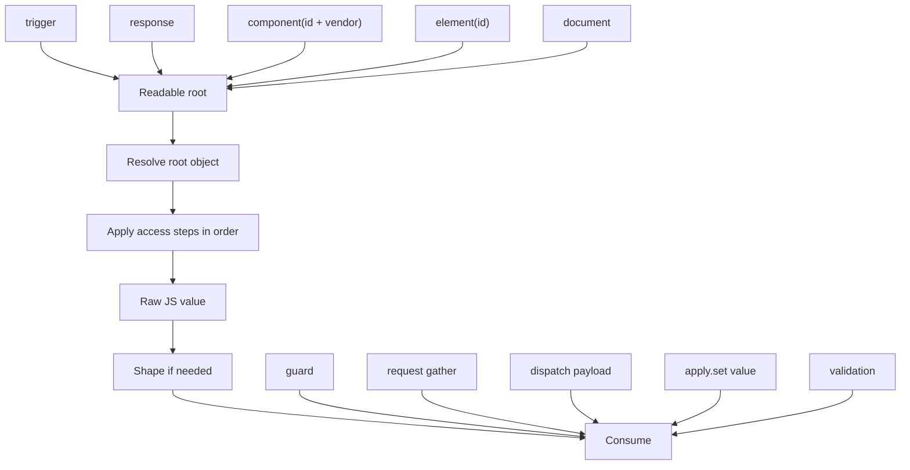
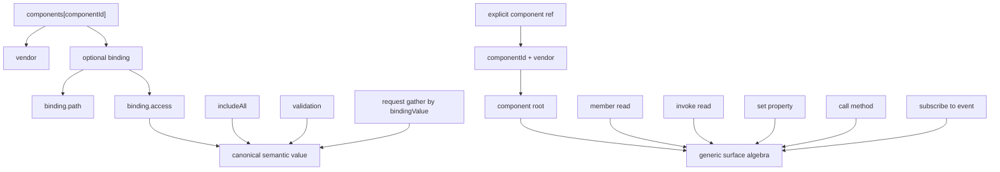
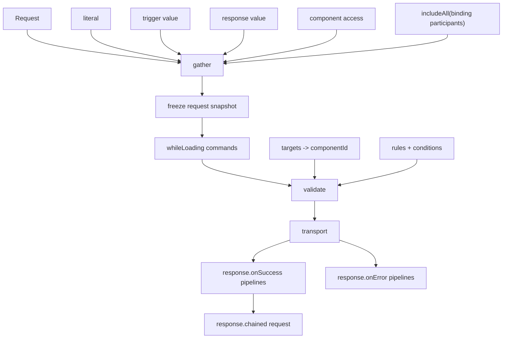
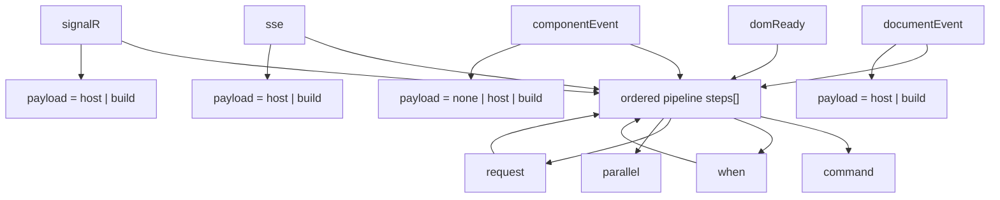
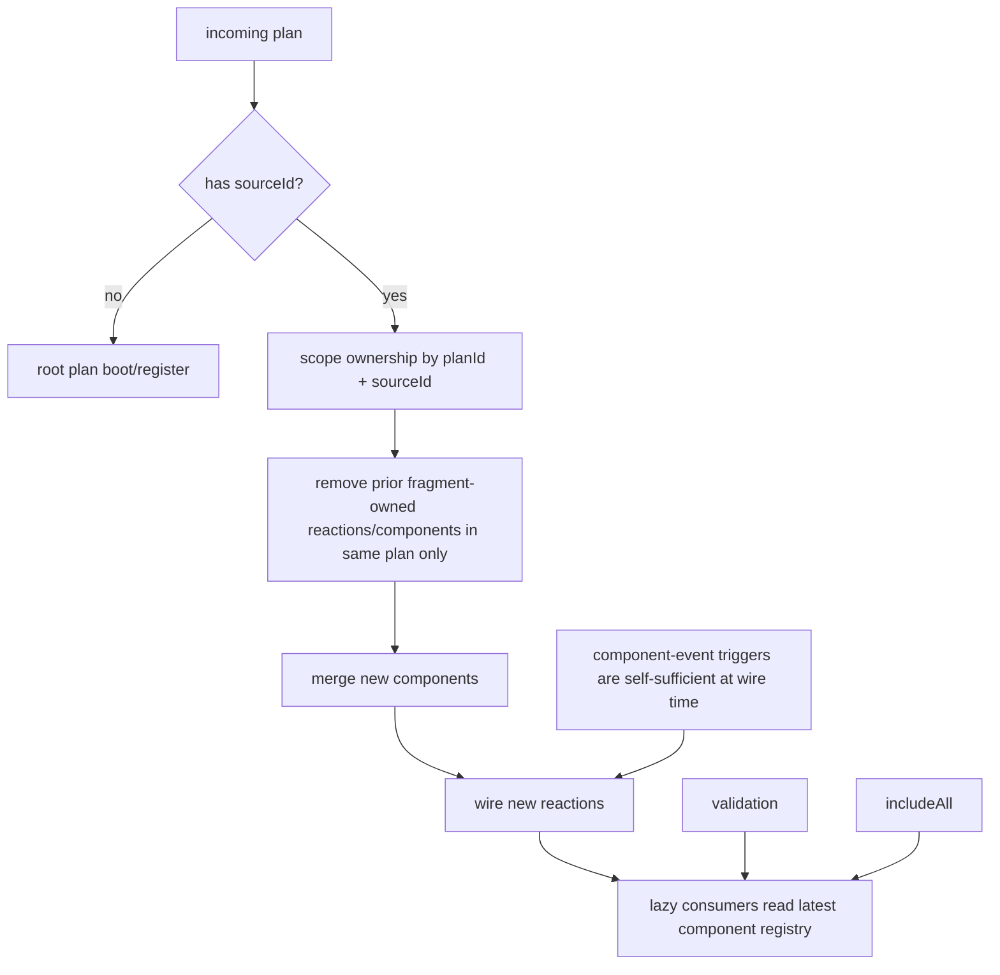
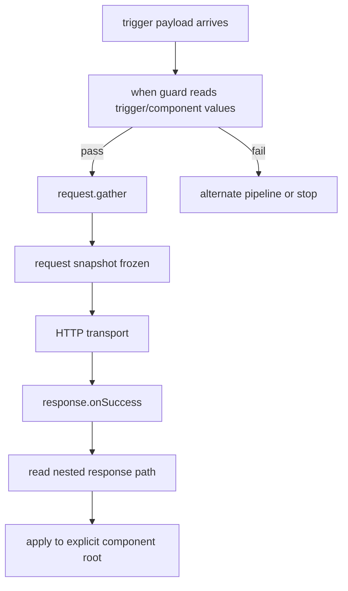
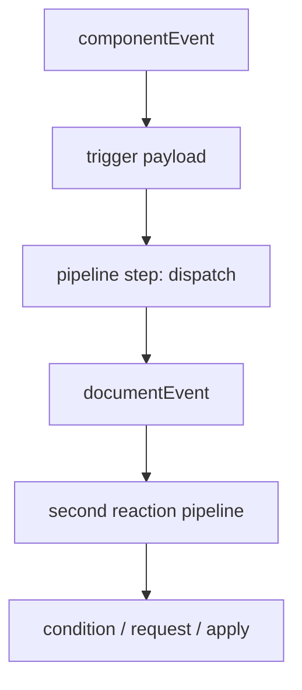
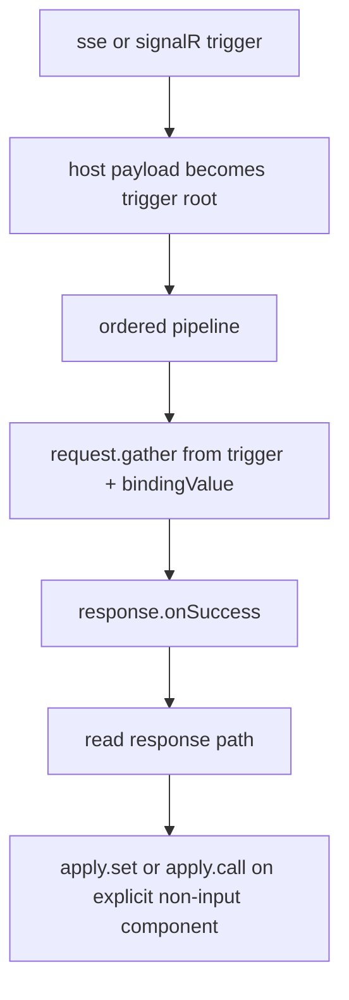

# Issue #86 Activity / Workflow Diagrams

## 1. Root Resolution And Shared Value Flow

## 2. Component Registry And Optional Binding Participation

## 3. Request Unit Lifecycle

## 4. Trigger Families Into The Same Ordered Pipeline

## 5. Partial Merge Lifecycle

## 6. Mixed Workflow: Trigger -> Condition -> Request -> Success -> Component Apply

## 7. Mixed Workflow: Component Event -> Dispatch -> Document Reaction

## 8. Mixed Workflow: SSE / SignalR -> Request -> Response -> Non-Input Component

