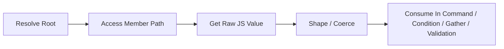
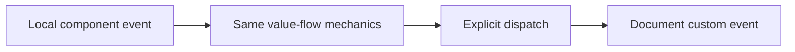

# Issue #86 Architecture Checkpoint

> Conversation checkpoint captured on March 31, 2026.
> This document preserves the architectural guidance and code-backed model
> established during the issue #86 analysis session so it can be merged to
> `main` and used as the baseline for future planning and refactoring.

## Why This Exists

The framework already supports far more typed value flow than a surface read of
the code suggests. The problem is not "does the framework have values?" The
problem is that the current architecture still exposes the same underlying model
through multiple partially-duplicated descriptor paths, which makes the system
harder to reason about than it should be.

This checkpoint captures the non-negotiable architectural guidance that emerged
from the discussion so future work does not regress into vertical slices,
fallback lanes, or dispatch-specific hacks.

## Locked Architectural Guidance

- No fallbacks. Parallel old/new lanes cause system rot.
- No duplicate value-flow paths left behind "for compatibility" unless they are
  explicitly transitional and removed within the same refactor sequence.
- Refactors must be stepwise and surgical, but cleanup is part of the refactor,
  not a later chore.
- Runtime should get dumber over time, not smarter.
- Descriptors should carry more meaning so runtime mechanics stay uniform.
- Source is the truth. New capabilities should plug into the shared source/value
  model rather than inventing storage or ad hoc handoff paths.
- If the abstractions are right, adding a capability at one DSL stage should not
  require inventing another vertical slice.
- Component events and custom events are the same flow model with different
  scope attachment.
- `readExpr` is not a special architectural feature. It is just member access
  after vendor-agnostic root resolution.
- A read yields a raw JS value that may be a primitive, object, or array.
- `coerce` is the shaping step that turns the raw runtime value into the value
  the typed DSL expects.
- The stable architectural concepts should be:
  - root resolution
  - member access
  - value shaping
  - command execution
  - event scope

## Core Mental Model

The framework models and executes JS API contracts. A JS object surface exposes
properties and methods. Events optionally carry another object surface. The plan
must describe how to resolve the right runtime object, how to access a member,
how to shape the resulting value, and which command consumes it.

The clean end-to-end flow is:

Scope crossing is separate:

The event type changes scope, not value-flow semantics.

## Canonical JS API Contract

At the framework level, a JS API contract collapses to a small set of
capabilities:

| Capability Family | Variants |
| --- | --- |
| Property | read, write |
| Method call | without args, with args |
| Method return | without args, with args |
| Event | without payload, with payload |

If an event has payload, that payload is just another object surface and can
again expose:

- property read/write
- method call without args
- method call with args
- method return without args
- method return with args

This is the correct abstraction layer. Wrapper counts, widget-specific helper
counts, and whether a given method has one or two parameters are not the
architecture.

## Current Code-Backed Understanding

### 1. Root resolution already exists and is vendor-agnostic

The framework already resolves component roots by vendor and only then accesses
members.

- `ComponentRegistration.ReadExpr` carries the component read path in
  `Alis.Reactive/ComponentRegistration.cs`.
- `resolveRoot()` and `evalRead()` perform vendor-specific root lookup and then
  path-based member access in
  `Alis.Reactive.SandboxApp/Scripts/resolution/component.ts`.
- `resolveSource()` is the shared source entry point in
  `Alis.Reactive.SandboxApp/Scripts/resolution/resolver.ts`.

This is why the same conceptual read works for native and Syncfusion-backed
components.

### 2. `readExpr` is just member access after root resolution

`readExpr` felt special early on, but in the current architecture it is simply a
serialized member path evaluated after the target object is resolved.

Evidence:

- `TestWidgetSyncFusion.ReadExpr => "value"` in
  `Alis.Reactive.Fusion/Components/TestWidgetSyncFusion/TestWidgetSyncFusion.cs`
- `NativeCheckBox.ReadExpr => "checked"` proved by Playwright assertions in
  `tests/Alis.Reactive.PlaywrightTests/Components/Native/WhenCheckboxToggles.cs`
- `items.length` is a valid component read in
  `Alis.Reactive.SandboxApp/Scripts/__tests__/when-reading-component-value.test.ts`

### 3. Reads already support primitive, object, and array leaves

The framework does not fundamentally operate on "scalar fields only." The
current path machinery already returns whatever JS value is at the leaf.

Evidence:

- nested object leaf returned as-is in
  `Alis.Reactive.SandboxApp/Scripts/__tests__/when-resolving-bind-expr.test.ts`
- array leaf returned as-is in
  `Alis.Reactive.SandboxApp/Scripts/__tests__/when-resolving-bind-expr.test.ts`
- array member traversal via `"items.length"` in
  `Alis.Reactive.SandboxApp/Scripts/__tests__/when-reading-component-value.test.ts`
- generic dot-path walking, including arrays, in
  `Alis.Reactive.SandboxApp/Scripts/__tests__/when-walking-dot-paths.test.ts`

This means object-valued and array-valued reads are not a new capability
category. They already fit the model.

### 4. `coerce` is the value-shaping step

The architecture is not just "read value and use it." The framework already
contains an explicit shaping layer for turning raw JS values into the value form
expected by the typed DSL.

Evidence:

- `SetPropMutation.Coerce` in `Alis.Reactive/Descriptors/Mutations/Mutation.cs`
- `SourceArg.Coerce` in `Alis.Reactive/Descriptors/Mutations/MethodArg.cs`
- shared runtime shaping functions in
  `Alis.Reactive.SandboxApp/Scripts/core/coerce.ts`
- runtime usage in `mutateElement()` and `resolveArg()` in
  `Alis.Reactive.SandboxApp/Scripts/execution/element.ts`
- Playwright proof that boolean shaping must travel in the plan for checkbox
  writes in
  `tests/Alis.Reactive.PlaywrightTests/Components/Native/WhenCheckboxToggles.cs`

So the correct model is:

1. resolve root
2. access member path
3. obtain raw JS value
4. shape/coerce it
5. consume it

### 5. Component events and custom events share the same mechanics

The meaningful difference is scope attachment, not logical capability.

- component events are attached to component-local roots in
  `Alis.Reactive.SandboxApp/Scripts/execution/trigger.ts`
- custom events are attached to `document` in the same runtime module
- typed component events are declared by `TypedEventDescriptor<T>` surfaces such
  as `TestWidgetSyncFusionEvents`
- typed custom event consumption uses the same typed placeholder idea through
  `TriggerBuilder.CustomEvent<TPayload>()`

Architecturally:

- component event = local event root
- custom event = document event root
- payload access and flow semantics should remain the same

### 6. The framework already revolves around a few commands

At the top level, the plan already centers on a small command set:

- `mutate-element`
- `mutate-event`
- `dispatch`
- `validation-errors`
- `into`

Within mutations, there are really only two execution verbs:

- `set-prop`
- `call`

Reads are not commands. They are source/member-access operations used by
commands, conditions, gather, and validation.

## Where The Current Architecture Still Duplicates Itself

The duplication problem is not in roots, member access, or path walking. It is
in how commands currently consume values.

Current consumer shapes:

- `MutateElementCommand` uses `Value` plus `Source`
- `MutateEventCommand` uses `Value` plus `Source`
- `CallMutation.Args` uses `MethodArg` (`LiteralArg` / `SourceArg`)
- `DispatchCommand` uses raw `object? Payload`

That means the same underlying concept, "how does this command obtain a value?",
is expressed through multiple unrelated descriptor contracts. This is what makes
the architecture feel more complicated than the runtime model actually is.

## What Must Stay Stable During Refactoring

These are not the problem and should not be destabilized casually:

- `BindSource` as the source abstraction
- vendor-agnostic root resolution
- member-path access after root resolution
- `ComponentRegistration` metadata such as `id`, `vendor`, `readExpr`,
  `componentType`, and `coerceAs`
- typed event placeholders
- typed response-body placeholders
- gather descriptors and builders
- validation enrichment using component registrations
- trigger scope rules
- the current `walk(...)` idea as an implementation detail

`walk(...)` is nuanced and designed for extension, but it should remain a lower
level runtime mechanism, not the architecture itself.

## Planning Implications For Issue #86

The right planning lens is now:

- Do not solve issue #86 by adding a dispatch-specific shortcut or fallback lane.
- Do not frame the issue as "framework lacks values."
- Frame the issue around value-flow continuity across the existing model.
- Any strengthening change should preserve the few-command architecture and move
  more meaning into descriptors, not runtime branching.
- If descriptor naming and ownership can be improved to achieve better SOLID
  boundaries and encapsulation, that path should be preferred over the easier
  incremental hack.

The real open architectural question is no longer "can the framework read and
carry values?" It is:

> Which producers can enter the shared read/value-shape pipeline, which
> consumers can accept the shaped value, and where does continuity stop today?

## Short Summary

The framework is closer to a simple deterministic architecture than it first
appears:

- resolve a root
- access a member
- get a raw JS value
- shape it
- consume it through a small command set
- optionally cross scope by explicit dispatch

Future planning should stay anchored to that model.
