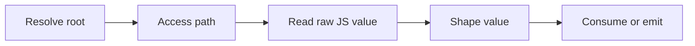
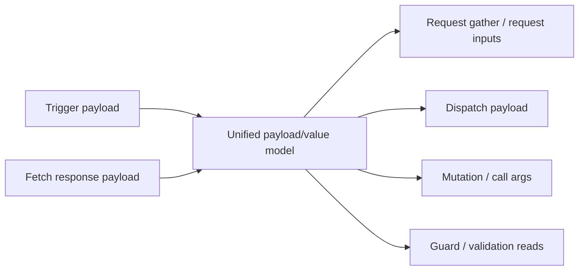

# Issue #86 Architecture Understanding Continuation 02

> Source Of Truth: this continuation refines
> [2026-03-31-architecture-understanding.md](./2026-03-31-architecture-understanding.md)
> using the later planning discussion captured in
> [2026-03-31-session-transcript-continuation-02.md](./2026-03-31-session-transcript-continuation-02.md).
> Read in order with
> [2026-03-31-session-transcript.md](./2026-03-31-session-transcript.md)
> and
> [2026-03-31-task-level-plan.md](./2026-03-31-task-level-plan.md).
>
> Date: 2026-03-31

## New Locked Thesis

The JS API semantics are the soul of the framework, and the entire
architecture should collapse toward that truth.

The stable end-to-end model is:



This same flow should explain:

- guards
- request input gathering
- response-body access
- chained-request input continuity
- property writes
- method calls
- dispatch payload composition
- validation reads

## HTTP Is Not A Side Subsystem

HTTP belongs inside the same unified value-flow family.

That means these are one conceptual group:

- request input values
- typed `ResponseBody<T>` reads
- `responseBody.*` source paths
- chained-request continuity after success
- future URL-pattern/value substitution

The correct mental model is:



Important nuance:

- request URL construction is not a separate semantic subsystem
- it is only a transport sink over already-resolved named values

So a future REST-pattern builder should plug into the same named request-value
family rather than invent a new source or value model.

## Response Payload Is Payload Scope, Not A New Source Kind

The continuation confirmed a sharper architectural interpretation:

- trigger payload and fetch response payload are the same payload-read concept
- they differ by payload scope, not by read mechanics

Current code still serializes this through the existing `event` source lane and
paths like `responseBody.name`. That is acceptable as current truth, but it is
not the ideal end-state vocabulary.

The conceptually cleaner model is:

- payload root
  - trigger scope
  - response scope
- component root
- path segments from that root
- shape metadata when typed DSL requires it

## Value Objects Are The Right End-State Vocabulary

The continuation also corrected the final schema target.

`readExpr` and `coerce` are current transport-era names. They are not the best
end-state domain terms.

The end-state emitted plan should move toward value objects such as:

- `access`
- `root`
- `path`
- `shape`
- `value`
- `sink`

Example conceptual direction:

```text
PlanValue
  literal
  read(access)
  object(fields)
  array(items)

ValueAccess
  root
  path
  shape
```

That gives a cleaner and more SOLID-aligned emitted contract than ending the
branch with field names like:

- `readExpr`
- `coerce`
- `coerceAs`

Those names may still exist temporarily while the stack is in flight, but they
should not be treated as the final architecture.

## Public DSL Still Stays Frozen

This cleanup does not argue for a broader public DSL.

The public C# DSL remains:

- curated
- compile-time guided
- intentionally restrictive

So the right direction is:

- cleaner internal semantics
- cleaner writer-owned emitted contract
- more correct compile-time surface
- no new speculative user-facing primitives

## Descriptor / Writer Split Is A Testability Win

The later discussion clarified a major benefit of separating semantic records
from JSON projection: correct testability.

With the split in place, the system can be tested at three clean levels:

1. semantic tests
   - what the internal model means
   - independent of transport naming or JSON formatting

2. writer tests
   - exact emitted JSON contract
   - independent of public descriptor visibility or serializer quirks

3. runtime tests
   - mechanical browser execution of the plan contract

That is much stronger than today’s mixed serializer-driven tests, where
semantic meaning and emitted transport shape are still entangled.

## Why Projection Ownership Matters Before Immutability

The continuation re-checked `ReactivePlan.Render()` and confirmed that request
and validation semantics are still mutated before serialization.

That means:

- semantic immutability is not real until projection owns the emitted subtree
- a pre-writer “immutability cleanup” would be architecture theater

So the correct sequence is:

1. give a writer / projection layer ownership of the request-validation subtree
2. move enrichment, extraction, and stamping into projection
3. only then claim the semantic records are truly immutable

## Updated End-State Summary

The continuation leaves the architecture with these stronger conclusions:

- JS API semantics are the primary source of truth
- HTTP request inputs and response payloads belong to the same value-flow model
- chained requests should inherit success context continuity
- URL construction is only a sink, not a subsystem
- descriptors should become pure internal recorders
- emitted JSON should become writer-owned and more value-object-oriented
- `shapeValue` is the better internal term for the shaping step

## Practical Reading Order For Future Agents

1. [2026-03-31-architecture-understanding.md](./2026-03-31-architecture-understanding.md)
2. [2026-03-31-session-transcript-continuation-02.md](./2026-03-31-session-transcript-continuation-02.md)
3. [2026-03-31-release-stack-plan-v2.md](./2026-03-31-release-stack-plan-v2.md)
