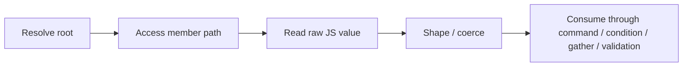
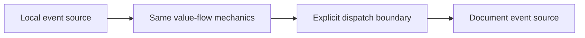

# Issue #86 Architecture Understanding

> This is the distilled understanding from the March 31, 2026 architecture
> session. It is intentionally separate from the raw transcript so the model is
> easy to use without re-reading the entire exchange.

## Thesis

The framework is already much closer to a simple deterministic architecture than
the current naming makes it feel.

The correct end-to-end mental model is:

And scope crossing is separate:

This is the architecture that should drive issue #86 and any follow-on
descriptor refactor.

## What The Framework Is Really Modeling

The framework models a JS API contract, not wrapper methods.

At the contract level, a runtime object surface exposes:

| Contract family | Variants |
| --- | --- |
| Property | read, write |
| Method call | without args, with args |
| Method return | without args, with args |
| Event | without payload, with payload |

If an event has payload, that payload is just another object surface and can
again expose:

- property read/write
- method call without args
- method call with args
- method return without args
- method return with args

That is the right abstraction level for the framework.

## What Is Not Special

### `readExpr`

`readExpr` is not a separate architectural feature. It is simply member access
after vendor-agnostic root resolution.

So:

- component `readExpr`
- event payload path like `evt.x.y`
- response-body path like `responseBody.x.y`

are all the same conceptual operation:

1. resolve a root
2. walk a member path from that root

### `walk(...)`

`walk(...)` is an implementation mechanism for path access. It is nuanced and
important, but it is not the architecture. The architecture is root resolution
plus member access. The current runtime happens to realize member access through
path walking.

## What A Read Produces

A read yields a raw JS value.

That value may be:

- primitive
- object
- array

This is already true in the code today. The framework does not fundamentally
operate on scalar-only leaves.

That matters because:

- object-valued properties are not a separate feature family
- array-valued properties are not a separate feature family
- if a property or return value ends at an object or array, the same model
  still applies

## Where `coerce` Fits

The read is not automatically the final typed value.

`coerce` is the shaping step between raw runtime value and the value form the
typed DSL expects.

So the real flow is:

1. resolve root
2. access member path
3. get raw JS value
4. shape / coerce
5. consume

This is why typed conditions work even though the runtime starts from plain JS
values. It is also why shaping belongs in the plan/descriptor model and not as
ad hoc runtime intelligence.

## Event Scope: Logical Unity, Physical Difference

Component events and custom events are not different capability families.

They are the same event/value-flow model with different scope attachment:

- component event = local event root
- custom event = `document` event root

So the right architecture is:

- same payload semantics
- same access semantics
- same shaping semantics
- same command/value-flow semantics
- different trigger scope/root attachment

That means the system should not fork into a separate logical model for custom
events versus component events.

## What The Runtime Should Look Like

The runtime should get dumber over time.

That means:

- fewer special cases
- fewer parallel value-consumer representations
- fewer branchy execution lanes
- more meaning carried in plan descriptors

The runtime’s job should mostly be:

1. resolve the correct root
2. access the correct member path
3. apply shaping if requested
4. execute a small command set

## What The Command Layer Should Look Like

The framework already centers on a small number of commands. Reads are not
commands; they are inputs to commands and to read consumers like conditions or
gather.

The top-level command set is already small:

- `mutate-element`
- `mutate-event`
- `dispatch`
- `validation-errors`
- `into`

Inside mutation execution, the effect verbs are even smaller:

- set property
- call method

That is a strong architectural sign. The system should continue to revolve
around a few stable commands, not around many wrapper-specific APIs.

## What Is Actually Duplicated Today

The problem is not root resolution.

The problem is not member access.

The problem is not path walking.

The problem is the duplicated way commands consume values.

Today, the same concept is represented through multiple descriptor shapes:

- mutate-element uses `Value` plus `Source`
- mutate-event uses `Value` plus `Source`
- call args use `MethodArg` (`LiteralArg` / `SourceArg`)
- dispatch uses raw object payload

That means one underlying idea, “how does this command obtain and shape a
value?”, is currently split across multiple representations.

This is the architectural pressure point.

## What Must Not Happen

These rules are part of the understanding, not optional style preferences:

- no fallbacks
- no parallel old/new lanes left behind
- no cleanup postponed to “later”
- no new ad hoc handoff/storage path if existing source/value flow can express
  the use case
- no dispatch-only mini-architecture
- no vertical slice fix that ignores the shared model

The guiding rule is:

> Source is truth.

If a capability can be expressed as source-driven flow, that is the direction
to prefer.

## What This Means For Issue #86

Issue #86 should not be framed as if the framework lacks a value model.

The framework already has:

- root resolution
- member access
- source-driven reads
- value shaping
- typed conditions
- gather
- typed custom-event consumption
- property writes
- method calls

The right question is:

> Where does value-flow continuity stop today, across the shared model?

That is the question the matrix, the architectural tracing, and the issue
rewrite should answer.

## Refactor Direction Implied By This Understanding

If descriptors are reshaped correctly, then:

- any DSL stage can hook into the same model naturally
- runtime mechanics stay uniform
- adding a new supported flow becomes composition, not invention
- JSON serialization responsibilities can be made cleaner
- collection/core logic can be encapsulated more cleanly
- SOLID boundaries become clearer instead of fuzzier

That is the architectural target.
