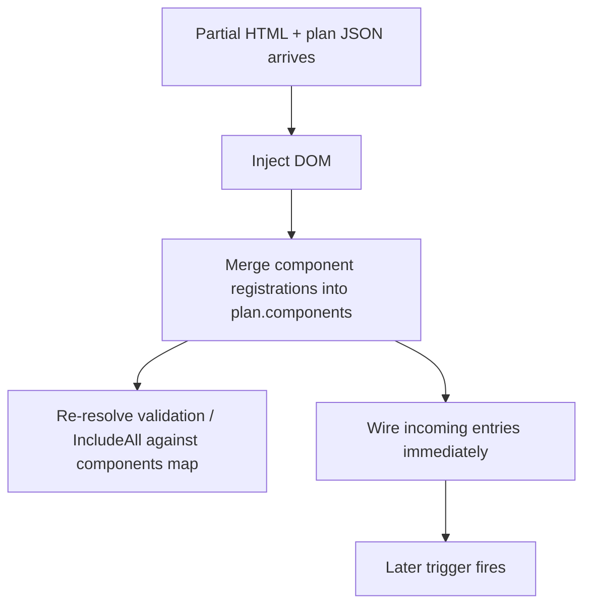
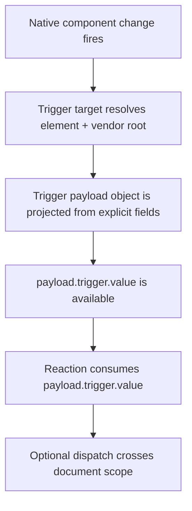
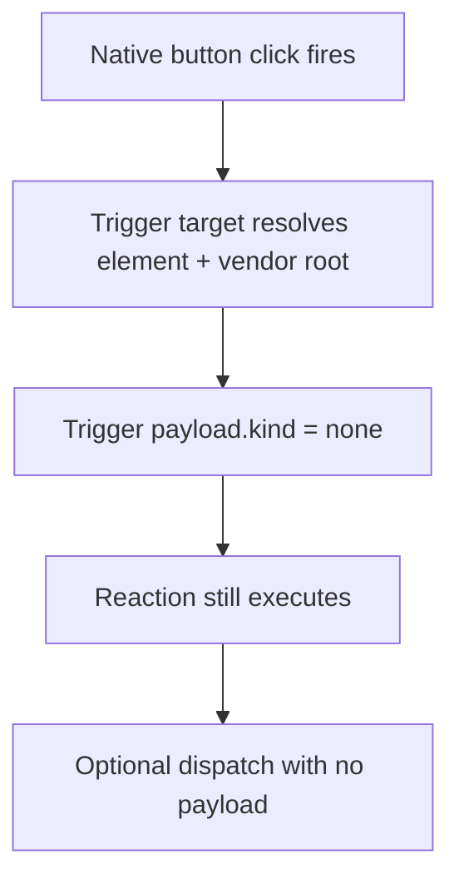
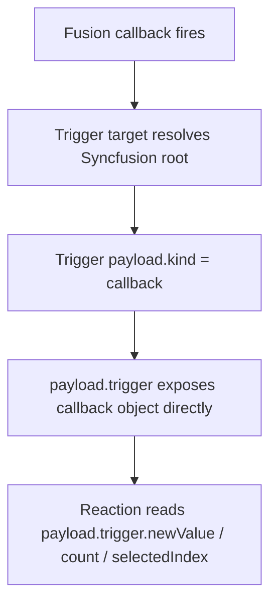
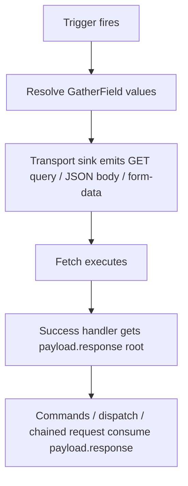
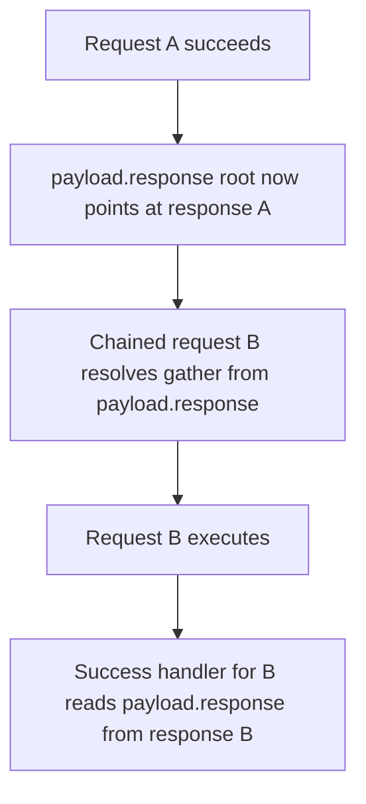
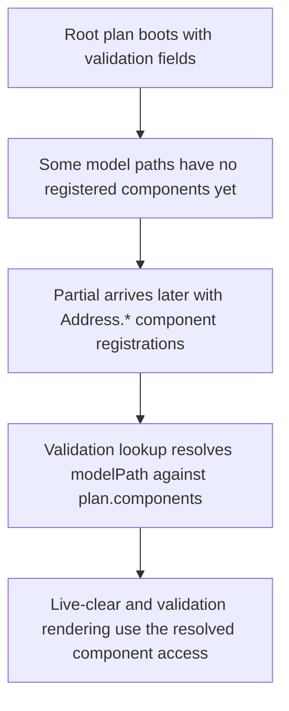
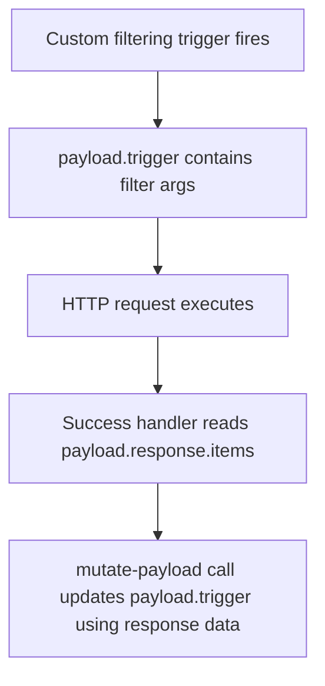
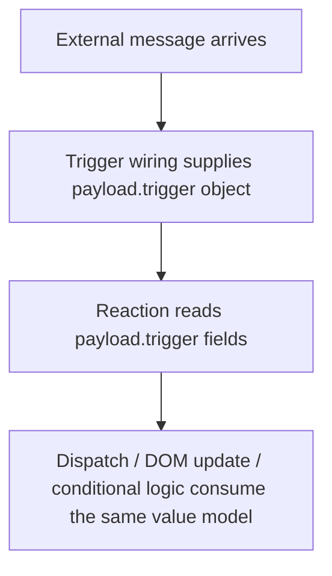

# Source Of Truth

- Read in order:
  - [2026-03-31-session-transcript.md](./2026-03-31-session-transcript.md)
  - [2026-03-31-architecture-understanding.md](./2026-03-31-architecture-understanding.md)
  - [2026-03-31-session-transcript-continuation-02.md](./2026-03-31-session-transcript-continuation-02.md)
  - [2026-03-31-release-stack-plan-v2.md](./2026-03-31-release-stack-plan-v2.md)
  - [2026-03-31-end-state-schema-proof-matrix.md](./2026-03-31-end-state-schema-proof-matrix.md)
  - [2026-03-31-end-state-reactive-plan.schema.json](./2026-03-31-end-state-reactive-plan.schema.json)

# 2026-03-31 End-State Schema Proof

## Governing Rule

The refactor is only valid if every real use-case family in the current codebase can be narrated and expressed by the end-state plan contract itself.

If a use case only works because:

- runtime branches invent payload shape
- lazy enrichment secretly completes missing trigger data
- the schema cannot tell the story without prose

then the end-state schema is wrong.

## Final Contract Decisions

These decisions are locked in this proof package.

1. `components` stays a map keyed by model path.
The key is the stable correlation key for `IncludeAll`, validation, and component lookups after partial merges.

2. Component registrations stop emitting `readExpr` / `coerceAs`.
They emit:

```json
{
  "id": "Resident_Name",
  "vendor": "native",
  "componentType": "textbox",
  "value": {
    "path": "value",
    "shape": "string"
  }
}
```

3. Reads and carried values are separated cleanly.
- `ValueAccess` answers: where does the raw value come from?
- `PlanValue` answers: what value is being passed to a consumer?

4. Trigger payload and response payload are one source family.
- trigger payload reads use `source: { kind: "payload", scope: "trigger" }`
- response payload reads use `source: { kind: "payload", scope: "response" }`

5. `ComponentEventTrigger` must be self-sufficient.
It cannot depend on later enrichment because partial-injected entries are wired immediately.

6. Validation fields stay pure.
Validation does **not** carry enriched `fieldId`, `vendor`, `readExpr`, or `coerceAs`.
It stays:

```json
{
  "modelPath": "Resident.Address.ZipCode",
  "rules": [
    { "rule": "required", "message": "required" }
  ]
}
```

Runtime lookup can resolve the current component through `plan.components[modelPath]`.

7. `mutate-event` becomes `mutate-payload`.
The command acts on trigger payload, not just DOM event args. That matches current reachable use through custom events, fusion callback args, and native event-like payloads.

8. Request input, dispatch payload, method args, and condition operands all use `PlanValue`.
This is the unified value-flow center.

## Self-Sufficient vs Lazy-Resolvable

This distinction is required by the browser partial lifecycle.



- `ComponentEventTrigger` must be complete before `E`
- validation fields are allowed to stay pure and be resolved at `D`

## Activity Proofs

### 1. Native Readable Component Event



Schema objects:
- `ComponentEventTrigger.target`
- `ComponentEventTrigger.payload.kind = object`
- `TriggerProjectionValue = ComponentReadValue`
- `ValueAccess.source.kind = component`
- `DispatchCommand.payload = ObjectValue`

### 2. Native Non-Readable Component Event



This replaces the current runtime habit of manufacturing `{ event: e }` even when the DSL never reads it.

### 3. Fusion Callback Event



Schema objects:
- `ComponentEventTrigger.payload.kind = callback`
- `ValueAccess.source.kind = payload`
- `ValueAccess.source.scope = trigger`

### 4. HTTP Request Input And Response



Schema objects:
- `GatherField`
- `PlanValue`
- `RequestDescriptor.contentType`
- `StatusHandler.reaction`
- `PayloadValueSource.scope = response`

### 5. Chained Request Continuity



This is the concrete proof that response payload is not a side subsystem. It is the same unified payload-read model.

### 6. Partial Validation



This removes the need to mutate validation fields with copied component metadata.

### 7. Payload Mutation During Filtering



Schema objects:
- `MutatePayloadCommand`
- `CallMutation.args: PlanValue[]`
- `PayloadValueSource.scope = trigger | response`

This is the real proof case behind `PreventDefault` and `UpdateData`.

### 8. Server Push And SignalR



No special read model is needed for SSE or SignalR. They are just trigger-payload providers.

## Result

With the contract in [2026-03-31-end-state-reactive-plan.schema.json](./2026-03-31-end-state-reactive-plan.schema.json), every current use-case family can be expressed without relying on hidden runtime payload invention.

The two most important architectural corrections are:

- `ComponentEventTrigger` now owns explicit payload projection instead of leaving it to vendor-specific runtime branching
- validation remains pure and resolves through `components` instead of lazy copying/mutation

## Review Notes

- `Carson` runtime review:
  - request input, response payload, and chained-request continuity are one value-flow family
  - partial-injected component-event triggers must stay self-sufficient
- `Descartes` public-DSL / writer review:
  - public placeholders like `ResponseBody<T>` and typed event args are compile-time DSL only
  - emitted projection contracts must be distinct from public DSL inputs and internal semantic records
