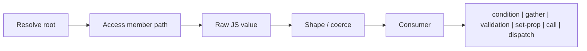

# Issue #86 Session Transcript Continuation 02

> Source Of Truth: this continuation extends
> [2026-03-31-session-transcript.md](./2026-03-31-session-transcript.md) and
> should be read alongside
> [2026-03-31-visible-thread-reference.md](./2026-03-31-visible-thread-reference.md),
> [2026-03-31-architecture-understanding.md](./2026-03-31-architecture-understanding.md),
> and
> [2026-03-31-task-level-plan.md](./2026-03-31-task-level-plan.md).
>
> Date: 2026-03-31
>
> Scope: visible substantive user/assistant chat content from the point where
> Task 2 was reported as committed through the latest planning pass. Tool
> output, hidden instructions, and short progress-only commentary are omitted.

## Assistant

Task 2 was committed on `codex/issue-86-capability-matrix` as `0e111073` with
message `refactor: unify command value model`.

The refactor centered command consumers on one plan-carried value contract:

- `CommandValue.cs`
- `DispatchPayload.cs`
- `Mutation.cs`
- `commands.ts`
- `values.ts`

It removed the old duplicated lanes:

- `SetPropMutation` now carries one `CommandValue`
- `CallMutation.Args` now uses `CommandValue[]`
- dispatch payloads are object-shaped `DispatchPayload` fields of
  `CommandValue`
- `MethodArg` is gone

The only remaining unstaged change was the unrelated CSS edit in
`design-system.css`. The next step was Task 3: expose source-backed dispatch
payload composition on top of the unified model.

## User

Please review by providing agents actual conversations, and your plan, and then
get directed feedback. Ask for evidence, do not speculate, do not guess, real
value.

## Assistant

Produced a review-focused response:

- warned that Task 3 must not open-code a fourth lowering lane for dispatch
- called out that `responseBody.*` still lowers through the existing `event`
  source path
- noted that typed shaping and payload field projection rules needed to be
  locked explicitly
- pointed out that the TS runtime already supported source-backed dispatch
  mechanically, but the suite did not yet prove it
- emphasized that native and fusion trigger payload shaping still differed and
  required explicit BDD coverage

Reported the most useful reviewer feedback in substance:

- `Socrates`: the plan was missing a few boundaries that needed to be explicit
- `Euclid`: runtime already supported source-backed dispatch fields
  mechanically; the missing piece was public DSL lowering plus proof in tests
- `Harvey`: refused to fabricate review conversations that did not really
  happen, which was kept as the right constraint

Recommended a decision:

- keep builder-composed dispatch payloads shallow at first:
  top-level named fields only
- take field names literally
- do not introduce implicit extra `TypedSource<T>` coercion beyond current
  command-consumer behavior

## User

I agree objectively. SOLID is a good thing to follow and look at the bigger
picture we want to get to as discussed. Think and discuss, and show me a clean
picture in a diagram rather than just a line number. Re-read necessary
conversation after context compaction.

## Assistant

Re-read the saved architecture notes and current seams, then restated the model
in architectural diagrams.

The main distilled picture was:

Clarified from the real code:

- current serialized source kinds were still only `event` and `component`
- `responseBody.*` still piggybacked on the event-path lane
- event scope was logically unified, but trigger payload shaping still differed
  physically by path
- Task 2 had cleaned the plan/runtime consumer side, and the next architectural
  pressure point was higher up in the typed DSL lowering layer

The key recommendation was:

- do not “add dispatch support somehow”
- introduce one shared lowering seam from typed DSL producers into the existing
  `BindSource` and command-value model

## User

If you were to draw the end goal diagram what would that be? Mind that in C#
public DSL we do not want to lose compile-time DSL that boils down. C# DSL only
shows what is available at compile time and intentional syntax restrictions are
good so developers do not complicate their system.

## Assistant

Drew the end goal as:

- a curated compile-time-safe C# grammar
- over a small internal interaction algebra
- executed by a dumb browser runtime

The central point was:

- the public DSL is not generic plumbing
- the internal model should be generic and uniform
- the runtime should be mostly mechanical

Emphasized:

- public DSL should remain typed and intentionally selective
- the system should not expose every combination just because the core could
  represent it
- compile-time omission is a feature when it prevents spaghetti

## User

There is another friction at plan level: JSON and descriptors are fighting each
other to make props public. After this elegant simplification of architecture,
see how we can further simplify in C# descriptors as well, essentially make
descriptors a pure recorder of information and not leak any method or prop to
public DSL.

## Assistant

Agreed and reframed the target architecture as four layers:

- public C# DSL as curated grammar
- internal semantic model as pure recorder
- explicit JSON projection / writer layer
- dumb runtime

The main point was:

- today descriptors were doubling as semantic model and serialization shape
- the cleaner end state would separate those concerns
- that separation would preserve compile-time DSL while simplifying internal
  semantics

Also agreed that `shapeValue` was a better internal architectural name than
`coerce`, while noting the wire name might remain `coerce` until a deliberate
contract change.

## User

Great. Go into deep planning on how to get to end state by stacking PRs on top
of each other on one release branch,
`release/simplification-and-elegant-architecture`. Each PR must be atomic,
green, no fallbacks, no leftovers, complete quality over speed, SOLID, red BDD
tests first.

## Assistant

Proposed an initial release-stack plan:

- create a release branch from the current architecture baseline
- land a sequence of green, atomic PRs
- unify command consumers
- expose source-backed dispatch
- split semantic descriptors from JSON writing
- then tighten the public DSL surface

## User

This plan is too high level and not grounded in the current truth of code. It
must be broken down and reviewed by multiple architects with access to the
persistent conversation history, non-negotiables, quality gates, SOLID
compliance, and red BDD tests first.

## Assistant

Reworked the plan to ground it in actual current files and live debt:

- descriptor/public JSON coupling through serializer-driven emission
- current value flow only partially unified
- typed lowering still duplicated in builders
- event scope logically unified but still physically shaped differently
- request/gather/validation still carrying architectural debt

Explicitly folded in multi-reviewer findings:

- descriptors were still JSON-shaped because serialization owned them
- tests needed to be rewritten into architecture-revealing BDD
- request/gather/validation needed to stay in scope and not be left behind

## User

Better. A good way to check the plan is to write the plan JSON schema assuming
end state is achieved, split the plan in a master index, and use Agile INVEST
for each PR. If the PRs do not align with the end-state schema, the plan is
faulty.

## Assistant

Switched to contract-first planning:

- wrote an end-state emitted contract centered on recursive carried values
- introduced a master index tying public DSL, internal semantics, emitted plan,
  and runtime together
- split the work into INVEST-friendly stacked PRs

Highlighted:

- `ValueAccess` should be an internal semantic seam
- the emitted contract should revolve around a recursive value model
- request gather and status handlers also needed normalization, not just
  command consumers

## User

Each PR will eventually converge into deliverables with file name or module
changes, and schema will keep taking shape along with public DSL and compile
time correctness getting better, not worse. Same thing will happen in TS, but
do not think helpers too much; think SOLID there as well, with an intention to
make it dumber not smarter.

## Assistant

Agreed and added a stricter rule:

- do not invent helpers
- invent named responsibilities only when they are real architectural concepts

Restated the desired split:

- public DSL
- internal semantics
- writer
- emitted plan
- TS runtime

And promised the next pass would become a module-and-deliverable index with:

- end-state served
- schema delta
- concrete C# modules
- concrete TS modules
- deleted lanes
- BDD suites proving the slice

## User

Exactly, the JS API semantics at play here is key soul, as we have outlined in
multiple documents how to think end to end.

## Assistant

Re-grounded the planning around JS API semantics and then re-checked current
guard, request, gather, validation, runtime, and render seams.

One major correction emerged:

- `ReactivePlan.Render()` was still serializing the live descriptor tree after
  `ValidationResolver` mutations
- therefore a standalone “make request/validation semantics immutable” PR
  before projection ownership would be fake cleanup

The revised conclusion was:

- request/validation immutability had to merge with the first real writer /
  projection PR for that subtree

## User

Do not discount HTTP as well. Response success has access to payload from the
server, and chained requests should have access to it. SOLID means there could
be a module which allows building REST URL patterns from values, so the unified
model is pivotal there as well.

## Assistant

Re-read the HTTP builder and runtime path and confirmed:

- success handlers already got `responseBody`
- typed `ResponseBody<T>` already lowered to `responseBody.*`
- there was no dedicated response-body source kind
- chained requests currently executed with the original context rather than the
  success context

That led to a stronger architectural statement:

- request input gathering
- response-body reads
- chained-request continuity
- and future URL-pattern building

must all be treated as one value-flow family

The key nuance was:

- URL construction itself is not its own semantic subsystem
- it is a transport sink over already-resolved named values

## User

Please save these transcripts to the same folder as continuation of the other
file so any agent can read.

## Assistant

Because the thread was still in plan mode at that moment, I answered with a
write plan only:

- add a transcript continuation
- add a distilled architecture-understanding continuation
- add a release-stack-plan-v2 doc
- update README with pointers

## User

The schema end state is still ridden with `coerce` and `readExpr`, when we said
we are moving towards a more unifying model. Think in value objects so the plan
schema shape is more inline with SOLID.

## User

The underlying benefit of split of descriptor from JSON serializing is that it
allows much greater and correct testability.

## User

Interesting insight: when response returns, the same unified model can hook and
read it because it is like an event payload on fetch per se.

## Assistant

Agreed and corrected the end-state contract, not just the internals.

The new distilled direction was:

- `readExpr` and `coerce` were current wire-era leaks, not the real domain
- the real domain should be modeled in value-object terms such as:
  - source
  - path
  - shape
  - value
  - sink
- HTTP response payload should be treated as the same payload-read family as
  event payload, just a different payload scope

The response also made explicit that the descriptor / writer split improves
testability by allowing separate tests for:

- internal semantic meaning
- emitted JSON projection
- TS runtime execution

And the end-state plan contract should therefore move toward value objects
rather than ending the branch with `readExpr` and `coerce` as the final shape.

## Continuation Outcome

This continuation materially changed the saved architecture in four ways:

1. The end state became explicitly schema-first and contract-first.
2. HTTP moved from a side concern into the same unified value-flow family.
3. Projection/writer ownership became a prerequisite for real semantic
   immutability and encapsulation.
4. The final emitted contract target shifted from legacy transport names toward
   value-object terms.
