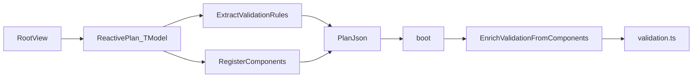
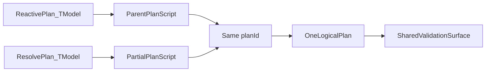
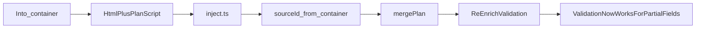
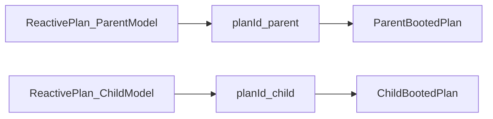
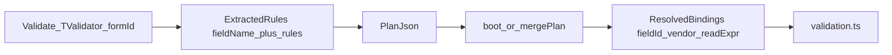
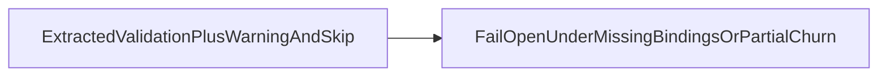
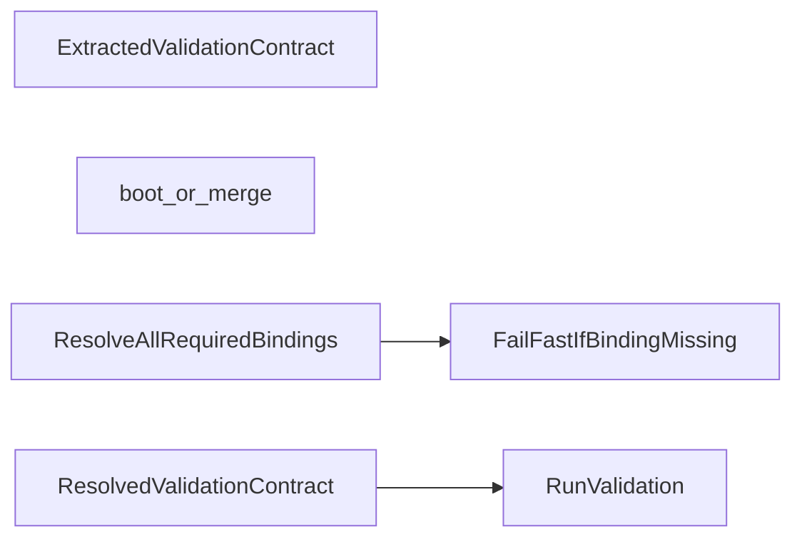

# Validation Contract Still Fails Open And Loses Fidelity

## Verdict

This is a legitimate open issue.

The problem is not that validation exists. The problem is that the intended validation architecture is stronger than the current implementation.

## Intended Architecture

### Root View Validation

- `Html.ReactivePlan<TModel>()` is the root logical plan boundary.
- `.Validate<TValidator>(formId)` is request-chained.
- Validation becomes executable after runtime enrichment binds extracted fields to controlled component ids.

### Same-Model Partial Through `ResolvePlan<TModel>()`

- `Html.ResolvePlan<TModel>()` is the architectural marker that the partial belongs to the parent logical plan.
- Parent and partial are authored separately, but runtime treats them as one logical validation surface because `planId` matches.

### AJAX-Loaded Same-Model Partial

- `inject.ts` extracts the partial plan and stamps `sourceId` from the target container.
- `mergePlan()` replaces the previous contribution from that source and re-enriches validation.
- This is how parent-authored validation is supposed to become truthful for fields that arrive later from a same-model partial.

### Standalone Partial With Its Own `TModel`

- A partial using `Html.ReactivePlan<TOtherModel>()` is its own logical plan.
- Different `planId` means separate runtime validation lifecycles.

### Validation Lifecycle

- C# extraction produces symbolic validation fields.
- Runtime enrichment binds those fields to controlled ids, vendors, and read expressions.

## Current Contract

The DSL is frozen.

Validation is request-chained through `HttpRequestBuilder.Validate(...)`, not a standalone subsystem.

`ResolvePlan<TModel>()` exists to express that a partial belongs to the same logical plan as the parent for the same model.

The supported client-validation subset is:

- request-chained validation
- local client rules
- explicit client conditional rules
- partial participation through `ResolvePlan<TModel>()`
- separate standalone partial plans through their own `ReactivePlan<TOtherModel>()`

The framework should not reduce MVC capability as the fix strategy. It should give developers stronger framework-owned tools so correct MVC composition is the easiest path.

## Evidence Of Where It Breaks

### 1. Declared validation still fails open

Evidence:

- `HttpRequestBuilder.Validate<TValidator>(formId)` creates a placeholder validation descriptor.
- `ValidationResolver` only replaces it if extraction succeeds.
- `validation.ts` returns `true` when the form container is missing and skips unresolved fields.

Relevant files:

- `Alis.Reactive/Builders/Requests/HttpRequestBuilder.cs`
- `Alis.Reactive/Resolvers/ValidationResolver.cs`
- `Alis.Reactive.SandboxApp/Scripts/validation.ts`

Why this matters:

- a request can explicitly opt into validation
- extraction or binding can still degrade
- runtime can still behave as if validation passed

### 2. Validation is still only half-bound until runtime enrichment

Evidence:

- extracted fields carry `fieldName + rules`
- runtime later mutates them with `fieldId`, `vendor`, and `readExpr`

Relevant files:

- `Alis.Reactive/Validation/ValidationField.cs`
- `Alis.Reactive/Resolvers/ValidationResolver.cs`
- `Alis.Reactive.SandboxApp/Scripts/boot.ts`

Why this matters:

- the executable validation contract does not fully exist on the C# side
- runtime enrichment is therefore part of correctness, not just convenience

### 3. Same-model partial merge can weaken validation truth

Evidence:

- `mergePlan()` re-enriches entries after partial merge
- `enrichValidationFields()` only warns when a field is missing from `components`
- `validation.ts` skips unresolved fields

Relevant files:

- `Alis.Reactive.SandboxApp/Scripts/boot.ts`
- `Alis.Reactive.SandboxApp/Scripts/inject.ts`
- `Alis.Reactive.SandboxApp/Scripts/validation.ts`

Why this matters:

- the architecture says `ResolvePlan<TModel>()` partials participate in the same logical validation surface
- current runtime behavior still tolerates incomplete rebinding instead of treating it as a contract problem

### 4. Conditional and equality rules are not truthful when peer bindings are missing

Evidence:

- `evalCondition()` returns truthy when condition source metadata or element is missing
- `equalTo` silently stops enforcing when peer binding metadata is missing

Relevant files:

- `Alis.Reactive.SandboxApp/Scripts/validation.ts`
- `Alis.Reactive.FluentValidator/FluentValidationAdapter.cs`

Why this matters:

- rules extracted for client use can drift from their authored meaning
- this gets worse under partial load and re-merge scenarios

### 5. Server error mapping and message placement are not fully framework-owned

Evidence:

- error spans are still discovered with `data-valmsg-for`
- `FieldBuilder` renders message placeholders by field name convention
- server-side error mapping still depends on consistent field-name shaping rather than one explicit shared contract

Relevant files:

- `Alis.Reactive.SandboxApp/Scripts/validation.ts`
- `Alis.Reactive.Native/Builders/FieldBuilder.cs`
- validation controllers that shape error dictionaries

Why this matters:

- the input/value lane is id-driven
- the message lane still depends on markup convention
- this is weaker than the rest of the architecture

### 6. “Conditional rules extracted from FluentValidation” is only partially true

Evidence:

- generic FluentValidation `.When()` / `.Unless()` are skipped
- explicit client conditions come through the custom Reactive path

Relevant files:

- `Alis.Reactive.FluentValidator/FluentValidationAdapter.cs`

Why this matters:

- the supported subset must be described truthfully
- the architecture should not imply that arbitrary FV delegate conditions are exportable

## Why This Breaks The Architecture

The intended architecture is:

The current implementation is closer to:

That breaks the architecture because:

- the authored validation contract is not authoritative enough
- same-model partial participation through `ResolvePlan<TModel>()` is not enforced strongly enough at runtime
- missing bindings degrade into warning-and-skip behavior instead of explicit contract failure

## Better Architecture

The better architecture is:

- keep the DSL frozen
- keep validation request-chained
- preserve `ResolvePlan<TModel>()` as the same-logical-plan authoring marker
- separate:
  - extracted validation contract
  - resolved executable validation contract
- re-resolve bindings authoritatively on every boot and merge
- fail fast when declared bindings cannot be satisfied
- unify server and client field mapping from the same canonical field path model
- move message targets toward explicit framework-owned identifiers
- do not move back to DOM scanning for field/value resolution
- do not reduce MVC capability to make validation easier

## Required Proof

### Playwright proof

- root view validation works through the id-driven contract
- same-model partial loaded later via `ResolvePlan<TModel>()` becomes part of the same validation surface
- reloading the same partial by `sourceId` does not weaken validation truth
- standalone partial with its own `TModel` remains isolated
- explicit client conditional rules remain truthful after partial load and reload
- server validation errors map back to the correct rendered fields

### TS runtime proof

- missing active bindings do not silently pass
- boot/merge re-resolution is authoritative
- missing peer bindings for conditional/equality rules do not silently alter meaning
- same-model partial churn does not leave stale validation state behind

### C# proof

- `.Validate<TValidator>()` cannot degrade to a false-success contract
- extracted conditional rules preserve canonical field paths
- server and client field mapping use the same field identity model
