# NativeActionLink Reuses One Full Single-Request Chain

## Verdict

This document is the frozen design specification for `NativeActionLink`.

## Problem

Many screens have repeated row-level actions in grids, lists, and tables.

In those screens, the interaction shape is usually identical for every row:

- the user activates a link
- one full single-request chain is executed
- only concrete per-row values differ, such as URL and declared request inputs
- the response is handled through the same success and error semantics every time

That is a strong use case for a native vertical slice.

The framework does not require every repeated link action to become a full generic plan entry when the author wants a link-shaped component with one fixed single-request-chain behavior.

This slice is explicitly designed for repeated rendering inside Razor loops. Each rendered anchor carries different concrete request values while all instances share the same document-level capture mechanism and the same single-request-chain semantics.

## The Core Direction

`NativeActionLink` is a native component vertical slice that supports an `Html.NativeActionLink` builder-style authoring experience and renders a normal anchor enriched with `data-reactive-*` attributes.

The feature reuses the existing full single-request-chain semantics that already exist in the framework, and it differs only in serialization surface.

This is non-negotiable:

- the DSL for the supported one-request chain does not change
- the request semantics do not change
- the response semantics do not change
- the only architectural difference is serialization surface
- no alternate or convenience DSL shapes are introduced for this slice

For the supported shape, `NativeActionLink` does not introduce a reduced DSL, an expanded DSL, or a reinterpreted DSL. It reuses the same one-request DSL and serializes it differently.

The same request truth is preserved:

- the generic plan-backed HTTP DSL serializes that truth into plan JSON
- `NativeActionLink` serializes that same truth into `data-reactive-*`

This must stay:

- one element
- one unique anchor identity per rendered instance
- one activation
- one full single-request chain
- one declared gather/input lane
- one while-loading lane
- one full success lane
- one full error lane
- one typed success payload lane
- one request execution truth

It must not become:

- a generic per-element reactive DSL
- a reduced convenience DSL with different semantics
- a client-side route-construction mechanism
- a multi-request workflow surface

## Critical Constraint: MVC Still Owns URL Resolution

This point is fundamental.

`NativeActionLink` keeps route resolution in MVC, not in the browser.

The browser receives only concrete `href` and concrete `data-reactive-*` values.

The URL truth is frozen:

- the canonical serialized request payload is the single execution source of truth for the base request URL
- the rendered `href` mirrors that same base URL for the anchor element
- for GET requests, gathered query parameters may extend the executed URL at click time through the existing gather semantics
- mismatch between `href` and the canonical serialized base request URL is an invalid contract
- the browser never resolves MVC action names, controller names, or route templates

The runtime executes concrete request metadata. It does not reconstruct MVC semantics from action names, controller names, or route templates.

This aligns with the existing framework contract:

- `ReactivePlan.Render()` serializes a concrete JSON plan in `Alis.Reactive/IReactivePlan.cs`
- `RequestDescriptor.Url` is already just a final string in `Alis.Reactive/Descriptors/Requests/RequestDescriptor.cs`
- `GatherBuilder<TModel>` already models request inputs on the C# side in `Alis.Reactive/Builders/Requests/GatherBuilder.cs`
- `resolveGather(...)` executes against already-serialized gather items in `Alis.Reactive.SandboxApp/Scripts/gather.ts`
- `ResponseBuilder.OnSuccess<TResponse>(...)` already models a typed success payload lane in `Alis.Reactive/Builders/Requests/ResponseBuilder.cs`
- `ResponseBody<T>` already carries compile-time response typing in `Alis.Reactive/ResponseBody.cs`
- native components already treat element identity as explicit state, either by explicit ids or generated collision-free ids such as `IdGenerator.For(...)`

That discipline matters because it preserves long-term cacheability. If the rendered contract remains a pure product of C# render-time data, the framework can later cache that output much more safely than a design that requires the browser to synthesize request metadata.

## Public Shape

The public shape follows an existing native builder, and the request-chain surface matches the existing single-request HTTP DSL exactly.

The builder surface is therefore a serialization host for the existing one-request DSL. It is not a place to redesign the DSL.

Example:

```csharp
@Html.NativeActionLink("Next", "/orders/page/2", p => p
    .Post("/orders/page/2", g => g.IncludeAll().Static("page", 2))
    .WhileLoading(x => x.Element("paging-spinner").Show())
    .Response(r => r
        .OnSuccess<PagedOrdersResponse>((json, x) =>
        {
            x.Into("orders-grid");
            x.Element("page-title").SetText(json, y => y.Title);
        })
        .OnError(400, x => x.Element("page-error").SetText("Bad request"))))
    .CssClass("paging-link")
```

Loop usage:

```csharp
@foreach (var row in Model.Rows)
{
    @Html.NativeActionLink("Delete", $"/orders/delete/{row.Id}", p => p
        .Post($"/orders/delete/{row.Id}", g => g.Static("id", row.Id))
        .Response(r => r.OnSuccess(x => x.Into("orders-grid"))))
        .CssClass("row-action")
}
```

Surface:

```csharp
public static NativeActionLinkBuilder<TModel> NativeActionLink<TModel>(
    this IHtmlHelper<TModel> html,
    string linkText,
    string url,
    Func<PipelineBuilder<TModel>, HttpRequestBuilder<TModel>> configure)
    where TModel : class;

public sealed class NativeActionLinkBuilder<TModel> : IHtmlContent
    where TModel : class
{
    public NativeActionLinkBuilder<TModel> CssClass(string css);
    public NativeActionLinkBuilder<TModel> Attr(string name, string value);
}
```

There is one shape only in this slice: `NativeActionLink` receives the final URL it renders and executes.

The request chain itself is not re-declared on `NativeActionLinkBuilder`. The existing request-start surface on `PipelineBuilder<TModel>` is hosted through the `configure` callback, and the resulting existing one-request chain is then serialized through `data-reactive-*`.

Each rendered `NativeActionLink` instance also owns a unique anchor id.

That is required because:

- the slice is rendered repeatedly inside loops
- each rendered anchor is a separate serialized request contract
- identity must not rely on link text, URL text, or DOM position

The rendered id must therefore be collision-free across repeated instances on the page. Delegated click handling remains document-level, but the anchor itself still has explicit identity as part of its rendered contract.

## Supported Single-Request Chain Semantics

`NativeActionLink` supports the same semantics as one existing single-request HTTP chain in the framework:

- verb selection
- final URL
- gather
- request payload format
- validation
- while-loading
- response success handlers
- typed response success handlers through `OnSuccess<TResponse>(...)`
- response error handlers
- the same command and reaction semantics that already exist inside those handlers

The single-request-chain boundary is strict:

- the hosted request chain contains exactly one `RequestDescriptor`
- no additional `RequestDescriptor` may appear inside success handlers, error handlers, conditional branches, or confirm branches
- response handlers may use commands and non-request reactions only

The one difference is serialization:

- plan-backed HTTP serializes through plan JSON
- `NativeActionLink` serializes through `data-reactive-*`

Nothing else changes.

`NativeActionLinkBuilder` therefore owns anchor concerns only:

- link text
- final URL
- unique anchor id
- CSS class and HTML attributes
- serialization of the already-built request chain

It does not re-declare request methods such as `Post()`, `Gather(...)`, `Validate(...)`, `WhileLoading(...)`, or `Response(...)`. Those remain on the existing request DSL.

## What Must Be Deliberately Excluded

This slice excludes only the parts of the generic HTTP DSL that turn one request into more than one request.

It does not support:

- chained requests
- parallel requests
- client-side route generation
- any nested HTTP request introduced from inside response handlers or branches

All other single-request-chain semantics remain aligned with the existing DSL. If those semantics are removed or reduced on `NativeActionLink`, the DSL diverges and the slice stops reusing the framework’s existing request truth.

## Authoring Enforcement

Unsupported multi-request constructs are enforced through analyzer diagnostics rather than by shrinking the DSL surface.

That means:

- `NativeActionLink` keeps the existing one-request DSL semantics
- authoring `Parallel(...)` inside a `NativeActionLink` request chain is a diagnostic error
- authoring `Response(...).Chained(...)` inside a `NativeActionLink` request chain is a diagnostic error
- authoring a new HTTP request inside `OnSuccess(...)`, `OnSuccess<TResponse>(...)`, `OnError(...)`, or any nested branch reachable from those handlers is a diagnostic error

This follows the same architectural direction already used by `Alis.Reactive.Analyzers`: the DSL remains expressive, and invalid usage on a specific Razor authoring surface is rejected at authoring time.

Analyzer enforcement is not the only safeguard. The serialization path must be designed so unsupported multi-request shapes are rejected by explicit contract validation before execution continues.

The enforcement model is therefore:

1. analyzer rejects unsupported authoring in Razor
2. serialization contract validation rejects unsupported shapes before runtime execution

This preserves one DSL truth while still making `NativeActionLink` a strict single-request-chain surface.

The analyzer does not redefine the DSL. It only rejects request shapes that exceed the allowed serialization scope for `NativeActionLink`.

The analyzer-based restriction model is what allows the spec to reuse the existing DSL without duplicating request methods or introducing alternate DSL shapes on `NativeActionLinkBuilder`.

## Why This Stays SOLID

### Single Responsibility

`NativeActionLink` models one thing only: a native anchor that executes one full single-request chain.

### Open/Closed

The existing request engine remains the source of truth for request execution. The new feature adds a narrow adapter over existing behavior rather than changing unrelated workflow concepts.

### Liskov Substitution

The builder still renders valid anchor markup and behaves like a bounded enhancement of a link, not a fundamentally different concept hidden behind an `<a>`.

### Interface Segregation

Authors get a native link builder while still keeping the existing one-request DSL semantics.

### Dependency Inversion

The builder emits a small declarative attribute contract, and the runtime adapter depends on the existing request executor instead of embedding fetch logic in the component slice.

## Runtime Shape

The runtime remains minimal.

The runtime shape is:

- one document-level delegated click handler
- one narrow attribute reader
- one shared single-request-chain execution entry point
- reuse of the existing request engine

This avoids per-element boot complexity and keeps `NativeActionLink` on the same fetch and request execution path the framework already trusts.

This also matches the existing runtime style:

- `auto-boot.ts` already performs one-time runtime initialization on page load
- `inject.ts` already injects partial HTML without per-element event registration infrastructure
- `boot.ts` and trigger wiring are reserved for plan-backed entries, not for this native attribute slice

`NativeActionLink` therefore adds one startup-time delegated listener, not one listener per rendered anchor.

The TypeScript runtime handling must remain SOLID:

- `native-action-link.ts` owns only delegated capture and decoding of the serialized existing single-request-chain shape for `NativeActionLink`
- `pipeline.ts` remains the shared entry point for executing one request chain
- `http.ts` remains the request executor
- `gather.ts` remains the gather resolver
- existing response handling remains the response-handling path
- shared component/validation enrichment logic is extracted once and reused rather than copied

No module in the `NativeActionLink` lane is allowed to re-implement fetch, validation, gather, response routing, or DOM injection behavior that already has a single owner in the framework.
No module in the `NativeActionLink` lane is allowed to invent a second request shape by decomposing the request chain into ad hoc per-feature runtime logic.

### Runtime flow

```mermaid
flowchart LR
  razor[RazorView] --> builder[NativeActionLinkBuilder]
  builder --> mvc[MVCResolvesUrl]
  mvc --> html[AnchorWithConcreteDataReactiveAttrs]
  html --> boot[auto-boot.ts]
  boot --> delegate[native-action-link.ts]
  delegate --> parse[ReadCanonicalRequestPayload]
  parse --> gate[SharedValidationGate]
  gate --> exec[execRequest]
  exec --> handle[ExistingSuccessAndErrorHandling]
  handle --> dom[DOMUpdateOrNoOp]
```



## Delegated Activation

The runtime uses exactly one delegated click listener for `a[data-reactive-link]` at the document level.

The capture contract is:

1. Runtime startup installs the listener once from `auto-boot.ts`.
2. A click bubbles from the DOM target to that listener.
3. The listener resolves the nearest owning anchor with `closest('a[data-reactive-link]')`.
4. If no such anchor exists, the listener does nothing.
5. If such an anchor exists, the listener reads the concrete `data-reactive-*` attributes from that anchor.
6. The listener prevents native navigation for that reactive case.
7. The listener decodes the canonical serialized single-request-chain payload and the local component registry snapshot from `data-reactive-*`.
8. The listener applies the shared component and validation enrichment path used by the framework.
9. The listener runs the shared gather, validation, while-loading, request, success, and error path.

As a result:

- initial page render works
- injected partial content works
- rerendered row content works
- large repeated grids work without per-element wiring
- 100 rendered `NativeActionLink` rows still use one click listener, not 100 listeners
- 100 rendered `NativeActionLink` rows also produce 100 distinct anchor ids

`NativeActionLink` does not participate in the plan boot/merge lifecycle for its base behavior.

`MutationObserver` is not part of this design. The repeated-row use case is served by delegated activation.

## Concrete Runtime Reuse

The implementation reuses what already exists:

- `execRequest(...)` in `Alis.Reactive.SandboxApp/Scripts/http.ts` remains the request executor
- the validation gate pattern in `Alis.Reactive.SandboxApp/Scripts/pipeline.ts` becomes a shared single-request-chain entry point
- gather semantics stay consistent with `Alis.Reactive.SandboxApp/Scripts/gather.ts`
- typed success payload semantics stay consistent with `ResponseBuilder.OnSuccess<TResponse>(...)` and `ResponseBody<T>`
- while-loading semantics stay consistent with `HttpRequestBuilder<TModel>.WhileLoading(...)`
- success and error handling reuse the existing response handler path rather than introducing a separate response model
- request decoding targets the canonical existing request shape rather than rebuilding feature-by-feature behavior from multiple independent attributes
- component registry semantics stay consistent with the existing `plan.components` shape
- validation enrichment semantics stay consistent with the existing `boot.ts` enrichment path

Any TypeScript refactoring needed to support `NativeActionLink` must be surgical:

- extract only the minimal shared entry point needed from `pipeline.ts`
- keep behavior in the current owning module whenever possible
- avoid broad runtime reshaping that would risk regressions in plan-backed behavior
- preserve the existing single owners of request execution, gather resolution, and response routing
- prefer extraction over duplication, and prefer small focused helpers over new cross-cutting abstractions

The goal is to add the serialization lane without disturbing the existing plan-backed lane.

The implementation does not create:

- another fetch path
- another validation path
- another gather path
- another while-loading path
- another response-handler path
- another DOM injection path
- fallback behavior for malformed or unsupported `NativeActionLink` contracts
- another component-registry enrichment path

If a required `data-reactive-*` field is missing, if a serialized request shape is unsupported, or if descriptor reconstruction cannot produce a valid single-request-chain contract, execution does not proceed. Silent fallback behavior is forbidden.

## Behavior-First Test Contract

This specification is verified by behavior tests first, not implementation tests first.

The proving order is:

1. Playwright behavior tests prove the user-visible contract in a real browser.
2. TypeScript runtime tests prove the single-request-chain mechanics in isolation.
3. C# unit tests prove the builder output and serialized contract.

The design is not considered correct because internal helpers exist or because attributes serialize. It is considered correct only when the observable browser behavior matches the specification.

### Playwright first

Playwright is the first acceptance gate because this feature is fundamentally about user interaction, request shaping, and response application in the browser.

The first test scenarios must be behavior-driven:

- a repeated row action inside a grid issues exactly one request and updates the intended target
- a paging link inside a grid sends current filters gathered from outside the grid
- a loop with many rendered `NativeActionLink` instances behaves correctly under one delegated listener
- an injected partial containing `NativeActionLink` anchors works without per-element rewire logic
- a typed success payload drives the same success semantics the generic HTTP DSL already supports
- validation failure prevents request execution for the clicked action

These tests must describe what the framework does, not how it is wired internally.

### Lower-layer proof

After Playwright proves behavior, lower-layer tests lock the contract:

- TypeScript tests prove delegated capture, reconstruction of the existing request shape, gather resolution, validation gating, while-loading, and reuse of the existing request path
- C# tests prove the builder surface, rendered anchor output, and concrete `data-reactive-*` contract for the full single-request-chain shape

These tests also remain behavior-oriented. They do not assert private implementation choices that are irrelevant to the public contract.

## Required File-Level Changes

### C# slice

- add `Alis.Reactive.Native/Components/NativeActionLink/NativeActionLink.cs`
- add `Alis.Reactive.Native/Components/NativeActionLink/NativeActionLinkBuilder.cs`
- add the minimal serialization mapping required to emit one canonical serialized request payload for the already-built single-request chain
- add the minimal serialization mapping required to emit one local serialized component registry snapshot for this `NativeActionLink` contract
- add `Html.NativeActionLink(...)` overloads returning `NativeActionLinkBuilder<TModel>`

### TypeScript runtime

- add `Alis.Reactive.SandboxApp/Scripts/native-action-link.ts`
- modify `Alis.Reactive.SandboxApp/Scripts/auto-boot.ts` to initialize the delegated handler once for the entire page
- refactor `Alis.Reactive.SandboxApp/Scripts/pipeline.ts` so plan-backed HTTP and `NativeActionLink` share the same single-request-chain entry point
- keep refactoring surgical so existing plan-backed runtime modules retain their current single responsibilities
- decode one canonical serialized request payload rather than reassembling the request chain from fragmented semantic attributes
- extract shared component and validation enrichment so `boot.ts` and `native-action-link.ts` use the same logic

### Analyzer

- add analyzer diagnostics for unsupported `NativeActionLink` request shapes in Razor-generated code
- report an error when `Parallel(...)` appears inside `NativeActionLink`
- report an error when `Response(...).Chained(...)` appears inside `NativeActionLink`
- report an error when response handlers or nested branches introduce another HTTP request
- add analyzer tests proving valid one-request chains are accepted and multi-request constructs are rejected

### Serialization validation

- reject parallel or chained request shapes during `NativeActionLink` serialization contract validation
- reject any nested HTTP request shape that would create more than one `RequestDescriptor`
- keep validation messages explicit so unsupported authoring never degrades silently

### Excluded Dependencies

- no dependency on `planId`
- no dependency on `mergePlan(...)`
- no dependency on partial-plan re-enrichment
- no browser-side MVC route interpretation

## Attribute Contract Principles

The attribute contract must be explicit and closed.

The attribute contract is explicit and validated:

- no fallback defaults for missing required fields
- no best-effort interpretation of partial contracts
- no silent downgrade from unsupported shapes to simpler behavior

Correctness is the primary design strategy:

- supported shapes are made explicit
- unsupported shapes are diagnosed early
- serialization and runtime only proceed for valid contracts
- exceptions remain a last-resort safeguard for invariant breaches, not the default design technique

Canonical fields:

- marker attribute for the slice
- unique anchor id
- one canonical serialized request payload for the existing single-request-chain shape
- one local serialized component registry snapshot matching the existing `plan.components` shape

The canonical request payload carries the existing one-request-chain contract as a whole.
It is not decomposed into separate ad hoc attribute families for gather, while-loading, success, and error semantics.
It includes the request URL as part of that one canonical execution truth.

The rendered anchor `href` is a mirrored browser-facing field, not a second execution source of truth.
The local component registry snapshot supplies the same lookup context the runtime currently expects for `IncludeAll()` and validation enrichment.

This requirement exists to maximize one-shot success:

- one serialization truth
- one request shape truth
- one decode path
- no piecemeal reassembly of semantics that already exist together in the framework

Bad fields:

- action name
- controller name
- route template fragments
- anything that requires the browser to understand MVC routing concepts
- anything that turns attributes into a generic workflow language
- fragmented per-feature attribute schemes that force the runtime to rebuild the request contract manually

## Resolution Criteria

This specification is only satisfied when there is proof for all of the following:

- Playwright behavior tests are written first and pass first
- `Html.NativeActionLink`-style authoring works as a native builder
- the supported one-request DSL shape is unchanged apart from serialization into `data-reactive-*`
- request-unit methods are not duplicated on `NativeActionLinkBuilder`
- the rendered output contains only concrete server-resolved values
- the rendered `data-reactive-*` contract carries one canonical serialized request payload for the existing single-request-chain shape
- the rendered `data-reactive-*` contract carries one local serialized component registry snapshot matching the existing runtime component shape
- the runtime executes one full single-request chain only
- declared gather inputs outside the anchor participate in that request chain correctly
- `WhileLoading(...)` behaves the same way it behaves on the existing single-request HTTP DSL
- `Response(...)` behaves as the same success and error lane the existing single-request HTTP DSL already supports
- typed success payload access is available inside that same success lane
- repeated grid/list row actions work without per-element complexity
- 100 rendered `NativeActionLink` rows still result in one delegated document listener
- repeated `NativeActionLink` instances render collision-free ids
- injected partial content behaves correctly
- validation, while-loading, and response handling stay on the existing request path rather than branching into a separate execution truth
- analyzer diagnostics reject `Parallel(...)` and `Response(...).Chained(...)` for `NativeActionLink` authoring
- analyzer diagnostics reject nested HTTP request creation inside response handlers or nested branches
- serialization contract validation rejects those unsupported multi-request shapes if they bypass analyzer enforcement
- the TypeScript runtime remains module-focused and surgical rather than duplicating existing framework responsibilities
- malformed or incomplete `data-reactive-*` contracts do not proceed to execution and never degrade through fallback behavior
- the TypeScript runtime decodes one canonical serialized request payload rather than rebuilding request semantics piecemeal from many attribute families

The key proof is not just that attributes can be rendered. The key proof is that `NativeActionLink` preserves the existing single-request-chain DSL and semantics unchanged, changes only serialization surface, remains deterministic and cache-friendly, and proves browser behavior before lower-layer implementation detail is locked in.
